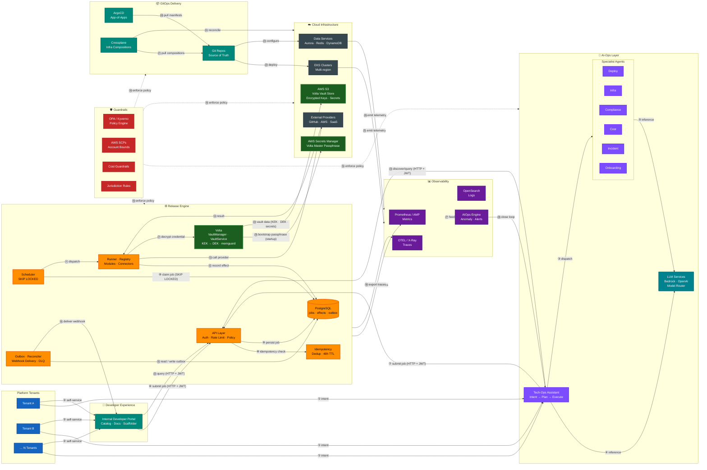

# Release Engine — Design (Index)

This document serves as an index to all other Release Engine — Design documentation files in this folder.

## Strategic Context

The **Release Engine** is the idempotent job scheduler at the heart of the Agentic TechOps platform. It provides the **execution + query backbone** that makes the entire platform trustworthy: every action — whether triggered by a human operator, an AI agent, or an automated policy — is expressed as a durable, observable, and concurrency-safe job. Each module owns both its workflows (execution) AND the read path for its domain (query), transforming the engine from a pure execution plane to an execution+query plane. This design ensures that operations are predictable, auditable, and recoverable, regardless of their origin.

The diagram below shows where the Release Engine sits within the broader platform. All intent — from developer self-service through the Internal Developer Portal, or from AI-driven orchestration through the AI-Ops layer — flows into the Release Engine before reaching the GitOps delivery mechanisms and cloud infrastructure. The Guardrail layer enforces policy at every tier, and the Observability layer feeds operational telemetry back to the AIOps engine, closing the loop with the Tech-Ops Assistant.

Connector credentials and other tenant-scoped secrets are protected by **[Volta](https://github.com/southwinds-io/volta)**, an embedded multi-tenant encryption library. At startup the Release Engine fetches Volta's master passphrase from **AWS Secrets Manager** (the sole external secret); Volta then manages per-tenant key hierarchies (KEK → DEK) with vault data stored in **AWS S3**. All high-frequency credential decryption happens in-process with zero network latency and full per-tenant cryptographic isolation.



### Flow Descriptions

| # | From → To | Description |
|---|-----------|-------------|
| ① | Tenants → Tech-Ops Assistant | Tenants express operational **intent** (e.g. *"roll out v3 to prod"*) via the Tech-Ops Assistant; it resolves intent into a structured plan. |
| ② | Tenants → IDP | Tenants trigger **self-service workflows** (scaffold a service, request an environment) through the Internal Developer Portal. |
| ③ | Tech-Ops Assistant → Agents | The Assistant **delegates subtasks** to the appropriate Specialist Agent (Deploy, Infra, Compliance, Cost, Incident, Onboarding) based on the resolved plan. |
| ④ | Tech-Ops Assistant ↔ LLM Services | The Assistant makes **inference calls** to LLM Services (via a model router across Bedrock / OpenAI) for natural-language understanding, plan generation, and summarisation. |
| ⑤ | Agents ↔ LLM Services | Specialist Agents similarly call **LLM Services** for context-aware reasoning within their domain (e.g. root-cause analysis, policy explanation, cost forecasting). |
| ⑥ | IDP → API Layer | IDP portal actions are submitted as **authenticated HTTP jobs** (Bearer JWT from OIDC) to the Release Engine API Layer. |
| ⑦ | Tech-Ops Assistant → API Layer | Agent-driven actions are submitted as **idempotent jobs** via the same HTTP API, ensuring all mutations are durable and auditable. |
| ⑧ | API Layer → Idempotency | The API Layer performs an **idempotency check** using the client-supplied key; duplicate submissions receive the cached response without re-executing. |
| ⑨ | API Layer → PostgreSQL | Job creation, the read-optimised projection (`jobs_read`), and the initial outbox event are **persisted atomically** in a single database transaction. |
| ⑩ | Scheduler → PostgreSQL | The Scheduler claims runnable jobs using `SELECT … FOR UPDATE SKIP LOCKED`, enabling **lock-free, lease-based concurrency** across multiple engine instances. |
| ⑪ | Scheduler → Runner | The Scheduler **dispatches a claimed job** to the Runner together with a fencing token (`run_id`) that prevents zombie-worker commits. |
| ⑫ | Runner → PostgreSQL | The Runner **records each external effect** (`external_effects` table) through its full lifecycle — reservation, execution, finalisation. |
| ⑬ | Runner → External Providers | The Runner invokes **Connectors** (compiled-in) which call the appropriate External Provider (GitHub, AWS, SaaS APIs) carrying a `call_id` for provider-side idempotency. |
| ⑭ | External Providers → Runner | Providers return a response categorised as **success** (2xx), **retryable** (5xx / 429), or **terminal failure** (4xx); unknown outcomes are queued for reconciliation. |
| ⑮ | Outbox ↔ PostgreSQL | The Outbox **reads pending events** from the `outbox` table and marks them delivered (or escalates failed entries to the DLQ after `max_attempts`). |
| ⑯ | Outbox → IDP | Completed job events are **delivered as signed webhooks** (HMAC-SHA256) to the IDP or any registered callback endpoint. |
| ⑰ | Release Engine → Prometheus / AMP | The engine **exports real-time operational metrics** (latencies, error rates, queue depths, lease conflicts) via a Prometheus exporter, and writes immutable event logs directly to SQL for audit. |
| ⑱ | Release Engine → OTEL / X-Ray | Distributed **trace spans** are exported for every job step and connector call, enabling end-to-end latency analysis. |
| ⑲ | Guardrails → * (dashed) | The Guardrail layer (OPA/Kyverno, AWS SCPs, Cost limits, Jurisdiction rules) **enforces policy at every tier** — AI-Ops, Release Engine, GitOps, and Cloud — before any mutation is applied. |
| ⑳ | ArgoCD → Git | ArgoCD **continuously polls and pulls desired application state** (Helm charts, Kubernetes manifests, Crossplane Claims) from Git as the single source of truth. No direct trigger from the Runner is required — ArgoCD autonomously detects Git changes and initiates sync. See *GitOps Delivery Pattern* below. |
| ㉑ | Crossplane → Git | Crossplane **pulls infrastructure compositions** from Git to drive cloud resource reconciliation via provider CRDs. As with ArgoCD, no direct trigger from the Runner is needed — Crossplane watches its CRDs in-cluster and reconciles continuously. |
| ㉒ | Git → EKS | ArgoCD applies manifests (including Crossplane XR/Claim objects) to **EKS clusters**, deploying workloads and infrastructure declarations across one or more regions. |
| ㉓ | Git → Data Services | Data-service configurations (schema migrations, parameter groups) are **applied from Git**. |
| ㉔ | Crossplane → Cloud | Crossplane continuously **reconciles live cloud resources** (VPCs, RDS instances, MSK topics, etc.) against their declared compositions once those compositions have been applied to the cluster by ArgoCD. |
| ㉕–㉖ | EKS / Data Svcs → Observability | Running workloads and data services **emit metrics, structured logs, and distributed traces** to the Observability layer. |
| ㉗ | Observability → AIOps Engine | Aggregated signals are fed to the **AIOps Engine** for anomaly detection, SLO burn-rate alerts, and predictive capacity warnings. |
| ㉘ | AIOps Engine → Tech-Ops Assistant | The AIOps Engine **closes the feedback loop**, surfacing detected incidents and operational context back to the Tech-Ops Assistant so it can act autonomously or advise operators. |
| ㉙ | Volta → AWS Secrets Manager | At **application startup** (before job processing begins), Volta retrieves the master passphrase via the EKS pod's IAM role. This is a one-time, low-frequency operation; the passphrase is held in `memguard`-protected memory for the process lifetime and never written to disk or logs. |
| ㉚ | Volta ↔ AWS S3 | Volta reads and writes **encrypted vault objects** (KEK metadata, DEK blobs, connector credential secrets, and audit logs) to S3. Reads are on-demand per tenant and cached in guarded memory; writes occur on secret mutation or key rotation. All objects are double-encrypted: Volta's AES-256-GCM plus SSE-S3. |
| ㉛ | Runner → Volta | Before invoking a Connector, the Runner calls `VaultService.UseSecret("connector:<key>:<field>", fn)`. Volta decrypts the credential **in a guarded scope**, hands the plaintext to the connector closure, then scrubs it from memory when the call returns — so plaintext credentials never leave the Volta boundary. |
| ㉜ | IDP → API Layer | IDP portal queries **domain-specific data** via module query API (`GET /v1/query/{module}/{query}`). Enables UI components to show current infrastructure state, deployment versions, drift reports, etc. |
| ㉝ | Tech-Ops Assistant → API Layer | Assistant queries **module capabilities** (`GET /v1/modules`) and executes **domain queries** (`GET /v1/query/{module}/{query}`) to discover available operations and answer questions about managed resources. |


### GitOps Delivery Pattern

This section explains exactly how the Release Engine integrates with ArgoCD and Crossplane, and why no direct imperative trigger from the Runner to either system is needed.

#### The canonical delivery chain

```
Runner
  └── (⑬) GitHub Connector
            └── writes manifests / Crossplane XR Claims to Git

ArgoCD
  └── (⑳) continuously polls Git, detects new commits
            └── (㉒) applies manifests + Crossplane CRD/Claim objects to EKS cluster

Crossplane
  └── (⑑) reads compositions from Git via ArgoCD-managed CRDs
            └── (㉔) reconciles live cloud resources (VPCs, RDS, MSK, …) to match declared state
```

#### Why Git is the source of truth — not an API call

In a **pure GitOps model**, the desired state of all infrastructure and workloads is **declared in Git**. Neither ArgoCD nor Crossplane receive imperative commands. Instead:

1. **The Runner (via the GitHub Connector)** writes or updates YAML manifests and Crossplane `XR` / `Claim` resource definitions into the appropriate Git repository as part of a job step. This is an ordinary Git commit/PR via the `github` connector (arrow ⑬).

2. **ArgoCD** watches the Git repository (polling every 3 minutes by default, or via webhook for near-instant detection). When it detects a change, it **pulls** the new desired state and applies it to the target EKS cluster. This includes Crossplane `Composition`, `XRD`, and `Claim` objects.

3. **Crossplane** watches its own custom resource definitions (CRDs) within the EKS cluster. Once ArgoCD has applied a new or updated Crossplane `Claim`, Crossplane's controllers **automatically reconcile** the corresponding cloud resources — creating, updating, or deleting VPCs, RDS instances, S3 buckets, MSK topics, etc. — without any further instruction from the Release Engine.

#### Why a direct Runner → ArgoCD or Runner → Crossplane trigger is not needed

| Alternative | Why it is not used in this design |
|---|---|
| `Runner → ArgoCD` (force sync API) | Bypasses the GitOps audit trail. If Git has not yet received the commit (race condition), ArgoCD would sync the old state. Also couples the Runner to ArgoCD's internal API, adding a fragile dependency. |
| `Runner → Crossplane` (direct `kubectl apply`) | Bypasses Git entirely. The cluster state diverges from Git, breaking drift detection, rollback, and the single source of truth guarantee. |

The passive pull model means Git always reflects what **was intentionally requested**, ArgoCD always reflects what **Git says should be in the cluster**, and Crossplane always reflects what **the cluster says should exist in the cloud**. Causality is fully traceable through Git history alone.

#### Convergence latency

The passive GitOps model introduces a small convergence delay compared to an imperative trigger:

| Stage | Typical latency |
|---|---|
| GitHub Connector commits to Git | < 5 s |
| ArgoCD detects change (polling) | 0–3 min (instant with Git webhook) |
| ArgoCD applies objects to EKS | < 30 s |
| Crossplane reconciles cloud resources | 10 s – 5 min (depends on provider) |

For most operational workflows this latency is acceptable. If sub-minute convergence is required, **ArgoCD webhook integration** (configuring GitHub to push a webhook to ArgoCD on each push) reduces the ArgoCD detection step to near-zero.

#### Crossplane and ArgoCD relationship

Crossplane is **not a separate layer from ArgoCD** in this design — it runs as a controller inside the EKS cluster and its resource definitions (`Composition`, `XRD`, `Claim`) are themselves Kubernetes objects managed by ArgoCD. The delivery chain is therefore entirely GitOps-driven:

```
Git → ArgoCD → EKS cluster (Crossplane CRDs + app manifests) → Crossplane → Cloud
```

There is no direct path from the Release Engine to Crossplane. The Release Engine's only interface to the GitOps layer is through **Git**, via the GitHub Connector.

---

## Documents

| File | Description                                                                                                                                                                                                                                                      |
|------|------------------------------------------------------------------------------------------------------------------------------------------------------------------------------------------------------------------------------------------------------------------|
| [d01.md](d01.md) | 1. System Context <br> 2. Component Architecture <br> 3. Architecture Overview                                                                                                                                                                                   |
| [d02.md](d02.md) | 4. Job State Machine <br> 5. Module Runtime Contract <br> 6. External Effect Lifecycle                                                                                                                                                                           |
| [d03.md](d03.md) | 7. Scheduling <br> 8. How Jobs Work                                                                                                                                                                                                                              |
| [d04.md](d04.md) | 9. Design Contracts <br>10. Extension Path <br>11. HTTP API Surface <br>12. Data Model (Postgres): jobs · jobs_read · outbox · metrics_sql · external_effects · steps · job_context · connector_call_log · idempotency_keys · Intake Transaction |
| [d05.md](d05.md) | 13. Job Lifecycle Flows with Fencing and SQL <br>14. Failure Handling <br>15. Metrics Surfaces <br>16. Module and Connector Contracts <br>17. Registry and Resolution <br>18. Policy, RBAC, Multi-Tenancy <br>19. Configuration and Flags <br>20. Backstage Integration |
| [d06.md](d06.md) | 21. Scalability, Performance, and SLOs <br>22. Security and Compliance <br>23. Observability and Tracing <br>24. Deployment, Rollout, and DR <br>25. Testing Strategy <br>26. Production Readiness Checklist                                                      |
| [d07.md](d07.md) | 27. Tenant Secret Encryption with Volta and AWS Secrets Manager                                                                                                                                                                                                  |
| [d08.md](d08.md) | 28. Inbound Webhook Ingestion Layer <br>29. Architecture Overview <br>30. API Surface <br>31. Authentication & Validation <br>32. Job Correlation <br>33. Event Processing <br>34. Runner Resumption <br>35. Data Model <br>36. Security <br>37. Observability <br>38. Configuration <br>39. Flaky Test Workflow Integration <br>40. Summary |
| [d09.md](d09.md) | 41. Human-in-the-Loop Approval Gates State Machine                                                                                                                                                                                |
| [d10.md](d10.md) | 42. DORA Metrics: Overview, Signal Mapping, Data Model, Correlation, APIs, Multi-Brand Authorization, and Implementation Phases |
