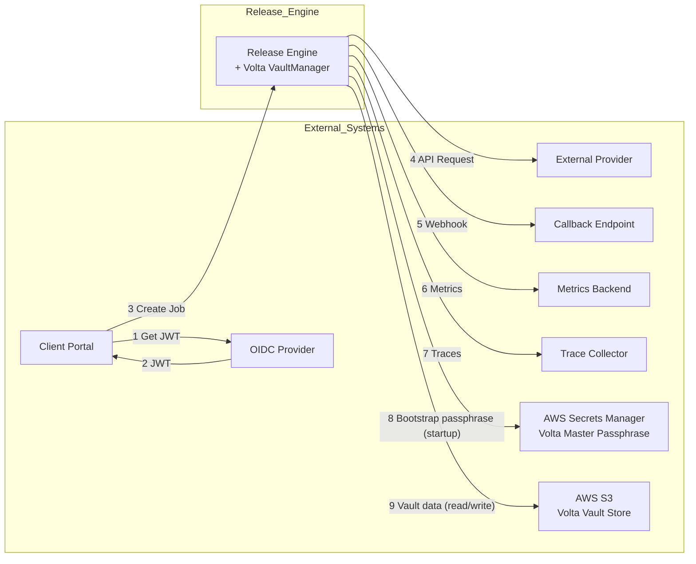
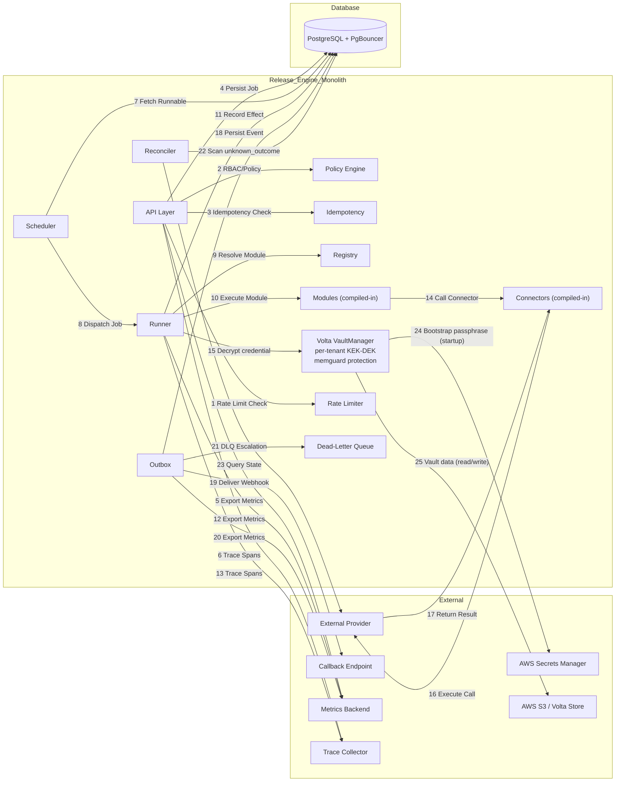
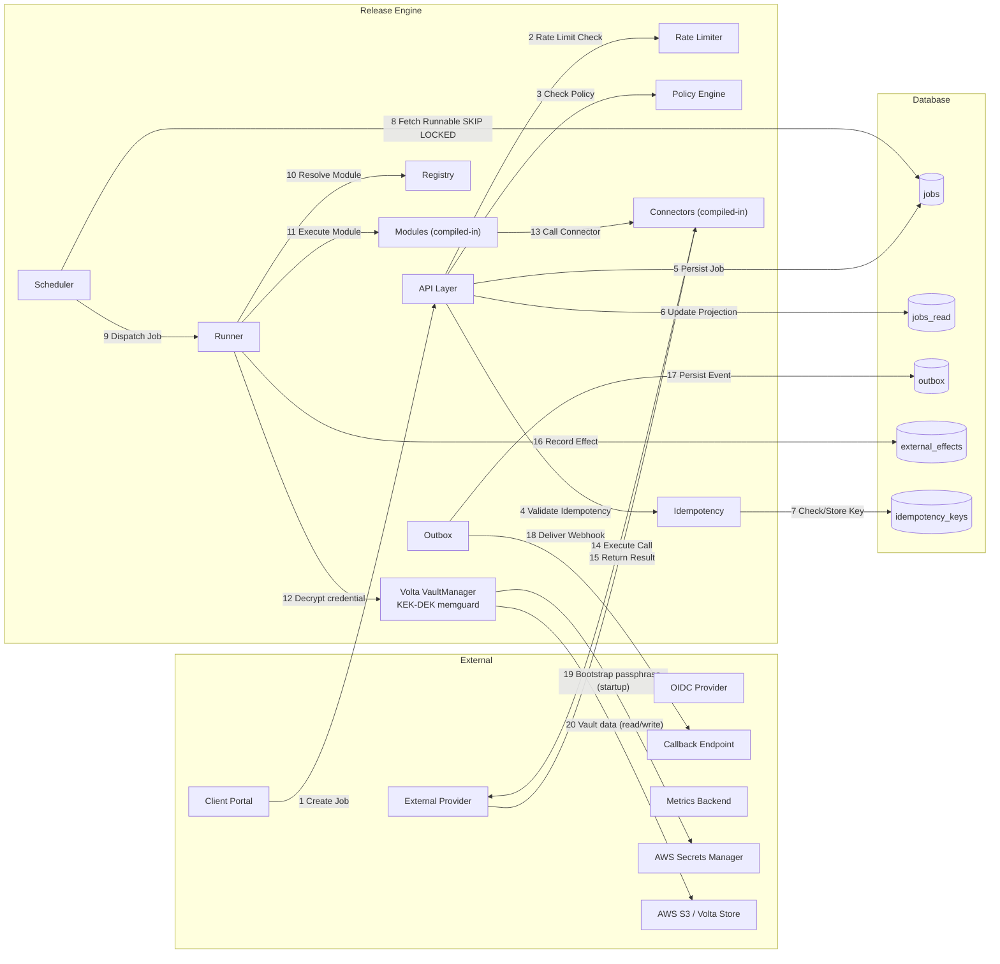
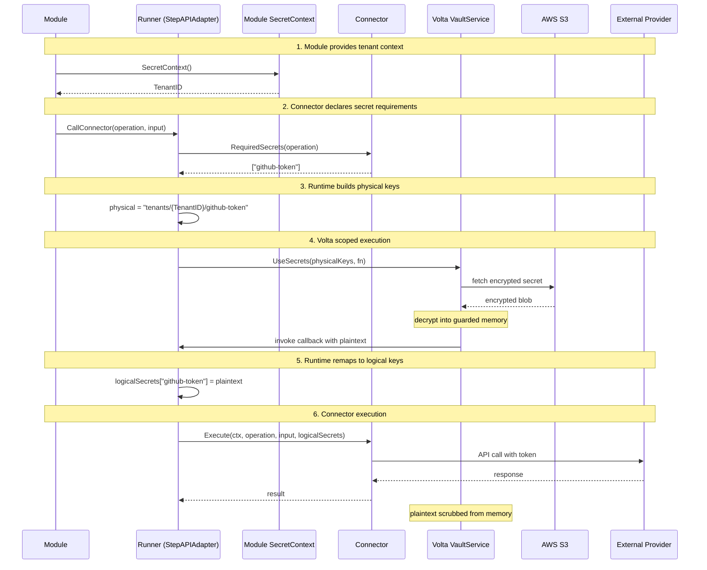

# Release Engine — Design (Part 1)

This document outlines the design for the Release Engine, a durable job execution system constructed as a modular monolith.
Its primary function is to accept job submissions from Backstage via an HTTP API and guarantee execution despite process or network failures.
Job intake is idempotent by contract, using a client-provided key to prevent duplicate work initiation from retries.

The system's integrity is derived from a few core principles. First, all critical state mutations are atomic.
The write operation to the primary `jobs` table, the update to the `jobs_read` read-optimised projection, and the enqueuing of events into the transactional outbox all occur within a single database transaction.
This design eliminates entire classes of state divergence errors between the write model, the read model, and external notifications.

Second, concurrency across multiple running instances is managed by a lease-and-fence mechanism.
A worker process claims a job by acquiring a timed lease, which is associated with a unique `run_id`.
This `run_id` is then required as a fencing token for all subsequent state-mutating operations for that job.
This ensures that a slow, partitioned, or zombie worker cannot commit state after its lease has expired and been reclaimed by another process.

Functionally, the engine separates orchestration from external effects.
- "**Modules**" define the deterministic sequence of steps in a workflow and contain no I/O.
- "**Connectors**" are the boundary components that implement the protocol-specific interactions with external services—source control, cloud providers, and so on.
- A registry system provides the configurable bindings between a given job type, the module that orchestrates it, and the connectors it can invoke.
  This allows for the addition of new workflows and provider integrations without modification to the engine's core runtime.

Observability is a first-class component, designed with two distinct surfaces:
- a Prometheus exporter for high-cardinality, real-time operational metrics (latencies, error rates, queue depths), and
- a direct-to-SQL metrics writer for immutable event logs.
  The SQL logs provide the ground truth for long-term analysis, auditing, and compliance reporting.

#### Scope
Single-process modular monolith with explicit component boundaries, deterministic idempotency, lease/fencing, load-balanced scheduling via `SKIP LOCKED`, and dual metrics surfaces.

---

## 1) System Context

> High-level view of the Release Engine and its interactions with external systems.



**Flow Description:**
1. Portal obtains JWT from OIDC Provider
2. OIDC Provider returns JWT to Portal
3. Client Portal creates jobs via HTTP API with JWT authentication
4. Release Engine executes jobs by calling External Providers
5. Events are delivered via webhooks to Callback endpoints
6. Metrics are exported to Metrics Backend
7. Traces are exported to Trace Collector
8. At startup, Volta retrieves the master passphrase from AWS Secrets Manager via the instance/pod IAM role. This is a one-time bootstrap; the passphrase is held in memguard-protected memory for the process lifetime.
9. Volta reads encrypted KEK/DEK metadata and connector credential secrets from S3 on demand (per tenant, cached in guarded memory). Writes occur on secret mutation or key rotation.

---

## 2) Component Architecture

The Release Engine is built as a **modular monolith**—a single deployable process that internally organises functionality into distinct components with clear boundaries and responsibilities. This architecture provides the operational simplicity of a monolith while maintaining the architectural discipline needed for long-term maintainability.

> Internal components of the Release Engine modular monolith and their interactions.



Each component in the diagram above represents a well-defined subsystem:

- **API Layer**: The entry point handling HTTP requests, authentication (JWT validation via OIDC), rate limiting, and job submission. Exposes `/healthz` and `/readyz` endpoints in addition to the job API.

- **Rate Limiter**: Per-tenant token-bucket rate limiter at the API layer. Returns `429 Too Many Requests` with `Retry-After` header on exhaustion. Separate from policy-engine business quotas.

- **Policy Engine**: Evaluates access control and quota restrictions. Running in-process allows immediate policy decisions without external service calls, ensuring fast request processing. Cache bypass is enforced for destructive actions (`job:cancel`, admin operations).

- **Idempotency**: Manages deterministic job creation and response caching. By sharing the same transaction scope as the job creation, it guarantees atomicity between idempotency checks and job persistence. Keys expire after 48 hours.

- **Scheduler**: Detects runnable jobs and claims work for execution. All instances participate in scheduling using `SELECT … FOR UPDATE SKIP LOCKED`—no leader election is used for the scheduler.

- **Runner**: Executes jobs by loading modules and invoking connectors. Job finalization is always fenced by `run_id`; a 0-row UPDATE signals a lost lease and stops local processing immediately.

- **Registry**: Resolves module and connector bindings by path key. This central lookup service enables extensibility—new workflows and providers can be added by registering new components without modifying the core runtime.

- **Modules (compiled-in)**: The unit of business logic, compiled into the monolith binary as Go interfaces. Modules are deterministic orchestration code that call connectors through the StepAPI for all external effects.

- **Connectors (compiled-in)**: The protocol-specific implementations for external service communication (GitHub, AWS, etc.). Connectors are also compiled-in and managed by the Runner.

- **Volta (VaultManager)**: Embedded multi-tenant encryption library. Manages per-tenant key hierarchies (KEK → DEK) with memguard-protected memory. At startup it bootstraps by fetching a master passphrase from AWS Secrets Manager; thereafter it loads and caches encrypted vaults from S3. The Runner calls `VaultService.UseSecret()` before each connector invocation so that plaintext credentials are decrypted in a guarded scope and scrubbed immediately after use — they never appear in logs, params, or the database.

- **Outbox**: Delivers webhooks and internal events to callbacks. Outbox entries that exceed `max_attempts` are moved to a Dead-Letter Queue status and trigger an alert.

- **Dead-Letter Queue (DLQ)**: Logical status/table for outbox entries and effects that cannot be automatically resolved. Triggers alerting and requires manual review.

- **Reconciler**: Background worker that resolves `unknown_outcome` effects by querying providers to determine the true state. This is a core correctness path — it cannot be hand-waved.

    - **Poll interval**: Scans `external_effects` where `status='unknown_outcome'` and `next_run_at <= now()` every 30 seconds.
    - **Max attempts**: Default 5 reconciliation attempts before escalating to `dlq` via `effect_escalate_dlq()`.
    - **Provider-specific probe strategy**:
        1. Query provider by `call_id` (idempotency key) if supported
        2. If not supported, read target resource to determine if intended state exists
        3. If state confirms success → `status='succeeded'`
        4. If state confirms failure → `status='failed'`
        5. If still ambiguous → re-queue for retry with same `call_id` and `next_run_at = now() + 5 minutes`
        6. If attempts exhausted → `status='dlq'`, alert fires, manual review required.
    - **SQL driving the reconciler**:
      ```sql
      -- Pick effects to reconcile
      SELECT effect_id, job_id, run_id, step_key, connector_key, operation, call_id, provider_ref
      FROM external_effects
      WHERE status = 'unknown_outcome'
        AND next_run_at <= now()
      ORDER BY next_run_at, effect_id
      FOR UPDATE SKIP LOCKED
      LIMIT 10;
      ```
    - SLO: P99 ≤ 5 minutes for unknown outcome reconciliation.

**Advantages of this approach:**

1. **Atomic Consistency**: All state changes—jobs, projections, and outbox events—occur within a single database transaction. No distributed saga coordination or eventual consistency is required.

2. **Performance**: In-process communication between components has negligible latency compared to RPC or message-based inter-service calls. Connection pooling via PgBouncer (transaction mode) manages database connection budget.

3. **Operational Simplicity**: Single deployment artifact, single database to optimise, unified metrics and tracing.

4. **Extensibility**: New workflow types and provider integrations are added by registering modules and connectors in the Registry—no core code changes required.

5. **Horizontal Scaling**: Multiple identical instances run behind a load balancer. `SKIP LOCKED` distributes scheduling work across all instances naturally.

---

## 3) Architecture Overview

> Complete system architecture showing the data flow from job submission through execution to external effects and event delivery.



**Flow Description:**

1. **Create Job** — Client Portal submits a job request to the API Layer with tenant_id, path_key, params, idempotency_key, and optional callback_url.

2. **Rate Limit Check** — API Layer checks if the tenant has exceeded their rate limit using a token bucket algorithm. Returns 429 if exceeded.

3. **Check Policy** — Policy Engine evaluates access control and quota restrictions for the requesting principal on the specific path_key.

4. **Validate Idempotency** — Idempotency component checks for existing key and either creates a new job or returns the cached response. Uses payload fingerprint for conflict detection.

5. **Persist Job** — Job is persisted to the jobs table atomically along with the jobs_read projection and any initial outbox events in a single database transaction.

6. **Update Projection** — The jobs_read read-optimised projection is updated in the same transaction as the job insert for zero staleness.

7. **Check/Store Key** — Idempotency key is stored with a payload fingerprint and 48-hour TTL for efficient cleanup and replay protection.

8. **Fetch Runnable** — Scheduler queries for runnable jobs using SKIP LOCKED to atomically claim work without leader election.

9. **Dispatch Job** — Scheduler dispatches the claimed job to a Runner with a lease and incremented run_id for fencing.

10. **Resolve Module** — Runner looks up the module responsible for the path_key from the Registry to orchestrate the workflow. See §5 for details on module loading and invocation.

11. **Execute Module** — Runner invokes the Module.Execute() method, passing the StepAPI for orchestrating the workflow.

12. **Decrypt Credential** — Before invoking a connector, the Runner calls `VaultService.UseSecret()`. Volta decrypts the connector credential into guarded memory; the plaintext is scoped to the connector call and scrubbed immediately afterwards.

13. **Call Connector** — Module calls the StepAPI.CallConnector() method to request an external effect. The engine routes this to the appropriate connector, which uses the decrypted credential.

14. **Execute Call** — Connector executes the external API call to the provider, including the call_id for idempotency guarantees.

15. **Return Result** — Provider returns a response which is categorised as success (2xx), retryable error (5xx, 429), or terminal error (4xx).

16. **Record Effect** — Runner records the external effect lifecycle in the external_effects table, tracking reservation, execution, and finalization.

17. **Persist Event** — Outbox persists the webhook event to the outbox table for delivery to the callback endpoint.

18. **Deliver Webhook** — Outbox delivers the webhook via HTTP POST with HMAC signature to the configured callback URL.

19. **Bootstrap Passphrase** — At application startup (before job processing begins), Volta fetches the master passphrase from AWS Secrets Manager via the pod/instance IAM role and loads it into memguard-protected memory. This is a one-time operation per process lifecycle.

20. **Vault Data** — Volta reads encrypted vault objects (KEK metadata, DEK blobs, connector credential secrets) from S3 on demand per tenant session. Writes occur on secret mutation or key rotation. Objects are double-encrypted: Volta's AES-256-GCM plus S3 SSE.

---

## 4) Secret Resolution Flow

The Release Engine implements a secure secret injection pattern where modules provide tenant context, connectors declare secret requirements, and the runtime orchestrates the binding via Volta scoped execution.

### 4.1 Architectural Principles

1. **Module-Owned Tenant Context**: Modules implement the `SecretContextProvider` interface to determine which tenant's secrets to use. For example:
   - Infrastructure modules use the platform tenant
   - Customer-facing modules derive tenant from job parameters
   - Modules validate their own tenant context; runtime doesn't need to know validation rules

2. **Connector-Declared Requirements**: Connectors implement the `SecretRequirer` interface to declare what secrets they need (logical keys like `github-token`, `aws-access-key`). Connectors never see tenant paths or physical storage locations.

3. **Scoped Execution**: The runtime calls Volta's `UseSecrets()` with physical keys derived from module tenant context and connector logical keys. Decrypted secrets exist only within the guarded callback scope and are scrubbed after execution.

### 4.2 Secret Resolution Sequence



### 4.3 Key Interfaces

**Module Secret Context:**
```go
type SecretContextProvider interface {
    SecretContext() SecretContext
}

type SecretContext struct {
    TenantID string
}
```

**Connector Secret Requirements:**
```go
type Connector interface {
    Execute(ctx context.Context, operation string, input map[string]interface{}, secrets map[string][]byte) (*ConnectorResult, error)
}

type SecretRequirer interface {
    RequiredSecrets(operation string) []string
}
```

### 4.4 Physical-to-Logical Key Mapping

The runtime performs key remapping to maintain separation of concerns:

- **Logical keys** (connector declares): `github-token`, `gitlab-ssh-key`, `aws-access-key`
- **Physical keys** (Volta resolves): `tenants/{tenant-id}/github-token`

This convention ensures connectors work with logical keys regardless of storage implementation. The runtime builds physical keys by combining the module-provided `TenantID` with connector-declared logical keys.

### 4.5 Security Properties

- **No secret persistence**: Plaintext credentials never escape Volta's guarded callback scope
- **Module validation**: Modules validate their own tenant context; invalid inputs cause module construction failure
- **Gradual migration**: The `SecretRequirer` interface is optional, allowing connectors to adopt the pattern incrementally
- **No tenant path exposure**: Connectors receive only logical keys, never physical storage paths

### 4.6 Updated Component Architecture

The component architecture in §2 includes the following updates to support secret resolution:

1. **Modules** implement `SecretContextProvider` to provide tenant context
2. **Connectors** implement `SecretRequirer` to declare secret requirements  
3. **Runner (StepAPIAdapter)** orchestrates the binding between module context, connector requirements, and Volta scoped execution
4. **Volta** provides `UseSecrets()` for secure scoped decryption

This architecture maintains the separation of concerns while enabling secure, tenant-isolated secret injection for connector operations.

