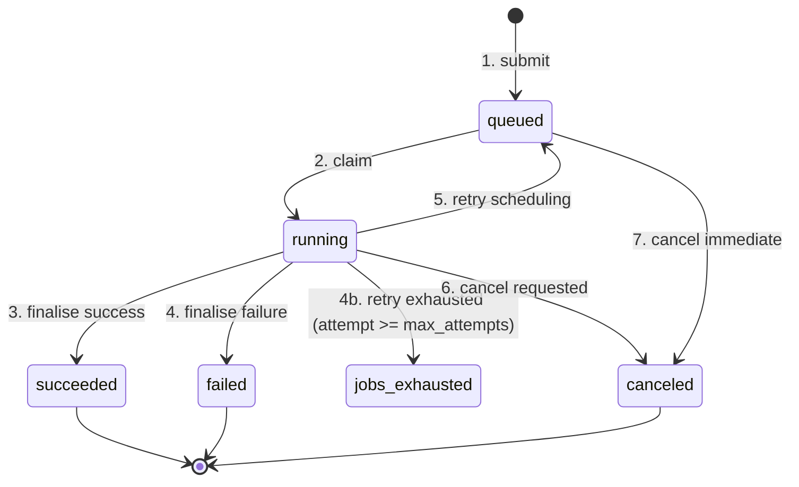
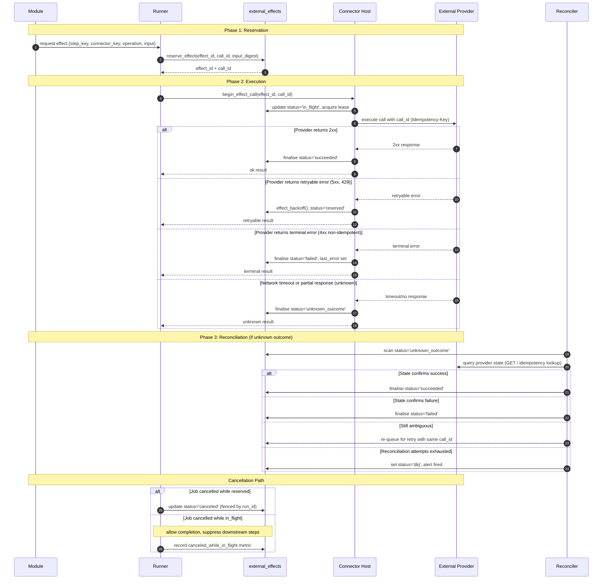

# Release Engine — Design (Part 2)

## 4) Job State Machine

> Valid states and transitions for jobs in the Release Engine:
> Jobs transition from `queued` to `running` when claimed.
> From `running`, they can succeed, fail (after exhausting retries), or be cancelled.
> Queued jobs can also be cancelled directly.



**Transition Explanations:**

1. **submit** (`[*] → queued`): Job is created and persisted to the database within an idempotent transaction.

2. **claim** (`queued → running`): The scheduler selects the job using `SKIP LOCKED`, acquires a lease, and hands it to a worker. The `run_id` is incremented to fence any stale processes.

3. **finalise success** (`running → succeeded`): The worker completes all steps. Finalization is fenced by `WHERE run_id = $run_id AND state = 'running'`; a 0-row result means the lease was lost and the worker discards the result.

4. **finalise failure** (`running → failed`): The worker exhausts all retry attempts or encounters a terminal error. Fenced identically to success finalisation.

5. **retry scheduling** (`running → queued`): A step encountered a transient error. The job is re-queued with exponential backoff. Fenced by `run_id`.

6. **cancel requested** (`running → canceled`): A cancellation request was received while the job was running. The worker observes `cancel_requested_at` between steps and finalises as cancelled.

7. **cancel immediate** (`queued → canceled`): A cancellation request is received before the job is claimed. Transitions directly to canceled.

---

## 5) Module Runtime Contract

Modules are the unit of business logic in the Release Engine. Each module encodes a golden-path workflow as a sequence of steps that call connectors through a controlled API surface.

Modules are **compiled into the monolith binary as Go interfaces**. There is no plugin system, no dynamic loading, and no external script execution. This is a deliberate choice favoring type safety, testability, debuggability, and deployment simplicity.

### 5.1 Core Interfaces

```go
// Module is the contract every golden-path workflow implements.
type Module interface {
    // Key returns the unique identifier (e.g., "scaffold-service").
    Key() string

    // Version returns the semver string (e.g., "1.0.0").
    Version() string

    // Execute runs the workflow. The engine calls this exactly once
    // per job attempt. Modules must use the StepAPI for all side effects.
    // api is the engine-provided StepAPI implementation.
    // The registry package keeps this argument untyped to avoid
    // package cycles; runtime code passes a concrete StepAPI.
    Execute(ctx context.Context, api any, params map[string]any) error
}

// StepAPI is the engine surface exposed to modules during execution.
// All durable state changes and external calls go through this interface.
type StepAPI interface {
    // Step lifecycle
    BeginStep(stepKey string) error
    EndStepOK(stepKey string, output map[string]any) error
    EndStepErr(stepKey string, code string, msg string) error

    // Connector invocation (idempotent, tracked as effects)
    CallConnector(ctx context.Context, req ConnectorRequest) (*ConnectorResult, error)

    // Human approval gate
    WaitForApproval(ctx context.Context, req ApprovalRequest) (ApprovalOutcome, error)

    // Job-scoped key-value context (persisted between steps)
    SetContext(key string, value any) error
    GetContext(key string) (any, bool)

    // Cancellation signal from the engine
    IsCancelled() bool
}

type ApprovalRequest struct {
    Summary     string            `json:"summary"`
    Detail      string            `json:"detail"`
    BlastRadius string            `json:"blast_radius"`
    PolicyRef   string            `json:"policy_ref"`
    Metadata    map[string]string `json:"metadata"`
}

type ApprovalOutcome struct {
    Decision      string    `json:"decision"`
    Approver      string    `json:"approver"`
    Justification string    `json:"justification"`
    DecidedAt     time.Time `json:"decided_at"`
}
```

**Rule:** Modules MUST NOT perform side effects outside of `StepAPI`. No direct HTTP calls, no direct DB access, no goroutine spawning. The engine controls all I/O for idempotency, observability, and safe retries.

### 5.2 Module Registry

The registry is an in-memory map populated at application startup in `main.go`.

```go
type Registry struct {
    modules map[string]Module // key format: "module_key:version"
}

func (r *Registry) Register(m Module)
func (r *Registry) Lookup(moduleKey, version string) (Module, bool)
```

Registration is explicit:

```go
func main() {
    reg := module.NewRegistry()
    reg.Register(&scaffold.ScaffoldService{})
    reg.Register(&promote.PromoteToProd{})

    eng := engine.New(engine.Config{Modules: reg})
    eng.Run()
}
```

Adding a new module requires: implement the interface, register in `main.go`, deploy.

### 5.3 Resolution Chain

When a job is claimed, the scheduler resolves the module through a two-hop lookup:

```
job.path_key
    → path_bindings table → (module_key, version)
        → Registry.Lookup() → Module struct
            → Module.Execute(ctx, api, params)
```

The `path_bindings` table decouples the external path key (used by callers) from the internal module identity. This enables:

- **Version pinning:** path `golden-path/scaffold-service` → `scaffold-service:2.0.0`
- **Canary modules:** 10% of jobs routed to a new module version via binding rules
- **Deprecation:** rebind a path to a different module without changing callers

```sql
CREATE TABLE path_bindings (
    path_key     TEXT PRIMARY KEY,
    module_key   TEXT NOT NULL,
    version      TEXT NOT NULL,
    routing_rule JSONB DEFAULT '{}',
    updated_at   TIMESTAMPTZ NOT NULL DEFAULT now()
);
```

### 5.4 Reference Module: Scaffold Service

```go
package scaffold

type ScaffoldService struct{}

func (s *ScaffoldService) Key() string     { return "scaffold-service" }
func (s *ScaffoldService) Version() string { return "1.0.0" }

func (s *ScaffoldService) Execute(ctx context.Context, api module.StepAPI, params map[string]any) error {
    // --- Step 1: Create repository ---
    if err := api.BeginStep("create-repo"); err != nil {
        return err
    }

    result, err := api.CallConnector(ctx, module.ConnectorRequest{
        Connector: "github",
        Operation: "create-repo-from-template",
        Input: map[string]any{
            "org":           params["org"],
            "name":          params["service_name"],
            "template_repo": params["template"],
            "visibility":    "internal",
        },
    })
    if err != nil {
        return err
    }
    if result.Status != "succeeded" {
        return api.EndStepErr("create-repo", result.Error.Code, result.Error.Message)
    }

    repoURL := result.Output["repo_url"].(string)
    api.SetContext("repo_url", repoURL)
    if err := api.EndStepOK("create-repo", result.Output); err != nil {
        return err
    }

    // --- Step 2: Register in service catalog ---
    if err := api.BeginStep("register-catalog"); err != nil {
        return err
    }

    result, err = api.CallConnector(ctx, module.ConnectorRequest{
        Connector: "backstage-catalog",
        Operation: "register-location",
        Input: map[string]any{
            "target": repoURL + "/blob/main/catalog-info.yaml",
        },
    })
    if err != nil {
        return err
    }
    if result.Status != "succeeded" {
        return api.EndStepErr("register-catalog", result.Error.Code, result.Error.Message)
    }

    return api.EndStepOK("register-catalog", result.Output)
}
```

### 5.5 Step Resumption on Failure

When a job is retried (crash, timeout, or retryable error), the engine checks the `steps` table for the last completed step. `BeginStep` is a no-op for already-succeeded steps, allowing modules to be written as straight-line code without manual checkpoint logic.

```
Attempt 1:  create-repo ✅ → register-catalog 💥 (crash)
Attempt 2:  create-repo → BeginStep returns skip → register-catalog → executes normally
```

### 5.6 Decision Record: Why Compiled-In Modules

| Alternative | Rejected Because |
|---|---|
| **Go plugins (`plugin` pkg)** | Requires exact toolchain match between host and plugin. Fragile across upgrades. No IDE support for cross-boundary types. |
| **Hashicorp go-plugin (gRPC)** | Adds gRPC complexity, separate binaries, and process management for what is glue code. |
| **WASM** | High overhead for I/O-bound orchestration. Poor Go-to-WASM tooling maturity. |
| **Starlark / Lua scripts** | Loses type safety, IDE support, and standard Go testing. Requires building a sandbox and serialization layer. |
| **External services** | Defeats the modular monolith premise. Adds deployment units, network failure modes, and operational burden. |

**Chosen approach:** Modules are Go structs implementing an interface, compiled into a single binary, and registered at startup. Trade-off: adding a module requires redeploying the engine. This is acceptable because module changes are infrequent and follow the same CI/CD pipeline as the engine itself.

---

## 6) External Effect Lifecycle

> States and transitions for external effects (connector calls and webhooks).

### What are External Effects?


External effects are the **boundary operations** that the Release Engine performs to interact with systems outside of its own durable execution environment. These include:

- **Connector calls**: Invocations to external providers such as source control management (SCM), cloud APIs, CI/CD systems, or any third-party service.
- **Webhook deliveries**: Outbound HTTP POST requests to callback endpoints to notify external systems of job state changes.

External effects are fundamental to the Release Engine's design because:
1. **Separation of concerns**: Modules (orchestration logic) are deterministic and side-effect free, while connectors handle all external communication.
2. **Idempotency guarantee**: Every external effect has a stable `call_id` derived from `(job_id, run_id, step_key, operation, input_digest)`. This ensures that retries do not cause duplicate operations at the provider.
3. **Fencing**: External effects are fenced by `effect_id` and `run_id`, preventing zombie workers from corrupting external state after their lease expires.
4. **Observability**: Every effect is tracked in the `external_effects` table, enabling auditing, reconciliation, and metrics.
5. **Unknown outcome escalation**: After N failed reconciliation attempts, an effect is escalated to `dlq` status, triggering an alert and requiring manual review.

### Effect Lifecycle Sequence



### Reconciler Retry Budget and Escalation

The reconciler resolves `unknown_outcome` effects by querying providers to determine the true state. The following parameters control its behavior:

| Parameter | Value | Rationale |
|-----------|-------|-----------|
| `max_reconciler_attempts` | 5 | Enough attempts to cover typical provider latency variability |
| Backoff schedule | `LEAST(2^attempt, 300)` s | Capped at 5 minutes — longer than outbox (10 min) because reconciler queries are read-only |
| DLQ escalation | Same `dlq` status as outbox | Unified operational surface |
| Alert | `EffectUnknownOutcomeDLQ` | Separate alert name from outbox DLQ for routing clarity |

**Note:** The reconciler backoff cap (300s / 5 min) differs from the outbox backoff cap (600s / 10 min) because reconciler operations are typically read-only queries that should resolve faster, whereas outbox deliveries involve potentially slow external callbacks.

When an effect transitions to `dlq` status via `effect_escalate_dlq()`, the alert `EffectUnknownOutcomeDLQ` fires and requires manual review. This is distinct from the outbox DLQ alert to allow separate on-call routing.
