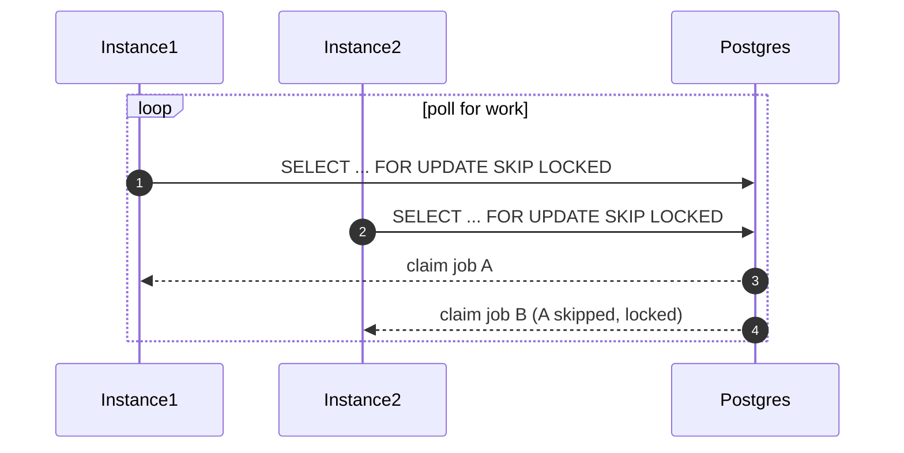
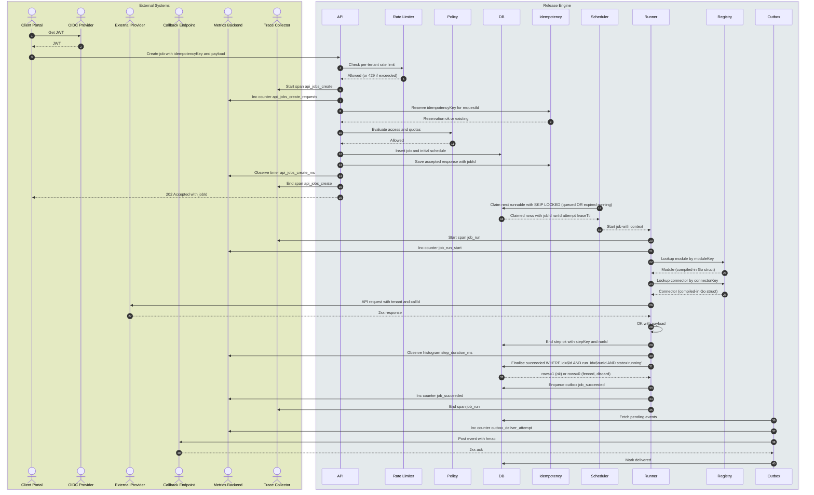
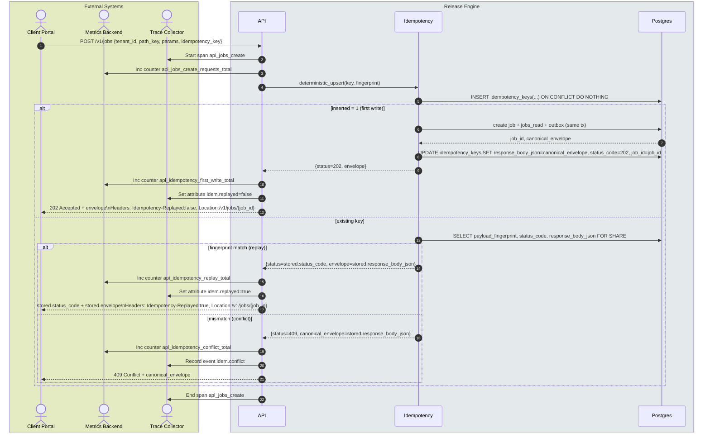
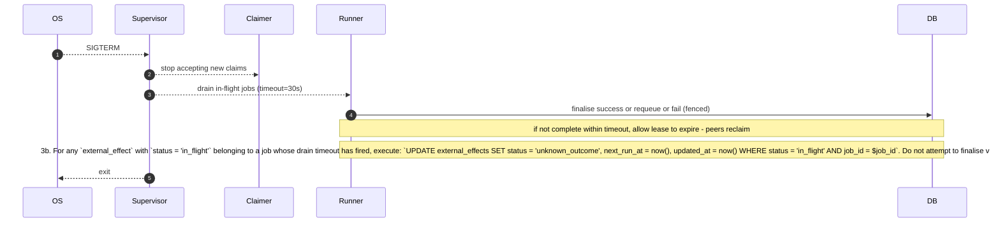

# Release Engine — Design (Part 3)

## 7) Scheduling

> Load-balanced job scheduling using Postgres SKIP LOCKED. No leader election for the scheduler.


### How Scheduling Works

All instances run the scheduler loop concurrently. Each instance polls the database for runnable jobs and attempts to atomically claim them using `SELECT ... FOR UPDATE SKIP LOCKED`. This provides natural load-balancing—work is distributed across instances without requiring explicit coordination or a leader.

**This design uses `SKIP LOCKED` exclusively for scheduling. There is no Postgres advisory lock for scheduler leader election.**

### Transaction Isolation

All database operations in the Release Engine use **`READ COMMITTED`** isolation level (the default for PostgreSQL). This is explicitly mandated for the following reasons:

1. **`SKIP LOCKED` compatibility**: `SELECT ... FOR UPDATE SKIP LOCKED` only works correctly under `READ COMMITTED`. Using `REPEATABLE READ` or `SERIALIZABLE` isolation would cause `SKIP LOCKED` to behave unexpectedly—rows that should be visible to other transactions may not be, breaking the scheduling algorithm.

2. **Fencing correctness**: The 0-row UPDATE check (detecting lost leases) relies on `READ COMMITTED` semantics. Under stricter isolation, a runner might see stale state and incorrectly believe it still owns a job.

3. **Startup assertion**: The application should verify the default isolation level on startup:
   ```sql
   SELECT current_setting('transaction_isolation');
   -- Must return 'read committed'
   ```

4. **Migration comment**: All migration scripts should include:
   ```sql
   -- Requires READ COMMITTED isolation (PostgreSQL default)
   -- Do not use REPEATABLE READ or SERIALIZABLE - breaks SKIP LOCKED semantics
   ```


### Claim Process



**Advantages:**
- No leader election code — simpler architecture
- Instant failover — any instance can immediately take over
- True horizontal scaling — work is naturally distributed
- No coordination overhead

**Considerations:**
- Higher polling load on the database (mitigated by proper partial indexing and polling intervals)
- With PgBouncer in front of Postgres, connection overhead is negligible

### Batch Claiming

To improve throughput at scale, the claimer queries for multiple jobs (`LIMIT 10`) per poll iteration and dispatches them to the runner pool for concurrent execution. This reduces database round-trips and improves latency under load (50–200 claims/s target). The batch size of 10 was chosen to balance:

- **Throughput**: Fewer polls needed to achieve target claim rate
- **Latency**: Smaller batches mean jobs start faster
- **Database load**: Each claim still requires a SELECT/FOR UPDATE SKIP LOCKED

The scheduler loop fetches up to 10 jobs atomically, then dispatches each to an available runner goroutine. Each claimed job carries its own lease and run_id for fencing.

### Claim Index

A partial index is required for the claim query to perform efficiently:

```sql
CREATE INDEX CONCURRENTLY ON jobs (next_run_at)
WHERE state = 'queued';

CREATE INDEX CONCURRENTLY ON jobs (lease_expires_at)
WHERE state = 'running';

CREATE INDEX jobs_tenant_id_idx ON jobs (tenant_id, id);
```

---
## 8) How Jobs Work


The sequence diagram below illustrates the complete lifecycle of a job in the Release Engine, from initial submission through execution to event delivery.



**Flow Description:**

1. **Get JWT** — Client Portal obtains a JWT from the OIDC Provider for authentication.

2. **JWT** — OIDC Provider returns the JWT token to the Client Portal.

3. **Create job** — Client Portal submits a job with idempotencyKey and payload to the API.

4. **Check rate limit** — API checks if the tenant has exceeded their rate limit using a token bucket.

5. **Allowed/429** — If within limit, proceed; otherwise return 429 Too Many Requests.

6. **Start span** — API starts a tracing span for the job creation operation.

7. **Inc counter** — API increments the job creation request counter metric.

8. **Reserve idempotencyKey** — Idempotency component reserves the key for the requestId to prevent duplicates.

9. **Reservation ok/existing** — Returns whether the reservation succeeded or key already exists.

10. **Evaluate access/quotas** — Policy Engine evaluates RBAC and quota restrictions.

11. **Allowed** — Policy check passes; request proceeds.

12. **Insert job** — Job and initial schedule are persisted to the database.

13. **Save response** — Idempotency saves the accepted response with jobId.

14. **Observe timer** — API records the job creation latency metric.

15. **End span** — API ends the tracing span.

16. **202 Accepted** — API returns 202 Accepted with jobId to the Portal.

17. **Claim next runnable** — Scheduler claims the next runnable job using SKIP LOCKED.

18. **Claimed rows** — Database returns job details including jobId, runId, attempt, and leaseTtl.

19. **Start job** — Scheduler dispatches the job to a Runner with context.

20. **Start span** — Runner starts a job run tracing span.

21. **Inc counter** — Runner increments the job start counter.

22. **Lookup module** — Runner queries the Registry for the compiled-in module struct by moduleKey.

23. **Module** — Registry returns the compiled-in module Go struct (resolved via in-memory map; see §5.2).

24. **Lookup connector** — Runner queries the Registry for the compiled-in connector struct by connectorKey.

25. **Connector** — Registry returns the compiled-in connector Go struct.

26. **API request** — Runner invokes the connector, which makes an API request to the provider with tenant and callId.

27. **2xx response** — Provider returns a successful response.

28. **OK with payload** — Connector returns the result to the Runner (in-process call; no RPC).

29. **End step** — Runner records the step completion in the database.

30. **Observe histogram** — Runner records step duration metric.

31. **Finalise succeeded** — Runner finalises the job as succeeded, fenced by run_id.

32. **rows=1/0** — Database returns affected rows; 0 means lease was lost (fenced).

33. **Enqueue outbox** — Runner enqueues a job_succeeded event to the outbox.

34. **Inc counter** — Runner increments the job succeeded counter.

35. **End span** — Runner ends the job run tracing span.

36. **Fetch pending** — Outbox fetches pending events from the database.

37. **Inc counter** — Outbox increments the delivery attempt counter.

38. **Post with HMAC** — Outbox posts the event to the callback URL with HMAC signature.

39. **2xx ack** — Callback endpoint acknowledges receipt with 2xx.

40. **Mark delivered** — Outbox marks the event as delivered in the database.

---

### Idempotency Constraint Path

The idempotency constraint path ensures that job submissions are deterministic and replay-safe.



**Flow Description:**

1. **POST /v1/jobs** — Client Portal submits a job request with tenant_id, path_key, params, and idempotency_key.

2. **Start span** — API starts a tracing span for the job creation operation.

3. **Inc counter** — API increments the request counter metric.

4. **deterministic_upsert** — Idempotency component prepares an upsert with the key and normalised payload fingerprint.

5. **INSERT idempotency_keys** — Attempts to insert the idempotency key with ON CONFLICT DO NOTHING.

6. **First write path** — If inserted = 1, creates job + jobs_read + outbox in the same transaction.

7. **Return job_id** — Database returns the new job_id and canonical envelope.

8. **UPDATE idempotency_keys** — Updates the idempotency row with the response envelope and status code.

9. **Return envelope** — Idempotency returns the 202 status and envelope to API.

10. **Inc first_write counter** — API records the first write metric.

11. **Set replayed=false** — Tracing attribute indicates this was not a replay.

12. **202 Accepted** — API returns 202 with envelope and headers to Portal.

13. **SELECT existing key** — If key exists, selects the payload fingerprint for comparison.

14. **Fingerprint match (replay)** — If fingerprint matches, returns the stored status code and envelope.

15. **Inc replay counter** — API records the replay metric.

16. **Set replayed=true** — Tracing attribute indicates this was a replay.

17. **Return stored response** — API returns the stored response with replay header.

18. **Fingerprint mismatch (conflict)** — If fingerprint doesn't match, returns 409 Conflict.

19. **Inc conflict counter** — API records the conflict metric.

20. **Record conflict event** — Tracing records the idempotency conflict event.

21. **409 Conflict** — API returns 409 with canonical envelope, no state change.

22. **End span** — API ends the tracing span.

---

### Scope and Invariants

- One process. No in-memory unbounded queues. Backpressure is enforced by the database, scheduling policy, and per-tenant rate limits.
- All writes to jobs and jobs_read occur in the same transaction.
- All business-visible state transitions are fenced by run_id. A 0-row UPDATE on finalise means ownership was lost; the runner logs `fenced_conflict` and stops.
- All external effects are fenced by effect_id. Every connector call and outbound webhook has a stable call_id derived from (job_id, run_id, step_key, operation, input_digest).
- Idempotency keys expire after 48 hours. Clients that need longer replay windows must store the response themselves.
- Job payload size is capped at 256 KB at the API layer; oversised payloads are rejected before any DB write.
- **System-wide max_attempts ceiling**: A hard limit of **10** is enforced at the engine level regardless of module configuration. This prevents unbounded retries in case of misconfiguration. Jobs that exhaust all attempts transition to `jobs_exhausted` state (distinct from `failed`). An alert fires when any job enters `jobs_exhausted` state.

### Inbound Path

- Client sends POST /v1/jobs with tenant_id, path_key, params, idempotency_key, callback_url?.
- API validates JWT and RBAC.
- API applies per-tenant rate limiting (token bucket, 429 with Retry-After on exhaustion).
- Engine performs a single transaction:
    1) Upsert an idempotency row keyed by (tenant_id, path_key, idempotency_key) with a normalised payload fingerprint.
    2) If this is the first insert for the key, create the job and construct a stable response envelope, then atomically persist that envelope back onto the idempotency row.
    3) If the key already exists:
    - If payload_fingerprint matches, return the stored envelope exactly (status code and body).
    - If it does not match, return 409 Conflict with the stored canonical envelope and do not mutate state.
- Metrics: api_idempotency_first_write, api_idempotency_replay, api_idempotency_conflict

### Normalization

- params and callback_url are normalised before hashing:
    - JSON objects: sorted keys, no insignificant whitespace, remove nulls when semantically equivalent to omission.
    - Arrays: preserved order unless declared as sets by schema.
    - Binary values: hashed then embedded as hex.
- fingerprint = SHA-256 over canonical JSON of {path_key, params, callback_url?}.

### Structured Error Taxonomy

All errors returned by the API include a structured `error_code` field for client consumption and alerting correlation:

| Code | HTTP Status | Description |
|------|-------------|-------------|
| `ERR_RATE_LIMITED` | 429 | Per-tenant rate limit exceeded |
| `ERR_POLICY_DENIED` | 403 | RBAC policy denied the action |
| `ERR_IDEM_CONFLICT` | 409 | Idempotency key reused with different payload |
| `ERR_PAYLOAD_TOO_LARGE` | 413 | Job params exceed 256 KB limit |
| `ERR_PROVIDER_TIMEOUT` | — | Connector call timed out (internal code) |
| `ERR_PROVIDER_TERMINAL` | — | Provider returned non-retryable error (internal) |
| `ERR_FENCED_CONFLICT` | — | Run_id fencing detected lost lease (internal) |
| `ERR_INVALID_CALLBACK_URL` | 400 | callback_url resolves to a blocked or private address |
| `ERR_INVALID_IDEMPOTENCY_KEY` | 400 | idempotency_key exceeds 128 chars or contains invalid characters |
| `ERR_JOB_NOT_FOUND` | 404 | Job ID not found |

### Execution Path

- Scheduler selects due work. All instances participate via SKIP LOCKED — no leader election.
- Runner resolves the compiled-in module for path_key via the Registry and calls `Module.Execute()`, persisting step transitions. Steps are deterministic and side-effect free until an external effect is required.
- When a step needs an external call:
    - The Runner (via `StepAPI.CallConnector()`) requests an effect reservation. The engine computes call_id, upserts `external_effects` with `status='reserved'`, and returns effect_id + call_id.
    - The Runner acquires the effect lease (`status='in_flight'`, fenced by effect_id and run_id) and invokes the compiled-in Connector, which executes the call with call_id propagated to the provider.
    - The Runner finalises the effect to `succeeded` or `failed`. Unknown outcome paths trigger reconciliation; after max reconciliation attempts the effect moves to `dlq`.
- Workers pull Outbox tasks to deliver webhooks/callbacks. Outbound deliveries that exceed max_attempts move to `dlq` status and fire an alert.

### Consistency Model

- jobs, step state, jobs_read, outbox, and external_effects share the same primary database cluster (PG).
- Outbox provides at-least-once delivery; effect fencing ensures at-most-once observable effect at the receiver using call_id.
- `jobs_read` is updated in the **same transaction** as `jobs` — it is a read-optimised de-normalisation, not an async projection. Staleness is zero within a transaction.

### Extensibility

- Adding a golden path adds a module registered in Registry. No engine changes.
- Adding a provider adds a connector and a registry rule. Selection keys include tenant_id, provider, region, policy.

### Observability

- **MetricsSQL**: event and duration rows into TimescaleDB (or Postgres with TimescaleDB extension) for rollups, audits, and compliance.
- **MetricsExp**: scrape endpoint for counters and histograms. Prometheus may remote_write to VictoriaMetrics. Grafana queries SQL for aggregates and PromQL for live rates.
- **Audit captures**: who initiated, module and version, parameter fingerprint, state transitions, external calls (payloads redacted), and RBAC decisions.

### Security and Configuration

- RBAC enforces per-tenant and per-path permissions. Policy decisions are in-process.
- Secrets are retrieved via a secrets client and never logged or projected.
- Configuration and flags control module versions, connector selection, rate limits, and per-tenant quotas. Cache layers keep registry and policy lookups fast with explicit TTLs.

### Graceful Shutdown

On SIGTERM:

1. Stop claiming new work from the scheduler loop.
2. Finish in-flight job steps (with a configurable drain timeout, default 30 s).
3. Drain the current outbox batch.
4. Exit after the drain timeout, allowing the lease to expire so peers can reclaim.

