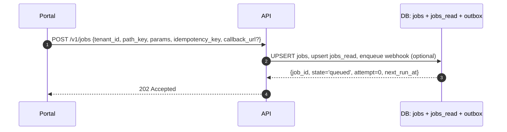
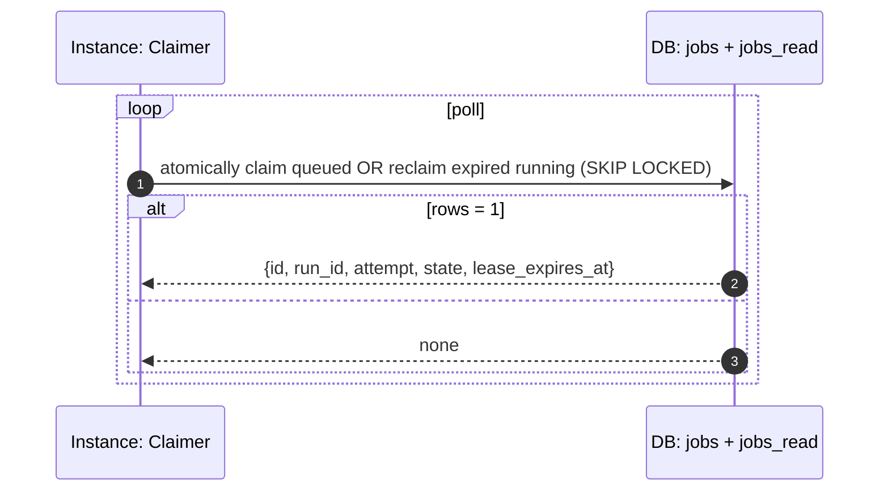
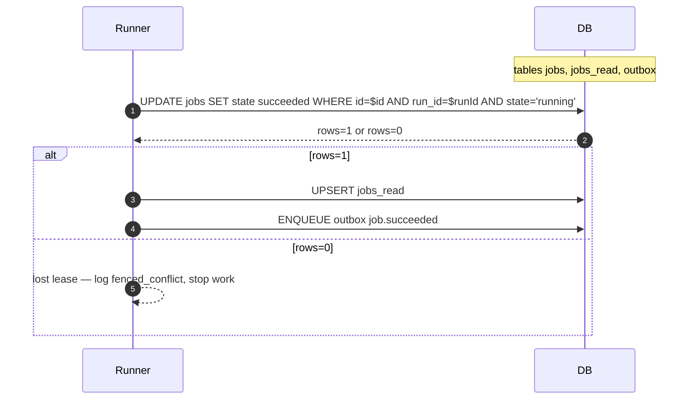
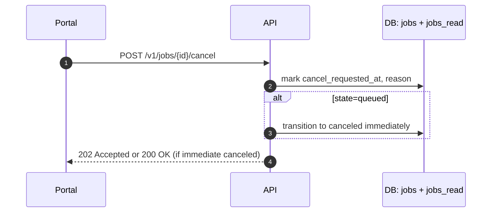

# Release Engine — Design (Part 5)

## 13) Job Lifecycle Flows with Fencing and SQL

All comparisons use database time. Every write path updates jobs and jobs_read in the same transaction.

### 13.1 Submit / Create (Idempotent)



```sql
INSERT INTO jobs (
  tenant_id, path_key, idempotency_key, params_json,
  state, attempt, max_attempts, next_run_at, created_by
)
VALUES ($tenant, $path, $idem, $params, 'queued', 0, $max_attempts,
        coalesce($first_run_at, now()), $subject)
ON CONFLICT (tenant_id, idempotency_key)
DO UPDATE SET updated_at = now()
RETURNING *;

INSERT INTO jobs_read AS r (id, tenant_id, path_key, state, attempt, max_attempts, owner_id, run_id,
                            lease_expires_at, next_run_at, started_at, finished_at, updated_at)
VALUES ($id, $tenant, $path, 'queued', 0, $max_attempts, NULL, gen_random_uuid(), NULL, EXCLUDED.next_run_at, NULL, NULL, now())
ON CONFLICT (id) DO UPDATE
SET state = EXCLUDED.state, attempt = EXCLUDED.attempt, next_run_at = EXCLUDED.next_run_at, updated_at = now();

INSERT INTO outbox (tenant_id, job_id, kind, payload_json, next_run_at)
VALUES ($tenant, $id, 'event', jsonb_build_object('type','job.accepted','job_id',$id), now());
```

### 13.2 Claim Work (Scheduler/Claimer)

The claimer handles both scheduling and lease-expiry recovery in one atomic path. No separate reaper exists.



```sql
WITH picked AS (
  SELECT id
  FROM jobs
  WHERE (
          (state = 'queued'  AND next_run_at      <= now())
       OR (state = 'running' AND lease_expires_at <= now())
        )
  ORDER BY
    CASE WHEN state = 'running' THEN 0 ELSE 1 END,
    next_run_at NULLS FIRST,
    lease_expires_at NULLS FIRST
  FOR UPDATE SKIP LOCKED
  LIMIT 10
)
UPDATE jobs j
SET
  state = 'running',
  owner_id = $owner_id,
  run_id = gen_random_uuid(),
  lease_expires_at = now() + $lease_ttl,
  attempt = CASE WHEN j.state = 'queued' THEN j.attempt + 1 ELSE j.attempt END,
  started_at = COALESCE(j.started_at, now()),
  updated_at = now()
FROM picked p
WHERE j.id = p.id
RETURNING j.id, j.tenant_id, j.path_key, j.run_id, j.attempt, j.state, j.lease_expires_at;
```

Projection update (same transaction):

```sql
INSERT INTO jobs_read AS r (id, tenant_id, path_key, state, attempt, owner_id, run_id,
                            lease_expires_at, next_run_at, started_at, finished_at, updated_at)
SELECT j.id, j.tenant_id, j.path_key, j.state, j.attempt, j.owner_id, j.run_id,
       j.lease_expires_at, j.next_run_at, j.started_at, j.finished_at, now()
FROM jobs j JOIN picked p ON p.id = j.id
ON CONFLICT (id) DO UPDATE
SET state = EXCLUDED.state, attempt = EXCLUDED.attempt, owner_id = EXCLUDED.owner_id,
    run_id = EXCLUDED.run_id, lease_expires_at = EXCLUDED.lease_expires_at, updated_at = now();
```

**Invariants**
- Expired running jobs are reclaimed exclusively via the claimer. The new `run_id` UUID fences any late writes from the prior owner.
- No background sweeper is required; database time is the sole clock for lease expiry.
- **All lease and scheduling time comparisons MUST use database `now()`, never application clock.** Clock skew between application instances and the database will cause early or late lease expiry if application time is used. All `lease_expires_at` and `next_run_at` comparisons happen in SQL.

**Metrics**: `claim_selected_total`, `claim_none_total`, `claim_started_running_total`, `claim_recovered_expired_total`, `claim_conflict_total`

### 13.3 Runner Finish — Success (Fenced)



```sql
UPDATE jobs
SET state = 'succeeded', owner_id = NULL, lease_expires_at = NULL, next_run_at = NULL,
    last_error_code = NULL, last_error_message = NULL, finished_at = now(), updated_at = now()
WHERE id = $id AND run_id = $run_id AND state = 'running';
-- Assert 1 row affected; if 0 rows -> fenced_conflict metric, discard
```

### 13.4 Cooperative Cancel



```sql
UPDATE jobs
SET cancel_requested_at = COALESCE(cancel_requested_at, now()),
    cancel_reason = COALESCE($reason, cancel_reason), updated_at = now()
WHERE id = $id;

UPDATE jobs
SET state = 'canceled', owner_id = NULL, lease_expires_at = NULL, next_run_at = NULL,
    finished_at = now(), updated_at = now()
WHERE id = $id AND state = 'queued';
```

### 13.5 Retry Scheduling (Transient Error)

```sql
UPDATE jobs
SET state = CASE WHEN attempt >= max_attempts THEN 'jobs_exhausted' ELSE 'queued' END,
    owner_id = NULL, lease_expires_at = NULL,
    next_run_at = CASE
                    WHEN attempt >= max_attempts THEN NULL
                    ELSE now() + backoff_interval(attempt, backoff_policy)
                  END,
    last_error_code = $code, last_error_message = $msg, updated_at = now(),
    finished_at = CASE WHEN attempt >= max_attempts THEN now() ELSE NULL END
WHERE id = $id AND run_id = $run_id AND state = 'running';
```

Helper:

```sql
CREATE OR REPLACE FUNCTION backoff_interval(attempt int, policy jsonb)
RETURNS interval LANGUAGE sql AS $$
  SELECT make_interval(secs => LEAST(
    coalesce((policy->>'base_seconds')::int, 2) * (2 ^ GREATEST(attempt-1,0)),
    coalesce((policy->>'max_seconds')::int, 300)))
$$;
```

### 13.6 Outbox Delivery with DLQ

```sql
-- Claim outbox row
WITH c AS (
  SELECT id FROM outbox
  WHERE delivery_state = 'pending' AND next_run_at <= now()
  ORDER BY next_run_at, id FOR UPDATE SKIP LOCKED LIMIT 1
)
UPDATE outbox o SET delivery_state = 'delivering', attempt = attempt + 1, updated_at = now()
FROM c WHERE o.id = c.id RETURNING o.*;

-- Success
UPDATE outbox SET delivery_state = 'delivered', updated_at = now()
WHERE id = $id AND delivery_state = 'delivering';

-- Retry (backoff: LEAST(2^(attempt-1), 600) seconds, capped at 10 minutes — matches §11 spec)
UPDATE outbox
SET delivery_state = 'pending',
    next_run_at = now() + make_interval(secs => LEAST(2 ^ GREATEST(attempt-1, 0), 600)),
    last_error = $err, updated_at = now()
WHERE id = $id AND delivery_state = 'delivering' AND attempt < max_attempts;

-- DLQ escalation
UPDATE outbox SET delivery_state = 'dlq', updated_at = now()
WHERE id = $id AND delivery_state = 'delivering' AND attempt >= max_attempts;
```

### 13.7 Lease-based Recovery

Recovery is executed by the claimer through the same atomic claim path (see §13.2). No separate reaper loop exists. The `run_id` bump inside the claim transaction guarantees correctness.

**Observability**
- `expiry_to_resume_latency` measures `lease_expires_at` to new claim timestamp.
- `lost_lease_while_running_total` tracks fenced conflicts observed by runners.

### 13.8 Read Status

```sql
SELECT id, tenant_id, path_key, state, attempt, max_attempts,
       owner_id, run_id, lease_expires_at, next_run_at,
       started_at, finished_at, updated_at, last_error_code, last_error_message
FROM jobs_read
WHERE tenant_id = $tenant AND id = $id;
```

---
## 14) Failure Handling

- Retries use bounded exponential backoff with jitter. Circuit states tracked per connector and per tenant (per-process; see note below).
- **Unknown outcome reconciliation**:
    - A reconciler scans `external_effects` where `status='unknown_outcome'` and `next_run_at <= now()`.
    - Strategy per operation:
        - If provider supports idempotency lookup by call_id or provider_ref, query it and finalise to succeeded or failed.
        - Otherwise, read the target resource to determine whether the intended state exists. If yes, finalise to succeeded; if no, transition to reserved for another attempt with the same call_id.
    - After `max_reconcile_attempts` (default 5) the effect is escalated to `status='dlq'` via `effect_escalate_dlq()`. An alert fires; manual review required.
In-flight effects that are abandoned at graceful shutdown drain timeout are transitioned to `unknown_outcome` by the shutdown sequence, not left to lease expiry.
- **Fencing conflicts**:
    - Any 0-row UPDATE during effect lease, finalise, or backoff indicates lost ownership; record `fenced_conflict` and stop local processing.
- **Job cancellation**:
    - For reserved effects, set `status='canceled'` under run_id fence.
    - For in_flight effects, allow completion and then suppress downstream step transitions; metrics record `canceled_while_in_flight`.
- **Webhooks**:
    - Outbound webhook/callback deliveries to tenant `callback_url` endpoints are tracked exclusively in the `outbox` table (§12.3), not in `external_effects`. The `outbox` row's `dedupe_key` serves as the `delivery_id` for at-most-once processing at the receiver. At-least-once delivery at transport; at-most-once processing at receiver via delivery_id and HMAC replay protection. HMAC keys support rotation (two active keys, `X-Signature-Version` header).
- **Circuit breaker state**:
    - Circuit breaker state is maintained **per-process** (in-memory). This means Instance A may have an open circuit while Instance B sends traffic. This is accepted as the trade-off for simplicity. For production deployments with sustained provider failures, operators should watch `connector_circuit_open_total` metrics and scale down to reduce blast radius. Shared circuit state (via Postgres/Redis) can be added as a future improvement if needed.

### Operational Model
- Horizontally scalable with N identical processes. All instances participate in scheduling via SKIP LOCKED.
- Backpressure is applied by claim policy, rate limiting, and Outbox throughput. No hidden concurrency.

---

## 15) Metrics Surfaces

Prometheus exporter (selected names; label sets are bounded):
- `release_engine_jobs_claim_success_total{tenant_id}`
- `release_engine_jobs_claim_conflict_total{tenant_id}`
- `release_engine_jobs_fenced_write_conflicts_total{tenant_id}`
- `release_engine_jobs_lost_lease_while_running_total{tenant_id}`
- `release_engine_jobs_expiry_to_resume_latency_seconds_bucket`
- `release_engine_job_duration_seconds_bucket{path_key}`
- `release_engine_connector_call_seconds_bucket{connector, operation}`
- `release_engine_outbox_delivery_attempts_total`
- `release_engine_outbox_delivery_failures_total`
- `release_engine_outbox_dlq_total{tenant_id}`
- `release_engine_effects_dlq_total{tenant_id}`
- `release_engine_jobs_exhausted_total{tenant_id}`
- `release_engine_api_rate_limited_total{tenant_id}`
- `release_engine_connector_circuit_open_total{connector, tenant_id}`
- `pgbouncer_cl_waiting` (PgBouncer metric — alert on > 0 for 30 s)

SQL events (metrics_sql): Same events as exporter for compliance and long-term trend analysis. Rollups computed via materialised views.

---

## 16) Module and Connector Contracts

### 16.1 Module Contract (orchestration only)
- **Purpose**: deterministic orchestration of steps; no direct external API calls.
- **Input**: job_id, tenant_id, path_key, params_json, attempt, run_id, cancel_requested_at
- **Capabilities**:
    - emit step_start/step_ok/step_err events to engine (in-process API)
    - request external effects via the engine with a normalised input payload; receive effect_id and call_id
    - read transient job context stored by engine
- **Constraints**:
    - no network access; all external effects routed via connectors or webhook workers
    - idempotent step logic given the same (job_id, attempt, step_key)
    - must check cancel_requested_at between steps
- **Engine-provided calls**:
    - `begin_step(step_key)`
    - `end_step_ok(step_key, output_json?)`
    - `end_step_err(step_key, code, message)`
    - `reserve_effect(step_key, connector_key, operation, normalised_input) -> {effect_id, call_id}`
    - `await_effect(effect_id, timeout?) -> {status, provider_ref?, output_json?}`
    - `get_context(key)`, `set_context(key, value)`

### 16.2 Connector Contract (external boundary)
- **Purpose**: enforce a fenced, idempotent boundary to external providers.
- **Required behavior**:
    - Use call_id with the provider's idempotency features. If provider lacks native support, emulate with a pre-flight GET.
    - Acquire effect lease before issuing any outbound request. Release only through a fenced finalise.
    - Map provider responses to a normalised outcome: `ok`, `retryable`, `terminal`, `unknown`.
    - Emit `connector_call_log` entry for every attempt.
- **Finalization rules** (all fenced by `WHERE effect_id = $id AND status = 'in_flight'`):
    - ok → `status = 'succeeded'`, provider_ref set
    - retryable → `effect_backoff(...)`
    - terminal → `status = 'failed'`, last_error_* set
    - unknown → `status = 'unknown_outcome'`, next_run_at = now()
- **Standard operations**: `scm.create_repo`, `scm.protect_branch`, `cicd.create_pipeline`, `cloud.apply_stack`, `catalog.register_entity`

### 16.3 Optional Context Storage
- Table: `job_context(job_id uuid, key text, value_json jsonb, updated_at timestamptz, PRIMARY KEY(job_id, key))`
- Writers are fenced with run_id in WHERE clause when updates occur from runners.

---

## 17) Registry and Resolution

### 17.1 Registry Model
- `module_registry(module_key text PK, description text, default_version text)`
- `module_version(module_key text, version text, checksum text, enabled boolean, UNIQUE(module_key, version))`
- `connector_registry(connector_key text PK, provider text, capability jsonb, default_config jsonb)`
- `binding_module(path_key text PK, module_key text, version text, policy_ref text, flags jsonb)`
- `binding_connector(path_key text, connector_key text, config jsonb, precedence int, PRIMARY KEY(path_key, connector_key))`

### 17.2 Resolution Algorithm
1. Resolve module: `binding_module[path_key]` → module_key + version
2. Resolve connectors: `binding_connector[path_key]` ordered by precedence
3. Apply policy overlay to filter/override settings
4. Cache with TTL 60 s and background refresh; LRU eviction

---

## 18) Policy, RBAC, Multi-Tenancy

### 18.1 Authentication
- OIDC JWT Bearer required on all API requests. Issuer pinned, audience checked, clock skew ≤ 60 s.

### 18.2 RBAC
- Model: role → permissions(action, path_key) scoped by tenant_id.
- Enforcement:
    - intake: `job:create` on path_key
    - read: `job:read` on job_id or path_key
    - cancel: `job:cancel` on job_id or path_key — **cache bypassed, always evaluated fresh**
- Cache: per-principal decision cache with TTL 60 s for non-destructive actions; explicit invalidation on binding updates.
- **Note on cancel cache bypass:** The `job:cancel` action bypasses the RBAC cache because it is a destructive operation. Stale grants could allow unauthorised cancellation of running jobs, leading to data integrity issues or service disruption. Fresh evaluation ensures that the most current permission state is always applied to this sensitive action.
- Audit: `audit_log(id, ts, tenant_id, principal, action, target, decision, reason)`

### 18.3 Policy Evaluation
- Scope: path enablement, connector selection, rate limits, max_attempts bounds, backoff defaults, parameter allowlist/denylist.
- Engine: embedded evaluator (code) or OPA-compatible evaluation in-process.

### 18.4 Multi-Tenancy Isolation
- All tables include tenant_id indexes.
- No cross-tenant reads or writes in SQL queries.
- Per-tenant rate and concurrency limits enforced at: API layer (rate limiter), claimers, connectors, outbox.

---

## 19) Configuration and Flags

- Sources: static file at boot, environment variables, DB-backed dynamic settings table.
- Settings: `settings(scope text, key text, value jsonb, updated_at timestamptz, PRIMARY KEY(scope, key))`
- Feature flags: typed flags with default, description, rollout percentage per tenant; snapshot-based evaluation polling every 30 s.
- Safe rollout: additive defaults; canary tenants configured explicitly.
- **Canary rollback definition**:
    - Trigger SLI: intake error rate > 1% OR claim latency P99 exceeds TTL/4 threshold
    - Canary window: 15 minutes
    - Mechanism: See decision tree below
    - Notification: PagerDuty alert + Slack channel
    - **Rollback decision tree**:

```
SLI breach detected (intake error rate > 1% OR claim latency P99 > TTL/4)
  ├─ Is it a code bug in the newly deployed engine?
  │   └─ Yes → ArgoCD rollback (affects all tenants)
  │           → Alert: PagerDuty severity 1, channel: #release-engine-incidents
  │
  ├─ Is it a config, module, or connector issue?
  │   └─ Yes → Feature flag kill switch (scoped to path_key or tenant)
  │           → Alert: PagerDuty severity 2, channel: #release-engine-ops
  │
  └─ Unknown root cause?
      ├─ Step 1: Apply feature flag kill switch first (fast, scoped)
      └─ Step 2: If not resolved within 5 minutes → ArgoCD full rollback
```

**Ownership:**
- **Automated**: ArgoCD analysis detects SLI breach and can trigger rollback automatically
- **Manual**: On-call engineer can override via ArgoCD or feature flag dashboard
- **Post-incident**: Conduct blameless review within 48 hours, update game day tests

---

## 20) Backstage Integration

- Backstage Portal calls `POST /v1/jobs` with idempotency_key tied to the user action.
- Streaming: Backstage subscribes to `GET /v1/jobs/{id}/events` with cursor; shows live state transitions.
- Callback: If callback_url provided, Release Engine posts signed events with HMAC (two-key rotation supported). Backstage validates `X-Signature-Version` header to select the correct verification key.
- Catalog: Connector registers new entities through the Backstage Catalogue API using service credentials, not user tokens.
- Permissions: Backstage plugin forwards JWT; engine enforces RBAC. No implicit trust.