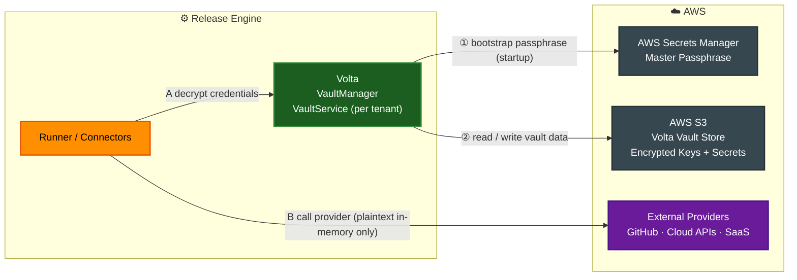
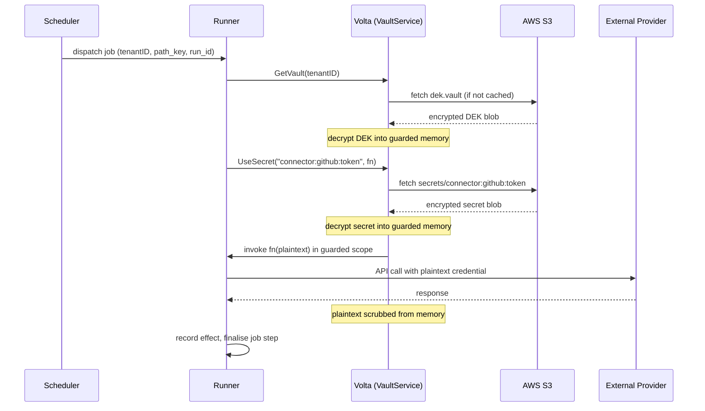
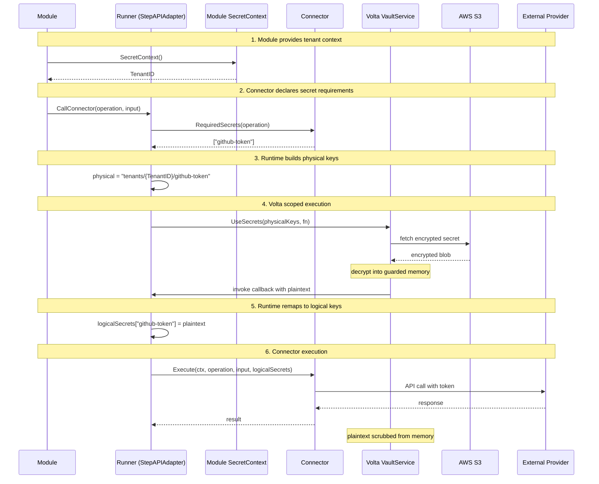

# Release Engine — Design (Part 7)

## 27) Tenant Secret Encryption with Volta and AWS Secrets Manager

### Overview

The Release Engine uses **[Volta](https://github.com/gatblau/volta)** — a zero-dependency, embedded Go library — as
its in-process, multi-tenant encryption engine for protecting connector credentials and other tenant-scoped secrets.

Connector credentials (e.g. GitHub tokens, cloud provider API keys, SaaS service secrets) are the most sensitive
material handled by the Release Engine. They must never appear in plaintext in logs, job parameters, or database rows.
Volta provides cryptographic isolation per tenant using an envelope-encryption key hierarchy (KEK → DEK), while AWS
Secrets Manager acts as the **root of trust** by storing Volta's startup passphrase, and **AWS S3** serves as the
durable backend for Volta's encrypted vault data.

---

### Why Volta for Connector Credentials?

Connector credentials exhibit properties that make Volta the correct tool:

| Property | Why Volta fits |
|----------|----------------|
| **High-frequency access** | Decryption occurs on every connector call; Volta operates in-process with zero network latency. |
| **Multi-tenant isolation** | Each tenant has a cryptographically independent key hierarchy; one tenant's compromise cannot expose another's. |
| **No external service per call** | Centralised vaults (AWS SM, Vault) incur per-call network round trips; Volta avoids this entirely once bootstrapped. |
| **Auditability** | Volta's pluggable `audit.Logger` interface logs every encrypt/decrypt/key-rotation event, feeding the existing Release Engine observability stack. |
| **Key lifecycle** | Per-tenant DEK rotation is self-contained and does not require data re-encryption. |

---

### Security Model: Envelope Encryption

Volta implements **envelope encryption** with a two-level key hierarchy per tenant:

```
AWS Secrets Manager
  └── Master Passphrase (startup, low-frequency)
       └── Volta KEK (Key Encryption Key, derived per tenant from passphrase)
            └── Volta DEK (Data Encryption Key, per tenant, encrypted by KEK)
                 └── Connector Credentials (encrypted by DEK, stored in S3)
```

- **Master Passphrase** — stored in AWS Secrets Manager, fetched once at application startup via the EC2/EKS IAM role.
  Never written to disk by the application. Held in memguard-protected memory.
- **KEK (Key Encryption Key)** — derived deterministically from the passphrase using `Argon2id`; one per tenant;
  exists only in protected memory at runtime; never persisted in plaintext.
- **DEK (Data Encryption Key)** — randomly generated per tenant; encrypted by the KEK; persisted encrypted in S3;
  decrypted into protected memory on first use per tenant session.
- **Connector Credentials** — encrypted by the DEK using AES-256-GCM; persisted as Volta secret entries in S3;
  decrypted in-process only for the duration of a connector call.

---

### System Context



**Flow:**

| Step | Description |
|------|-------------|
| ① | At startup, the Release Engine authenticates to AWS Secrets Manager via IAM role and retrieves Volta's master passphrase into guarded memory. |
| ② | Volta reads encrypted KEK/DEK metadata and encrypted secrets from S3 on demand (per-tenant, cached in guarded memory for the session lifetime). Writes go back to S3 on mutation (e.g. new secret, key rotation). |
| A | The Runner requests decryption of a connector's credential from the tenant's `VaultService` before executing a connector call. |
| B | The decrypted credential is used in-process for the duration of the provider call and then scrubbed from memory. |

---

### Component Design

#### 27.1 Bootstrap: AWS Secrets Manager

At application startup (before the Scheduler begins processing jobs), the Release Engine performs a single fetch:

```
POST /api/oidc/token (EKS Service Account / EC2 Instance Role)
  → GetSecretValue (AWS SDK v2)
      SecretId: "release-engine/volta/master-passphrase"
  → passphrase bytes inserted into memguard LockedBuffer
  → VaultManagerService.Init(passphrase)
```

**IAM Policy (minimum viable):**

```json
{
  "Effect": "Allow",
  "Action": ["secretsmanager:GetSecretValue"],
  "Resource": "arn:aws:secretsmanager:<region>:<account>:secret:release-engine/volta/master-passphrase-*"
}
```

The passphrase is **never** logged, written to environment variables, or serialised. On application shutdown
`VaultManagerService.CloseAll()` scrubs all in-memory key material.

#### 27.2 Storage Backend: AWS S3

Volta's `persist.Store` interface is implemented as an **S3 backend**. Each Volta object is stored as a single S3 object:

| S3 key pattern | Content |
|----------------|---------|
| `volta/{tenantID}/kek.vault` | Encrypted KEK metadata (Argon2id params + encrypted key blob) |
| `volta/{tenantID}/dek.vault` | Encrypted DEK blob (encrypted by KEK) |
| `volta/{tenantID}/secrets/{secretName}` | Encrypted secret value (encrypted by DEK) |
| `volta/{tenantID}/audit/{YYYY-MM-DD}.jsonl` | Append-only audit log (encrypted) |

**S3 Bucket Configuration:**

| Setting | Value |
|---------|-------|
| Versioning | Enabled (supports key rotation rollback) |
| Server-side encryption | SSE-S3 (AES-256, additional layer under Volta's own encryption) |
| Object Lock | Compliance mode, 90-day retention for audit logs |
| Bucket policy | Deny `s3:DeleteObject` for audit prefix; enforce TLS |
| IAM policy | `s3:GetObject`, `s3:PutObject` on `volta/*`; `s3:ListBucket` scoped to `volta/` prefix |

**S3 Store interface implementation (Go sketch):**

```go
// S3Store implements persist.Store using AWS SDK v2.
type S3Store struct {
    client     *s3.Client
    bucket     string
    keyPrefix  string // "volta/"
}

func (s *S3Store) Get(tenantID, objectKey string) ([]byte, error) { ... }
func (s *S3Store) Put(tenantID, objectKey string, data []byte) error { ... }
func (s *S3Store) Delete(tenantID, objectKey string) error { ... }
func (s *S3Store) List(tenantID string) ([]string, error) { ... }
```

#### 27.3 Connector Credential Lifecycle

Connector credentials are managed as **Volta secrets** under the owning tenant.

**Secret naming convention:**

```
connector:<connector-key>:<field>
```

Examples:
- `connector:github:token`
- `connector:aws-dev:access_key_id`
- `connector:aws-dev:secret_access_key`
- `connector:jira:api_token`

**Storing a credential (admin / onboarding path):**

```go
vault, err := mgr.GetVault(tenantID)
// ...
err = vault.StoreSecret("connector:github:token", []byte(rawToken))
```

**Retrieving a credential for a connector call (Runner path):**

```go
vault, err := mgr.GetVault(tenantID)
// credential is decrypted only within this scoped call
err = vault.UseSecret("connector:github:token", func(plaintext []byte) error {
    return githubConnector.Call(ctx, endpoint, plaintext, params)
})
// plaintext is scrubbed from memory when the closure returns
```

The `UseSecret` scoped pattern ensures that plaintext credential bytes exist in guarded memory **only for the duration of the connector call** and are wiped immediately afterwards.

#### 27.4 Audit Logging Integration

Volta's `audit.Logger` interface is implemented to route Volta audit events into the Release Engine's existing
structured log pipeline (OpenSearch / CloudWatch):

```go
type OtelAuditLogger struct {
    logger *slog.Logger
    tracer trace.Tracer
}

func (a *OtelAuditLogger) Log(event audit.Event) {
    a.logger.Info("volta.audit",
        "tenant_id",  event.TenantID,
        "operation",  event.Operation,
        "secret_name", event.SecretName,
        "outcome",    event.Outcome,
        "timestamp",  event.Timestamp,
    )
}
```

All of the following events are emitted to the structured log:
- Secret creation / retrieval / update / deletion
- DEK generation and rotation
- KEK rotation
- Failed decrypt attempts
- VaultService open / close

#### 27.5 Key Rotation Strategy

| Rotation type | Trigger | Impact | Procedure |
|---------------|---------|--------|-----------|
| **DEK rotation (per tenant)** | Scheduled (90-day default) or on-demand via admin API | No data re-encryption required; Volta re-wraps DEK with existing KEK | `VaultService.RotateKey(tenantID, reason)` |
| **KEK rotation (all tenants)** | Scheduled (annual) or on suspected passphrase exposure | All DEK blobs re-encrypted with new KEK | `VaultManagerService.RotateAllTenantKeys(newPassphrase, reason)` + update AWS Secrets Manager value |
| **Master passphrase rotation** | Via AWS Secrets Manager (manual or automatic rotation lambda) | Triggers application restart cycle; new passphrase fetched at startup | Update SM secret → rolling restart of Release Engine pods |

---

### Data Flow: Connector Call with Vault Decryption

The full flow of a job step that requires connector credentials:



---

### Security Considerations

| Risk | Mitigation |
|------|-----------|
| Passphrase exposure in logs | `memguard.LockedBuffer` used for passphrase and DEK; never passed as `string`; `slog` field redaction enforced |
| S3 object tampering | SSE-S3 + Volta's own AES-256-GCM (double encryption); S3 Object Lock prevents deletion |
| Credential leak in job params | Connector credentials are **never** stored in `params_json`; only the Volta secret name reference is stored |
| Zombie worker decrypting stale credential | Fencing via `run_id`; `VaultService` session closed when lease expires |
| Key compromise (single tenant) | Per-tenant DEK isolation; compromise of one tenant's DEK does not expose others |
| Backup of vault state | Volta's `VaultService.Backup(passphrase)` creates an encrypted backup archive; stored in a separate S3 prefix or Glacier |

---

### Operational Runbook Sketch

**Onboard a new tenant connector credential:**
```bash
# Via admin CLI (out-of-band, never via the job API)
volta-cli store-secret \
  --tenant <tenantID> \
  --name "connector:github:token" \
  --value "$(aws secretsmanager get-secret-value --secret-id github/orgs/acme/token --query SecretString --output text)"
```

**Rotate a single tenant's DEK:**
```bash
volta-cli rotate-dek --tenant <tenantID> --reason "scheduled 90-day rotation"
```

**Rotate the master passphrase (coordinated with rolling restart):**
```bash
# 1. Generate new passphrase
NEW_PASS=$(openssl rand -base64 48)
# 2. Update AWS Secrets Manager
aws secretsmanager put-secret-value \
  --secret-id release-engine/volta/master-passphrase \
  --secret-string "$NEW_PASS"
# 3. Trigger rolling restart of Release Engine
kubectl rollout restart deployment/release-engine
```

---

### Configuration

The following configuration keys govern Volta integration:

| Key | Type | Default | Description |
|-----|------|---------|-------------|
| `volta.enabled` | bool | `true` | Enable Volta encryption for connector credentials |
| `volta.sm_secret_id` | string | (required) | AWS Secrets Manager secret ID for the master passphrase |
| `volta.s3_bucket` | string | (required) | S3 bucket name for Volta vault storage |
| `volta.s3_prefix` | string | `volta/` | Key prefix within the bucket |
| `volta.dek_rotation_days` | int | `90` | Days between automatic DEK rotations per tenant |
| `volta.session_ttl` | duration | `24h` | How long a tenant `VaultService` is kept open in the manager cache |
| `volta.audit_enabled` | bool | `true` | Emit Volta audit events to the structured log pipeline |

---

### Go Dependency

```sh
go get southwinds.dev/volta
```

The AWS SDK v2 packages required for the S3 backend and Secrets Manager bootstrap:

```sh
go get github.com/aws/aws-sdk-go-v2/config
go get github.com/aws/aws-sdk-go-v2/service/secretsmanager
go get github.com/aws/aws-sdk-go-v2/service/s3
```

---

## 29) Scoped Secret Execution and Module-Owned Tenant Resolution

This section documents the architectural updates implementing secure scoped execution and module-owned tenant resolution for connector credentials, as defined in `docs/vault.md` and `docs/volta-plan.md`.

### 29.1 Architectural Principles

The updated architecture resolves the tension between clean separation of concerns and secure secret handling through three core principles:

1. **Scoped Execution**: Don't pass secrets to connectors. Pass connectors to secrets within Volta's guarded callbacks.
2. **Module-Owned Tenant Context**: The module — not the runtime, not the connector, not external config — determines which tenant's secrets to use.
3. **Connector-Declared Requirements**: Connectors declare *what* secrets they need. Modules declare *whose* secrets to use. The runtime orchestrates the binding.

### 29.2 Module Secret Context Interface

Modules implement the `SecretContextProvider` interface to provide tenant context for secret resolution:

```go
type SecretContextProvider interface {
    SecretContext() SecretContext
}

type SecretContext struct {
    TenantID string
}
```

Each module implementation owns its tenant resolution logic:

```go
// Infra module — always platform tenant
func (m *InfraModule) SecretContext() SecretContext {
    return SecretContext{
        TenantID: "platform",
    }
}

// Scaffold module — derived from its own inputs
func (m *ScaffoldModule) SecretContext() SecretContext {
    // Module validates its own inputs
    if m.input.CustomerID == "" {
        panic("scaffold module constructed without customer ID")
    }
    return SecretContext{
        TenantID: m.input.CustomerID,
    }
}
```

The module validates its own tenant context. If a scaffold module receives an empty or invalid `CustomerID`, the module rejects it — the runtime doesn't need to know the validation rules.

### 29.3 Revised Connector Interface

Connectors are updated to accept secrets via a new `Execute` method signature and can optionally implement the `SecretRequirer` interface:

```go
type Connector interface {
    Execute(ctx context.Context, operation string, input map[string]interface{}, secrets map[string][]byte) (*ConnectorResult, error)
}

// Optional interface for secret declaration
type SecretRequirer interface {
    RequiredSecrets(operation string) []string
}
```

Key design decisions:
- `secrets` parameter is `map[string][]byte` — logical keys only, connectors never see tenant paths
- `RequiredSecrets` is a separate optional interface, not part of the main `Connector` interface, allowing gradual adoption
- Connectors that don't need secrets receive an empty map

#### 29.3.1 Example: Revised GitHub Connector

```go
type GitHubConnector struct {
    client *http.Client // reusable, no auth baked in
    apiURL string
}

func NewGitHubConnector(cfg connector.ConnectorConfig) (*GitHubConnector, error) {
    return &GitHubConnector{
        client: &http.Client{Timeout: 30 * time.Second},
        apiURL: cfg.Settings["api_url"].(string),
    }, nil
}

func (g *GitHubConnector) RequiredSecrets(operation string) []string {
    return []string{"github-token"}
}

func (g *GitHubConnector) Execute(ctx context.Context, operation string, input map[string]interface{}, secrets map[string][]byte) (*ConnectorResult, error) {
    token := secrets["github-token"]
    if token == nil {
        return nil, fmt.Errorf("missing required secret: github-token")
    }

    req, err := http.NewRequestWithContext(ctx, "GET", g.apiURL+"/some/endpoint", nil)
    if err != nil {
        return nil, err
    }
    req.Header.Set("Authorization", "Bearer "+string(token))

    resp, err := g.client.Do(req)
    // ... handle response
}
```

### 29.4 Runtime Orchestration

The `StepAPIAdapter` orchestrates the binding between module tenant context, connector secret requirements, and Volta scoped execution:

```go
func (a *StepAPIAdapter) CallConnector(ctx context.Context, req ConnectorRequest) (*connector.ConnectorResult, error) {
    conn, err := a.connectorRegistry.GetConnector(req.ConnectorFamily, req.ConnectorType)
    if err != nil {
        return nil, fmt.Errorf("connector resolution failed: %w", err)
    }

    // Determine required secrets
    var requiredSecrets []string
    if secretReq, ok := conn.(connector.SecretRequirer); ok {
        requiredSecrets = secretReq.RequiredSecrets(req.Operation)
    }

    // No secrets needed — execute directly
    if len(requiredSecrets) == 0 {
        return conn.Execute(ctx, req.Operation, req.Input, nil)
    }

    // Resolve tenant context from module
    secretCtx := a.module.SecretContext()

    // Build physical keys, maintain logical mapping
    physicalToLogical := make(map[string]string, len(requiredSecrets))
    physicalKeys := make([]string, len(requiredSecrets))
    for i, logicalKey := range requiredSecrets {
        physical := fmt.Sprintf("tenants/%s/%s", secretCtx.TenantID, logicalKey)
        physicalKeys[i] = physical
        physicalToLogical[physical] = logicalKey
    }

    // Execute within Volta's secure scope
    var result *connector.ConnectorResult
    err = a.vaultManager.UseSecrets(physicalKeys, func(secrets map[string][]byte) error {
        // Remap to logical keys for connector
        logicalSecrets := make(map[string][]byte, len(secrets))
        for physical, value := range secrets {
            logicalSecrets[physicalToLogical[physical]] = value
        }
        var execErr error
        result, execErr = conn.Execute(ctx, req.Operation, req.Input, logicalSecrets)
        return execErr
    })

    return result, err
}
```

### 29.5 Physical-to-Logical Key Resolution

The runtime performs key remapping to maintain separation of concerns:

- **Logical keys** (connector declares): `github-token`, `gitlab-ssh-key`, `aws-access-key`
- **Physical keys** (Volta resolves): `tenants/{tenant-id}/github-token`

This convention is enforced by the resolution flow — connectors cannot bypass it. The remapping ensures connectors receive only logical keys regardless of how Volta stores them physically.

### 29.6 Updated Data Flow



### 29.7 Security Gap Acknowledgment

The `string(token)` conversion in connector implementations creates a copy that escapes Volta's secure disposal. This is a known Go limitation — `http.Header.Set` requires a string. Mitigations:

1. Volta zeroes the original `[]byte` after callback return
2. The string copy is short-lived (eligible for GC after request completes)
3. Future: custom `http.Transport` that works with `[]byte` directly

This is an acceptable trade-off. The current architecture stores tokens indefinitely in struct fields. Scoped execution reduces exposure from "lifetime of process" to "duration of single operation."

### 29.8 Migration Path

The architecture supports gradual migration:

1. **Phase 1**: Update all existing connectors to accept new `Execute` signature with empty secrets map
2. **Phase 2**: Implement `SecretRequirer` on connectors that need secrets
3. **Phase 3**: Update modules to implement `SecretContextProvider`
4. **Phase 4**: Wire Volta scoped execution in `StepAPIAdapter`

Backward compatibility is maintained through the optional `SecretRequirer` interface — connectors that don't implement it continue working with empty secret maps.

---

## 28) Approval Observability Runtime Hooks (Phase 8)

Although approval lifecycle metrics are defined in Part 5 observability surfaces, this part documents
the runtime hooks that produce those signals from approval-aware execution paths.

### 28.1 Instrumentation Ownership

| Runtime path | Component | Metrics emitted |
|---|---|---|
| Entering `waiting_approval` | `ApprovalService.SeedStep()` | `re_approval_requests_total{tenant_id,path_key,step_key}` |
| Decision recorded | `ApprovalService.SubmitDecision()` | `re_approval_decisions_total{tenant_id,path_key,step_key,decision}` |
| Decision latency observation | `ApprovalService.SubmitDecision()` | `re_approval_latency_seconds{tenant_id,path_key}` |
| Escalation threshold reached | `ApprovalService.TickApprovals()` | `re_approval_escalations_total{tenant_id,path_key}` |
| TTL expiry timeout | `ApprovalService.TickApprovals()` | `re_approval_timeouts_total{tenant_id,path_key}` |
| Worker poll cycle duration | `ApprovalWorker.Tick()` | `re_approval_worker_tick_duration_seconds{status}` |

### 28.2 Runtime Contract

- Metrics emission is best-effort and must never block approval state transitions.
- Missing metrics recorder is treated as no-op (engine behavior remains deterministic).
- Labels are bounded to avoid cardinality blow-up:
  - `tenant_id`, `path_key`, `step_key` derive from persisted step identity.
  - `decision` is constrained to `approved|rejected|expired`.
  - worker `status` currently emits `success`.
- Approval latency is measured as `decision_recorded_at - requested_at` using engine time source.

### 28.3 Wiring Model

`ApprovalService` owns the lifecycle domain events and therefore owns request/decision/escalation/timeout
counter increments. `ApprovalWorker` is responsible only for per-tick execution telemetry.

```go
type ApprovalMetricsRecorder interface {
    RecordApprovalRequest(tenantID, pathKey, stepKey string)
    RecordApprovalDecision(tenantID, pathKey, stepKey, decision string)
    RecordApprovalLatency(tenantID, pathKey string, latency time.Duration)
    RecordApprovalEscalation(tenantID, pathKey string)
    RecordApprovalTimeout(tenantID, pathKey string)
    RecordApprovalWorkerTick(status string, duration time.Duration)
}
```

The recorder is attached to `ApprovalService` at composition time. This decouples approval domain logic from
Prometheus implementation details while preserving explicit instrumentation points.
