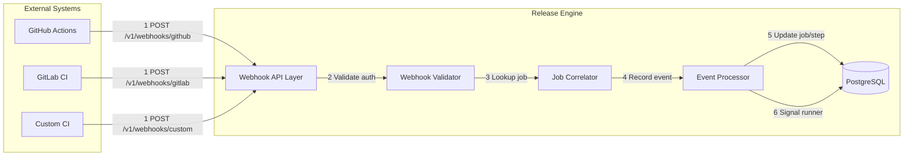
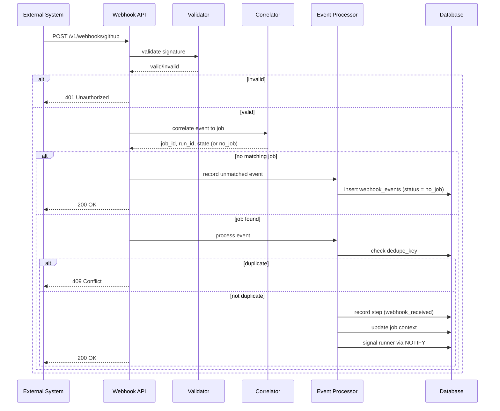
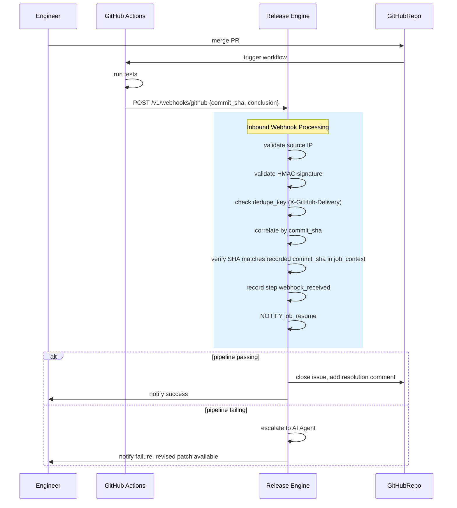

# Release Engine — Design (Part 8)

## Inbound Webhook Ingestion Layer

> This document specifies the design for receiving and processing inbound webhooks 
> from external systems (CI pipelines, GitHub Actions, GitLab CI, etc.) to correlate 
> events with running jobs and resume workflow execution.

---

## 28) Design Goals

1. **Secure ingestion**: Validate webhook authenticity via HMAC signature or token
2. **Source-specific auth**: Support different auth mechanisms per source 
   (GitHub, GitLab, custom CI)
3. **Job correlation**: Map inbound events to specific jobs using payload fields 
   or explicit job_id
4. **Idempotent processing**: Handle duplicate webhook deliveries without duplicate 
   side effects
5. **Audit trail**: Record all inbound events as immutable steps
6. **Source IP allowlisting**: Restrict accepted webhook sources to known external 
   IP ranges and reject private/internal addresses

---

## 29) Architecture Overview



---

## 30) API Surface

### 30.1 Inbound Webhook Endpoints

| Method | Path | Description |
|--------|------|-------------|
| POST | `/v1/webhooks/github` | Receive GitHub webhook events |
| POST | `/v1/webhooks/gitlab` | Receive GitLab webhook events |
| POST | `/v1/webhooks/custom` | Receive custom webhook events (token-based) |
| GET | `/v1/webhooks/{source}/health` | Health check for webhook endpoint |

**Note**: All webhook endpoints require **no JWT authentication** — they use
source-specific signature validation instead.

### 30.2 Request/Response Format

**GitHub Webhook Request:**
```json
{
  "action": "completed",
  "repository": { "full_name": "org/repo" },
  "workflow_run": {
    "head_sha": "abc123",
    "conclusion": "success",
    "workflow_id": 12345
  }
}
```

**Response:**
- `200 OK` — Event accepted and processed, or received but no matching job found
- `400 Bad Request` — Malformed payload
- `401 Unauthorized` — Invalid signature or token
- `409 Conflict` — Duplicate event (idempotency key already processed)

**Note**: No matching job returns `200 OK` and is recorded silently as
`status = no_job` in the event log. Returning `404` when signature validation
succeeded would leak correlation information to an external caller.

---

## 31) Authentication & Validation

### 31.1 GitHub Webhook Validation

GitHub webhooks are validated using HMAC-SHA256 signature in the
`X-Hub-Signature-256` header:

```
X-Hub-Signature-256: sha256=<hex_digest>
Signature = HMAC-SHA256(raw_request_body, webhook_secret)
```

**Validation steps:**
1. Read raw request body before any JSON parsing
2. Read `X-Hub-Signature-256` header
3. Compute `HMAC-SHA256(body, webhook_secret)` using tenant's configured secret
4. Compare computed digest against header value using **constant-time comparison**
   to prevent timing attacks
5. Reject if mismatch → `401 Unauthorized`

**Configuration per tenant:**
```yaml
webhooks:
  github:
    secret_key: "whsec_..."
    allowed_events: ["workflow_run", "check_run"]
```

### 31.2 GitLab Webhook Validation

GitLab sends the configured secret as a **plaintext token** in the
`X-Gitlab-Token` header. There is no HMAC computation.

**Validation steps:**
1. Read `X-Gitlab-Token` header
2. Compare header value against tenant's configured secret using
   **constant-time comparison**
3. Reject if mismatch → `401 Unauthorized`

```yaml
webhooks:
  gitlab:
    secret_key: "glpat_..."
    allowed_events: ["pipeline", "push"]
```

### 31.3 Custom Webhook Validation

Supports either:
- **Static token**: `X-Webhook-Token` header compared with constant-time
  comparison against configured secret
- **HMAC signature**: `X-Webhook-Signature` header, same HMAC-SHA256 computation
  as GitHub

Mode is specified per tenant in configuration.

### 31.4 Source IP Allowlisting

Inbound webhook requests are validated against known source IP ranges. Requests
from private or internal address spaces are rejected to prevent internal services
from being triggered as if they were legitimate external webhook sources.

**Blocked ranges:**
- RFC 1918: `10.0.0.0/8`, `172.16.0.0/12`, `192.168.0.0/16`
- Link-local: `169.254.0.0/16`
- Loopback: `127.0.0.0/8`, `::1`
- Cloud metadata endpoint: `169.254.169.254/32`

```go
func isAllowedSource(ip net.IP) bool {
    blocked := []string{
        "10.0.0.0/8",
        "172.16.0.0/12",
        "192.168.0.0/16",
        "169.254.0.0/16",
        "127.0.0.0/8",
        "169.254.169.254/32",
    }
    for _, cidr := range blocked {
        _, network, _ := net.ParseCIDR(cidr)
        if network.Contains(ip) {
            return false
        }
    }
    return true
}
```

**Note**: When the Release Engine sits behind a reverse proxy or load balancer,
use `X-Forwarded-For` with care. Only trust the leftmost IP if the proxy is
configured to append, and validate that the proxy itself is trusted before reading
forwarded headers.

---

## 32) Job Correlation

### 32.1 Correlation Strategies

The webhook processor must map an inbound event to a specific job. Three strategies
are supported:

| Strategy | Description | Use Case |
|----------|-------------|----------|
| `commit_sha` | Match `commit_sha` in payload to recorded value in job context | Flaky test triage |
| `job_id` | Explicit `job_id` in payload | Generic correlation |
| `pipeline_ref` | Match `pipeline_ref` + `commit_sha` composite | CI-specific workflows |

### 32.2 Correlation SQL

`job_context` is defined in Release Engine Design Part 3. It stores key/value
pairs scoped to a job and run.

```sql
-- Strategy 1: By commit_sha
SELECT j.id, j.run_id, j.state, j.tenant_id
FROM jobs j
JOIN job_context jc ON jc.job_id = j.id
WHERE jc.key = 'commit_sha'
  AND jc.value_json->>'commit_sha' = $commit_sha
  AND j.state IN ('running', 'queued')
LIMIT 1;

-- Strategy 2: By explicit job_id
SELECT id, run_id, state, tenant_id
FROM jobs
WHERE id = $job_id
  AND state IN ('running', 'queued');

-- Strategy 3: By pipeline_ref + commit_sha
SELECT j.id, j.run_id, j.state, j.tenant_id
FROM jobs j
JOIN job_context jc1 ON jc1.job_id = j.id AND jc1.key = 'pipeline_ref'
JOIN job_context jc2 ON jc2.job_id = j.id AND jc2.key = 'commit_sha'
WHERE jc1.value_json->>'pipeline_ref' = $pipeline_ref
  AND jc2.value_json->>'commit_sha' = $commit_sha
  AND j.state IN ('running', 'queued')
LIMIT 1;
```

### 32.3 Correlation Configuration

Each module specifies its correlation strategy in the job params:

```json
{
  "correlation": {
    "strategy": "commit_sha",
    "required_fields": ["commit_sha", "pipeline_ref"]
  }
}
```

---

## 33) Event Processing

### 33.1 Processing Flow



### 33.2 Step Recording

Every inbound webhook is recorded as an immutable step:

```sql
INSERT INTO steps (
    job_id, run_id, attempt, step_key, status, output_json, started_at, finished_at
)
VALUES (
    $job_id, $run_id, $attempt, 'webhook_received', 'ok', 
    $event_payload, now(), now()
);
```

### 33.3 Idempotency

Duplicate delivery prevention uses a source-specific `dedupe_key`:

| Source | dedupe_key field |
|--------|-----------------|
| GitHub | `X-GitHub-Delivery` header (UUID per delivery) |
| GitLab | `X-Gitlab-Event-UUID` header |
| Custom | `X-Webhook-Delivery` header, or SHA256 of payload if absent |

```sql
-- Check for duplicate
SELECT 1 FROM webhook_events
WHERE tenant_id = $tenant_id
  AND dedupe_key = $dedupe_key;

-- If row exists, return 409 Conflict and do not reprocess
```

---

## 34) Runner Resumption

### 34.1 Signal Mechanism

When a webhook correlates to a running job that is waiting for external input,
the processor signals the runner using PostgreSQL `NOTIFY`:

```sql
-- Write resume payload to job_context
INSERT INTO job_context (job_id, key, value_json, run_id, updated_at)
VALUES ($job_id, 'webhook_resume', jsonb_build_object(
    'event_type', $event_type,
    'payload', $payload,
    'received_at', now()
), $run_id, now())
ON CONFLICT (job_id, key) DO UPDATE
SET value_json = EXCLUDED.value_json, updated_at = now();

-- Notify waiting runner
SELECT pg_notify('job_resume', $job_id::text);
```

### 34.2 Runner Behavior

The runner listens on the `job_resume` channel using `LISTEN` before entering
a wait state. This avoids polling the database on a tight interval and avoids
holding an idle connection open for the full timeout duration.

```go
func (api *StepAPI) WaitForWebhook(ctx context.Context, eventKey string) (map[string]any, error) {
    // Register LISTEN before signalling readiness to avoid missing notifications
    if err := api.db.Exec("LISTEN job_resume"); err != nil {
        return nil, err
    }
    defer api.db.Exec("UNLISTEN job_resume")

    timeout := time.After(api.webhookTimeout) // default 10 minutes

    for {
        select {
        case <-timeout:
            return nil, ErrWebhookTimeout
        case <-ctx.Done():
            return nil, ctx.Err()
        case notification := <-api.notifyChan:
            if notification.Payload != api.jobID.String() {
                continue
            }
            // Read resume payload from job_context
            return api.readWebhookResume(ctx, eventKey)
        }
    }
}
```

The module calls `WaitForWebhook` between steps:

```go
func (m *FlakyTestModule) Execute(
    ctx context.Context, 
    api module.StepAPI, 
    params map[string]any,
) error {
    // Phase 1: Agent analysis and validation gates
    // Phase 2: GitHub writes

    // Wait for CI pipeline result after PR merge
    webhookPayload, err := api.WaitForWebhook(ctx, "ci_pipeline_complete")
    if err != nil {
        return err
    }

    // Phase 3: Validation gate 2 using webhookPayload
}
```

---

## 35) Data Model

### 35.1 Webhook Configuration Table

```sql
CREATE TABLE webhook_configs (
    id              uuid PRIMARY KEY DEFAULT gen_random_uuid(),
    tenant_id       text NOT NULL,
    source          text NOT NULL,  -- github, gitlab, custom
    enabled         boolean NOT NULL DEFAULT true,
    -- secret_key is encrypted at the application layer before insert
    -- using AES-256-GCM with a key derived from the tenant master key.
    -- The raw secret is never stored.
    secret_key_enc  bytea NOT NULL,
    allowed_events  jsonb NOT NULL DEFAULT '[]'::jsonb,
    correlation_strategy text NOT NULL DEFAULT 'job_id',
    auth_mode       text NOT NULL DEFAULT 'hmac',  -- hmac, plaintext_token
    created_at      timestamptz NOT NULL DEFAULT now(),
    updated_at      timestamptz NOT NULL DEFAULT now(),
    UNIQUE (tenant_id, source)
);

CREATE INDEX webhook_configs_tenant_idx ON webhook_configs (tenant_id, source);
```

### 35.2 Inbound Event Log

```sql
CREATE TABLE webhook_events (
    id              bigserial PRIMARY KEY,
    tenant_id       text NOT NULL,
    job_id          uuid,           -- null if no_job
    source          text NOT NULL,
    event_type      text NOT NULL,
    dedupe_key      text NOT NULL,
    payload_json    jsonb NOT NULL,
    correlation_strategy text NOT NULL,
    status          text NOT NULL,  -- accepted, duplicate, no_job, error
    processing_time_ms int,
    created_at      timestamptz NOT NULL DEFAULT now(),
    UNIQUE (tenant_id, dedupe_key)
);

CREATE INDEX webhook_events_job_idx ON webhook_events (job_id, created_at);
CREATE INDEX webhook_events_tenant_idx ON webhook_events (tenant_id, created_at);
```

---

## 36) Security

### 36.1 Source IP Allowlisting

See section 31.4. Source IP validation is enforced before signature validation.
Requests from private address ranges are rejected with `401 Unauthorized` without
revealing whether the signature would have been valid.

### 36.2 Payload Validation

- Reject payloads exceeding 256 KB before reading body
- Validate JSON structure before passing to correlator
- Sanitize all string fields written to logs to prevent log injection

### 36.3 Rate Limiting

Rate limiting is applied per-tenant to prevent a single tenant from consuming
ingestion capacity. The engine-level limit acts as an absolute ceiling.

```yaml
webhook_rate_limit:
  per_tenant:
    tokens_per_second: 20
    burst: 50
  engine_ceiling:
    tokens_per_second: 500
    burst: 1000
```

---

## 37) Observability

### 37.1 Metrics

| Metric | Labels | Description |
|--------|--------|-------------|
| `release_engine_webhook_received_total` | source, tenant, status | Webhook events received |
| `release_engine_webhook_processing_duration_seconds` | source, tenant | Processing latency |
| `release_engine_webhook_correlation_total` | source, tenant, result | Correlation success/failure |
| `release_engine_webhook_auth_failure_total` | source, tenant | Authentication failures |

### 37.2 Tracing

- Span: `webhook.ingest`
- Span: `webhook.validate`
- Span: `webhook.correlate`
- Span: `webhook.process`

### 37.3 Logging

- `webhook.received` — Event received with source and dedupe_key
- `webhook.auth.success` / `webhook.auth.failure` — Validation result
- `webhook.correlated` — Job found, includes job_id
- `webhook.no_job` — Valid signature but no matching job
- `webhook.duplicate` — Duplicate dedupe_key, skipped

---

## 38) Configuration

### 38.1 Environment Variables

| Variable | Type | Default | Description |
|----------|------|---------|-------------|
| `WEBHOOK_ENABLED` | bool | true | Enable webhook ingestion |
| `WEBHOOK_RATE_TOKENS_PER_SEC` | float | 20 | Per-tenant rate limit |
| `WEBHOOK_RATE_BURST` | int | 50 | Per-tenant burst |
| `WEBHOOK_DEFAULT_TIMEOUT` | duration | 10m | WaitForWebhook timeout |
| `WEBHOOK_SOURCE_IP_CHECK_ENABLED` | bool | true | Enable source IP validation |
| `WEBHOOK_MAX_PAYLOAD_BYTES` | int | 262144 | Max payload size (256 KB) |

**Note**: Webhook ingestion is served on the same port as the main API. A dedicated
port adds operational complexity without security benefit when rate limiting and
IP validation are applied at the application layer. Infrastructure-level network
policy should be used if port-level separation is required.

### 38.2 Tenant Configuration

```yaml
tenants:
  - tenant_id: "acme-prod"
    webhook:
      github:
        enabled: true
        secret_key: "whsec_..."
        allowed_events: ["workflow_run"]
        correlation_strategy: "commit_sha"
        auth_mode: "hmac"
      gitlab:
        enabled: true
        secret_key: "glsecret_..."
        allowed_events: ["pipeline"]
        correlation_strategy: "pipeline_ref"
        auth_mode: "plaintext_token"
      custom:
        enabled: false
```

---

## 39) Flaky Test Workflow Integration

### 39.1 Phase 3 — CI Result Ingestion

The flaky test triage workflow uses inbound webhooks as follows:



### 39.2 Required Module Changes

The flaky test module must declare its correlation configuration:

```go
func (m *FlakyTestModule) CorrelationConfig() module.CorrelationConfig {
    return module.CorrelationConfig{
        Strategy:       "commit_sha",
        RequiredFields: []string{"commit_sha", "conclusion"},
    }
}
```

---

## 40) Summary

| Component | Status | Notes |
|-----------|--------|-------|
| Inbound endpoint | **NEW** | `/v1/webhooks/{source}` on main API port |
| HMAC validation (GitHub, custom) | **NEW** | Constant-time comparison |
| Plaintext token validation (GitLab) | **NEW** | Constant-time comparison |
| Source IP allowlisting | **NEW** | Rejects RFC 1918 and internal ranges |
| Job correlation | **NEW** | commit_sha, job_id, pipeline_ref |
| Idempotency via dedupe_key | **NEW** | Source-specific header per provider |
| Step recording | **NEW** | Immutable event log |
| Runner resumption via LISTEN/NOTIFY | **NEW** | No polling, low connection pressure |
| Per-tenant rate limiting | **NEW** | With engine-level ceiling |
| Metrics and tracing | **NEW** | Full observability |

This design closes the inbound webhook ingestion gap identified during the flaky
test triage workflow design and provides the foundation for all future event-driven
workflow patterns in the Release Engine.
```