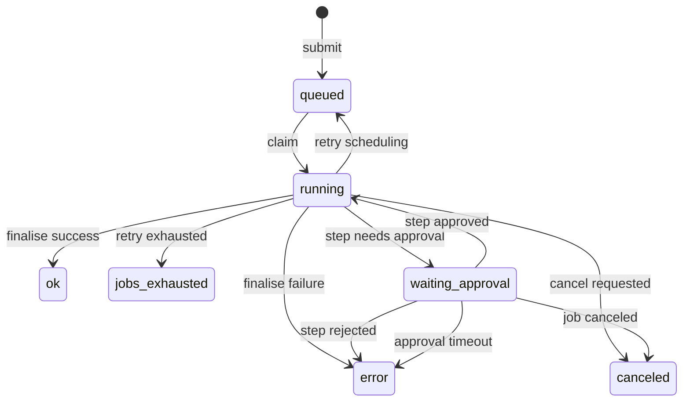

# Release Engine — Design (Part 09: State Machine)

## 1. State Machine Overview

The Release Engine manages job execution through a state-based machine. To support Human-in-the-Loop (HITL) approval, the state machine is extended by introducing a `waiting_approval` status for steps.

## 2. State Machine Diagram

## 3. Step Status Transitions

- **`waiting_approval`**: A special state where a step is parked awaiting human intervention. The scheduler does not claim subsequent steps in the job until this step is resolved.
- **`running` → `waiting_approval`**: Triggered when a module encounters a point requiring approval.
- **`waiting_approval` → `running`**: Triggered by a decision of `approved`.
- **`waiting_approval` → `error`**: Triggered by a decision of `rejected` or an auto-expiry timeout.
- **`waiting_approval` → `canceled`**: Triggered if the entire job is canceled.

## 4. Implementation Requirements

- Extend `step_status` enum in the database.
- Update `RunnerService` to transition `running` to `waiting_approval`.
- Update `SchedulerService` to ensure steps dependent on a pending approval are not claimed.
- Update `ApprovalService` to record results in `approval_decisions` and transition the step status back to `running` or `error`.
