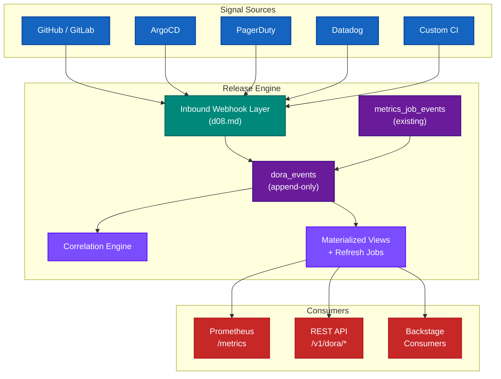

# Release Engine — Design (Part 10: DORA Metrics)

| Section | Title |
|---------|-------|
| 42 | Overview and Design Principle |
| 43 | DORA Metric Signal Mapping |
| 44 | Data Model |
| 45 | Webhook Ingestion and Normalizer Contract |
| 46 | Correlation Engine |
| 47 | REST API Surface |
| 48 | Prometheus Metrics |
| 49 | Multi-Tenancy and Data Quality |
| 50 | Implementation Phases |

---

## 42. Overview and Design Principle

The Release Engine computes DORA metrics (Deployment Frequency, Lead Time for Changes, Change Failure Rate, Mean Time to Restore) by correlating internal job events with signals received from external systems. This document defines the data model, ingestion pipeline, correlation logic, and API surface that support this capability.

### Core Architectural Decision

The Release Engine does not integrate directly with source control providers, incident management platforms, or monitoring systems for the purpose of DORA metrics. Instead, it treats all external signals as inbound webhook events that are normalized into a common event schema, stored immutably, and correlated with internal job events at query time or via background processing.

This decision follows from the existing architectural boundary: the engine communicates outbound through connectors and receives inbound signals through the webhook ingestion layer defined in d08.md. DORA metrics computation is a correlation and aggregation layer on top of these existing primitives.



### Guiding Constraints

1. The system computes whatever metrics the available signals support. Not all tenants will configure all signal sources. Partial DORA coverage is valid and expected.
2. All DORA data is tenant-scoped at write time, and authorization-scoped at read time. Brand-level isolation is the default; cross-brand aggregation is only available through explicit group-level permissions.
3. The engine is a computation layer. It does not replace monitoring, incident management, or CI systems.
4. All external interaction is inbound. The DORA subsystem introduces no new outbound integrations.

---

## 43. DORA Metric Signal Mapping

Each DORA metric requires specific signals. Some are available natively from internal job events. Others must arrive via webhook from external systems.

### Deployment Frequency

**Definition**: How often code is successfully deployed to production.

**Signals required**:

| Signal | Source | Ingestion |
|--------|--------|-----------|
| Deployment succeeded to production | Release Engine job events | Native. `metrics_job_events` where `event_type = 'job_completed'` and environment is production. |

**External signals**: None required. This metric is fully computable from internal data.

**Computation**: Count of successful production deployments per unit time, scoped by tenant and service.

### Lead Time for Changes

**Definition**: Time from first commit to successful production deployment.

**Signals required**:

| Signal | Source | Ingestion |
|--------|--------|-----------|
| Commit pushed or merged | GitHub / GitLab / custom CI | Webhook → `commit.pushed` or `commit.merged` event |
| Deployment succeeded to production | Release Engine job events | Native. `deployment.succeeded` with `commit_shas` in payload |

**External signals**: Commit events required.

**Computation**: For each successful deployment, identify the earliest `commit.pushed` or `commit.merged` event for each linked commit SHA. Lead Time is `deployment_time - earliest_commit_time`, aggregated as median (p50) and p95 over the query window. Requires `dora_commit_deployment_links` to be populated at write time. Deployments without commit links are excluded from Lead Time and counted as uncovered in `data_quality` reporting.

### Change Failure Rate

**Definition**: Percentage of deployments that result in a degraded service requiring remediation.

**Signals required**:

| Signal | Source | Ingestion |
|--------|--------|-----------|
| Deployment succeeded or failed | Release Engine job events | Native |
| Incident opened | PagerDuty / Datadog / custom | Webhook → `incident.opened` event |

**External signals**: Incident events required for DORA-compliant CFR. A proxy metric (job failure rate) is available without incident signals — see data quality section.

**Computation**: CFR numerator is the count of deployments that have at least one correlated `incident.opened` event within the correlation window. Denominator is total deployment attempts (succeeded + failed). CFR uses `incident.opened` events as the numerator signal, not `incident.resolved`. This ensures that in-progress incidents are included at query time and CFR is not understated during active outages. See Section 46 for correlation strategies.

### Mean Time to Restore

**Definition**: How long it takes to recover from a service degradation.

**Signals required**:

| Signal | Source | Ingestion |
|--------|--------|-----------|
| Incident opened | PagerDuty / Datadog / custom | Webhook → `incident.opened` event |
| Incident resolved | PagerDuty / Datadog / custom | Webhook → `incident.resolved` event |

**External signals**: Both `incident.opened` and `incident.resolved` required.

**Computation**: `incident_resolved_at - incident_opened_at`, aggregated as a histogram over a time window. Incidents without a matching `incident.resolved` event are excluded from MTTR and counted as partial in `data_quality` reporting. This is an inherent property of MTTR (restore time cannot be computed until restoration occurs) and is distinct from the CFR case, where opened-but-unresolved incidents must be counted.

---

## 44. Data Model

### dora_events Table

All DORA-relevant signals, whether from internal job events or external webhooks, are normalized and written to a single append-only table. This table is the sole source of truth for DORA metric computation.

```sql
CREATE TABLE dora_events (
    id              UUID        PRIMARY KEY DEFAULT gen_random_uuid(),
    tenant_id       UUID        NOT NULL,
    event_type      TEXT        NOT NULL,
    event_source    TEXT        NOT NULL,
    service_ref     TEXT,
    environment     TEXT,
    correlation_key TEXT,
    source_event_id TEXT,
    event_timestamp TIMESTAMPTZ NOT NULL,
    ingested_at     TIMESTAMPTZ NOT NULL DEFAULT now(),
    payload         JSONB       NOT NULL DEFAULT '{}'::jsonb,

    CONSTRAINT dora_events_type_check CHECK (
        event_type IN (
            'deployment.succeeded',
            'deployment.failed',
            'commit.pushed',
            'commit.merged',
            'incident.opened',
            'incident.resolved',
            'rollback.completed'
        )
    )
);

CREATE INDEX idx_dora_events_tenant_service
    ON dora_events (tenant_id, service_ref, event_timestamp DESC);

CREATE INDEX idx_dora_events_correlation
    ON dora_events (tenant_id, correlation_key)
    WHERE correlation_key IS NOT NULL;

-- Idempotency index for webhook delivery deduplication.
-- Covers events arriving via external webhook providers where a stable
-- provider delivery ID is available (e.g. X-GitHub-Delivery, PagerDuty
-- webhook ID). Internal events from release-engine do not populate
-- source_event_id and rely on uq_dora_events_deploy_dedupe instead.
CREATE UNIQUE INDEX uq_dora_events_source_event
    ON dora_events (tenant_id, event_source, source_event_id)
    WHERE source_event_id IS NOT NULL;

-- Idempotency index for internal release-engine deployment events.
-- Internal events set correlation_key to the job ID but do not set
-- source_event_id. This index prevents duplicate rows if the internal
-- event bridge is invoked more than once for the same job outcome.
CREATE UNIQUE INDEX uq_dora_events_deploy_dedupe
    ON dora_events (tenant_id, service_ref, environment, event_type, correlation_key)
    WHERE correlation_key IS NOT NULL
      AND event_type IN ('deployment.succeeded', 'deployment.failed');
```

**Idempotency contract**:

- **Webhook events** (GitHub, PagerDuty, etc.): deduplicated via `uq_dora_events_source_event` on `(tenant_id, event_source, source_event_id)`. Inserts use `ON CONFLICT DO NOTHING`.
- **Internal release-engine events**: deduplicated via `uq_dora_events_deploy_dedupe` on `(tenant_id, service_ref, environment, event_type, correlation_key)`. `source_event_id` is not populated for internal events. Inserts use `ON CONFLICT DO NOTHING`.

These two indexes serve distinct purposes and must both be present. Neither alone covers both ingestion paths.

**Column semantics**:

| Column | Purpose |
|--------|---------|
| `event_type` | Normalized event classification. All external events are mapped to one of the enumerated types by the normalizer layer. |
| `event_source` | Origin identifier. Examples: `release-engine`, `github`, `pagerduty`, `datadog`, `custom`. Used for auditing and debugging, not for computation. |
| `service_ref` | Maps to the existing `path_key` concept. Nullable for incidents that arrive without reliable service attribution. Required by application validation for deployment and commit event types. |
| `environment` | Deployment target. Nullable because not all event types have an environment (e.g., incidents may be service-level). |
| `correlation_key` | Opaque string used to link related events. For deployments originating from the Release Engine, this is the job ID. For commits, this is the commit SHA. For incidents, this is the incident ID. |
| `source_event_id` | Provider delivery identifier used for idempotent webhook ingest (`X-GitHub-Delivery`, PagerDuty webhook ID, etc.). Populated only for external webhook events. Duplicate deliveries are ignored via `uq_dora_events_source_event`. |
| `event_timestamp` | When the event occurred in the source system. Distinct from `ingested_at` to handle out-of-order delivery. |
| `ingested_at` | Wall-clock time the row was written. Used for operational monitoring and lag detection. Never used in DORA metric computation. |
| `payload` | Source-specific metadata preserved for drill-down and debugging. Not used in aggregate computations. |

### Internal Event Bridge

When a job completes, the existing `MetricsSQLWriter` writes to `metrics_job_events`. In the same application transaction, an internal hook derives and writes a corresponding `deployment.succeeded` or `deployment.failed` event to `dora_events`, and one row per linked commit SHA to `dora_commit_deployment_links`. All three writes — `metrics_job_events`, `dora_events`, and `dora_commit_deployment_links` — are committed atomically in the same transaction. If any write fails, the entire transaction rolls back and no partial state is persisted.

```go
// writeJobAndDoraEvent persists the canonical job event, its derived
// DORA deployment event, and commit-deployment links in one transaction.
//
// Idempotency: the dora_events insert uses ON CONFLICT DO NOTHING against
// uq_dora_events_deploy_dedupe. The dora_commit_deployment_links insert
// uses ON CONFLICT DO NOTHING against its primary key. Both are safe to
// re-invoke on retry.
//
// Commit SHA handling:
//   - If ev.CommitSHAs is nil or empty, no link rows are written and the
//     deployment is recorded as uncovered for Lead Time purposes.
//   - If link insertion fails for any SHA in the slice, the entire
//     transaction rolls back (no partial link state is possible).
func writeJobAndDoraEvent(ctx context.Context, tx pgx.Tx, ev JobEvent) error {
    if err := insertMetricsJobEvent(ctx, tx, ev); err != nil {
        return err
    }

    if ev.EventType != "job_completed" && ev.EventType != "job_failed" {
        return nil
    }

    doraType := "deployment.failed"
    if ev.EventType == "job_completed" {
        doraType = "deployment.succeeded"
    }

    doraRow := DoraEventRow{
        TenantID:       ev.TenantID,
        EventType:      doraType,
        EventSource:    "release-engine",
        ServiceRef:     ev.PathKey,
        Environment:    ev.Environment,
        CorrelationKey: ev.JobID.String(),
        // source_event_id is intentionally not set for internal events.
        // Idempotency is provided by uq_dora_events_deploy_dedupe.
        EventTimestamp: ev.OccurredAt,
        Payload: map[string]any{
            "job_id":      ev.JobID,
            "run_id":      ev.RunID,
            "commit_shas": ev.CommitSHAs,
        },
    }

    doraEventID, err := insertDoraEvent(ctx, tx, doraRow)
    if err != nil {
        return err
    }

    // Write commit-deployment links atomically in the same transaction.
    // If CommitSHAs is absent or empty, no links are written and this
    // deployment will be excluded from Lead Time calculations and counted
    // as an uncovered correlation input in data_quality reporting.
    if len(ev.CommitSHAs) == 0 {
        return nil
    }

    outcome := "failed"
    if ev.EventType == "job_completed" {
        outcome = "succeeded"
    }

    for _, sha := range ev.CommitSHAs {
        if err := insertCommitDeploymentLink(ctx, tx, CommitDeploymentLinkRow{
            TenantID:          ev.TenantID,
            ServiceRef:        ev.PathKey,
            CommitSHA:         sha,
            DeploymentID:      doraEventID,
            DeploymentOutcome: outcome,
            DeploymentTime:    ev.OccurredAt,
        }); err != nil {
            return err
        }
    }

    return nil
}
```

### dora_commit_deployment_links Table

Lead Time queries are performance-sensitive at scale. Instead of extracting commit SHAs from deployment payload JSON on every query, commit-to-deployment links are normalized at write time.

```sql
CREATE TABLE dora_commit_deployment_links (
    tenant_id          UUID        NOT NULL,
    service_ref        TEXT        NOT NULL,
    commit_sha         TEXT        NOT NULL,
    deployment_id      UUID        NOT NULL,
    deployment_outcome TEXT        NOT NULL,
    deployment_time    TIMESTAMPTZ NOT NULL,
    created_at         TIMESTAMPTZ NOT NULL DEFAULT now(),

    CONSTRAINT chk_dora_links_outcome
        CHECK (deployment_outcome IN ('succeeded', 'failed')),

    CONSTRAINT fk_dora_links_deployment
        FOREIGN KEY (deployment_id)
        REFERENCES dora_events(id)
        ON DELETE CASCADE,

    PRIMARY KEY (tenant_id, service_ref, commit_sha, deployment_id)
);

CREATE INDEX idx_dora_links_deployment_time
    ON dora_commit_deployment_links (tenant_id, service_ref, deployment_time DESC, deployment_outcome);
```

Link rows are written atomically with the parent `dora_events` row in the same transaction (see Internal Event Bridge above). One row is written per `(commit_sha, deployment_id)` pair. Inserts use `ON CONFLICT DO NOTHING` against the primary key to support safe retry.

**Metric semantics**:

- Lead Time for Changes uses links where `deployment_outcome = 'succeeded'` (DORA definition).
- First-deploy-attempt latency (non-DORA diagnostic) may use both outcomes.
- CFR/incident correlation may reference failed deployment attempts when explicit deployment linkage is provided in incident payloads.

**Lead Time prerequisite**: deployment jobs must propagate `commit_shas` in job context/payload so links can be materialized at write time. If `commit_shas` is absent or empty, no links are written, that deployment is excluded from Lead Time, and the absence is counted as an uncovered correlation input in `data_quality` reporting.

**Cascade and retention**: `ON DELETE CASCADE` on `deployment_id` ensures link rows are purged when their parent `dora_events` row is deleted by the retention cleanup job. See the Retention section for batch budget implications.

### PostgreSQL Materialized Views and Refresh Jobs

Daily rollups are implemented with standard PostgreSQL materialized views and refreshed on a schedule. This avoids introducing a TimescaleDB extension dependency across all environments.

```sql
-- Deployment frequency: daily counts per tenant/service/environment
CREATE MATERIALIZED VIEW dora_deployment_frequency_daily AS
SELECT
    tenant_id,
    service_ref,
    environment,
    date_trunc('day', event_timestamp) AS bucket,
    count(*) FILTER (WHERE event_type = 'deployment.succeeded') AS success_count,
    count(*) FILTER (WHERE event_type = 'deployment.failed')    AS failure_count
FROM dora_events
WHERE event_type IN ('deployment.succeeded', 'deployment.failed')
GROUP BY tenant_id, service_ref, environment, bucket;

CREATE UNIQUE INDEX idx_dora_deploy_freq_daily_key
    ON dora_deployment_frequency_daily (tenant_id, service_ref, environment, bucket);

-- Incident resolution pairs: daily aggregates per tenant/service.
-- Joins opened and resolved events by correlation_key (incident ID).
-- Only matched open+resolved pairs are included; unresolved incidents
-- are excluded by this view and appear in dora_incident_opened_daily.
-- This view is used exclusively for MTTR computation.
-- CFR MUST NOT use this view; see dora_incident_opened_daily below.
CREATE MATERIALIZED VIEW dora_incidents_daily AS
SELECT
    o.tenant_id,
    o.service_ref,
    date_trunc('day', o.event_timestamp) AS bucket,
    count(*) AS resolved_incident_count,
    avg(EXTRACT(EPOCH FROM (r.event_timestamp - o.event_timestamp)))
        AS avg_restore_seconds,
    percentile_cont(0.5) WITHIN GROUP (
        ORDER BY EXTRACT(EPOCH FROM (r.event_timestamp - o.event_timestamp))
    ) AS p50_restore_seconds
FROM dora_events o
JOIN dora_events r
    ON  r.tenant_id       = o.tenant_id
    AND r.correlation_key = o.correlation_key
    AND r.event_type      = 'incident.resolved'
WHERE o.event_type = 'incident.opened'
GROUP BY o.tenant_id, o.service_ref, bucket;

CREATE UNIQUE INDEX idx_dora_incidents_daily_key
    ON dora_incidents_daily (tenant_id, service_ref, bucket);

-- Incident openings: daily counts per tenant/service.
-- Includes all incident.opened events regardless of resolution status.
-- This view is the authoritative source for CFR numerator computation.
-- Using incident openings (rather than resolved pairs) ensures that
-- in-progress incidents are counted at query time and CFR is not
-- understated during active outages.
CREATE MATERIALIZED VIEW dora_incident_opened_daily AS
SELECT
    tenant_id,
    service_ref,
    date_trunc('day', event_timestamp) AS bucket,
    count(*) AS opened_incident_count
FROM dora_events
WHERE event_type = 'incident.opened'
GROUP BY tenant_id, service_ref, bucket;

CREATE UNIQUE INDEX idx_dora_incident_opened_daily_key
    ON dora_incident_opened_daily (tenant_id, service_ref, bucket);

-- Refresh cadence (executed by Release Engine scheduler):
-- REFRESH MATERIALIZED VIEW CONCURRENTLY dora_deployment_frequency_daily;
-- REFRESH MATERIALIZED VIEW CONCURRENTLY dora_incidents_daily;
-- REFRESH MATERIALIZED VIEW CONCURRENTLY dora_incident_opened_daily;
```

**Refresh cadence**: Hourly in production, daily in lower environments. 15-minute refresh cadence is not required because all three views produce daily buckets and the DORA use case does not require sub-hourly aggregation. If near-real-time deployment frequency is required by a specific consumer, that consumer should query `dora_events` base tables directly via the API rather than driving unnecessary refresh pressure on the materialized views.

**Operational requirement**: All materialized views MUST be refreshed with `REFRESH MATERIALIZED VIEW CONCURRENTLY` to avoid blocking read traffic during refresh. Refresh jobs are scheduled by the Release Engine internal scheduler and emit `release_engine_dora_mv_refresh_last_success_timestamp` and `release_engine_dora_mv_refresh_failures_total` on each execution. Refresh failures do not block ingestion but must alert operators (see Section 48).

**CFR and MTTR view assignment**:

| Metric | View used | Rationale |
|--------|-----------|-----------|
| CFR numerator | `dora_incident_opened_daily` | Must include unresolved incidents to avoid undercount during active outages |
| MTTR | `dora_incidents_daily` | Requires matched open+resolved pairs; unresolved incidents cannot contribute a restore duration |

**Consistency notes**:

1. `dora_incidents_daily` joins opened and resolved events by `correlation_key`. Events where the resolved counterpart has not yet arrived are excluded and will appear in a future refresh. This is correct behaviour for MTTR but must not be used for CFR (see above).
2. `resolved_incident_count` is the number of matched open+resolved pairs, not total incident openings.
3. Retention deletes apply to base tables first; materialized views may temporarily show stale aggregates until next refresh. Operators must not set retention shorter than the oldest materialized-view bucket horizon without coordinated refresh/rebuild.
4. During the window between a retention delete and the next materialized-view refresh, queries combining base tables and stale views may observe short-lived inconsistencies. This is acceptable given hourly refresh cadence and is documented in operational runbooks.

**Lead time aggregation** is handled in application code using `dora_commit_deployment_links` for efficient joins. It is not precomputed in a materialized view.

---

## 45. Webhook Ingestion and Normalizer Contract

### Architecture

The webhook ingestion layer (defined in d08.md) routes inbound payloads to DORA normalizers by provider. Each normalizer is responsible for transforming a raw provider payload into zero or more `DoraEvent` values conforming to the canonical schema. The normalizer layer is the sole point of provider-specific logic; nothing downstream is provider-aware.

```go
// Normalizer transforms a raw webhook payload from a specific provider
// into zero or more DoraEvents. Returning zero events is valid and
// indicates the webhook payload is not DORA-relevant.
type Normalizer interface {
    // Provider returns the identifier for this normalizer.
    // Examples: "github", "gitlab", "pagerduty", "opsgenie", "datadog".
    Provider() string

    // Normalize extracts DORA-relevant events from a raw webhook payload.
    // The tenantID and serviceRef are resolved by the webhook layer before
    // the normalizer is invoked.
    Normalize(ctx context.Context, tenantID string, serviceRef string, headers map[string]string, body []byte) ([]DoraEvent, error)
}
```

### Normalizer Registry

```go
// NormalizerRegistry maps provider identifiers to their normalizer
// implementations. It is populated at startup via configuration.
type NormalizerRegistry struct {
    normalizers map[string]Normalizer
}

// Resolve returns the normalizer for the given provider, or nil if
// no normalizer is registered.
func (r *NormalizerRegistry) Resolve(provider string) Normalizer {
    return r.normalizers[provider]
}

// Register adds a normalizer. Panics on duplicate provider.
func (r *NormalizerRegistry) Register(n Normalizer) {
    if _, exists := r.normalizers[n.Provider()]; exists {
        panic("duplicate DORA normalizer for provider: " + n.Provider())
    }
    r.normalizers[n.Provider()] = n
}
```

### Dead-Letter Storage

```sql
CREATE TABLE dora_webhook_dead_letter (
    id               UUID        PRIMARY KEY DEFAULT gen_random_uuid(),
    tenant_id        UUID        NOT NULL,
    provider         TEXT        NOT NULL,
    source_event_id  TEXT,
    headers          JSONB       NOT NULL,
    body             BYTEA       NOT NULL,
    failure_reason   TEXT        NOT NULL,
    created_at       TIMESTAMPTZ NOT NULL DEFAULT now(),
    replayed_at      TIMESTAMPTZ,
    replay_job_id    UUID
);

CREATE INDEX idx_dora_webhook_dlq_tenant_created
    ON dora_webhook_dead_letter (tenant_id, created_at DESC);
```

Phase-1 operational minimum: dead-letter read access is required even before replay support. Internal endpoints:

- `GET /v1/internal/dora/dead-letter?tenant_id=...&provider=...&limit=...`
- `GET /v1/internal/dora/dead-letter/{id}`

Replay endpoint:

- `POST /v1/internal/dora/dead-letter/{id}/replay?tenant_id=...&service_ref=...`

Replay behaviour:

1. Loads stored headers/body for the dead-letter row.
2. Resolves provider normalizer from the registry.
3. Re-runs normalization and canonical validation.
4. Re-inserts normalized events into `dora_events` using `ON CONFLICT DO NOTHING`.
5. Marks row with `replayed_at` and generated `replay_job_id`.
6. Rejects repeated replay attempts with `409` (`ALREADY_REPLAYED`).

### Idempotency and Failure Handling

Webhook sources may redeliver the same event. The handler extracts a provider delivery ID (when available) and maps it to `source_event_id`. Inserts use `ON CONFLICT DO NOTHING` against `uq_dora_events_source_event` to guarantee idempotency for webhook events.

Deployment deduplication for internal events is enforced by `uq_dora_events_deploy_dedupe`. See the Data Model section for the full idempotency contract covering both ingestion paths.

If a provider cannot produce a stable deployment correlation key, the normalizer must run a short-window dedup guard (`tenant_id + service_ref + environment + event_type`) before insert.

**Normalizer failure response contract**: When a normalizer returns an error, the handler must:

1. Persist the raw webhook payload and headers to `dora_webhook_dead_letter` with a structured `failure_reason`.
2. Return `200 OK` with the following JSON body:

```json
{
  "accepted": true,
  "processed": false,
  "error_code": "<error_code>",
  "error_detail": "<human-readable description>",
  "dead_letter_id": "<uuid>"
}
```

Defined `error_code` values:

| Code | Meaning |
|------|---------|
| `normalizer_error` | Normalizer returned a non-nil error (parse failure, unexpected schema, etc.) |
| `normalizer_not_found` | No normalizer registered for the given provider |
| `store_error` | Normalizer succeeded but database write failed |
| `validation_error` | Normalizer output failed schema validation before write |

`dead_letter_id` is the UUID of the row inserted into `dora_webhook_dead_letter`. If dead-letter insertion also fails, the response omits `dead_letter_id` and sets `error_code` to `store_error`.

The `200 OK` status is intentional: webhook providers (GitHub, PagerDuty) that implement delivery retry logic based on response codes must not retry on accepted-but-unprocessable payloads, as retries would produce duplicate dead-letter rows without any prospect of success until the normalizer is fixed. Operators are alerted via the `release_engine_dora_dead_letter_total` metric and can replay after a normalizer fix is deployed.

### Webhook Rate Limiting

`POST /v1/webhooks/dora/{provider}` uses a dedicated ingest rate limiter separate from interactive API limits. Policy is provider- and tenant-aware burst-tolerant (to absorb webhook fan-out) with backpressure metrics, and does not share quotas with user-facing `/v1/dora/*` read endpoints.

---

## 46. Correlation Engine

### Purpose

DORA metrics require linking events that arrive independently. A commit event arrives from GitHub. Hours or days later, a deployment event is recorded internally. Lead Time requires linking these two events. Similarly, Change Failure Rate requires linking a deployment to a subsequent incident.

### Correlation Strategies

Three strategies are applied in priority order:

**1. Explicit key correlation**: The incident payload contains a deployment job ID or commit SHA. The normalizer extracts this and sets `correlation_key` on the `incident.opened` event to match the deployment's `correlation_key`. This is the highest-confidence strategy and is the only strategy that qualifies for `data_quality: complete` on CFR.

**2. Keyed correlation**: Commit SHAs are propagated through deployment jobs and materialized into `dora_commit_deployment_links` at write time. Lead Time uses these links directly. No runtime correlation scan is required.

**3. Time-window heuristic**: For CFR, when explicit key correlation is unavailable, incidents that open within a configurable window after a deployment are attributed to that deployment. This strategy qualifies for `data_quality: partial` on CFR. The default window is 1 hour and is configurable per tenant.

### CFR Computation Model

CFR is computed from base tables at query time, not from materialized views, to ensure in-progress incidents are always included.

```
CFR = (deployments with ≥1 correlated incident.opened) / (total deployments) × 100
```

The numerator is the count of distinct deployments (by `correlation_key`) that have at least one correlated `incident.opened` event within the query window, regardless of whether those incidents have a corresponding `incident.resolved`. This is intentional: a deployment that caused a still-active incident is a failed deployment for CFR purposes.

`dora_incident_opened_daily` provides precomputed daily counts for display and trend purposes, but authoritative CFR values are computed from the `dora_events` base table to capture incidents that arrived since the last materialized-view refresh.

### DORA Level Classification

Classification algorithm (deterministic):

1. Compute metric values over the requested window.
2. Apply configured thresholds from `classification_version`.
3. Boundary values are inclusive on the better tier for CFR/MTTR/Lead Time (lower-is-better) thresholds, and inclusive on the higher tier for Deployment Frequency (higher-is-better) thresholds.
4. If metric quality is `no_data`, `dora_level` is `null`.

Default threshold profile (`dora-2023-default`):

| Metric | Elite | High | Medium | Low |
|--------|-------|------|--------|-----|
| Deployment Frequency | `>= 1/day` | `>= 1/week` and `< 1/day` | `>= 1/month` and `< 1/week` | `< 1/month` |
| Lead Time | `< 1 hour` | `>= 1 hour` and `< 1 day` | `>= 1 day` and `< 1 week` | `>= 1 week` |
| Change Failure Rate | `< 5%` | `>= 5%` and `< 10%` | `>= 10%` and `< 15%` | `>= 15%` |
| Time to Restore | `< 1 hour` | `>= 1 hour` and `< 1 day` | `>= 1 day` and `< 1 week` | `>= 1 week` |

Classification variants:

- `dora-2023-default+gates-included` (default): approval gate durations are included in Lead Time.
- `dora-2023-default+gates-excluded`: approval gate durations are subtracted from Lead Time. This is an opt-in per tenant, configured in tenant settings.

**Cross-brand and group-level comparison validity**: Aggregated or comparative DORA results across brands are only valid when all constituent brands share the same `classification_version`. Group-level API queries (`/v1/dora/group/*`) enforce this as follows:

- If all brands in the group share a `classification_version`, the response includes a single `classification_version` field and aggregated `dora_level` values.
- If brands differ in `classification_version`, the API returns `422 Unprocessable Entity` with error code `classification_version_mismatch` and a per-brand breakdown of versions. Aggregated `dora_level` is not returned.
- Per-brand metric values (without classification) are always returned regardless of version mismatch, allowing consumers to display raw metrics while surfacing the comparison caveat.

This prevents silent mixing of `gates-included` and `gates-excluded` Lead Time values in group-level trend displays.

---

## 47. REST API Surface

### Authentication and Authorization

All `/v1/dora/*` endpoints require a valid JWT issued by Backstage. The middleware enforces:

- Brand-scoped queries: token claims must include the requested `brand_id`.
- Group-scoped queries: token claims must include the requested `group_id`, and server-side group-map resolution restricts the query to the authorized `[brand_id...]` set.
- Deny by default: missing or ambiguous brand/group claims result in `403`.

### Endpoints

#### GET /v1/dora/summary

Returns the four DORA metrics and classification for a single service over a requested time window, with period-over-period deltas.

**Query parameters**:

| Parameter | Required | Description |
|-----------|----------|-------------|
| `tenant_id` | Yes | Tenant scoping |
| `service_ref` | Yes | Service identifier (path_key) |
| `window_days` | No | Look-back window in days. Default: 30 |
| `classification_version` | No | Threshold profile to apply. Default: `dora-2023-default+gates-included` |

**Response** (200 OK):

```json
{
  "tenant_id": "t-123",
  "service_ref": "payments-api",
  "classification_version": "dora-2023-default+gates-included",
  "current_period": {
    "start": "2026-02-10T00:00:00Z",
    "end": "2026-03-12T00:00:00Z",
    "deployment_frequency_daily_avg": 1.57,
    "deployment_frequency_data_quality": "complete",
    "lead_time_p50_seconds": 3600,
    "lead_time_data_quality": "complete",
    "change_failure_rate_percent": 6.38,
    "change_failure_rate_data_quality": "partial",
    "mttr_p50_seconds": 1800,
    "mttr_data_quality": "partial",
    "dora_level": "high"
  },
  "previous_period": {
    "start": "2026-01-11T00:00:00Z",
    "end": "2026-02-10T00:00:00Z",
    "deployment_frequency_daily_avg": 1.2,
    "lead_time_p50_seconds": 5400,
    "change_failure_rate_percent": 8.0,
    "mttr_p50_seconds": 2400,
    "dora_level": "high"
  },
  "deltas": {
    "deployment_frequency_percent": 30.8,
    "lead_time_percent": -33.3,
    "change_failure_rate_percent": -20.3,
    "mttr_percent": -25.0
  }
}
```

Negative deltas indicate improvement for lead time, CFR, and MTTR. Positive delta indicates improvement for deployment frequency.

#### GET /v1/dora/deployments

Returns paginated deployment events for a service, with associated correlation data.

#### GET /v1/dora/incidents

Returns paginated incident events for a service, with associated correlation data and resolution status.

---

## 48. Prometheus Metrics

The following Prometheus metrics are registered under the `release_engine_dora_` namespace and exposed on the existing `/metrics` endpoint via the `MetricsExporter`.

### Counters

```
release_engine_dora_deployments_total{tenant_id, service_ref, environment, status}
```

Incremented on each `deployment.succeeded` or `deployment.failed` event. The `status` label is `succeeded` or `failed`.

```
release_engine_dora_incidents_total{tenant_id, service_ref, event_type}
```

Incremented on each `incident.opened` or `incident.resolved` event.

```
release_engine_dora_dead_letter_total{tenant_id, provider, error_code}
```

Incremented on each dead-letter write. The `error_code` label matches the defined error code values from Section 45. Alerts should trigger when this counter increases at a sustained rate for any `(tenant_id, provider)` combination.

```
release_engine_dora_cfr_last_computed_timestamp{tenant_id, service_ref, window}
```

Unix timestamp of the last successful CFR recomputation. Alerts should trigger when stale duration exceeds `2 * dora.cfr.recompute_interval`.

```
release_engine_dora_mv_refresh_last_success_timestamp{view}
release_engine_dora_mv_refresh_failures_total{view}
```

Tracks materialized-view refresh health per view name. Covers `dora_deployment_frequency_daily`, `dora_incidents_daily`, and `dora_incident_opened_daily`. Refresh failures do not block ingestion. Alert threshold: one or more failures within a 2-hour window.

### Cardinality Considerations

All DORA Prometheus metrics include `tenant_id` as a label. In deployments with a large number of tenants, this can create cardinality pressure. Mitigation:

1. The DORA Prometheus metrics are registered in a separate `prometheus.Registry` that can be selectively exposed or disabled via configuration.
2. For high-tenant-count deployments, operators can disable Prometheus DORA metrics and rely solely on the REST API, which queries PostgreSQL materialized views and base tables directly.
3. The configuration flag is `DORA_PROMETHEUS_ENABLED` (default: `true`).

To preserve fleet-level alerting when per-tenant metrics are disabled, low-cardinality aggregate metrics remain enabled regardless of the flag:

```
release_engine_dora_tenants_above_cfr_threshold_total{window, threshold}
release_engine_dora_tenants_with_no_dora_data_total{metric}
```

These aggregates intentionally exclude `tenant_id` and support platform-level alerting without cardinality explosion.

---

## 49. Multi-Tenancy and Data Quality

### Tenant Isolation

All `dora_events` rows carry `tenant_id`. All queries include `tenant_id` in the `WHERE` clause. The API layer enforces this via the existing authentication middleware.

Within a tenant, brand isolation is mandatory:

- Each `service_ref` resolves to a `brand_id` in tenant configuration.
- Brand-scoped queries must filter on the authorized `brand_id` set from token claims.
- No implicit cross-brand visibility is permitted.

### Brand and Group Authorization Model

Backstage is the authentication and access-control entry point for DORA APIs. It issues OIDC/JWT tokens containing identity and role claims consumed by the Release Engine middleware.

**Authorization rules**:

1. **Brand role required for brand view**: users can query metrics for a brand only if token claims include that `brand_id`.
2. **Group role required for cross-brand view**: users can query aggregated metrics across brands only if claims include a permitted `group_id` role.
3. **Group membership expansion is explicit**: the server resolves `group_id -> [brand_id...]` from synchronized authorization tables and restricts aggregation to that set.
4. **Deny by default**: missing or ambiguous brand/group claims result in `403`.

**Group map synchronization and staleness**:

The `group_id -> [brand_id...]` mapping is synchronized from Backstage into a local `dora_group_brand_map` table on a configurable interval (default: 5 minutes). Each sync run updates a `last_synced_at` timestamp per group.

Staleness is defined as: `now() - last_synced_at > dora.group_map.staleness_ttl` (default: 15 minutes).

Fail-closed behaviour: if the group map for a requested `group_id` is stale or absent at query time, the server returns `503 Service Unavailable` with error code `group_map_stale` and does not fall back to a cached mapping. This prevents stale group membership from granting access to brands that have since been removed from the group. Brand-scoped queries (which do not use the group map) are unaffected by group map staleness.

```sql
CREATE TABLE dora_group_brand_map (
    group_id      TEXT        NOT NULL,
    brand_id      TEXT        NOT NULL,
    tenant_id     UUID        NOT NULL,
    last_synced_at TIMESTAMPTZ NOT NULL DEFAULT now(),

    PRIMARY KEY (group_id, brand_id, tenant_id)
);

CREATE INDEX idx_dora_group_brand_map_group
    ON dora_group_brand_map (tenant_id, group_id, last_synced_at DESC);
```

Sync failures emit `release_engine_dora_group_map_sync_failures_total{tenant_id}` and alert operators. The sync job does not block ingestion or brand-scoped reads.

### Data Quality

Each metric in API responses includes a `data_quality` field. The value is never omitted.

| Value | Meaning |
|-------|---------|
| `complete` | All required signals are present and correlation coverage meets the threshold. |
| `partial` | Required signals are present but correlation coverage is below threshold, or only one side of a required pair is available (e.g., incidents opened but none resolved for MTTR). |
| `proxy` | The metric is computed from a substitute signal and is explicitly not DORA-compliant (e.g., job failure rate for CFR). The response includes a `proxy_description` field. |
| `no_data` | No events of the required type exist for the requested window. `dora_level` is `null`. |

Rules for computing quality level:

| Metric | Complete | Partial | Proxy | No Data |
|--------|----------|---------|-------|---------|
| Deployment Frequency | Deployment events exist | N/A | N/A | No deployment events |
| Lead Time | Commit and deployment events exist with successful correlations and adequate coverage | Some commit/deployment signals exist but low correlation coverage | N/A | No correlated commit→deployment pairs |
| Change Failure Rate | Both deployment and incident events exist with explicit/keyed or high-confidence correlation | Deployment and incident events exist but only time-window heuristic correlation is available | Deployment execution failure rate (job failures), explicitly labeled as non-DORA proxy | No deployment events |
| Time to Restore | Both `incident.opened` and `incident.resolved` events exist with matched pairs | `incident.opened` events exist but no resolved counterparts yet available | N/A | No incident events |

**Correlation coverage threshold**: a configurable minimum percentage of deployments within the query window that must have at least one linked commit SHA for Lead Time to qualify as `complete`. Default: 80%. Below this threshold, Lead Time reports `partial`. This threshold is configurable per tenant via `dora.lead_time.coverage_threshold`.

### Retention

The `dora_events` table grows indefinitely by default. A retention policy is configurable per tenant (default: 365 days). Retention is enforced by a periodic background job that deletes rows in bounded batches per tenant to avoid long-running locks on the ingest path.

```sql
-- Batched cleanup step (run by Release Engine scheduler, looped with sleep
-- between iterations until no rows remain beyond the retention horizon).
WITH to_delete AS (
    SELECT id
    FROM dora_events
    WHERE tenant_id = $1
      AND event_timestamp < now() - INTERVAL '365 days'
    ORDER BY event_timestamp
    LIMIT 1000
)
DELETE FROM dora_events d
USING to_delete td
WHERE d.id = td.id;
```

**Cascade and batch budget**: `dora_commit_deployment_links.deployment_id` has `ON DELETE CASCADE`. Each deleted `dora_events` row will cascade to delete all associated link rows. For services with high commit frequency, a single deployment row may link to many commit SHAs. The batch limit of 1,000 `dora_events` rows must account for this multiplier: operators should monitor `dora_commit_deployment_links` table growth and reduce the batch limit if cascade deletes produce excessive lock contention. The scheduler emits `release_engine_dora_retention_batch_duration_seconds{tenant_id}` to support this monitoring.

**Retention and materialized-view consistency**: retention deletes apply to base tables first; materialized views reflect the deletion only after the next refresh. Operators must not set retention shorter than the oldest materialized-view bucket horizon without a coordinated view rebuild. During the window between a deletion batch and the next refresh, short-lived inconsistencies between base-table queries and materialized-view queries are possible and are documented in operational runbooks.
