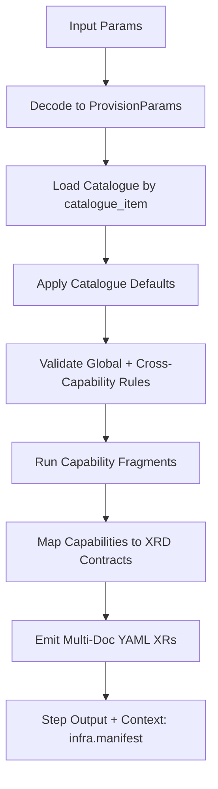
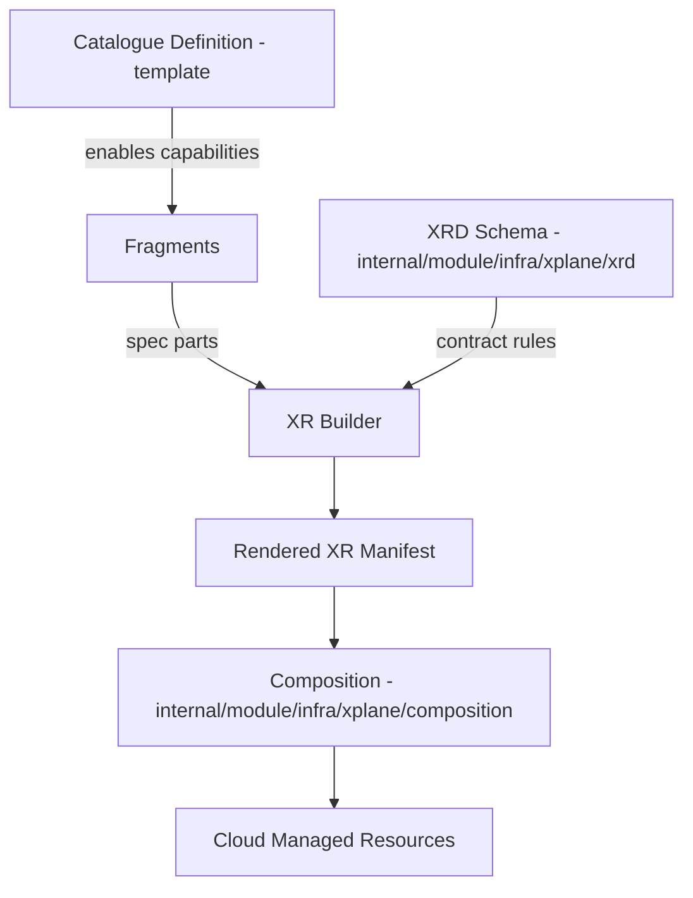

# Infra Module — Catalogues, XRDs, and Compositions

This README explains how the Infra module ties together:

- **Catalogues** (template intent and guardrails)
- **XRD contracts** (Crossplane API surface)
- **Compositions** (provider-specific realisation)

It also explains how manifests are produced and how to maintain this model safely over time.

---

## 1. Core Concepts

### Catalogues

Catalogues live in:

- `internal/module/infra/template/catalog/definitions/*.yaml`

They define template-level policy and defaults:

- required / optional / forbidden capabilities
- environment/profile/residency constraints
- defaults (e.g. composition refs, tiers)
- validation of allowed capability combinations

Think of catalogues as the **platform intent layer**.

### XRDs

XRD definitions live in:

- `internal/module/infra/xplane/xrd/*.yaml`

They define the **API contract** expected by Crossplane for each composite resource kind:

- kind and group/version
- required `spec.parameters`
- allowed parameter schema
- default values for optional parameters

> **Note**: These are the *actual* XRD contracts used by the system, not documentation. They define the concrete schema that must be satisfied.

### Compositions

Composition definitions live in:

- `internal/module/infra/xplane/composition/*.yaml`

They map each XRD to provider resources (currently AWS, with support for Azure and GCP planned). 

Compositions are provider-specific realisations of the abstract XRD contract.

---

## 2. How Rendering Works End-to-End

The Infra module (`infra.provision`) runs a deterministic render pipeline:



Key implementation files:

- Module/runtime entry: `internal/module/infra/module.go`
- Orchestration: `internal/module/infra/template/engine.go`
- XRD resource assembly: `internal/module/infra/template/xr.go`
- Capability renderers: `internal/module/infra/template/fragments/*`
- Tags handling: `internal/module/infra/template/fragments/tags.go`

---

## 3. Relationship Between Catalogue, XRD, and Composition



In short:

1. **Catalogue** chooses and constrains what can be requested.
2. **Fragments** compute concrete parameter values.
3. **XR builder** emits XRD-aligned resources.
4. **Compositions** consume those resources and provision cloud infrastructure.

---

## 4. Conceptual Model of Capabilities

A **capability** represents a distinct infrastructure service that can be provisioned, configured, and managed through the Infra module. Each capability corresponds to a specific type of cloud resource (e.g., virtual machines, databases, networking) and includes:
- A parameter schema defining what can be configured
- Validation rules for parameter values
- Mapping to Crossplane XRD kinds for provider-agnostic abstraction
- Provider-specific implementations via Compositions
- Integration with catalogues for policy enforcement

Capabilities in the Infra module operate at three distinct levels of abstraction:

### 4.1 Conceptual Level: Infrastructure Service Categories
At the highest level, capabilities represent abstract infrastructure services:
- **Compute**: Virtual machines, Kubernetes clusters
- **Storage**: Block storage, file storage, object storage  
- **Networking**: VPCs, load balancers, DNS
- **Data**: Databases, caching, messaging
- **Security**: Identity, secrets management
- **Observability**: Monitoring, logging, tracing

### 4.2 Logical Level: Platform Capabilities with Policy
This is the level at which the Infra module operates. 

Each capability is mapped at the logical level to a [Crossplane Composite Resource Definition](https://docs.crossplane.io/latest/composition/composite-resource-definitions/) or XRDs. Existing definitions can be found [here](../../../internal/module/infra/xplane/xrd).

Each capability:
- Has a well-defined parameter schema with validation rules
- Can be enabled/disabled independently
- Respects catalogue constraints and cross-capability rules
- Maps to a specific XRD kind for Crossplane consumption
- Includes provider-agnostic defaults and business logic

**Example**: The `vm` capability at the logical level defines parameters like `count`, `instance_family`, `os_family`, and `boot_disk_gib` without specifying cloud provider details.

### 4.3 Physical Level: Provider-Specific Realisations
The lowest level where capabilities become concrete cloud resources:
- **AWS**: EC2 instances, RDS databases, S3 buckets
- **Azure**: Virtual Machines, Azure SQL, Blob Storage  
- **GCP**: Compute Engine, Cloud SQL, Cloud Storage
- Implemented via Crossplane Compositions that consume XRD parameters
- Handles provider-specific details and optimisations

**Transformation Flow**:
```
Conceptual (Compute) 
  → Logical (vm capability with platform parameters)
    → Physical (AWS EC2 instance with specific AMI, instance type, etc.)
```
At the physical level, capabilities are mapped to [Crossplane Compositions](https://docs.crossplane.io/latest/composition/compositions/). Existing definitions can be found [here](../../../internal/module/infra/xplane/composition).

### 4.4 Capability Lifecycle
1. **Selection**: User enables capabilities in request payload
2. **Validation**: Catalogue and cross-capability rules are applied
3. **Parametrisation**: Fragments compute concrete values
4. **Mapping**: Logical parameters transformed to XRD contract
5. **Realisation**: Compositions create provider-specific resources

---

## 5. Production of Manifests (What is "Produced")

The module currently produces **multi-document YAML** where each enabled capability becomes one XR document.

**Supported Capabilities (15 total):**
- `blockStorage` → `XBlockStorage`
- `cache` → `XCache`
- `cdn` → `XCDN`
- `database` → `XDatabase`
- `dns` → `XDNSZone`
- `fileStorage` → `XFileStorage`
- `identity` → `XIdentity`
- `kubernetes` → `XKubernetesCluster`
- `loadBalancer` → `XLoadBalancer`
- `messaging` → `XMessaging`
- `objectStorage` → `XObjectStore`
- `observability` → `XObservability`
- `secrets` → `XSecretsStore`
- `vm` → `XVirtualMachine`
- `vpc` → `XVPCNetwork`

**Provider Support:**
Each capability supports AWS, Azure, and GCP providers (though AWS is most complete). The provider resolution order is:
1. Capability-specific provider
2. Request default provider
3. Module default provider (AWS)

**Tag Propagation:**
Tags specified in the request are automatically propagated to all generated XR documents.

---

## 6. Individual Capability Parameter Reference

This section details the parameters for individual capabilities. Each capability has a well-defined parameter schema that specifies what can be configured when that capability is enabled.

**Note**: For information on how to structure a complete request payload with global fields and multiple capabilities, see [Section 8: Complete Request Payload Schema](#8-complete-request-payload-schema).

Below are the key parameters for selected capabilities:

### 6.1 Virtual Machine (`vm`) Capability
**Required when enabled:**
- `count` (int): Number of VM instances
- `instance_family` (string): Compute family (e.g., "general", "compute", "memory")
- `size` (string): Instance size (e.g., "small", "medium", "large")
- `os_family` (string): Operating system (e.g., "linux", "windows")

**Optional parameters:**
- `boot_disk_gib` (int, default: OS-dependent): Root disk size in GiB
- `boot_disk_type` (string, default: "ssd"): Disk type
- `ssh_key_name` (string): SSH key for access
- `user_data` (string): Base64-encoded startup script
- `spot_enabled` (bool, default: false): Use spot instances
- `multi_az` (bool, default: false): Distribute across availability zones
- `additional_disks` (array): Extra storage volumes
- `auto_scaling` (object): Auto-scaling configuration

**Validation rules:**
- `spot_enabled` not allowed with `availability: "critical"`
- `critical` availability requires `multi_az` or `auto_scaling.enabled`
- `auto_scaling.max_count` must be ≥ `auto_scaling.min_count`

### 6.2 Database (`database`) Capability
**Required when enabled:**
- `engine` (string): Database engine (e.g., "postgres", "mysql", "aurora")
- `tier` (string): Performance tier (e.g., "dev", "prod", "enterprise")

**Optional parameters:**
- `storage_gib` (int, default: 100): Storage allocation in GiB
- `storage_type` (string, default: "gp3"): Storage type
- `iops` (int): Provisioned IOPS (for provisioned storage)
- `backup_enabled` (bool, default: true): Enable automated backups
- `backup_retention_days` (int, default: 7): Backup retention period
- `point_in_time_recovery` (bool, default: false): Enable PITR
- `parameter_group` (string): Custom parameter group
- `maintenance_window` (string): Maintenance window (e.g., "sun:03:00-sun:04:00")

### 6.3 Kubernetes (`kubernetes`) Capability
**Required when enabled:**
- `tier` (string): Cluster tier (e.g., "dev", "prod", "enterprise")
- `version` (string): Kubernetes version (e.g., "1.28", "1.29")

**Optional parameters:**
- `size` (string): Cluster size (e.g., "small", "medium", "large")
- `multi_az` (bool, default: true): Multi-AZ deployment
- `node_pool_count` (int, default: 1): Number of node pools

### 6.4 VPC (`vpc`) Capability
**Required when enabled:**
- `cidr` (string): VPC CIDR block (e.g., "10.0.0.0/16")

**Optional parameters:**
- `private_subnets` (int, default: 3): Number of private subnets
- `public_subnets` (int, default: 3): Number of public subnets
- `nat_gateways` (int, default: 1): Number of NAT gateways
- `flow_logs` (bool, default: true): Enable VPC flow logs
- `transit_gateway` (bool, default: false): Attach to transit gateway
- `peering_requests` (array): VPC peering connections

### 6.5 Object Storage (`object_store`) Capability
**Required when enabled:**
- `class` (string): Storage class (e.g., "standard", "intelligent", "archive")

**Optional parameters:**
- `versioning` (bool, default: true): Enable object versioning
- `retention_days` (int): Object retention period
- `bucket_count` (int, default: 1): Number of buckets

### 6.6 Complete Parameter Reference
For the complete parameter schema of all 15 capabilities, see:
- `internal/module/infra/template/types.go` - Go struct definitions
- Example payloads in `internal/integration/testdata/`

**Common patterns:**
- All capabilities have `enabled` (bool) and `provider` (string) fields
- Provider defaults: capability → request default → "aws"
- Parameters use snake_case naming convention
- Boolean fields default to `false` unless specified
- Integer fields often have sensible defaults

---

## 7. Validation Model

Validation is layered:

1. **Global request validation** (required fields, format)
2. **Catalogue constraints/capability policy** (allowed combinations, environment rules)
3. **Fragment-local validation** (capability-specific logic)
4. **Integration contract validation** (required/allowed fields per kind)

Integration validators are in:

- `internal/integration/validator.go` - contains `xrdParameterContracts` map defining required/allowed fields per XRD kind
- Validation rules ensure emitted XRs comply with XRD schemas

**Cross-cutting validation rules:**
- Cannot enable both `kubernetes` and `vm` capabilities
- `blockStorage` requires `vm` to be enabled
- `critical` availability requires `observability` to be enabled

---

## 8. Complete Request Payload Schema

This section describes the complete structure of a request payload, including global fields, FinOps tagging requirements, and how to structure multiple capabilities.

**Note**: For detailed parameter information for individual capabilities, see [Section 6: Individual Capability Parameter Reference](#6-individual-capability-parameter-reference).

The Infra module expects a structured JSON/YAML payload conforming to the `ProvisionParams` schema defined in `internal/module/infra/template/types.go`.

### 8.1 Global Fields (Required)
These fields apply to all infrastructure requests:

| Field | Type | Required | Allowed Values | Description | Example |
|-------|------|----------|----------------|-------------|---------|
| `contract_version` | string | Yes | `"1.0"`, `"1.1"` | API contract version | `"1.0"` |
| `request_name` | string | Yes | Alphanumeric, hyphens, underscores | Unique request identifier | `"my-app-prod"` |
| `tenant` | string | Yes | Alphanumeric, hyphens | Tenant/organisation identifier | `"acme-corp"` |
| `environment` | string | Yes | `"development"`, `"staging"`, `"production"`, `"sandbox"` | Deployment environment | `"production"` |
| `primary_region` | string | Yes | AWS: `"eu-west-1"`, `"us-east-1"`, etc.<br>Azure: `"westeurope"`, `"eastus"`, etc.<br>GCP: `"europe-west1"`, `"us-central1"`, etc. | Primary deployment region | `"eu-west-1"` |
| `catalogue_item` | string | No | `"vm-app"`, `"k8s-app"`, `"data-proc"` | Catalogue template to apply | `"vm-app"` |
| `namespace` | string | No | Kubernetes namespace pattern | Kubernetes namespace for XRs | `"platform"` |
| `default_provider` | string | No | `"aws"`, `"azure"`, `"gcp"` | Default cloud provider | `"aws"` |
| `owner` | string | Yes | Any string | Resource owner/contact | **FinOps required** - used for cost anomaly notifications |
| `cost_centre` | string | Yes | Alphanumeric, hyphens | Cost allocation centre | **FinOps required** - primary financial allocation tag |

### 8.2 Global Fields (Optional)
**Note**: For detailed FinOps tag strategy, see [FinOps Tag Strategy](../tags.md).

| Field | Type | Allowed Values | Description | Notes |
|-------|------|----------------|-------------|-------|
| `workload_profile` | string | `"small"`, `"medium"`, `"large"`, `"xlarge"` | Workload size profile | Influences default resource sizing |
| `residency` | string | `"eu"`, `"us"`, `"ap"`, `"global"` | Data residency requirement | Affects region selection and compliance |
| `secondary_region` | string | Valid cloud region | DR/secondary region | For disaster recovery deployments |
| `availability` | string | `"standard"`, `"high"`, `"critical"` | Availability requirement | Affects redundancy and failover configuration |
| `data_classification` | string | `"public"`, `"internal"`, `"confidential"`, `"restricted"` | Data sensitivity classification | **FinOps tag** - used for security/compliance filtering |
| `compliance` | array | `"gdpr"`, `"hipaa"`, `"pci-dss"`, `"soc2"` | Compliance frameworks | Array of compliance requirements |
| `workload_type` | string | `"web"`, `"api"`, `"batch"`, `"data"`, `"ml"` | Type of workload | Influences capability selection |
| `workload_exposure` | string | `"internal"`, `"external"`, `"vpn-only"` | Network exposure level | Affects network security configuration |
| `ingress_mode` | string | `"public"`, `"private"`, `"vpn"` | Ingress traffic mode | How traffic reaches the workload |
| `egress_mode` | string | `"nat"`, `"proxy"`, `"direct"` | Egress traffic mode | How workload accesses external resources |
| `dr_required` | bool | `true`, `false` | Disaster recovery required | Enables multi-region deployment |
| `backup_required` | bool | `true`, `false` | Backup required | Enables automated backups |
| `extra_tags` | map | Key-value pairs | Additional resource tags | Merged with automatic FinOps tags |
| `business_unit` | string | Any string | Business unit | **FinOps tag** - executive-level reporting |
| `project` | string | Any string | Project identifier | **FinOps tag** - temporary initiative tracking |
| `ttl` | string | ISO 8601 date format | Time-to-live for resources | **FinOps tag** - e.g., `"2025-12-31"` |

### 8.3 Capability Structures
Each capability follows the pattern:
```yaml
capability_name:
  enabled: true/false
  provider: "aws"/"azure"/"gcp"
  # capability-specific parameters (see Section 6 for details)
```

**Example complete payload:**
```yaml
contract_version: "1.0"
request_name: "webapp-prod"
tenant: "acme-corp"
environment: "production"
primary_region: "eu-west-1"
catalogue_item: "vm-app"
default_provider: "aws"

# FinOps required fields
owner: "checkout-team"
cost_centre: "CC-4521"

# Optional FinOps fields
business_unit: "retail"
project: "checkout-replatform"
data_classification: "confidential"
ttl: "2025-12-31"

vm:
  enabled: true
  count: 3
  instance_family: "general"
  size: "medium"
  os_family: "linux"
  boot_disk_gib: 50
  multi_az: true

database:
  enabled: true
  engine: "postgres"
  tier: "prod"
  storage_gib: 100
  backup_enabled: true

vpc:
  enabled: true
  cidr: "10.0.0.0/16"
  private_subnets: 3
  public_subnets: 2

observability:
  enabled: true
  metrics_retention_days: 30
  log_retention_days: 90
```

### 8.4 Schema Validation
The payload is validated at multiple levels:
1. **Structural validation**: Required fields, correct types
2. **Catalogue validation**: Template constraints and defaults
3. **Cross-capability validation**: Dependency and conflict rules
4. **Fragment validation**: Capability-specific logic
5. **XRD contract validation**: Final output compliance

### 8.5 Example Payloads
See `internal/integration/testdata/` for complete working examples:
- `vm-app-template.yaml` - VM-based application
- `k8s-app-template.yaml` - Kubernetes-based application
- `data-proc-template.yaml` - Data processing workload

### 8.6 Generating Schema Documentation
To generate OpenAPI-style documentation:
```bash
# The Go struct definitions in types.go serve as the canonical schema
# Use go doc or similar tools to extract structured documentation
go doc ./internal/module/infra/template/types.go
```

---

## 9. Maintenance Guide

When introducing a new capability or changing an existing one, update in this order:

1. **XRD definitions** (`internal/module/infra/xplane/xrd/*.yaml`) — define schema contract first.
2. **Composition definitions** (`internal/module/infra/xplane/composition/*.yaml`) — define provider-specific realisation.
3. **Example XRs** (`internal/module/infra/xplane/xrd/examples/*.yaml`) — provide working examples.
4. **Fragment renderer** (`internal/module/infra/template/fragments/*.go`) — produce capability spec.
5. **XR mapping** (`internal/module/infra/template/xr.go`) — map capability to kind/composition and parameter projection.
6. **Catalogue rules/defaults** (`internal/module/infra/template/catalog/definitions/*.yaml`) — include capability policy.
7. **Integration validator rules** (`internal/integration/validator.go`) — update `xrdParameterContracts` map.
8. **Integration payloads/tests** (`internal/integration/testdata/` + tests) — verify end-to-end output.

### Drift Prevention Checklist

- [ ] Composition names in catalogues match mapped contract names.
- [ ] Required XRD fields are present in emitted `spec.parameters`.
- [ ] Integration tests assert expected kinds for each template.
- [ ] Golden/output samples are refreshed after intentional changes.
- [ ] All 15 capabilities are properly mapped in `xr.go` parameter builders.
- [ ] Provider support matrix (`SupportedProviders` map in `xr.go`) is updated.

### Recommended Commands

```bash
# Run all infra module tests
go test ./internal/module/infra/...

# Run integration tests (requires -tags=integration)
go test -tags=integration ./internal/integration -run TestInfraIntegration_VMAppTemplate -count=1

# Update golden files after intentional changes
go test -tags=integration ./internal/integration -update-golden

# Run validator tests
go test ./internal/integration -run TestCrossplaneValidator
```

---

## 10. Notes

- The `xplane` directory (`internal/module/infra/xplane/`) contains the executable contract definitions, not documentation.
- Runtime and tests should be treated as the executable contract and kept aligned.
- **Example files** are available at `internal/module/infra/xplane/xrd/examples/` showing complete, valid XR documents for each capability.
- **Tag handling** is a special capability that propagates tags to all other capabilities automatically.
