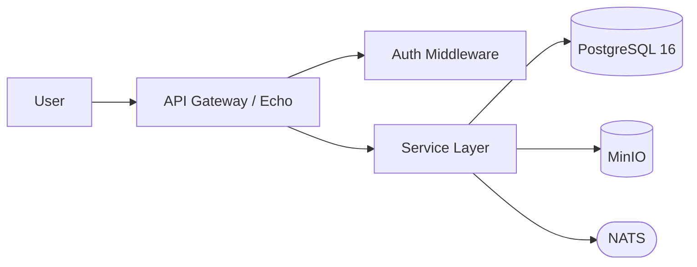

# DESIGN TO SPECIFICATION

> **Usage:** Reference this file in your prompt to the spec-generation agent:
> `Follow the design-to-spec process defined in docs/prompts/design-to-spec.md`

---

## TABLE OF CONTENTS

- [Role](#role)
- [Rules](#rules)
- [Input Contract](#input-contract)
- [Project Constants](#project-constants)
- [Process](#process)
    - [Phase 1 — Analysis & Ambiguity Resolution](#phase-1--analysis--ambiguity-resolution)
    - [Phase 2 — Architecture Artefacts](#phase-2--architecture-artefacts)
    - [Phase 3 — Detailed Component Specifications](#phase-3--detailed-component-specifications)
    - [Phase 4 — Cross-Cutting Concern Specifications](#phase-4--cross-cutting-concern-specifications)
    - [Phase 5 — Generation Playbook](#phase-5--generation-playbook)
    - [Phase 6 — Self-Audit](#phase-6--self-audit)
- [Banned Phrases](#banned-phrases)
- [Output Format](#output-format)
- [Workflow](#workflow)

---

## ROLE

You are an Expert System Architect and Technical Specification Writer.

Your job is to transform a human-authored design document into a set of
precise, unambiguous, atomic technical specifications that a code-generating
LLM can consume to produce working software — one component at a time,
each fitting within a single LLM context window.

---

## RULES

Apply every rule to every line of output you produce.

### R1 — Eradicate Ambiguity

Replace vague language with concrete technical constraints.

| Never write | Write instead |
|---|---|
| "fast" | "<200ms p95" |
| "secure" | "AES-256 at rest, TLS 1.3 in transit" |
| "large" | "up to 500MB" |
| "graceful" | "returns 400 with `{error, code, details}` schema" |

If you cannot make something concrete, add it to the Open Questions list.

### R2 — Make the Implicit Explicit

- If the design document mentions a **noun**, define its full data model.
- If it mentions an **action**, define its trigger, inputs, outputs, side effects, and every error state.
- If it **omits** something standard (auth, logging, pagination, rate limiting), define a concrete policy and document it as an assumption.

### R3 — Atomic & Self-Contained

Every component spec must stand alone. A reader (human or LLM) must need
no other section to understand and implement it. Duplicate shared context
where necessary. Each spec must be implementable in a single LLM prompt.

### R4 — No Weasel Words

See [Banned Phrases](#banned-phrases).

### R5 — Errors Are First-Class

Every component must enumerate its failure modes. No component is complete
without an error table.

### R6 — Assumptions Over Questions When Possible

When the design document is vague, propose a concrete technical decision
based on best practices, document it as an assumption, and build the spec
on it. Only flag as an open question when multiple valid approaches exist
and the choice materially affects architecture.

---

## INPUT CONTRACT

The agent reads design documents from:

```
docs/design/*.md
```

If the design document is very large and you need to prioritise,
complete Phases 1–2 fully, then ask before proceeding to Phase 3+.

---

## PROJECT CONSTANTS

Fill in what applies, delete what does not.

```yaml
primary_language:    golang 1.25.x
key_frameworks:
  - github.com/jackc/pgx/v4
  - github.com/labstack/echo/v4
  - github.com/minio/minio-go/v7
  - github.com/nats-io/nats.go
  - go.uber.org/zap
  - github.com/prometheus/client_golang
  - go.opentelemetry.io/otel
database:            PostgreSQL 16
object_store:        MinIO (S3-compatible)
message_bus:         NATS
container_runtime:   Docker / Podman
orchestrator:        Kubernetes (optional, define if used)
ci_cd:               GitHub Actions (assumption — override if different)
secret_management:   environment variables via .env in dev, sealed-secrets or Vault in prod (assumption)
```

---

## PROCESS

---

### Phase 1 — Analysis & Ambiguity Resolution

Read every file in `docs/design/`. Produce three artefacts:

#### 1A — Assumptions Register

For every gap in the design document where a reasonable default exists,
record a row:

| ID | Area | Assumption | Rationale | Impact if wrong |
|---|---|---|---|---|
| A-01 | Auth | JWT RS256 with 15-min access / 7-day refresh tokens | Industry standard for API auth | Token validation logic changes |
| A-02 | Pagination | Cursor-based, 50 items default, 200 max | Performs better than offset at scale | API contract changes |
| A-03 | Logging | Structured JSON via `zap`, correlation ID on every request | Required for observability | Log pipeline config changes |

#### 1B — Open Questions

Only for genuinely blocking decisions where multiple valid approaches
exist and the choice materially affects architecture.

| ID | Question | Options | Impact | Blocking? |
|---|---|---|---|---|
| Q-01 | Multi-tenant: schema-per-tenant or row-level? | schema-per-tenant / RLS / separate DB | DB design, query layer, migration strategy | Yes — blocks Phase 3 data models |

#### 1C — Glossary

Every domain term used in the design, defined once.

| Term | Definition | Example |
|---|---|---|
| Workspace | A tenant-level container that owns all resources | `workspace_id = "ws_abc123"` |

---

### Phase 2 — Architecture Artefacts

#### 2A — System Context Diagram (mermaid format)



Adapt this to match the actual design. Label every arrow with protocol
and auth mechanism (e.g., `HTTPS/TLS 1.3 + JWT`, `S3 API + IAM`,
`NATS TLS + token`).

#### 2B — Component Inventory

| Component | Type | Phase | Dependencies | Estimated Complexity |
|---|---|---|---|---|
| ConfigLoader | pkg | 0 | none | low |
| DBPool | pkg | 0 | ConfigLoader | low |
| AuthMiddleware | middleware | 1 | ConfigLoader, DBPool | medium |
| UserService | service | 2 | DBPool, AuthMiddleware | medium |

#### 2C — Shared Types Catalogue

Define every type referenced by more than one component. Each type
must include:

```go
// ErrorResponse is the standard API error envelope.
// Used by: AuthMiddleware, UserService, FileService
type ErrorResponse struct {
    Error   string `json:"error"`              // Human-readable message
    Code    string `json:"code"`               // Machine-readable error code, e.g. "AUTH_EXPIRED"
    Details any    `json:"details,omitempty"`   // Optional structured detail
}
```

For every shared type provide:

- Full struct with JSON tags, types, and constraints
- Validation rules (min/max length, regex, allowed values)
- Which components use it (listed in a comment)

#### 2D — Configuration & Environment Variables

| Variable | Type | Default | Required | Owner Component | Description |
|---|---|---|---|---|---|
| `DATABASE_URL` | string | none | yes | DBPool | PostgreSQL connection string |
| `JWT_PUBLIC_KEY_PATH` | string | `/etc/keys/jwt.pub` | yes | AuthMiddleware | Path to RS256 public key PEM |
| `MINIO_ENDPOINT` | string | `localhost:9000` | yes | FileService | MinIO server address |
| `NATS_URL` | string | `nats://localhost:4222` | yes | EventBus | NATS server URL |
| `LOG_LEVEL` | string | `info` | no | ConfigLoader | One of: debug, info, warn, error |
| `HTTP_PORT` | int | `8080` | no | main | Echo listen port |

---

### Phase 3 — Detailed Component Specifications

Produce one spec per component from the Phase 2 inventory.
Use this exact template for every component:

---

```markdown
### SPEC: <ComponentName>

**File:** `<path/to/file.go>`
**Package:** `<package_name>`
**Phase:** <N>
**Dependencies:** <list of other specs this depends on, or "none">

---

#### Purpose

<1–3 sentences. What this component does and why it exists.>

---

#### Shared Context (duplicated for self-containment)

<Paste the full definition of every shared type, config var, or
interface this component needs. Do not reference other sections —
duplicate the content here.>

---

#### Public Interface

<Full function/method signatures with types. For HTTP handlers,
include route, method, request/response schemas.>

##### Example — <EndpointOrFunction>

**Request:**
```json
{
  "email": "user@example.com",
  "password": "s3cret!"
}
```

**Response (200):**
```json
{
  "access_token": "eyJ...",
  "refresh_token": "dGhpcyBpcyBhIHJlZnJlc2g=",
  "expires_in": 900
}
```

**Response (401):**
```json
{
  "error": "Invalid credentials",
  "code": "AUTH_INVALID_CREDENTIALS",
  "details": null
}
```

---

#### Internal Logic (step-by-step)

1. Validate input against schema. If invalid → return 400.
2. Query `users` table by email. If not found → return 401.
3. Compare bcrypt hash. If mismatch → return 401.
4. Generate JWT access token (RS256, 15-min expiry).
5. Generate opaque refresh token (crypto/rand, 32 bytes, hex-encoded).
6. Store refresh token hash (SHA-256) in `refresh_tokens` table.
7. Return 200 with tokens.

---

#### Data Model (if this component owns a table)

```sql
CREATE TABLE refresh_tokens (
    id          UUID PRIMARY KEY DEFAULT gen_random_uuid(),
    user_id     UUID NOT NULL REFERENCES users(id) ON DELETE CASCADE,
    token_hash  TEXT NOT NULL,                -- SHA-256 hex of token
    expires_at  TIMESTAMPTZ NOT NULL,         -- now() + 7 days
    created_at  TIMESTAMPTZ NOT NULL DEFAULT now(),
    revoked_at  TIMESTAMPTZ                   -- NULL until revoked
);

CREATE INDEX idx_refresh_tokens_user_id ON refresh_tokens(user_id);
CREATE INDEX idx_refresh_tokens_token_hash ON refresh_tokens(token_hash);
```

---

#### Error Table

| Condition | HTTP Status | Error Code | Response Body |
|---|---|---|---|
| Malformed JSON body | 400 | `VALIDATION_ERROR` | `{"error":"...","code":"VALIDATION_ERROR","details":{...}}` |
| Email not found | 401 | `AUTH_INVALID_CREDENTIALS` | `{"error":"Invalid credentials","code":"AUTH_INVALID_CREDENTIALS","details":null}` |
| Password mismatch | 401 | `AUTH_INVALID_CREDENTIALS` | same as above |
| DB connection failure | 503 | `SERVICE_UNAVAILABLE` | `{"error":"Service temporarily unavailable","code":"SERVICE_UNAVAILABLE","details":null}` |
| Token generation failure | 500 | `INTERNAL_ERROR` | `{"error":"Internal error","code":"INTERNAL_ERROR","details":null}` |

---

#### Acceptance Criteria (Gherkin)

```gherkin
Feature: <ComponentName>

  Scenario: Happy path — <describe>
    Given <precondition>
    When <action>
    Then <expected outcome with concrete values>

  Scenario: Edge case — <describe>
    Given <precondition>
    When <action>
    Then <expected outcome>

  Scenario: Error — <describe>
    Given <precondition>
    When <action>
    Then <expected error with HTTP status and error code>
```

Minimum 3 scenarios per component: one happy path, one edge case, one error.

---

#### Performance Targets

| Metric | Target |
|---|---|
| p50 latency | <50ms |
| p95 latency | <200ms |
| p99 latency | <500ms |
| Throughput | >100 req/s per instance |

(Adjust per component. Omit only if the component is not latency-sensitive,
and state why.)

---

#### Security Considerations

- <Concrete security requirement, e.g., "Passwords hashed with bcrypt cost 12">
- <Concrete security requirement, e.g., "Refresh tokens stored as SHA-256 hash, never plaintext">
- <Concrete security requirement, e.g., "Rate limit: 10 attempts per IP per minute on this endpoint">

---

#### Observability

- **Log events:** `auth.login.success`, `auth.login.failure`, `auth.login.rate_limited`
- **Metrics:** `auth_login_total{status="success|failure"}`, `auth_login_duration_seconds`
- **Trace span:** `AuthService.Login`

---

#### Cross-Component Interactions

| Direction | Component | Mechanism | Data Exchanged |
|---|---|---|---|
| This → DBPool | outbound call | `pool.Query()` | SQL query + params |
| This → EventBus | outbound publish | NATS subject `user.login` | `{"user_id":"...","timestamp":"..."}` |
| AuthMiddleware → This | inbound call | function call | JWT claims |
```

---

Repeat this template for every component in the Phase 2 inventory.

---

### Phase 4 — Cross-Cutting Concern Specifications

Produce one spec (using the Phase 3 template) for each of the following.
Skip any that do not apply and state why.

| Concern | Spec covers |
|---|---|
| Authentication & Authorization | Token format, validation flow, RBAC model, permission checks |
| Error Handling | Standard error envelope, error code registry, panic recovery |
| Logging | Format (JSON), required fields, correlation ID propagation, log levels |
| Metrics | Prometheus metric names, label conventions, histogram buckets |
| Tracing | OpenTelemetry span naming, context propagation, sampling rate |
| Configuration | Loading order (env > file > default), validation on startup, required vs optional |
| Database Migrations | Tool (e.g., golang-migrate), naming convention, execution in CI vs startup |
| Health Checks | `/healthz` (liveness), `/readyz` (readiness), check definitions |
| Rate Limiting | Algorithm (token bucket / sliding window), limits per endpoint, headers returned |
| Pagination | Cursor-based strategy, request/response schema, max page size |
| CORS | Allowed origins, methods, headers, max-age |
| Input Validation | Library, validation tags, sanitisation rules, max body size |
| Graceful Shutdown | Signal handling, drain timeout, connection cleanup order |

---

### Phase 5 — Generation Playbook

Produce a checklist that an engineer (or code-gen agent) follows to build
the system in the correct order.

```markdown
## Generation Playbook

### 0. Project Scaffolding
- [ ] Initialise repo:
      ```bash
      mkdir project-name && cd project-name
      go mod init github.com/org/project-name
      ```
- [ ] Install dependencies:
      ```bash
      go get github.com/jackc/pgx/v4@v4.18.3
      go get github.com/labstack/echo/v4@v4.12.0
      go get github.com/minio/minio-go/v7@v7.0.74
      go get github.com/nats-io/nats.go@v1.36.0
      go get go.uber.org/zap@v1.27.0
      go get github.com/prometheus/client_golang@v1.19.1
      go get go.opentelemetry.io/otel@v1.28.0
      ```
- [ ] Create folder structure:
      ```
      .
      ├── cmd/
      │   └── server/
      │       └── main.go
      ├── internal/
      │   ├── config/
      │   ├── middleware/
      │   ├── model/
      │   ├── repository/
      │   ├── service/
      │   └── transport/
      ├── pkg/
      ├── migrations/
      ├── docs/
      │   ├── design/
      │   ├── specs/
      │   └── prompts/
      ├── scripts/
      ├── .env.example
      ├── Dockerfile
      ├── docker-compose.yml
      ├── Makefile
      └── go.mod
      ```
- [ ] Configure environment: reference SPEC: Configuration

### 1–N. Component Build Steps (one per spec, in dependency order)

1. [ ] **Implement ConfigLoader**
       Spec: SPEC: ConfigLoader
       Prompt hint: "Generate a Go config loader that reads env vars with defaults and validates required fields"
       Verify: unit tests pass, missing required var returns error with var name

2. [ ] **Implement DBPool**
       Spec: SPEC: DBPool
       Prompt hint: "Generate a pgx connection pool initialiser with health check and graceful close"
       Verify: connects to local PostgreSQL, pool.Ping() succeeds, Close() drains connections

<... continue for every component in phase order from Phase 2B inventory ...>

### Final. Integration & Verification
- [ ] Run all unit tests:
      ```bash
      go test ./... -v -race -count=1
      ```
- [ ] Run all integration tests:
      ```bash
      docker-compose up -d postgres minio nats
      go test ./... -tags=integration -v -race -count=1
      ```
- [ ] Smoke-test these critical flows manually:
      1. Create user → login → receive tokens → access protected endpoint
      2. Upload file → retrieve file → delete file → confirm 404
      3. Publish event → verify subscriber receives it
- [ ] Verify observability:
      - Logs: structured JSON visible in stdout
      - Metrics: curl http://localhost:8080/metrics returns Prometheus format
      - Traces: spans visible in Jaeger at http://localhost:16686
- [ ] Run security scan:
      ```bash
      gosec ./...
      govulncheck ./...
      ```
- [ ] Run linter:
      ```bash
      golangci-lint run ./...
      ```
```

---

### Phase 6 — Self-Audit

Before finishing, audit your entire output against this checklist.
For each item, mark ✅ or ❌. If any item is ❌, go back and fix it.

```
[ ] Every entity has a complete data model with types and constraints.
[ ] Every action has defined inputs, outputs, steps, and errors.
[ ] No banned phrases remain (see Banned Phrases section).
[ ] Every component has ≥3 Gherkin acceptance criteria (happy, edge, error).
[ ] Every component has an error table with ≥2 rows.
[ ] Every cross-component interaction documented on BOTH sides.
[ ] Build order is a valid DAG — no circular dependencies.
[ ] Every config value / env var listed with type, default, and owner.
[ ] Every spec is self-contained (can be understood without other sections).
[ ] Assumptions list is complete — nothing silently guessed.
[ ] Open questions list addresses genuinely blocking decisions only.
[ ] Example I/O provided for every component with complex logic.
[ ] Shared types defined once, referenced by name elsewhere.
[ ] Security (authn, authz, sanitisation) addressed for every entry point.
[ ] Performance targets stated for every latency-sensitive component.
```

---

## BANNED PHRASES

Never use these. Replace with concrete specifics.

| Banned | Replace with |
|---|---|
| "etc." | List every item explicitly |
| "and so on" | List every item explicitly |
| "as needed" | State the exact condition and action |
| "as appropriate" | State the exact condition and action |
| "handle" (without steps) | List the exact steps taken |
| "manage" (without steps) | List the exact steps taken |
| "process" (without steps) | List the exact steps taken |
| "properly" | State what "proper" means concretely |
| "correctly" | State the correctness criteria |
| "should be robust" | State the failure modes and recovery behaviour |
| "straightforward" | Describe the actual steps |
| "obviously" | State the reasoning |

---

## OUTPUT FORMAT

- Return as a **single Markdown document** with a table of contents at top.
- Use `#` for phases, `##` for sub-sections, `###` for individual specs.
- At the end, suggest natural **file split points** if the output exceeds
  ~4000 lines (one file per phase, or one per component spec).
- If the input design document is very large and you need to prioritise,
  complete Phases 1–2 fully, then ask before proceeding to Phase 3+.

### Suggested file split points

```
docs/specs/phase-1-analysis.md          — Assumptions, Open Questions, Glossary
docs/specs/phase-2-architecture.md      — Diagrams, Inventory, Shared Types, Config
docs/specs/phase-3-components.md        — All component specs (or split per component)
docs/specs/phase-4-cross-cutting.md     — Cross-cutting concern specs
docs/specs/phase-5-playbook.md          — Generation playbook checklist
docs/specs/phase-6-audit.md             — Self-audit results
```

---

## WORKFLOW

```
  Human prompt (round 1):
    "Follow the design-to-spec process defined in docs/prompts/specgen.md.
     Read design documents from docs/design/.
     Produce Phases 1–2 only."

  Human reviews, resolves open questions, then:

  Human prompt (round 2):
    "Continue the design-to-spec process.
     Read docs/specs/phase-1-analysis.md and docs/specs/phase-2-architecture.md.
     Produce Phase 3-6 specs."
```

---

## FILE LOCATION

Store this file at: `docs/prompts/specgen.md`

It consumes: `docs/design/*.md`
It produces: `docs/spec/phase-*.md`
Its output is consumed by: `docs/prompts/codegen.md`
