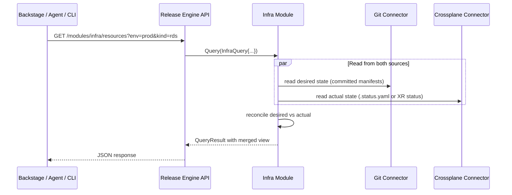

# Module Evolution Proposal - Query API

This document describes the evolution of the Release Engine Module framework from a pure execution engine into an **execution + query plane** — where each module owns both its workflows AND the read path for the domain it manages.

---

## The Insight

```
Today:    RE = "do things"
Proposed: RE = "do things" + "answer questions about the things I manage"
```

The infra module already knows how to talk to Git and interpret Crossplane status files. Why build a separate system to do the same reads? The module should expose a query interface alongside its execution interface.

---

## Module Interface Evolution

### Current Module Contract

```go
type Module interface {
    Execute(ctx context.Context, params map[string]any) StepResult
}
```

### Proposed Module Contract

```go
type Module interface {
    // Execution — what the module does
    Execute(ctx context.Context, params map[string]any) StepResult

    // Query — what the module knows
    Query(ctx context.Context, query QueryRequest) QueryResult

    // Discovery — what the module can tell you about itself
    Describe() ModuleDescriptor
}
```

---

## Three Additions Explained

### 1. `Query()` — Domain-Specific Read Path

Each module exposes queries relevant to its domain. The infra module's queries are different from a deploy module's queries.

```go
// Infra module query examples
type InfraQuery struct {
    Kind       string            // "rds", "s3", "vpc", "all"
    Environment string           // "prod", "staging"
    Team       string
    Status     string            // "healthy", "degraded", "all"
    ResourceID string            // specific resource lookup
}

// Deploy module query examples  
type DeployQuery struct {
    Service     string
    Environment string
    Version     string           // "current", "previous", specific tag
}
```

The infra module implements this by reading through its connectors:



### 2. `Describe()` — Module Self-Description for Discovery

```go
type ModuleDescriptor struct {
    Name        string
    Domain      string              // "infrastructure", "deployment", "observability"
    
    // What operations can this module execute?
    Operations  []OperationDescriptor
    
    // What queries can this module answer?
    Queries     []QueryDescriptor
    
    // What entity types does this module manage?
    EntityTypes []EntityTypeDescriptor
}

type OperationDescriptor struct {
    Name        string              // "provision", "deprovision", "resize"
    Params      map[string]ParamSchema
    RequiresApproval bool
}

type QueryDescriptor struct {
    Name        string              // "list-resources", "resource-health", "drift-report"
    Params      map[string]ParamSchema
    ResponseSchema string           // JSON Schema ref
}

type EntityTypeDescriptor struct {
    Kind        string              // "rds-instance", "s3-bucket"
    Attributes  map[string]string   // what fields are available
}
```

This is what makes the agentic interface viable. The agent doesn't need hardcoded knowledge of what the engine can do — it discovers it:

```
Agent: "What can you tell me about infrastructure?"

→ GET /modules
→ GET /modules/infra/describe

Agent now knows:
  - operations: [provision, deprovision, resize]
  - queries: [list-resources, resource-health, drift-report]
  - entity types: [rds-instance, s3-bucket, vpc, ...]

Agent: "Show me all degraded RDS instances in prod"

→ GET /modules/infra/query/resource-health?kind=rds&env=prod&status=degraded
```

### 3. The Unified API Surface

```
/api/v1/
├── workflows/                          # Execution (existing)
│   ├── POST   /                        # trigger workflow
│   ├── GET    /{id}                    # job status
│   └── POST   /{id}/approve           # approval gate
│
├── modules/                            # Discovery (new)
│   ├── GET    /                        # list all modules
│   └── GET    /{module}/describe       # module self-description
│
└── query/                              # Query (new)
    └── GET    /{module}/{query-name}   # module-specific query
        
# Examples:
# GET  /query/infra/resources?env=prod&kind=rds
# GET  /query/infra/drift-report?env=prod
# GET  /query/deploy/current-versions?service=checkout
# GET  /query/observability/health?service=checkout
```

---

## How the Infra Module Uses Its Own Query Path for Remediation

This is the elegant part — the module's execution path reuses its own query logic:

```go
func (m *InfraModule) Execute(ctx context.Context, params map[string]any) StepResult {
    // ... commit manifests to git ...

    // Poll using the same query logic exposed to external clients
    for attempt := 0; attempt < m.maxPollAttempts; attempt++ {
        result := m.Query(ctx, QueryRequest{
            Name: "resource-health",
            Params: map[string]any{
                "resource_id": resourceID,
            },
        })

        switch result.Status {
        case "healthy":
            return StepResult{State: COMPLETED, Output: result.Data}
        case "failed":
            if attempt == 0 {
                m.remediate(ctx, resourceID)
                continue
            }
            return StepResult{State: FAILED, Error: result.Reason}
        }

        time.Sleep(m.pollInterval)
    }

    return StepResult{State: FAILED, Error: "health check timeout"}
}
```

One read path. Used internally for execution health checks. Exposed externally for queries. No duplication.

---

## What This Means for Each Consumer

| Consumer | Uses |
|---|---|
| **Backstage** | `/modules/infra/describe` to auto-register entity types; `/query/infra/resources` as entity provider source — no separate catalogue sync needed |
| **Agentic interface** | `/modules` for capability discovery; `/query/{module}/{query}` for conversational answers; `/workflows` for executing actions |
| **CLI / scripts** | Same API, no special treatment |
| **Infra module itself** | `Query()` internally during execution for health checks and remediation decisions |

---

## Summary of Module Framework Changes

| Layer | Current | Proposed |
|---|---|---|
| Module contract | `Execute()` only | `Execute()` + `Query()` + `Describe()` |
| API surface | Workflow execution + job status | + Module discovery + domain queries |
| Infra state reads | Bespoke polling of `.status.yaml` | Structured query through connectors, reusable internally and externally |
| External catalogue sync | Webhook / direct API push | Consumers pull from RE query API |
| Agent support | None | Agent discovers capabilities via `Describe()`, queries via `Query()`, acts via `Execute()` |

The Release Engine becomes the **query plane** for everything it manages — not by centralising state, but by centralising the **read path** through the modules that already know how to interpret their domain's state.