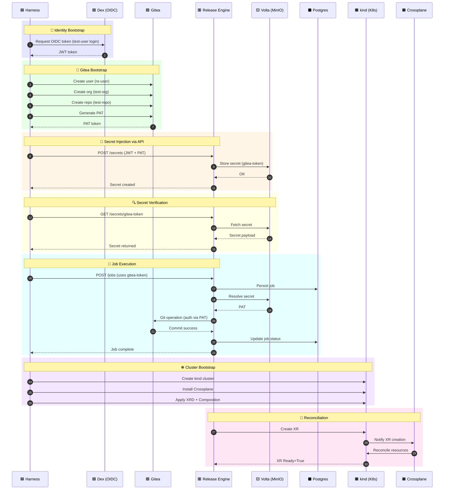

### 📄 Implementation Specification: Local E2E Environment for Release Engine

# 1. 🎯 Objective

Provide a **single-command, fully wired local environment** that:

- Executes **true end-to-end flows**, including authentication to external systems
- Uses **real credential paths (OIDC → API → Volta → connector)**
- Creates and stores **all required secrets programmatically**
- Validates:
    - DB state
    - Git operations via authenticated access
    - callback delivery
    - Crossplane reconciliation
- Requires **zero manual setup**

---

# 2. 🧱 Architecture

## 2.1 Runtime Topology

### Docker Compose
- Postgres
- PgBouncer
- MinIO (S3 backend for Volta)
- Gitea
- Dex (OIDC)
- Release Engine
- Callback Sink

### kind
- Crossplane
- XRDs / Compositions
- provider-kubernetes (only)

### Go Harness (central orchestrator)
- **Bootstrap engine (critical)**
- Test runner
- Assertion engine

---

# 3. 🔑 Critical Design Principle: Bootstrap is First-Class

The system MUST include a **deterministic bootstrap pipeline** that:

1. Creates identities
2. Generates credentials
3. Stores secrets via Release Engine API
4. Configures external systems
5. Verifies connectivity

👉 If bootstrap fails, the environment is invalid.

---

# 4. 📦 Component Specifications

## 4.1 Gitea

### Bootstrap Requirements

The harness MUST:

1. Create user:
    - `re-user`
2. Create repository:
    - `test-org/test-repo`
3. Generate **Personal Access Token (PAT)** via API
4. Store PAT in Volta via Release Engine API

### Token Flow (MANDATORY)

```
Go Harness
   ↓
Gitea API → create PAT
   ↓
Release Engine Secret API → store PAT
   ↓
Volta → persists in MinIO
   ↓
Connector → retrieves secret → authenticates to Gitea
```

### Validation

- Git operations MUST use this token
- Anonymous or unauthenticated access is NOT allowed

---

## 4.2 Volta / Secrets (Mandatory)

### Mode
- MUST run in **S3-backed mode (MinIO)**

### Bootstrap Responsibilities

Harness MUST:

- Create required secrets via API:
    - `gitea.token`
    - (future-ready: db creds, etc.)

### Validation

- Secret retrieval path MUST be exercised:
    - connector → Volta → MinIO

---

## 4.3 Release Engine 

### MUST support:

- Secret API (used during bootstrap)
- Connector auth using stored secrets

### Health gating

Environment is not ready until:
- DB connected
- Volta connected
- OIDC working

---

## 4.4 Dex (OIDC)

### Bootstrap

Harness MUST:

- Generate valid JWT tokens for:
    - API access
    - secret creation

---

## 4.5 Crossplane

### MUST be fully operational

Bootstrap MUST:

1. Create kind cluster
2. Install Crossplane
3. Install provider-kubernetes
4. Apply:
    - XRDs
    - Compositions

### Validation MUST include:

- XR creation
- XR reconciliation
- `Ready=True`

---

## 4.6 Callback Sink

### MUST be used in all tests

- No “optional later” behaviour
- All jobs must define callback URL

---

# 5. 🔌 Interfaces & Contracts

## 5.1 Secret API 

### Required Flow

1. Authenticate via Dex
2. Call:
    - `POST /secrets`
3. Store:
    - Gitea PAT

### Validation

- Secret must be retrievable internally by connectors

---

## 5.2 Connector Authentication (Critical Path)

### MUST validate:

- Connector retrieves token from Volta
- Uses token against Gitea
- Git operations succeed

👉 This is now a **hard requirement**, not optional

---

# 6. 🔄 Bootstrap Workflow (Authoritative)

This is the **most important section**.

## Step-by-step (must be automated)

### 1. Start infrastructure
- Docker Compose up
- Wait for:
    - Postgres
    - MinIO
    - Gitea
    - Dex

---

### 2. Start kind + Crossplane
- Create cluster
- Install Crossplane
- Install provider-kubernetes
- Apply XRDs/Compositions

---

### 3. Start Release Engine
- Wait for `/health/ready`

---

### 4. Identity bootstrap
- Get JWT from Dex

---

### 5. Gitea bootstrap
- Create user
- Create repo
- Generate PAT

---

# 6. 🔄 Bootstrap Workflow 

This is the **most important section**.
Every step must be automated.

## 🔁 End-to-End Bootstrap Sequence (Canonical)



---

### 7. Wiring validation

Harness MUST verify:

- Can fetch secret via Release Engine
- Connector can authenticate to Gitea
- Repo accessible via token

---

### 8. System validation checkpoint

Environment is “READY” only if:

- DB OK
- OIDC OK
- Secret stored
- Git auth works
- Crossplane healthy

---

# 7. 🧪 Test Scenarios 

## 7.1 Authenticated Git Flow ✅

- Job triggers Git operation
- Uses stored token
- Commit created in Gitea

---

## 7.2 Full Job Execution ✅

- Job created
- DB updated
- Projection correct
- Callback sent

---

## 7.3 Crossplane Execution ✅

- Job creates XR
- XR reconciles
- Ready=True

---

## 7.4 Secret Path Validation ✅

- Secret created via API
- Retrieved by connector
- Used successfully

---

## 7.5 Failure Scenario ✅

- Invalid token → Git failure
- Error propagated correctly

---

## 7.6 Approval Flow ✅

- Job pauses
- Approval submitted
- Job resumes

---

# 8. 🧠 Harness Responsibilities (Expanded)

The Go harness is now responsible for:

## Environment Control
- up / down / reset

## Bootstrap Engine (critical)
- identity creation
- token generation
- secret injection
- system wiring

## Test Runner
- executes scenarios

## Assertion Engine
- DB
- Git
- callbacks
- Crossplane
- secrets

---

# 9. 📁 Repository Structure 

```
/e2e/
  docker-compose.yml
  kind-config.yaml

  bootstrap/
    gitea.go
    dex.go
    secrets.go
    crossplane.go

  harness/
    cmd/re-harness/
    internal/
      bootstrap/
      api/
      assertions/
      git/
      db/
      crossplane/

  crossplane/
    xrds/
    compositions/
```

---

# 10. ✅ Acceptance Criteria

Environment is complete ONLY if:

- ✅ One command boots everything
- ✅ Bootstrap creates:
    - Gitea user + repo
    - Gitea PAT
    - Secret stored via API
- ✅ Git operations use stored token (not bypassed)
- ✅ Crossplane reconciles XR successfully
- ✅ All tests pass end-to-end
- ✅ No manual steps required
- ✅ System can be torn down and recreated deterministically

---

# 11. 🚫 Explicitly Disallowed

- ❌ Manual creation of tokens
- ❌ Hardcoded credentials bypassing Volta
- ❌ Skipping secret API
- ❌ Running Git in unauthenticated mode
- ❌ Deferring Crossplane validation

---