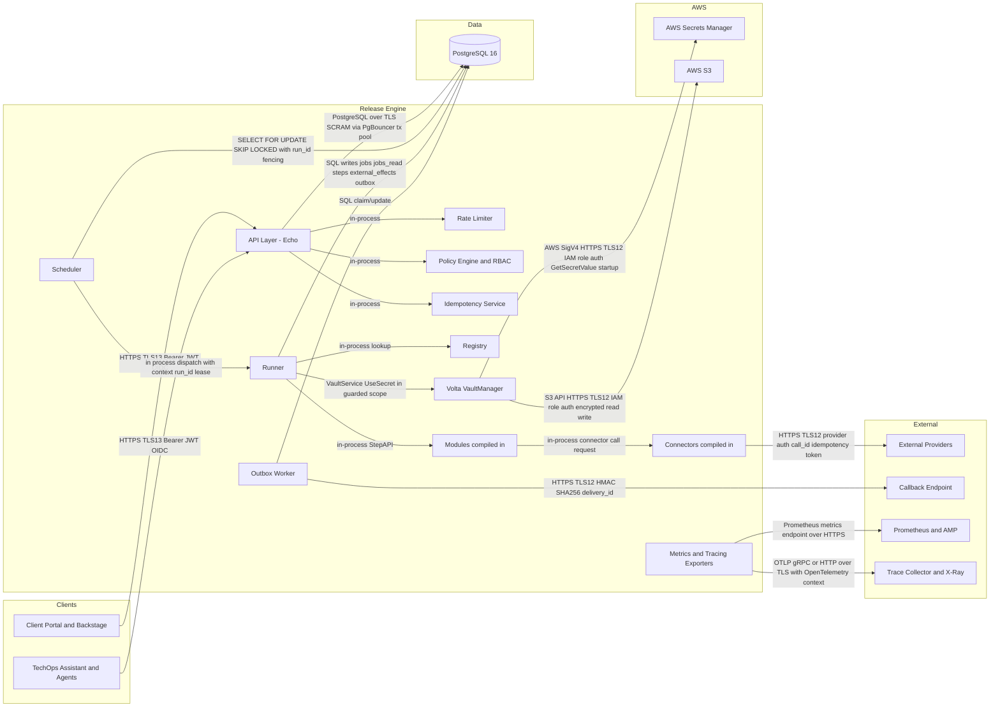

# Phase 2 — Architecture Artefacts

## Table of Contents

- [2A — System Context Diagram (Mermaid)](#2a--system-context-diagram-mermaid)
- [2B — Component Inventory](#2b--component-inventory)
- [2C — Shared Types Catalogue](#2c--shared-types-catalogue)
- [2D — Configuration & Environment Variables](#2d--configuration--environment-variables)

## 2A — System Context Diagram (Mermaid)



## 2B — Component Inventory

| Component | Type | Phase | Dependencies | Estimated Complexity |
|---|---|---|---|---|
| ConfigLoader | pkg | 0 | none | low |
| LoggerFactory | pkg | 0 | ConfigLoader | low |
| DBPool (pgx + PgBouncer) | pkg | 0 | ConfigLoader | low |
| HTTPServer (Echo bootstrap) | transport | 0 | ConfigLoader, LoggerFactory | low |
| AuthMiddleware (OIDC JWT) | middleware | 1 | ConfigLoader, HTTPServer | medium |
| RateLimiter | middleware | 1 | ConfigLoader | medium |
| PolicyEngine | service | 1 | ConfigLoader, DBPool | medium |
| IdempotencyService | service | 1 | DBPool, PolicyEngine | high |
| JobsAPIHandler | transport | 1 | AuthMiddleware, RateLimiter, PolicyEngine, IdempotencyService, DBPool | high |
| HealthHandler (`/healthz`, `/readyz`) | transport | 1 | DBPool, SchedulerService, MigrationChecker | low |
| SchedulerService | service | 1 | DBPool, Registry, MetricsService | high |
| LeaseManager | pkg | 1 | DBPool | medium |
| RunnerService | service | 2 | DBPool, Registry, VoltaManager, MetricsService, TracingService | high |
| StepAPIAdapter | service | 2 | DBPool, RunnerService | medium |
| ModuleRegistry | service | 2 | ConfigLoader | low |
| ConnectorRegistry | service | 2 | ConfigLoader | low |
| VoltaManager | service | 2 | ConfigLoader, LoggerFactory | high |
| ReconcilerService | service | 2 | DBPool, ConnectorRegistry, MetricsService | high |
| OutboxDispatcher | service | 2 | DBPool, CallbackSigner, MetricsService | high |
| CallbackSigner (HMAC rotation) | pkg | 2 | ConfigLoader | medium |
| MetricsExporter (Prometheus) | observability | 2 | HTTPServer | medium |
| MetricsSQLWriter | observability | 2 | DBPool | medium |
| TracingService (OpenTelemetry) | observability | 2 | ConfigLoader | medium |
| AuditService | observability | 2 | DBPool, LoggerFactory | medium |
| MigrationChecker | pkg | 0 | DBPool | low |

## 2C — Shared Types Catalogue

```go
package shared

import "time"

// ErrorResponse is the standard API error envelope.
// Used by: JobsAPIHandler, AuthMiddleware, PolicyEngine, RateLimiter, OutboxDispatcher
type ErrorResponse struct {
	Error   string `json:"error"`            // 1..256 chars, human-readable error summary
	Code    string `json:"code"`             // required, enum: VALIDATION_ERROR|ERR_RATE_LIMITED|ERR_POLICY_DENIED|ERR_IDEM_CONFLICT|ERR_PAYLOAD_TOO_LARGE|ERR_INVALID_CALLBACK_URL|ERR_INVALID_IDEMPOTENCY_KEY|ERR_JOB_NOT_FOUND|INTERNAL_ERROR
	Details any    `json:"details,omitempty"` // optional object/array with structured context; must not contain secrets
}

// JobCreateRequest is the input payload for POST /v1/jobs.
// Used by: JobsAPIHandler, IdempotencyService, PolicyEngine, RateLimiter
type JobCreateRequest struct {
	TenantID       string         `json:"tenant_id"`               // required, regex ^[a-z0-9][a-z0-9-]{1,62}$
	PathKey        string         `json:"path_key"`                // required, 1..128 chars
	Params         map[string]any `json:"params"`                  // required, canonical JSON max serialised size 262144 bytes
	IdempotencyKey string         `json:"idempotency_key"`         // required, regex ^[a-zA-Z0-9\-_.]{1,128}$
	CallbackURL    *string        `json:"callback_url,omitempty"`  // optional, absolute HTTPS URL, public routable host only
}

// JobAcceptedEnvelope is the deterministic response body for successful intake.
// Used by: JobsAPIHandler, IdempotencyService, jobs_read projection readers
type JobAcceptedEnvelope struct {
	JobID       string    `json:"job_id"`       // UUID v4
	TenantID    string    `json:"tenant_id"`    // same as request
	PathKey     string    `json:"path_key"`     // same as request
	State       string    `json:"state"`        // queued|running|succeeded|failed|jobs_exhausted|canceled
	Attempt     int       `json:"attempt"`      // >=0
	MaxAttempts int       `json:"max_attempts"` // 1..10 (engine hard ceiling)
	NextRunAt   time.Time `json:"next_run_at"`  // UTC RFC3339
	AcceptedAt  time.Time `json:"accepted_at"`  // UTC RFC3339
}

// JobStatusResponse is the read model returned by GET /v1/jobs/{job_id}.
// Used by: JobsAPIHandler, SchedulerService, RunnerService
type JobStatusResponse struct {
	JobID            string     `json:"job_id"`                      // UUID v4
	TenantID         string     `json:"tenant_id"`                   // required
	State            string     `json:"state"`                       // queued|running|succeeded|failed|jobs_exhausted|canceled
	Attempt          int        `json:"attempt"`                     // >=0
	OwnerID          *string    `json:"owner_id,omitempty"`          // instance identity for running jobs
	LeaseExpiresAt   *time.Time `json:"lease_expires_at,omitempty"`  // nullable for non-running states
	NextRunAt        *time.Time `json:"next_run_at,omitempty"`       // nullable when terminal
	StartedAt        *time.Time `json:"started_at,omitempty"`        // nullable until first run
	FinishedAt       *time.Time `json:"finished_at,omitempty"`       // nullable until terminal
	UpdatedAt        time.Time  `json:"updated_at"`                  // UTC RFC3339
	LastErrorCode    *string    `json:"last_error_code,omitempty"`   // nullable
	LastErrorMessage *string    `json:"last_error_message,omitempty"`// nullable, max 1024 chars
}

// AuthClaims represents validated JWT claims extracted by AuthMiddleware.
// Used by: AuthMiddleware, PolicyEngine, JobsAPIHandler, AuditService
type AuthClaims struct {
	Subject   string   `json:"sub"`                  // required principal id
	Issuer    string   `json:"iss"`                  // must equal configured issuer
	Audience  []string `json:"aud"`                  // must contain configured audience
	TenantID  string   `json:"tenant_id"`            // required tenant scope
	Roles     []string `json:"roles"`                // zero or more role names
	ExpiresAt int64    `json:"exp"`                  // unix epoch seconds
	IssuedAt  int64    `json:"iat"`                  // unix epoch seconds
}

// PolicyDecision is the normalised authorisation/quota decision.
// Used by: PolicyEngine, JobsAPIHandler, SchedulerService, AuditService
type PolicyDecision struct {
	Allowed bool   `json:"allowed"`          // true if action permitted
	Reason  string `json:"reason"`           // required, non-empty reason code
	Action  string `json:"action"`           // job:create|job:read|job:cancel
	Tenant  string `json:"tenant"`           // tenant_id
	PathKey string `json:"path_key"`         // evaluated resource path
}

// ConnectorRequest is a standardised request from module orchestration to connector runtime.
// Used by: StepAPIAdapter, RunnerService, ConnectorRegistry, ReconcilerService
type ConnectorRequest struct {
	Connector  string         `json:"connector"`   // required connector key, 1..64 chars
	Operation  string         `json:"operation"`   // required operation key, 1..128 chars
	Input      map[string]any `json:"input"`       // canonicalised before digest
	TenantID   string         `json:"tenant_id"`   // required
	JobID      string         `json:"job_id"`      // UUID v4
	RunID      string         `json:"run_id"`      // UUID v4
	StepKey    string         `json:"step_key"`    // required
	CallID     string         `json:"call_id"`     // deterministic idempotency token
	TimeoutSec int            `json:"timeout_sec"` // 1..120
}

// ConnectorResult captures connector execution outcome.
// Used by: RunnerService, StepAPIAdapter, ReconcilerService, MetricsService
type ConnectorResult struct {
	Status      string         `json:"status"`                  // succeeded|retryable|terminal|unknown
	Output      map[string]any `json:"output,omitempty"`        // optional sanitised output
	ProviderRef *string        `json:"provider_ref,omitempty"`  // optional provider-side resource id
	Error       *ErrorResponse `json:"error,omitempty"`         // required for non-succeeded status
	LatencyMs   int            `json:"latency_ms"`              // >=0
}

// StepRecord models a durable step transition row.
// Used by: StepAPIAdapter, RunnerService, MetricsSQLWriter
type StepRecord struct {
	JobID         string     `json:"job_id"`                    // UUID v4
	RunID         string     `json:"run_id"`                    // UUID v4
	Attempt       int        `json:"attempt"`                   // >=1 while running
	StepKey       string     `json:"step_key"`                  // 1..128 chars
	Status        string     `json:"status"`                    // ok|error|skipped
	Output        any        `json:"output,omitempty"`          // optional for ok
	ErrorCode     *string    `json:"error_code,omitempty"`      // required when status=error
	ErrorMessage  *string    `json:"error_message,omitempty"`   // required when status=error
	StartedAt     time.Time  `json:"started_at"`                // UTC
	FinishedAt    *time.Time `json:"finished_at,omitempty"`     // nullable if in-progress
	DurationMs    *int       `json:"duration_ms,omitempty"`     // nullable if in-progress
}

// ExternalEffectRecord tracks lifecycle of a connector call.
// Used by: RunnerService, ReconcilerService, MetricsSQLWriter, AuditService
type ExternalEffectRecord struct {
	EffectID              string     `json:"effect_id"`                          // UUID v4
	JobID                 string     `json:"job_id"`                             // UUID v4
	RunID                 string     `json:"run_id"`                             // UUID v4
	StepKey               string     `json:"step_key"`                           // required
	ConnectorKey          string     `json:"connector_key"`                      // required
	Operation             string     `json:"operation"`                          // required
	CallID                string     `json:"call_id"`                            // globally unique
	Status                string     `json:"status"`                             // pending|reserved|in_flight|succeeded|failed|canceled|unknown_outcome|dlq
	Attempt               int        `json:"attempt"`                            // >=0
	ReconcileAttempts     int        `json:"reconcile_attempts"`                 // >=0
	MaxReconcileAttempts  int        `json:"max_reconcile_attempts"`             // default 5
	LeaseExpiresAt        *time.Time `json:"lease_expires_at,omitempty"`         // nullable
	NextRunAt             *time.Time `json:"next_run_at,omitempty"`              // nullable
	LastErrorCode         *string    `json:"last_error_code,omitempty"`          // nullable
	LastErrorMessage      *string    `json:"last_error_message,omitempty"`       // nullable
}

// OutboxEvent is the durable callback/event delivery record.
// Used by: OutboxDispatcher, JobsAPIHandler, CallbackSigner, MetricsService
type OutboxEvent struct {
	ID            int64      `json:"id"`                        // DB identity
	TenantID      string     `json:"tenant_id"`                 // required
	JobID         *string    `json:"job_id,omitempty"`          // nullable UUID
	Kind          string     `json:"kind"`                      // webhook|event|internal
	DeliveryState string     `json:"delivery_state"`            // pending|delivering|delivered|failed|dlq
	Attempt       int        `json:"attempt"`                   // >=0
	MaxAttempts   int        `json:"max_attempts"`              // default 12
	NextRunAt     *time.Time `json:"next_run_at,omitempty"`     // nullable when delivered/dlq
	Payload       any        `json:"payload_json"`              // required JSON payload
	LastError     *string    `json:"last_error,omitempty"`      // nullable
	CreatedAt     time.Time  `json:"created_at"`                // UTC
	UpdatedAt     time.Time  `json:"updated_at"`                // UTC
}
```

### Shared Type Validation Rules

1. All `tenant_id` values must satisfy regex `^[a-z0-9][a-z0-9-]{1,62}$`.
2. All UUID identifiers must be canonical lower-case RFC4122 strings.
3. Any field ending `_at` must be UTC RFC3339 timestamps.
4. `idempotency_key` must match `^[a-zA-Z0-9\-_.]{1,128}$`; reject otherwise with `ERR_INVALID_IDEMPOTENCY_KEY`.
5. Serialised `JobCreateRequest` size must be `<= 262144` bytes; reject with `ERR_PAYLOAD_TOO_LARGE`.
6. `callback_url` must use `https` scheme and must not resolve to blocked private/link-local/metadata ranges.
7. `ErrorResponse.Details` must not contain secret material, tokens, passphrases, or plaintext connector credentials.

## 2D — Configuration & Environment Variables

| Variable | Type | Default | Required | Owner Component | Description |
|---|---|---|---|---|---|
| `HTTP_PORT` | int | `8080` | no | HTTPServer | Public API listen port. |
| `HTTP_READ_TIMEOUT` | duration | `15s` | no | HTTPServer | Max duration to read request including body. |
| `HTTP_WRITE_TIMEOUT` | duration | `30s` | no | HTTPServer | Max duration before timing out response write. |
| `HTTP_IDLE_TIMEOUT` | duration | `60s` | no | HTTPServer | Keep-alive idle timeout. |
| `MAX_REQUEST_BODY_BYTES` | int | `262144` | no | JobsAPIHandler | API payload size cap (256 KB). |
| `DATABASE_URL` | string | none | yes | DBPool | PostgreSQL DSN (PgBouncer endpoint in transaction mode). |
| `DB_MAX_CONNS` | int | `30` | no | DBPool | Max open DB connections from app process. |
| `DB_MIN_CONNS` | int | `10` | no | DBPool | Min idle/ready DB connections. |
| `DB_CONN_MAX_LIFETIME` | duration | `30m` | no | DBPool | Connection recycle interval. |
| `DB_STATEMENT_TIMEOUT` | duration | `5s` | no | DBPool | Per-statement timeout for OLTP queries. |
| `DB_TX_ISOLATION_REQUIRED` | string | `read committed` | no | MigrationChecker | Startup assertion for transaction isolation. |
| `OIDC_ISSUER_URL` | string | none | yes | AuthMiddleware | OIDC issuer URL used for token validation. |
| `OIDC_AUDIENCE` | string | none | yes | AuthMiddleware | Required JWT audience claim value. |
| `OIDC_JWKS_REFRESH_INTERVAL` | duration | `5m` | no | AuthMiddleware | JWKS background refresh cadence. |
| `OIDC_CLOCK_SKEW` | duration | `60s` | no | AuthMiddleware | Allowed JWT time-claim skew. |
| `RATE_LIMIT_TOKENS_PER_SEC` | float | `10` | no | RateLimiter | Per-tenant token refill rate. |
| `RATE_LIMIT_BURST` | int | `20` | no | RateLimiter | Per-tenant token bucket burst capacity. |
| `IDEMPOTENCY_TTL` | duration | `48h` | no | IdempotencyService | Retention window for idempotency keys. |
| `IDEMPOTENCY_CLEANUP_CRON` | string | `0 2 * * *` | no | IdempotencyService | Cleanup schedule in server local timezone (set UTC in container). |
| `SCHEDULER_ENABLED` | bool | `true` | no | SchedulerService | Enables claimer loop in this instance. |
| `SCHEDULER_POLL_INTERVAL` | duration | `500ms` | no | SchedulerService | Poll cadence for runnable job claims. |
| `SCHEDULER_CLAIM_BATCH_SIZE` | int | `10` | no | SchedulerService | Max jobs claimed per polling iteration. |
| `JOB_LEASE_TTL` | duration | `120s` | no | LeaseManager | Running job lease duration. |
| `RUNNER_MAX_CONCURRENCY` | int | `32` | no | RunnerService | Max concurrent job executions per instance. |
| `RUNNER_DRAIN_TIMEOUT` | duration | `30s` | no | RunnerService | Graceful shutdown drain window. |
| `RUNNER_MAX_ATTEMPTS_CEILING` | int | `10` | no | RunnerService | Hard ceiling for job max attempts. |
| `EFFECT_LEASE_TTL` | duration | `60s` | no | RunnerService | External effect in-flight lease duration. |
| `EFFECT_MAX_RECONCILE_ATTEMPTS` | int | `5` | no | ReconcilerService | Max unknown-outcome reconciliation attempts before DLQ. |
| `RECONCILER_ENABLED` | bool | `true` | no | ReconcilerService | Enables unknown-outcome reconciliation worker. |
| `RECONCILER_POLL_INTERVAL` | duration | `30s` | no | ReconcilerService | Scan cadence for `unknown_outcome` effects. |
| `RECONCILER_BATCH_SIZE` | int | `10` | no | ReconcilerService | Max effects scanned per cycle. |
| `OUTBOX_ENABLED` | bool | `true` | no | OutboxDispatcher | Enables outbox delivery worker. |
| `OUTBOX_POLL_INTERVAL` | duration | `1s` | no | OutboxDispatcher | Outbox fetch cadence. |
| `OUTBOX_DELIVERY_TIMEOUT` | duration | `10s` | no | OutboxDispatcher | HTTP timeout for callback POST. |
| `OUTBOX_MAX_ATTEMPTS` | int | `12` | no | OutboxDispatcher | Delivery retries before DLQ state. |
| `CALLBACK_HMAC_ACTIVE_KEY_ID` | string | none | yes | CallbackSigner | Active signing key identifier (`X-Signature-Version`). |
| `CALLBACK_HMAC_ACTIVE_KEY` | string | none | yes | CallbackSigner | Active HMAC key material. |
| `CALLBACK_HMAC_SECONDARY_KEY_ID` | string | none | no | CallbackSigner | Secondary verification key id during rotation window. |
| `CALLBACK_HMAC_SECONDARY_KEY` | string | none | no | CallbackSigner | Secondary verification key material during rotation window. |
| `CALLBACK_ALLOWLIST_MODE` | string | `global_and_tenant` | no | JobsAPIHandler | Allowed values: `global_only`, `tenant_only`, `global_and_tenant`. |
| `LOG_LEVEL` | string | `info` | no | LoggerFactory | Allowed: `debug`, `info`, `warn`, `error`. |
| `LOG_FORMAT` | string | `json` | no | LoggerFactory | Structured log formatter. |
| `METRICS_ENABLED` | bool | `true` | no | MetricsExporter | Enables Prometheus metrics endpoint. |
| `METRICS_PATH` | string | `/metrics` | no | MetricsExporter | HTTP path for Prometheus scrape endpoint. |
| `METRICS_SQL_ENABLED` | bool | `true` | no | MetricsSQLWriter | Enables SQL event metrics sink. |
| `TRACING_ENABLED` | bool | `true` | no | TracingService | Enables OpenTelemetry tracing pipeline. |
| `OTEL_EXPORTER_OTLP_ENDPOINT` | string | none | yes | TracingService | OTLP collector endpoint. |
| `OTEL_SERVICE_NAME` | string | `release-engine` | no | TracingService | Service name attribute for traces. |
| `OTEL_SAMPLING_BOOTSTRAP_RATIO` | float | `1.0` | no | TracingService | Sampling ratio during initial launch window. |
| `OTEL_SAMPLING_STEADY_RATIO` | float | `0.1` | no | TracingService | Head-based sampling ratio after initial window. |
| `VOLTA_ENABLED` | bool | `true` | no | VoltaManager | Enables Volta secret management. |
| `VOLTA_SM_SECRET_ID` | string | none | yes | VoltaManager | Secrets Manager ID for Volta master passphrase. |
| `VOLTA_S3_BUCKET` | string | none | yes | VoltaManager | S3 bucket storing encrypted vault objects. |
| `VOLTA_S3_PREFIX` | string | `volta/` | no | VoltaManager | S3 key prefix for tenant vault objects. |
| `VOLTA_DEK_ROTATION_DAYS` | int | `90` | no | VoltaManager | Automatic per-tenant DEK rotation cadence. |
| `VOLTA_SESSION_TTL` | duration | `24h` | no | VoltaManager | Vault service cache TTL per tenant. |
| `VOLTA_AUDIT_ENABLED` | bool | `true` | no | VoltaManager | Enables Volta audit event emission. |
| `AWS_REGION` | string | none | yes | VoltaManager | AWS region for S3 and Secrets Manager clients. |

### Volta key-rotation scope note

KEK rotation is intentionally **not** exposed as an app-local periodic environment variable in this phase.

- **KEK rotation is coupled to master passphrase change and coordinated operations**, not a per-instance timer. As defined in `docs/design/d07.md`, KEK rotation uses `VaultManagerService.RotateAllTenantKeys(newPassphrase, reason)` together with AWS Secrets Manager update, and master passphrase rotation requires a rolling restart.
- **Blast radius and coordination are materially different from DEK rotation**: DEK rotation is low-impact and per-tenant, while KEK rotation is all-tenants and requires re-encryption of DEK blobs under synchronised secret-management and rollout procedures.

Therefore, KEK rotation is managed externally via the **AWS Secrets Manager rotation workflow + operational runbook choreography**, while `VOLTA_DEK_ROTATION_DAYS` remains the in-process cadence control for routine per-tenant DEK rotation.
