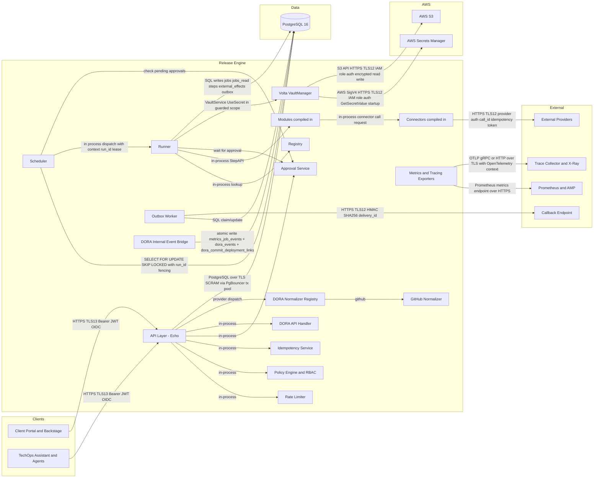
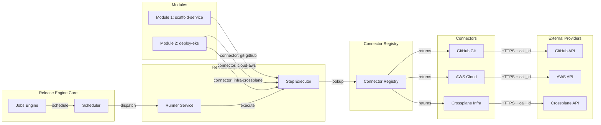
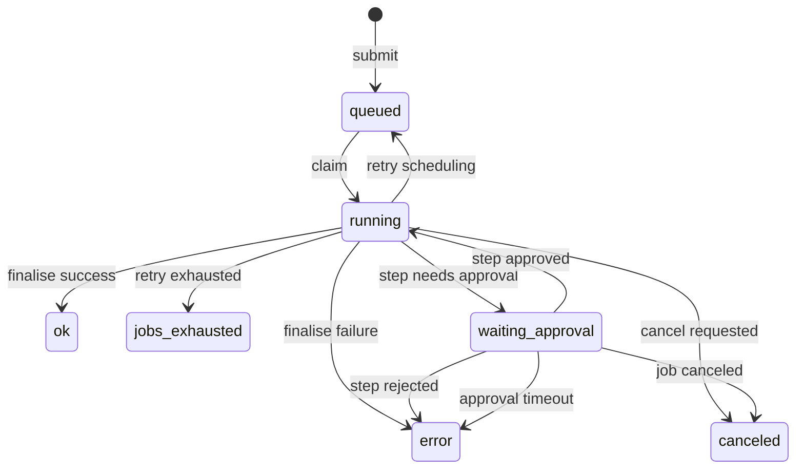

# Phase 2 — Architecture Artefacts

## Table of Contents

- [2A — System Context Diagram (Mermaid)](#2a--system-context-diagram-mermaid)
- [2A.1 — Connector Context Diagram (Mermaid)](#2a1--connector-context-diagram-mermaid)
- [2B — Component Inventory](#2b--component-inventory)
- [2C — Shared Types Catalogue](#2c--shared-types-catalogue)
- [2D — Configuration & Environment Variables](#2d--configuration--environment-variables)
- [2E — State Machine Extension](#2e--state-machine-extension)

## 2A — System Context Diagram (Mermaid)



## 2A.1 — Connector Context Diagram (Mermaid)



## 2B — Component Inventory

| Component | Type | Phase | Dependencies | Estimated Complexity |
|---|---|---|---|---|
| ConfigLoader | pkg | 0 | none | low |
| LoggerFactory | pkg | 0 | ConfigLoader | low |
| DBPool (pgx + PgBouncer) | pkg | 0 | ConfigLoader | low |
| HTTPServer (Echo bootstrap) | transport | 0 | ConfigLoader, LoggerFactory | low |
| AuthMiddleware (OIDC JWT) | middleware | 1 | ConfigLoader, HTTPServer | medium |
| RateLimiter | middleware | 1 | ConfigLoader | medium |
| PolicyEngine | service | 1 | ConfigLoader, DBPool | medium |
| IdempotencyService | service | 1 | DBPool, PolicyEngine | high |
| JobsAPIHandler | transport | 1 | AuthMiddleware, RateLimiter, PolicyEngine, IdempotencyService, DBPool | high |
| HealthHandler (`/healthz`, `/readyz`) | transport | 1 | DBPool, SchedulerService, MigrationChecker | low |
| SchedulerService | service | 1 | DBPool, Registry, MetricsService | high |
| LeaseManager | pkg | 1 | DBPool | medium |
| RunnerService | service | 2 | DBPool, Registry, VoltaManager, MetricsService, TracingService | high |
| StepAPIAdapter | service | 2 | DBPool, RunnerService | medium |
| ModuleRegistry | service | 2 | ConfigLoader | low |
| ConnectorRegistry | service | 2 | ConfigLoader | low |
| Runner Step Executor | service | 2 | ConnectorRegistry, LoggerFactory, MetricsExporter | medium |
| SecretContextProvider | interface | 2 | Module runtime | low |
| SecretRequirer | interface | 2 | Connector runtime | low |
| StepAPIAdapter (Secret Orchestration) | service | 2 | DBPool, RunnerService, VoltaManager, ModuleRegistry, ConnectorRegistry | high |
| BaseConnector | pkg | 2 | Shared Types | low |
| GitHubConnector | service | 2 | BaseConnector, ConnectorConfig, VoltaManager | high |
| CrossplaneConnector | service | 2 | BaseConnector, ConnectorConfig, VoltaManager, Kubernetes client | high |
| AWSConnector | service | 2 | BaseConnector, ConnectorConfig, VoltaManager, AWS SDK v2 | high |
| Connector Testing Framework | pkg | 3 | Shared Types, ConnectorRegistry | medium |
| Startup Wiring | pkg | 1 | ConfigLoader, ConnectorRegistry, VoltaManager | medium |
| VoltaManager | service | 2 | ConfigLoader, LoggerFactory | high |
| ReconcilerService | service | 2 | DBPool, ConnectorRegistry, MetricsService | high |
| OutboxDispatcher | service | 2 | DBPool, CallbackSigner, MetricsService | high |
| ApprovalService | service | 2 | DBPool, PolicyEngine, OutboxDispatcher | high |
| DoraAPIHandler | transport | 1 | AuthMiddleware, RateLimiter, DBPool | medium |
| DoraEventBridge (in MetricsSQLWriter) | observability | 1 | DBPool | medium |
| DoraNormalizerRegistry | service | 2 | DoraAPIHandler | medium |
| GitHubDoraNormalizer | service | 2 | DoraNormalizerRegistry | medium |
| CallbackSigner (HMAC rotation) | pkg | 2 | ConfigLoader | medium |
| MetricsExporter (Prometheus) | observability | 2 | HTTPServer | medium |
| MetricsSQLWriter | observability | 2 | DBPool | medium |
| TracingService (OpenTelemetry) | observability | 2 | ConfigLoader | medium |
| AuditService | observability | 2 | DBPool, LoggerFactory | medium |
| MigrationChecker | pkg | 0 | DBPool | low |

## 2C — Shared Types Catalogue

```go
package shared

import "time"

// (Keep existing shared types and add approval-related types)

// ApprovalRecord models a human decision for a step.
// Used by: ApprovalService, AuditService
type ApprovalRecord struct {
	ID             string    `json:"id"`
	JobID          string    `json:"job_id"`
	StepID         int64     `json:"step_id"`
	Decision       string    `json:"decision"`       // approved|rejected|expired
	Approver       string    `json:"approver"`
	Justification  string    `json:"justification"`
	PolicySnapshot any       `json:"policy_snapshot"`
	CreatedAt      time.Time `json:"created_at"`
}

// ApprovalRequest is the record of an approval gate defined in a step.
// Used by: Module runtime via StepAPI
type ApprovalRequest struct {
	Summary     string            `json:"summary"`
	Detail      string            `json:"detail"`
	BlastRadius string            `json:"blast_radius"`
	PolicyRef   string            `json:"policy_ref"`
	Metadata    map[string]string `json:"metadata"`
}
```

### Connector Shared Types Catalogue

```go
package connector

import (
    "context"
    "fmt"
    "strings"
    "time"
)

// --- Connector Types ---

type ConnectorType string

const (
    ConnectorTypeGit    ConnectorType = "git"
    ConnectorTypeCloud  ConnectorType = "cloud"
    ConnectorTypeCD     ConnectorType = "cd"
    ConnectorTypeInfra  ConnectorType = "infra"
    ConnectorTypeDevOps ConnectorType = "devops"
    ConnectorTypeOther  ConnectorType = "other"
)

var ValidConnectorTypes = map[ConnectorType]bool{
    ConnectorTypeGit:    true,
    ConnectorTypeCloud:  true,
    ConnectorTypeCD:     true,
    ConnectorTypeInfra:  true,
    ConnectorTypeDevOps: true,
    ConnectorTypeOther:  true,
}

// --- Result Types ---

const (
    StatusSuccess        = "success"
    StatusRetryableError = "retryable_error"
    StatusTerminalError  = "terminal_error"
)

type ConnectorResult struct {
    Status string
    Output map[string]interface{}
    Error  *ConnectorError
}

type ConnectorError struct {
    Code    string
    Message string
    Details map[string]interface{}
}

func (e *ConnectorError) Error() string {
    return fmt.Sprintf("[%s] %s", e.Code, e.Message)
}

type ConnectorConfig struct {
    HTTPTimeout      time.Duration
    TransportRetries int
    Extra            map[string]string
}

func DefaultConnectorConfig() ConnectorConfig {
    return ConnectorConfig{
        HTTPTimeout:      30 * time.Second,
        TransportRetries: 3,
        Extra:            make(map[string]string),
    }
}

type contextKey string

const callIDKey contextKey = "call_id"

func WithCallID(ctx context.Context, callID string) context.Context {
    return context.WithValue(ctx, callIDKey, callID)
}

func CallIDFromContext(ctx context.Context) string {
    if v, ok := ctx.Value(callIDKey).(string); ok {
        return v
    }
    return ""
}

type Connector interface {
    Key() string
    Validate(operation string, input map[string]interface{}) error
    Execute(ctx context.Context, operation string, input map[string]interface{}) (*ConnectorResult, error)
    Close() error
}

type OperationDescriber interface {
    Operations() []OperationMeta
}

type OperationMeta struct {
    Name           string
    Description    string
    RequiredFields []string
    OptionalFields []string
    IsAsync        bool
}

type ConnectorRegistry interface {
    Register(conn Connector) error
    Replace(conn Connector) error
    Lookup(key string) (Connector, bool)
    ListByType(connectorType ConnectorType) []Connector
    Close() error
}

type BaseConnector struct {
    connectorType ConnectorType
    technology    string
}

func NewBaseConnector(ctype ConnectorType, tech string) (BaseConnector, error) {
    if !ValidConnectorTypes[ctype] {
        return BaseConnector{}, fmt.Errorf("unknown connector type: %s", ctype)
    }
    if tech == "" {
        return BaseConnector{}, fmt.Errorf("technology must not be empty")
    }
    if strings.Contains(tech, "-") {
        return BaseConnector{}, fmt.Errorf("technology must not contain hyphens: %s", tech)
    }
    return BaseConnector{connectorType: ctype, technology: tech}, nil
}

func (b *BaseConnector) Type() ConnectorType { return b.connectorType }
func (b *BaseConnector) Technology() string   { return b.technology }
func (b *BaseConnector) Key() string          { return fmt.Sprintf("%s-%s", b.connectorType, b.technology) }
```

## 2D — Configuration & Environment Variables

| Variable | Default | Purpose |
|---|---|---|
| `DORA_GROUP_MAP_TTL` | `15m` | Maximum staleness tolerated for `dora_group_brand_map` during group-scoped reads. |
| `DORA_LEAD_TIME_COVERAGE_THRESHOLD` | `0.8` | Minimum correlated deployment coverage required for Lead Time `data_quality=complete`. |
| `DORA_CLASSIFICATION_VERSION` | `dora-2023-default+gates-included` | Default classification profile when request does not provide an override. |

## 2E — State Machine Extension

The step state machine now includes `waiting_approval`.



- **`waiting_approval`**: A special state where a step is parked awaiting human intervention. The scheduler does not claim subsequent steps in the job until this step is resolved.
- **Triggered when a module encounters a point requiring approval.**
- **Transitions to `running` on approval, `error` on rejection or timeout.**
