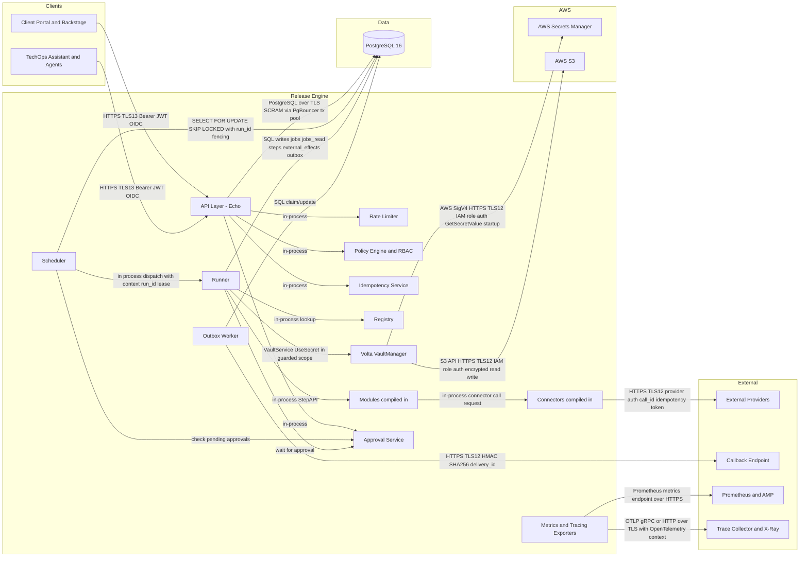
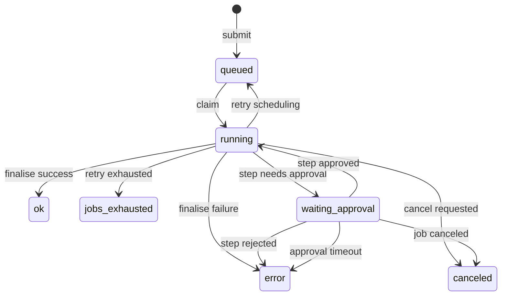

# Phase 2 — Architecture Artefacts

## Table of Contents

- [2A — System Context Diagram (Mermaid)](#2a--system-context-diagram-mermaid)
- [2B — Component Inventory](#2b--component-inventory)
- [2C — Shared Types Catalogue](#2c--shared-types-catalogue)
- [2D — Configuration & Environment Variables](#2d--configuration--environment-variables)
- [2E — State Machine Extension](#2e--state-machine-extension)

## 2A — System Context Diagram (Mermaid)



## 2B — Component Inventory

| Component | Type | Phase | Dependencies | Estimated Complexity |
|---|---|---|---|---|
| ConfigLoader | pkg | 0 | none | low |
| LoggerFactory | pkg | 0 | ConfigLoader | low |
| DBPool (pgx + PgBouncer) | pkg | 0 | ConfigLoader | low |
| HTTPServer (Echo bootstrap) | transport | 0 | ConfigLoader, LoggerFactory | low |
| AuthMiddleware (OIDC JWT) | middleware | 1 | ConfigLoader, HTTPServer | medium |
| RateLimiter | middleware | 1 | ConfigLoader | medium |
| PolicyEngine | service | 1 | ConfigLoader, DBPool | medium |
| IdempotencyService | service | 1 | DBPool, PolicyEngine | high |
| JobsAPIHandler | transport | 1 | AuthMiddleware, RateLimiter, PolicyEngine, IdempotencyService, DBPool | high |
| HealthHandler (`/healthz`, `/readyz`) | transport | 1 | DBPool, SchedulerService, MigrationChecker | low |
| SchedulerService | service | 1 | DBPool, Registry, MetricsService | high |
| LeaseManager | pkg | 1 | DBPool | medium |
| RunnerService | service | 2 | DBPool, Registry, VoltaManager, MetricsService, TracingService | high |
| StepAPIAdapter | service | 2 | DBPool, RunnerService | medium |
| ModuleRegistry | service | 2 | ConfigLoader | low |
| ConnectorRegistry | service | 2 | ConfigLoader | low |
| VoltaManager | service | 2 | ConfigLoader, LoggerFactory | high |
| ReconcilerService | service | 2 | DBPool, ConnectorRegistry, MetricsService | high |
| OutboxDispatcher | service | 2 | DBPool, CallbackSigner, MetricsService | high |
| ApprovalService | service | 2 | DBPool, PolicyEngine, OutboxDispatcher | high |
| CallbackSigner (HMAC rotation) | pkg | 2 | ConfigLoader | medium |
| MetricsExporter (Prometheus) | observability | 2 | HTTPServer | medium |
| MetricsSQLWriter | observability | 2 | DBPool | medium |
| TracingService (OpenTelemetry) | observability | 2 | ConfigLoader | medium |
| AuditService | observability | 2 | DBPool, LoggerFactory | medium |
| MigrationChecker | pkg | 0 | DBPool | low |

## 2C — Shared Types Catalogue

```go
package shared

import "time"

// (Keep existing shared types and add approval-related types)

// ApprovalRecord models a human decision for a step.
// Used by: ApprovalService, AuditService
type ApprovalRecord struct {
	ID             string    `json:"id"`
	JobID          string    `json:"job_id"`
	StepID         int64     `json:"step_id"`
	Decision       string    `json:"decision"`       // approved|rejected|expired
	Approver       string    `json:"approver"`
	Justification  string    `json:"justification"`
	PolicySnapshot any       `json:"policy_snapshot"`
	CreatedAt      time.Time `json:"created_at"`
}

// ApprovalRequest is the record of an approval gate defined in a step.
// Used by: Module runtime via StepAPI
type ApprovalRequest struct {
	Summary     string            `json:"summary"`
	Detail      string            `json:"detail"`
	BlastRadius string            `json:"blast_radius"`
	PolicyRef   string            `json:"policy_ref"`
	Metadata    map[string]string `json:"metadata"`
}
```

## 2D — Configuration & Environment Variables

(Keep existing, add for ApprovalService if needed)

## 2E — State Machine Extension

The step state machine now includes `waiting_approval`.



- **`waiting_approval`**: A special state where a step is parked awaiting human intervention. The scheduler does not claim subsequent steps in the job until this step is resolved.
- **Triggered when a module encounters a point requiring approval.**
- **Transitions to `running` on approval, `error` on rejection or timeout.**
