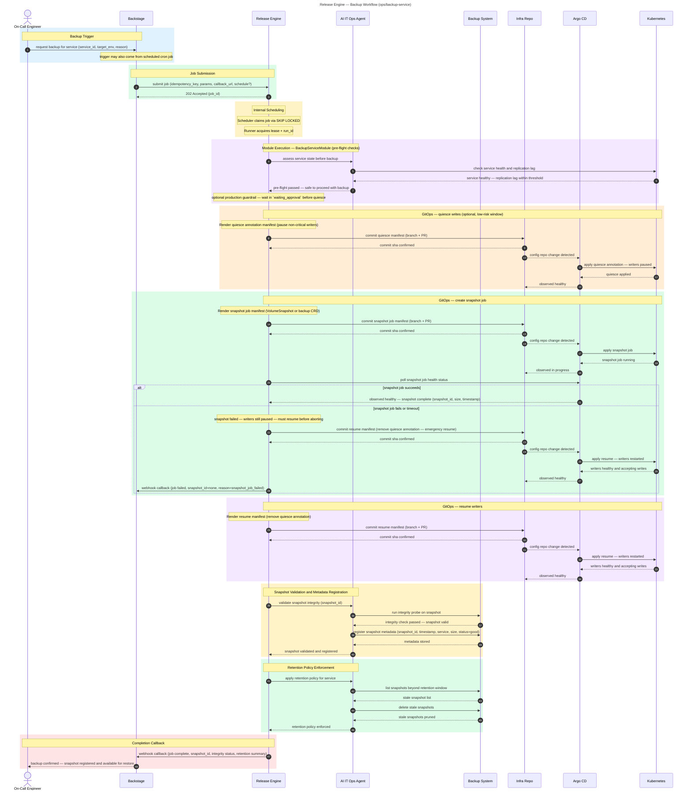

# Backup Workflow

**Audience:** Ops

## Overview

Automated, GitOps-driven backup orchestration for services running on Kubernetes. Triggered on-demand via Backstage or by schedule, this workflow quiesces writers, creates a validated volume snapshot, resumes writers, and enforces retention policy — all with full audit trail.

## Purpose

What this workflow accomplishes: Automated backup orchestration that eliminates manual, error-prone backup steps.

## Rationale

Why this workflow exists: To ensure backups are consistently executed, validated, and retained according to policy — without requiring manual intervention from on-call engineers.

## Benefit

What value it delivers:
- On-call engineers no longer execute error-prone, multi-step manual procedures
- AI-powered pre-flight checks guarantee snapshot usability
- Stale snapshots are pruned automatically, preventing storage bloat
- Every backup is recorded with full audit trail (timestamp, snapshot ID, integrity status)
- Developers can request backups via Backstage without filing tickets to TechOps

## Release Engine Capability Mapping

- **Recurrent jobs (primary mode):** backup runs can be submitted with `schedule` (cron expression). On successful completion, the job is re-queued for the next occurrence.
- **Human in the Loop (optional):** for production backups, an explicit approval step can be inserted before quiescing writers (`waiting_approval` → decision API).

## Value — TechOps as a Product

| Value Dimension | T-Shirt Size | Notes |
|---|:------------:|---|
| Speed at Scale |      M       | Backup orchestration is mostly sequential; scaling comes from self-service, not parallelism. |
| Consistency & Reduced Risk |      L       | Quiesce, snapshot, resume, validate — every backup follows the exact same safe sequence. |
| Governance Through Code |      M       | GitOps ensures all backup manifests are version-controlled and reviewable. |
| Developer Experience (DX) |      S       | Limited self-service value — backups are primarily an ops concern, not a daily dev workflow. |
| Clear Ownership / Fewer Hand-offs |      M       | TechOps owns the platform; developers consume backup capability without needing ops involvement. |

**Combined Value Score (Velocity 1):** 16/40 (M + L + M + S + M = 3 + 5 + 3 + 2 + 3)

---

