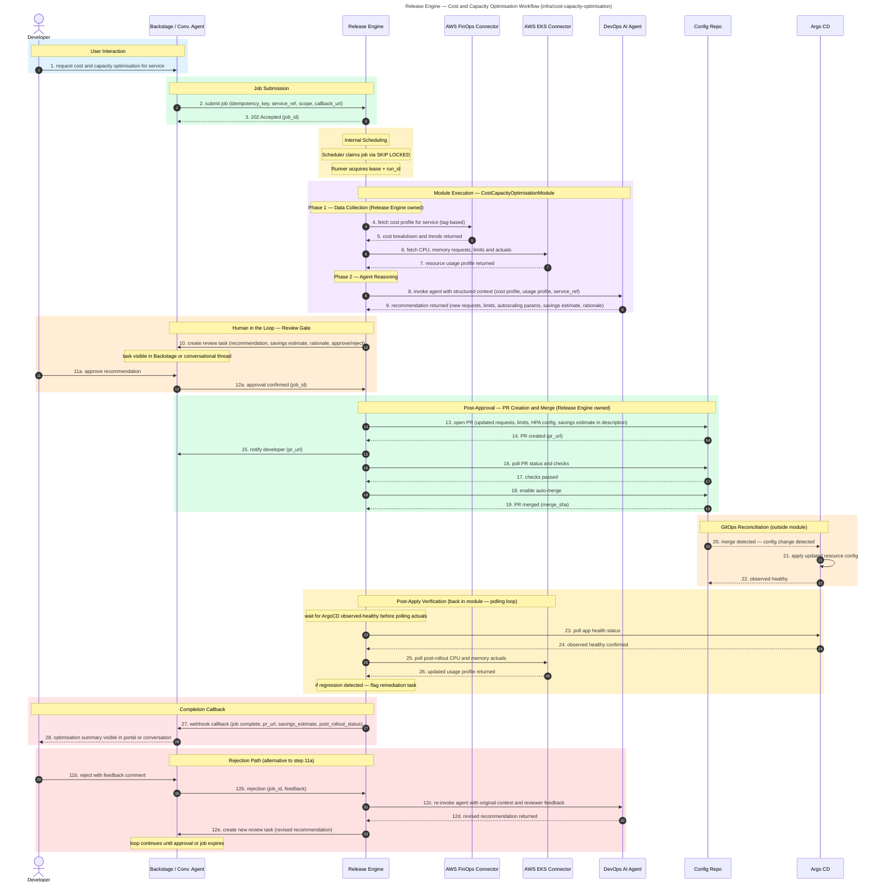

# Cost and Capacity Optimisation

**Audience:** Dev, Ops

## Overview

AI-driven analysis of cloud cost and Kubernetes resource usage to generate right-sizing recommendations. Requires human approval before raising a PR with updated resource configs. Post-apply verification confirms no regression.

## Purpose

What this workflow accomplishes: Automated cost and capacity analysis that produces actionable right-sizing recommendations for Kubernetes workloads.

## Rationale

Why this workflow exists: To replace manual, spreadsheet-based cost reviews with a repeatable, scalable process that continuously aligns cloud spend with actual resource needs.

## Benefit

What value it delivers:
- Eliminates ad-hoc cost analysis with automated, consistent recommendations
- Prevents both over-provisioning (waste) and under-resourcing (risk) at scale
- Scales linearly without adding headcount as the number of services grows
- Human approval gates ensure operator intent is respected
- Post-change verification confirms no performance regression

## Value — TechOps as a Product

| Value Dimension | T-Shirt Size  | Notes |
|---|:-------------:|---|
| Speed at Scale |      XL       | Automated analysis eliminates manual effort entirely; scales to any number of services. |
| Consistency & Reduced Risk |       L       | Same analysis logic applied across all services; recommendations follow known patterns. |
| Governance Through Code |       L       | Approval gates and PR workflows ensure every cost change is reviewed and traceable. |
| Developer Experience (DX) |       M       | Developers see recommendations and can approve/reject via Backstage; self-service but not fully automated. |
| Clear Ownership / Fewer Hand-offs |       L       | TechOps defines the analysis logic; developers consume recommendations without ops tickets. |

**Combined Value Score (Velocity 1):** 26/40 (XL + L + L + M + L = 8 + 5 + 5 + 3 + 5)

---

