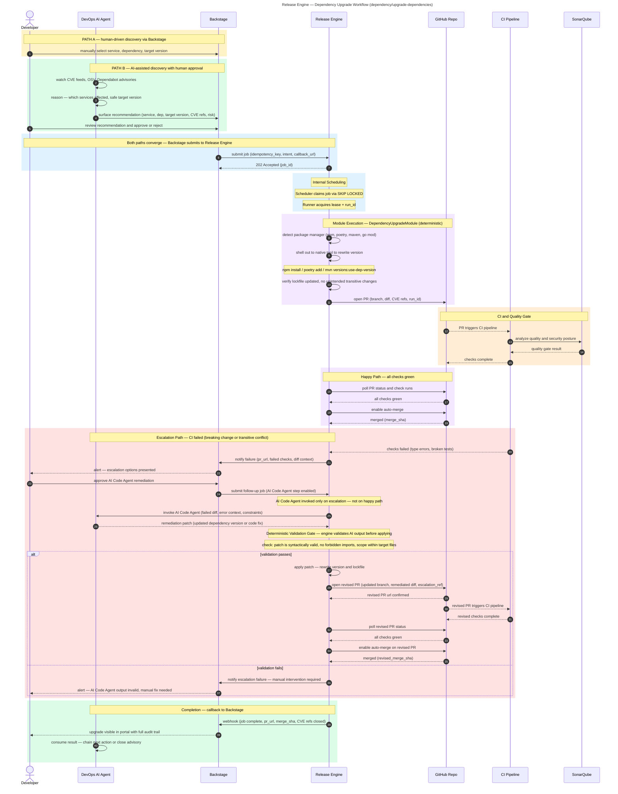

# Dependency Upgrade and Security Fix

**Audience:** Dev, Ops

## Overview

Automated dependency upgrade and CVE remediation workflow. An AI agent monitors vulnerability feeds and proposes fixes; a deterministic engine rewrites the lockfile, opens a PR, and gates on CI. AI Code Agent is only invoked on escalation.

## Purpose

What this workflow accomplishes: Automated dependency upgrades and CVE remediation that scans the entire service estate, proposes fixes, and merges them through CI.

## Rationale

Why this workflow exists: To make security patches a default, automated process rather than a manual, error-prone task that accumulates technical debt.

## Benefit

What value it delivers:
- Every CVE is automatically triaged and fixed without waiting for developer awareness
- Eliminates vulnerability backlog on multi-service estates
- Deterministic engine handles routine upgrades; AI is reserved for complex escalations
- Full audit trail with CVE references, diff, and merge status
- Safe escalation: AI Code Agent only invoked when CI fails

## Value — TechOps as a Product

| Value Dimension | T-Shirt Size  | Notes |
|---|:-------------:|---|
| Speed at Scale |      XL       | Monitors all services simultaneously; upgrades are parallelised across the fleet. |
| Consistency & Reduced Risk |      XL       | Same upgrade logic applied everywhere; no service is left behind on outdated dependencies. |
| Governance Through Code |       L       | All changes go through PR and CI; CVEs are linked in the PR description for traceability. |
| Developer Experience (DX) |       L       | Developers are notified of upgrades; they can review but don't need to drive the process. |
| Clear Ownership / Fewer Hand-offs |       M       | TechOps owns the platform; developers receive ready-to-merge PRs instead of filing tickets. |

**Combined Value Score (Velocity 1):** 29/40 (XL + XL + L + L + M = 8 + 8 + 5 + 5 + 3)

---

