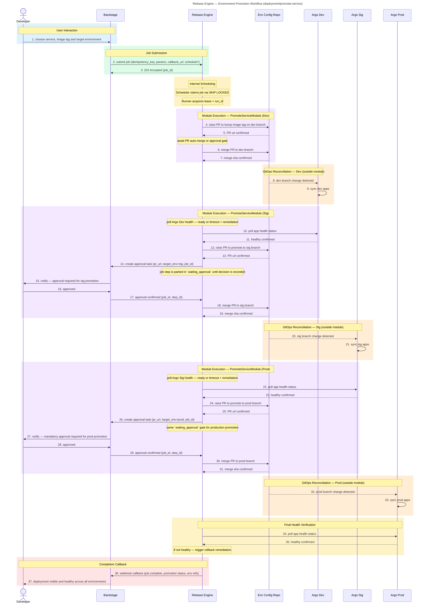

# Environment Promotion

**Audience:** Dev

## Overview

Automated multi-environment promotion pipeline (Dev → Staging → Production) driven via GitOps. Each stage raises a PR, waits for health confirmation from Argo CD, applies an approval gate, and promotes only when the previous environment is healthy.

## Purpose

What this workflow accomplishes: Automated multi-environment promotion pipeline that moves code from Dev through Staging to Production with approval gates and health checks at each stage.

## Rationale

Why this workflow exists: To eliminate ad-hoc, inconsistent deployments and replace them with a deterministic, auditable promotion process that ensures stability at each stage.

## Benefit

What value it delivers:
- No more manual deployments using inconsistent commands across teams
- Staging and Production require explicit approval before promotion
- Full traceability with commit, environment, approver, and health status
- Argo CD health checks verify stability before promotion proceeds
- GitOps-driven approach enables instant rollback via commit revert

## Release Engine Capability Mapping

- **Human in the Loop (engine-native):** staging and production gates map to `waiting_approval` steps and resume through the decisions API.
- **Recurrent jobs (optional):** promotion checks can be scheduled (for example nightly candidate promotion windows) via `schedule`.

## Value — TechOps as a Product

| Value Dimension | T-Shirt Size  | Notes |
|---|:-------------:|---|
| Speed at Scale |       L       | Automates the full promotion chain; scales to any number of services and environments. |
| Consistency & Reduced Risk |      XL       | Same promotion flow for every service; no environmental drift between stages. |
| Governance Through Code |      XL       | GitOps + approval gates ensure every promotion is auditable and controlled. |
| Developer Experience (DX) |       L       | Developers see promotion status in Backstage; approvals can be handled via PR or Backstage. |
| Clear Ownership / Fewer Hand-offs |       M       | Platform owns the promotion logic; developers trigger and approve, not execute. |

**Combined Value Score (Velocity 1):** 29/40 (L + XL + XL + L + M = 3 + 8 + 8 + 5 + 3)

---

