# Flaky Test Triage

**Audience:** Dev

## Overview

AI-assisted triage of flaky test failures in CI. The agent analyses failure patterns, generates a patch candidate, validates it deterministically, raises a GitHub issue and PR, and closes the loop when the pipeline is green. Escalates for iterative refinement if needed.

## Purpose

What this workflow accomplishes: Automated flaky test analysis, patch generation, and validation that removes the manual investigation burden from developers.

## Rationale

Why this workflow exists: To eliminate the hidden productivity tax that flaky tests impose on development teams through context switching, reruns, and investigation overhead.

## Benefit

What value it delivers:
- Developers are freed from flaky test investigation and can review a ready-made fix instead
- Works across all services and repositories simultaneously, not just for the team owning the test
- Deterministic validation gates prevent bad patches from reaching GitHub
- Human review and merge approval ensures safety
- Iterative refinement generates revised fixes automatically when initial patches fail CI

## Value — TechOps as a Product

| Value Dimension | T-Shirt Size  | Notes |
|---|:-------------:|---|
| Speed at Scale |       L       | Parallelised across all repos; triage effort scales without adding human reviewers per service. |
| Consistency & Reduced Risk |       M       | Same triage logic applied across the fleet; deterministic gates catch bad patches. |
| Governance Through Code |       M       | All patches go through PR and CI; full audit trail in GitHub issues. |
| Developer Experience (DX) |      XL       | Developers are freed from flaky test investigation; they review a ready-made fix instead. |
| Clear Ownership / Fewer Hand-offs |       M       | Platform handles triage; developers own final review and merge decision. |

**Combined Value Score (Velocity 1):** 22/40 (L + M + M + XL + M = 5 + 3 + 3 + 8 + 3)

---

```mermaid
---
title: "Release Engine — Flaky Test Triage Workflow (devops/flaky-test-triage)"
---
sequenceDiagram
    autonumber
    actor Initiator as Backstage or AIDevOps Agent UI
    actor Human as Engineer
    participant CISystem as CI System
    participant ReleaseEngine as Release Engine
    participant AIAgent as DevOps AI Agent
    participant GitHubRepo as GitHub Repo

    rect rgb(224, 242, 254)
        Note over Initiator,CISystem: Trigger — CI failure or manual submission
        CISystem->>ReleaseEngine: submit job (idempotency_key, test_report, pipeline_ref, callback_url)
        ReleaseEngine-->>CISystem: 202 Accepted (job_id)
    end

    rect rgb(254, 243, 199)
        Note over ReleaseEngine: Internal Scheduling
        Note over ReleaseEngine: Scheduler claims job via SKIP LOCKED
        Note over ReleaseEngine: Runner acquires lease + run_id
    end

    rect rgb(243, 232, 255)
        Note over ReleaseEngine,AIAgent: Phase 1 — Agent Analysis
        ReleaseEngine->>AIAgent: forward test report with failures and pipeline context
        AIAgent->>AIAgent: correlate failures across recent runs
        AIAgent->>AIAgent: detect flakiness patterns, classify severity, generate patch candidate
        AIAgent-->>ReleaseEngine: analysis result (patch_diff, confidence_score, affected_files, issue_draft)

        Note over ReleaseEngine: Deterministic Validation Gate 1 — Analysis Output
        ReleaseEngine->>ReleaseEngine: validate confidence_score against policy threshold
        ReleaseEngine->>ReleaseEngine: verify affected_files exist on target branch
        ReleaseEngine->>ReleaseEngine: verify patch applies cleanly without conflicts
        ReleaseEngine->>ReleaseEngine: verify patch scope — no unexpected deletions or out of scope changes
        ReleaseEngine->>ReleaseEngine: verify issue_draft references correct pipeline_ref and test identifiers
        ReleaseEngine->>ReleaseEngine: record validated Agent output as immutable job step

        alt validation fails
            ReleaseEngine->>AIAgent: reject with validation errors and context
            AIAgent->>AIAgent: revise analysis and patch
            AIAgent-->>ReleaseEngine: revised analysis result
            Note over ReleaseEngine: Validation Gate 1 repeats — max retry policy applies
        end
    end

    rect rgb(220, 252, 231)
        Note over ReleaseEngine,GitHubRepo: Phase 2 — Approved Writes
        ReleaseEngine->>GitHubRepo: POST /repos/{owner}/{repo}/issues (validated issue_draft, quarantine label)
        GitHubRepo-->>ReleaseEngine: 201 Created (issue_url)
        ReleaseEngine->>ReleaseEngine: record issue_url in job state

        alt confidence high enough — patch PR path
            ReleaseEngine->>GitHubRepo: POST /repos/{owner}/{repo}/git/refs (create patch branch)
            GitHubRepo-->>ReleaseEngine: 201 Created (branch_ref)
            ReleaseEngine->>GitHubRepo: PUT /repos/{owner}/{repo}/contents (commit validated patch to branch)
            GitHubRepo-->>ReleaseEngine: 200 OK (commit_sha)
            ReleaseEngine->>ReleaseEngine: record commit_sha in job state
            ReleaseEngine->>GitHubRepo: POST /repos/{owner}/{repo}/pulls (patch PR referencing issue_url)
            GitHubRepo-->>ReleaseEngine: 201 Created (pr_url)
            ReleaseEngine->>ReleaseEngine: record pr_url in job state
            ReleaseEngine->>Initiator: notify (pr_url, issue_url, awaiting human review)
        else confidence below threshold — issue only path
            ReleaseEngine->>Initiator: notify (issue_url, low confidence, human investigation required)
        end
    end

    rect rgb(255, 237, 213)
        Note over Human,GitHubRepo: Phase 3 — Human Review Gate
        Human->>GitHubRepo: review PR, request changes or approve and merge
        CISystem->>ReleaseEngine: pipeline webhook (commit_sha, pipeline_status, pipeline_ref)

        Note over ReleaseEngine: Deterministic Validation Gate 2 — Pipeline Correlation
        ReleaseEngine->>ReleaseEngine: verify inbound commit_sha matches recorded commit_sha in job state
        ReleaseEngine->>ReleaseEngine: reject webhook if SHA mismatch to prevent false positive resolution
        ReleaseEngine->>ReleaseEngine: record pipeline_status as immutable job step

        alt pipeline passing and SHA verified
            ReleaseEngine->>GitHubRepo: PATCH /repos/{owner}/{repo}/issues (close issue, add resolution comment)
            GitHubRepo-->>ReleaseEngine: 200 OK (issue closed)
            ReleaseEngine->>ReleaseEngine: record resolution as immutable job step
        else pipeline still failing
            ReleaseEngine->>AIAgent: escalate (pipeline logs, original patch diff, failure delta, prior job steps)
            AIAgent->>AIAgent: root cause analysis and revised patch generation
            AIAgent-->>ReleaseEngine: revised analysis result (revised_patch_diff, confidence_score, affected_files)

            Note over ReleaseEngine: Deterministic Validation Gate 3 — Escalation Output
            ReleaseEngine->>ReleaseEngine: repeat scope, apply, and reference validation on revised patch
            ReleaseEngine->>ReleaseEngine: verify revised patch differs meaningfully from original patch
            ReleaseEngine->>ReleaseEngine: record validated escalation output as immutable job step

            ReleaseEngine->>GitHubRepo: POST /repos/{owner}/{repo}/git/refs (create revised patch branch)
            GitHubRepo-->>ReleaseEngine: 201 Created (branch_ref)
            ReleaseEngine->>GitHubRepo: PUT /repos/{owner}/{repo}/contents (commit revised patch)
            GitHubRepo-->>ReleaseEngine: 200 OK (commit_sha)
            ReleaseEngine->>GitHubRepo: POST /repos/{owner}/{repo}/pulls (revised PR referencing issue_url)
            GitHubRepo-->>ReleaseEngine: 201 Created (revised_pr_url)
            ReleaseEngine->>Initiator: notify (revised_pr_url, escalation summary, human review required)
        end
    end

    rect rgb(255, 228, 230)
        Note over ReleaseEngine,Initiator: Completion Callback
        ReleaseEngine->>Initiator: webhook callback (job complete, issue_url, pr_url, pipeline_status, full audit trail)
        Initiator-->>Initiator: triage results, resolution, and audit trail visible in Backstage or AIDevOps Agent UI
    end
```

