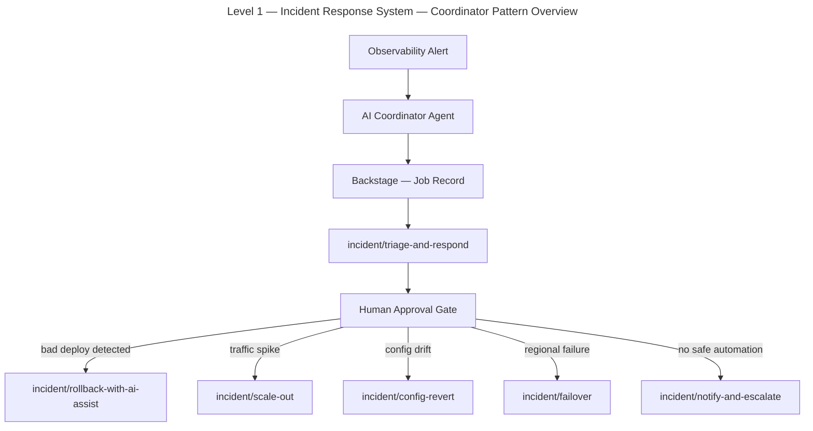
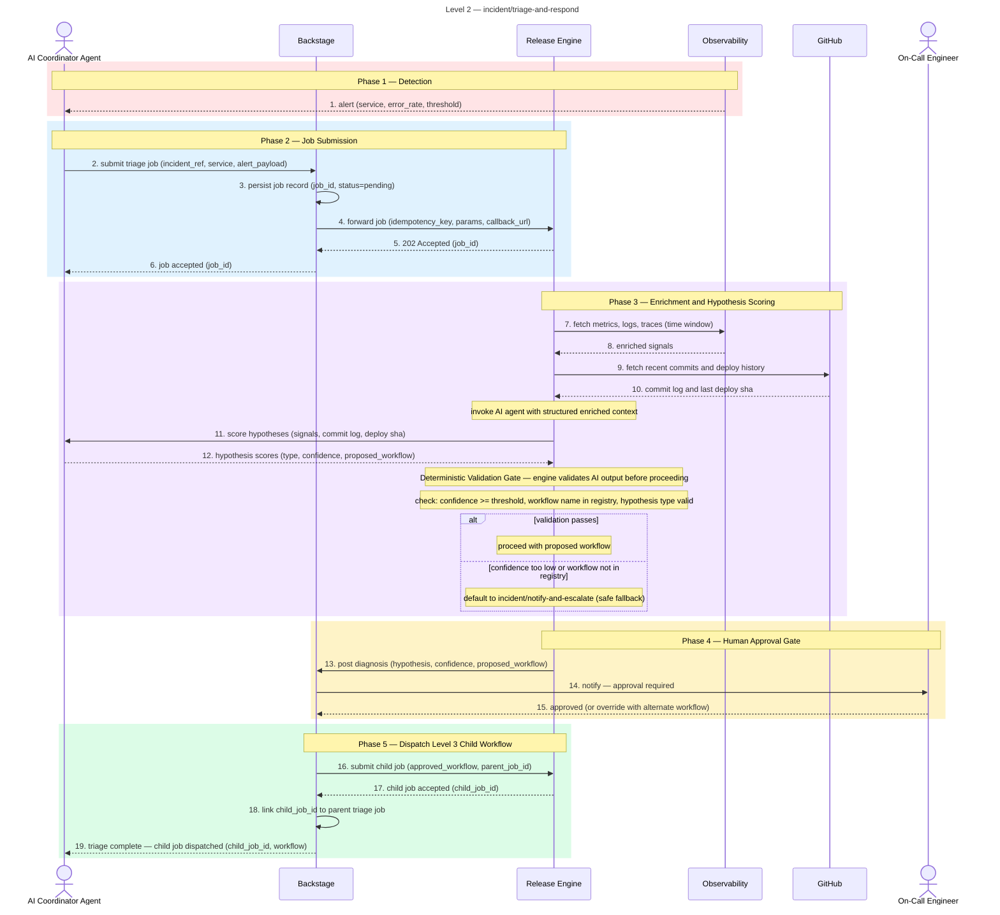
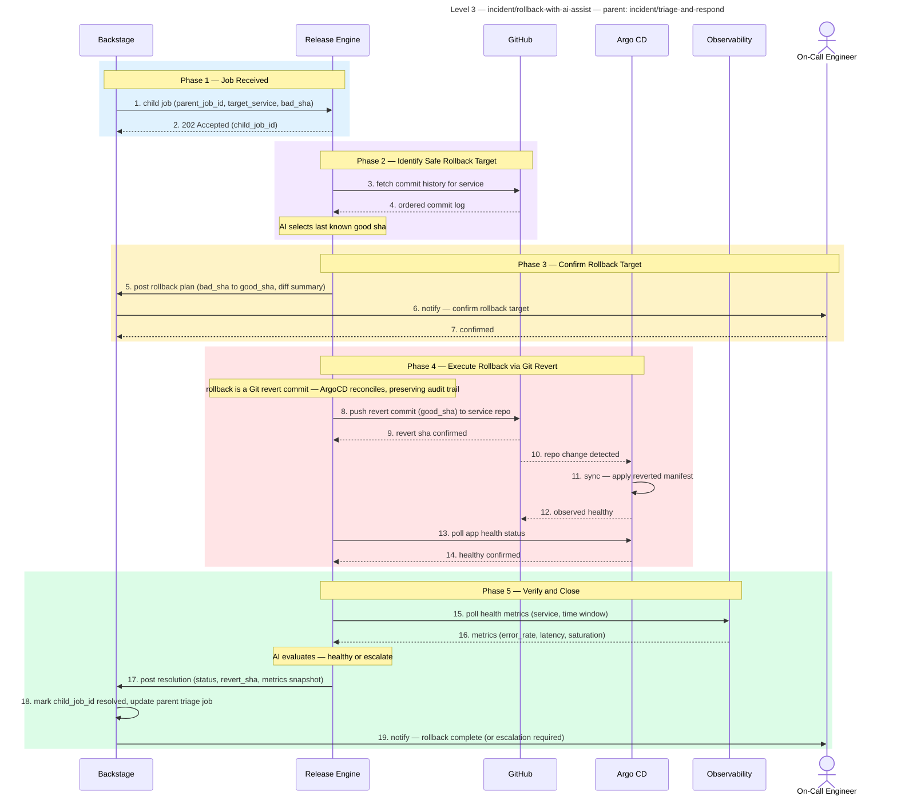
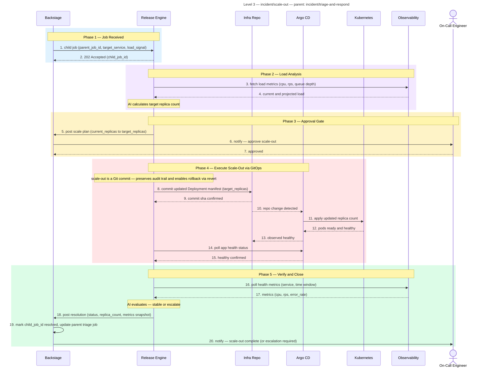
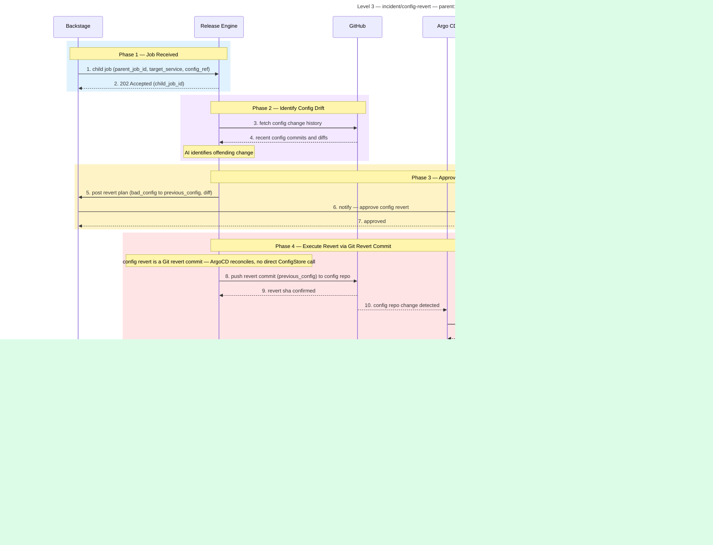
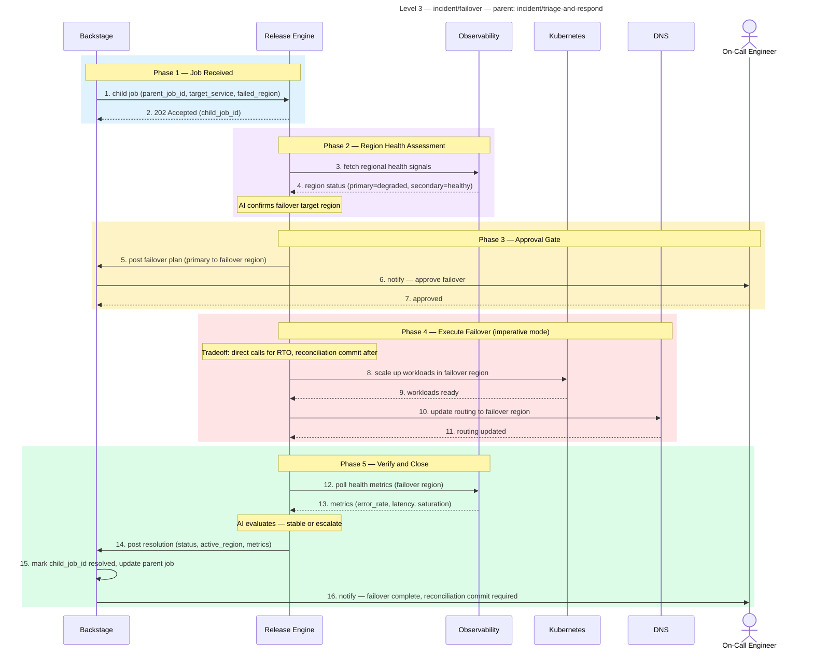
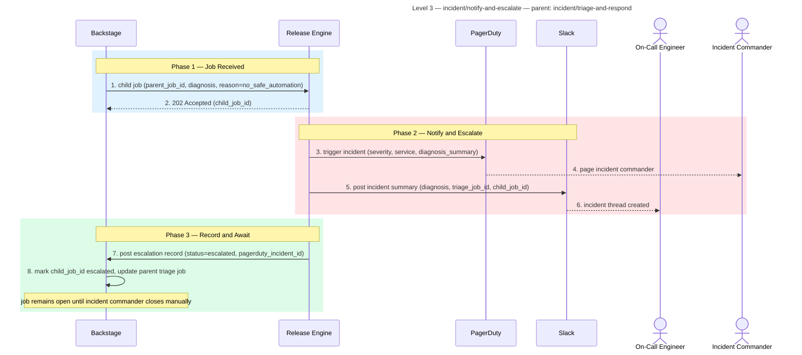

# Incident Management

**Audience:** Dev, Ops

## Overview

AI-coordinated incident response system with a three-level hierarchy — coordinator overview, triage workflow, and five specialised child workflows (rollback, scale-out, config revert, failover, escalate). Each level is self-contained and traceable via parent job IDs.

## Purpose

What this workflow accomplishes: AI-coordinated incident response that automates triage, hypothesis scoring, and remediation dispatch across a hierarchy of specialised workflows.

## Rationale

Why this workflow exists: To reduce Mean Time to Recovery (MTTR) by automating the investigative and remediation phases of incident response while preserving human oversight through approval gates.

## Benefit

What value it delivers:
- Automated triage and hypothesis scoring shortens the time from alert to resolution
- Human approval gates ensure no automated action runs without consent
- Coordinator pattern intelligently dispatches the right child workflow based on alert type
- Full traceability with parent-child job relationships enables thorough post-mortem analysis
- Self-healing workflows (rollback, scale-out, config revert, failover) provide automated remediation for common patterns

## Value — TechOps as a Product

| Value Dimension | T-Shirt Size  | Notes |
|---|:-------------:|---|
| Speed at Scale |      XL       | Coordinates response across the entire estate; parallelises triage and remediation. |
| Consistency & Reduced Risk |      XL       | Same triage logic and remediation paths applied to every incident; no ad-hoc response. |
| Governance Through Code |       L       | Human approval gates, job chaining, and audit trails ensure governance without manual oversight. |
| Developer Experience (DX) |       M       | Developers receive notifications and approve actions; the platform handles the heavy lifting. |
| Clear Ownership / Fewer Hand-offs |      XL       | Clear separation between platform (automation) and product teams (approval); no ambiguity. |

**Combined Value Score (Velocity 1):** 32/40 (XL + XL + L + M + XL = 8 + 8 + 5 + 3 + 8)

---

# AI-Assisted Release and Incident Management

## Architecture and Workflow Reference

---

### Three levels

**Level 1 — Overview diagram**
Shows the coordinator pattern end to end. No internal details. Humans and LLMs use this to understand the full shape of the system.

**Level 2 — Per workflow diagram**
One sequence diagram per workflow. Shows the steps, participants, and handoffs for that workflow only. Each Level 2 workflow may dispatch child workflows — those are Level 3.

**Level 3 — Specialised child workflow diagram**
One sequence diagram per child workflow, dispatched by a Level 2 workflow. Self-contained. References its parent by job ID. Also used for module internals when branching logic is complex enough to warrant it.

---

### Summary

| Level | Format | Purpose |
|---|---|---|
| 1 | flowchart | System shape — coordinator routes to workflows |
| 2 | sequenceDiagram | Per workflow — steps, participants, handoffs, dispatches child jobs |
| 3 | sequenceDiagram or flowchart | Child workflows dispatched by Level 2, or module internals |

---

### Rules that make diagrams digestible by both humans and LLMs

**For humans**
- Colour bands group logical phases — detection, submission, execution, approval, dispatch
- Step numbers are sequential across the full diagram
- Title includes the workflow name as registered in the Release Engine
- Level and parent reference are explicit in every Level 3 title

**For LLMs**
- Each diagram is self-contained with explicit participant names
- Notes inside `rect` blocks name the phase — LLMs use these as section anchors
- Workflow names in titles match exactly what is registered in the module registry
- Parent and child job references are explicit — LLMs can trace the chain across diagrams without ambiguity
- Level is declared in the title so an LLM knows where in the hierarchy it is reading

---

## Level 1 — Coordinator Overview



---

## Level 2 — Triage Workflow

Entry point for all incidents. Enriches the alert, scores hypotheses, gates on human approval, and dispatches one Level 3 child workflow.



---

## Level 3 — Child Workflows

Each workflow below is dispatched by `incident/triage-and-respond`. Each is self-contained and references its parent via `parent_job_id`.

---

### incident/rollback-with-ai-assist



---

### incident/scale-out



---

### incident/config-revert



---

### incident/failover



---

### incident/notify-and-escalate



---

## Hierarchy reference

```
Level 1 — Coordinator Overview
  └── Level 2 — incident/triage-and-respond
        ├── Level 3 — incident/rollback-with-ai-assist
        ├── Level 3 — incident/scale-out
        ├── Level 3 — incident/config-revert
        ├── Level 3 — incident/failover
        └── Level 3 — incident/notify-and-escalate
```

Each Level 3 workflow is self-contained. The only shared state between levels is `parent_job_id` recorded in Backstage, which allows any human or LLM to trace the full chain from alert to resolution across all three levels.