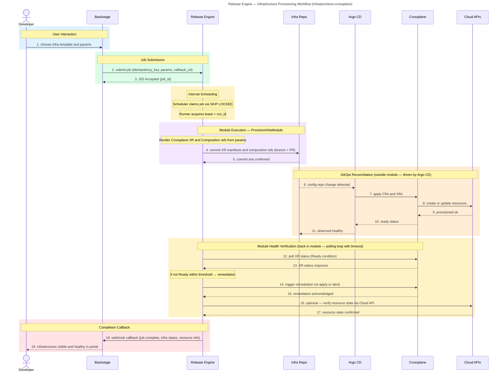

# Infrastructure Provisioning

**Audience:** Dev

## Overview

Self-service infrastructure provisioning via a Backstage template → Release Engine → Crossplane GitOps pipeline. Developers choose a template; the engine commits XR manifests; Argo CD reconciles; Crossplane provisions against Cloud APIs. Health is verified before completion.

## Purpose

What this workflow accomplishes: Self-service infrastructure provisioning that allows developers to provision cloud resources from vetted templates without manual ops involvement.

## Rationale

Why this workflow exists: To deliver the "Golden Path" for infrastructure — a pre-defined, safe, compliant way to provision resources that enforces architectural standards by default.

## Benefit

What value it delivers:
- Every provisioning request follows a pre-defined, safe path defined by TechOps
- No more tickets to TechOps for bespoke infrastructure requests
- Crossplane Compositions embed security, networking, and tagging policies automatically
- Any developer can provision infrastructure in minutes without waiting for an ops engineer
- GitOps ensures every change is version-controlled, reviewed, and traceable

## Value — TechOps as a Product

| Value Dimension | T-Shirt Size  | Notes |
|---|:-------------:|---|
| Speed at Scale |      XL       | Self-service eliminates queue time; provisioning happens in minutes, not days. |
| Consistency & Reduced Risk |      XL       | Every resource is provisioned from the same Compositions; no snowflakes. |
| Governance Through Code |      XL       | Policy-as-code in Compositions enforces compliance before resources are created. |
| Developer Experience (DX) |      XL       | Developers provision what they need from Backstage without engaging TechOps. |
| Clear Ownership / Fewer Hand-offs |      XL       | Platform owns the Compositions; developers consume self-service; clear boundary. |

**Combined Value Score (Velocity 1):** 40/40 (XL + XL + XL + XL + XL = 8 + 8 + 8 + 8 + 8)

---

