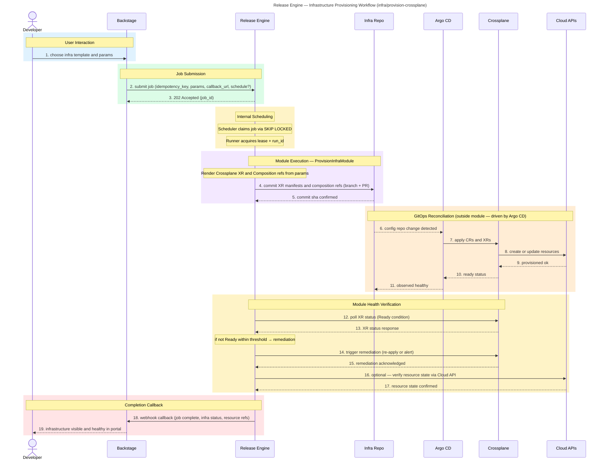

# Infrastructure Provisioning Module — Implementation Design

**Module:** `infra/provision-crossplane`
**Audience:** Dev
**Status:** Final

---

## Overview

Self-service infrastructure provisioning via a Backstage template → Release Engine → Crossplane GitOps pipeline. Developers choose a template; the engine commits XR manifests; Argo CD reconciles; Crossplane provisions against Cloud APIs. Health is verified before completion.

## Purpose

Self-service infrastructure provisioning that allows developers to provision cloud resources from vetted templates without manual ops involvement.

## Rationale

To deliver the "Golden Path" for infrastructure — a pre-defined, safe, compliant way to provision resources that enforces architectural standards by default.

## Benefit

- Every provisioning request follows a pre-defined, safe path defined by TechOps
- No more tickets to TechOps for bespoke infrastructure requests
- Crossplane Compositions embed security, networking, and tagging policies automatically
- Any developer can provision infrastructure in minutes without waiting for an ops engineer
- GitOps ensures every change is version-controlled, reviewed, and traceable

## Release Engine Capability Mapping

- **Human in the Loop (optional):** for high-blast-radius templates, insert an explicit `waiting_approval` step before committing manifests.
- **Recurrent jobs (optional):** generally on-demand, but can run with `schedule` for periodic drift-probe or reconciliation workflows.

## Value — TechOps as a Product

| Value Dimension | T-Shirt Size | Notes |
|---|:---:|---|
| Speed at Scale | XL | Self-service eliminates queue time; provisioning happens in minutes, not days. |
| Consistency & Reduced Risk | XL | Every resource is provisioned from the same Compositions; no snowflakes. |
| Governance Through Code | XL | Policy-as-code in Compositions enforces compliance before resources are created. |
| Developer Experience (DX) | XL | Developers provision what they need from Backstage without engaging TechOps. |
| Clear Ownership / Fewer Hand-offs | XL | Platform owns the Compositions; developers consume self-service; clear boundary. |

**Combined Value Score (Velocity 1):** 40/40

---

## Workflow Sequence



---

## Module Implementation

### Location

```
internal/module/infraprovision/
├── module.go          # Module struct, Key(), Version(), Execute()
├── render.go          # Manifest rendering logic
└── module_test.go     # Tests with mock StepAPI
```

### Registration

In `cmd/release-engine/main.go`, register the module with the module registry so the runner can resolve `infra/provision-crossplane` to this implementation.

### Interface

Implements `registry.Module`:

```go
type ProvisionInfraModule struct{}

func (m *ProvisionInfraModule) Key() string     { return "infra/provision-crossplane" }
func (m *ProvisionInfraModule) Version() string  { return "1.0.0" }
func (m *ProvisionInfraModule) Execute(ctx context.Context, api any, params map[string]any) error {
    // procedural step execution via StepAPI
}
```

### Connectors Used

| Connector | Operations | Purpose |
|---|---|---|
| `github` | `create-commit` or `create-pull-request` | Commit rendered manifests to infra repo |
| `crossplane` | `get-resource-status` | Poll XR for Ready condition |
| `aws` | `describe-resource` | Optional cloud-side verification |

---

## Execute Flow

### Step 1: Render Manifests

```go
stepAPI.BeginStep("render-manifests")

manifests, err := renderCrossplaneXR(params)
if err != nil {
    return stepAPI.FailStep(err)
}

stepAPI.CompleteStep(map[string]any{"manifests": manifests})
```

Renders Crossplane XR YAML from job parameters using Go templates and `gopkg.in/yaml.v3` for marshaling. Inputs: `template_name`, `composition_ref`, `parameters`. Output: rendered YAML stored in step context.

### Step 2: Commit to Git

```go
stepAPI.BeginStep("commit-to-git")

result, err := stepAPI.CallConnector("github", "create-commit", map[string]any{
    "repo":    params["git_repo"],
    "branch":  params["git_branch"],
    "path":    manifestPath,
    "content": manifests,
    "message": fmt.Sprintf("provision %s via job %s", params["template_name"], params["job_id"]),
})
if err != nil {
    return stepAPI.FailStep(err)
}

stepAPI.CompleteStep(result) // result contains commit_sha
```

Uses the GitHub connector. Whether this creates a direct commit or a PR is determined by the `git_strategy` parameter (default: direct commit).

### Step 3: Poll Crossplane for Ready

```go
stepAPI.BeginStep("wait-for-ready")

timeout := parseDurationOrDefault(params["poll_timeout"], 10*time.Minute)
interval := 30 * time.Second
deadline := time.Now().Add(timeout)

for time.Now().Before(deadline) {
    result, err := stepAPI.CallConnector("crossplane", "get-resource-status", map[string]any{
        "resource_ref": params["composition_ref"],
        "namespace":    params["namespace"],
    })
    if err != nil {
        return stepAPI.FailStep(err)
    }

    if result["status"] == "Ready" {
        stepAPI.CompleteStep(result)
        goto verification
    }

    select {
    case <-ctx.Done():
        return stepAPI.FailStep(ctx.Err())
    case <-time.After(interval):
    }
}
return stepAPI.FailStep(fmt.Errorf("crossplane XR not ready within %s", timeout))

verification:
```

Polls with fixed interval. Respects context cancellation. Fails the step on timeout — no automatic rollback; resources are left for manual inspection per GitOps principles.

### Step 4: Optional Cloud Verification

```go
if params["verify_cloud"] == true {
    stepAPI.BeginStep("verify-cloud-resource")

    result, err := stepAPI.CallConnector("aws", "describe-resource", map[string]any{
        "resource_id":   previousResult["resource_id"],
        "resource_type": params["cloud_resource_type"],
    })
    if err != nil {
        return stepAPI.FailStep(err)
    }

    stepAPI.CompleteStep(result)
}
```

Skipped entirely unless `verify_cloud` is explicitly `true`. Calls the AWS connector to confirm the resource exists and is in the expected state.

### Step 5: Completion Callback

```go
stepAPI.BeginStep("notify-completion")

err := stepAPI.CallConnector("outbox", "emit-event", map[string]any{
    "callback_url": params["callback_url"],
    "payload": map[string]any{
        "job_id":       params["job_id"],
        "status":       "completed",
        "commit_sha":   commitResult["sha"],
        "resource_refs": xrResult["resource_refs"],
    },
})
if err != nil {
    return stepAPI.FailStep(err)
}

stepAPI.CompleteStep(nil)
return nil
```

Delivers completion webhook via the outbox system. Backstage receives the callback and updates the developer portal.

---

## Parameters

| Parameter | Type | Required | Default | Description |
|---|---|---|---|---|
| `template_name` | string | yes | — | Crossplane XR template to render |
| `composition_ref` | string | yes | — | Crossplane Composition reference |
| `parameters` | map | yes | — | Template parameter values |
| `git_repo` | string | yes | — | Target infra Git repository |
| `git_branch` | string | no | `main` | Target branch |
| `git_strategy` | string | no | `commit` | `commit` or `pull-request` |
| `namespace` | string | no | `default` | Kubernetes namespace for XR |
| `poll_timeout` | string | no | `10m` | Timeout for Crossplane readiness |
| `verify_cloud` | bool | no | `false` | Run cloud API verification step |
| `callback_url` | string | no | — | Webhook URL for completion notification |
| `require_approval` | bool | no | `false` | Gate on human approval before commit |

---

## Error Handling

| Error Type | Behavior | Rationale |
|---|---|---|
| Parameter validation failure | Terminal failure, clear error message | Bad input; retrying won't help |
| GitHub connector error (auth, network) | Retryable per connector retry policy | Transient infrastructure issue |
| GitHub connector error (repo not found) | Terminal failure | Configuration error |
| Crossplane poll timeout | Terminal failure, resources left in place | GitOps principle: don't delete what Git declares; manual intervention required |
| Crossplane connector error | Retryable per connector retry policy | Transient API issue |
| AWS verification failure | Terminal failure with resource state in output | Resource exists but in unexpected state; needs investigation |
| Context cancellation | Immediate return with context error | Runner is shutting down or lease expired |
| Callback delivery failure | Handled by outbox retry mechanism | Outbox manages its own delivery guarantees |

---

## Testing

### Unit Tests (`module_test.go`)

- **Mock StepAPI**: Verify correct sequence of `BeginStep` → `CallConnector` → `CompleteStep` calls
- **Render logic**: Verify YAML output for known template inputs
- **Polling behavior**: Verify timeout enforcement, context cancellation
- **Conditional steps**: Verify cloud verification is skipped when `verify_cloud` is false
- **Error propagation**: Verify `FailStep` is called with correct errors for each failure mode

### Integration Tests

- **With mock connectors**: Full `Execute()` call with stubbed connector responses
- **Happy path**: All steps succeed, callback delivered
- **Timeout path**: Crossplane never returns Ready, verify timeout behavior
- **Approval gate**: Verify execution pauses when `require_approval` is true