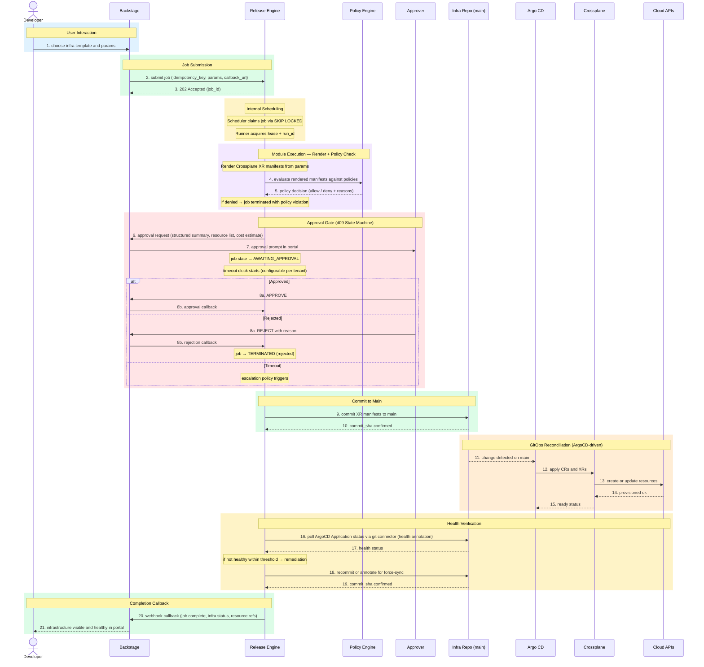
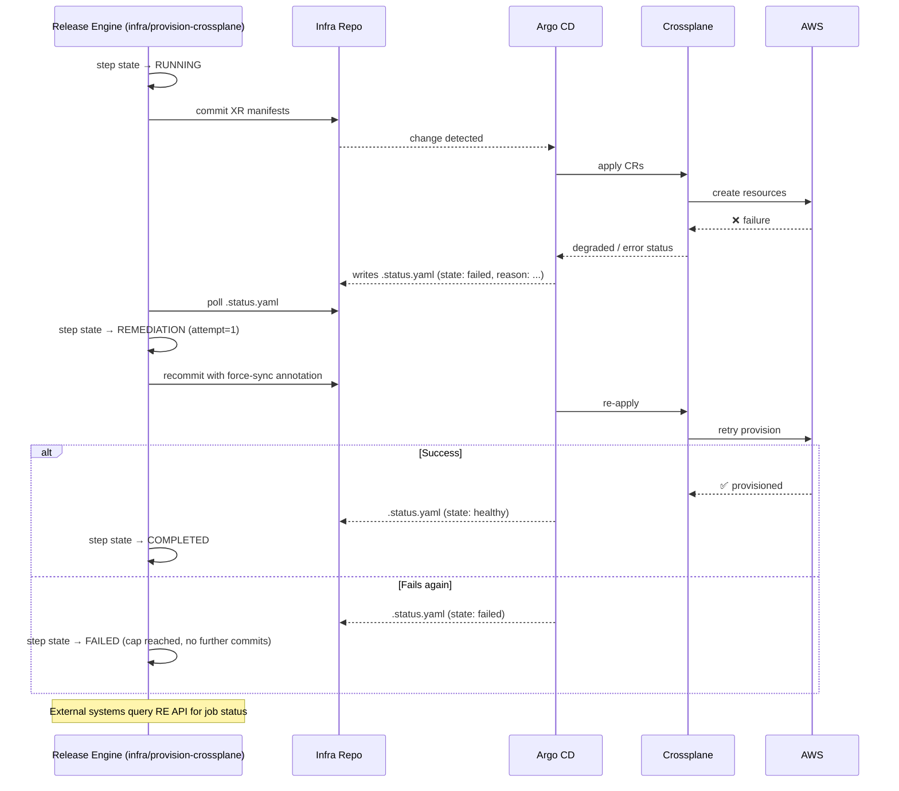

# Infrastructure Provisioning Module — Implementation Design

## Overview

Self-service infrastructure provisioning via a Backstage template → Release Engine → Crossplane GitOps pipeline. Developers choose a template; the engine commits XR manifests; Argo CD reconciles; Crossplane provisions against Cloud APIs. Health is verified before completion.

## Purpose

Self-service infrastructure provisioning that allows developers to provision cloud resources from vetted templates without manual ops involvement.

## Rationale

To deliver the "Golden Path" for infrastructure — a pre-defined, safe, compliant way to provision resources that enforces architectural standards by default.

## Benefit

- Every provisioning request follows a pre-defined, safe path defined by TechOps
- No more tickets to TechOps for bespoke infrastructure requests
- Crossplane Compositions embed security, networking, and tagging policies automatically
- Any developer can provision infrastructure in minutes without waiting for an ops engineer
- GitOps ensures every change is version-controlled, reviewed, and traceable

## Release Engine Capability Mapping

- **Human in the Loop (optional):** for high-blast-radius templates, insert an explicit `waiting_approval` step before committing manifests.
- **Recurrent jobs (optional):** generally on-demand, but can run with `schedule` for periodic drift-probe or reconciliation workflows.

## Value — TechOps as a Product

| Value Dimension | T-Shirt Size | Notes |
|---|:---:|---|
| Speed at Scale | XL | Self-service eliminates queue time; provisioning happens in minutes, not days. |
| Consistency & Reduced Risk | XL | Every resource is provisioned from the same Compositions; no snowflakes. |
| Governance Through Code | XL | Policy-as-code in Compositions enforces compliance before resources are created. |
| Developer Experience (DX) | XL | Developers provision what they need from Backstage without engaging TechOps. |
| Clear Ownership / Fewer Hand-offs | XL | Platform owns the Compositions; developers consume self-service; clear boundary. |

**Combined Value Score (Velocity 1):** 40/40

---

## Workflow Sequence

## Failure Handling

---

## Design Decisions

| Decision | Rationale |
|---|---|
| No PRs or branches | Infra repo is engine-managed; PRs add untracked state outside the job state machine |
| Approval via d09 gate, not GitHub reviewers | Enforces timeout, escalation, policy, and full audit inside the engine |
| Policy evaluation before approval | Approvers see a pre-validated request; policy violations never reach a human |
| Health verification via git, not direct Crossplane API | Maintains the principle that the engine's only interface to the GitOps layer is Git; ArgoCD writes health status back to the repo as annotations or status files |
| Remediation is recommit or force-sync annotation | The engine never talks to Crossplane or ArgoCD directly; it nudges the GitOps loop through Git |
