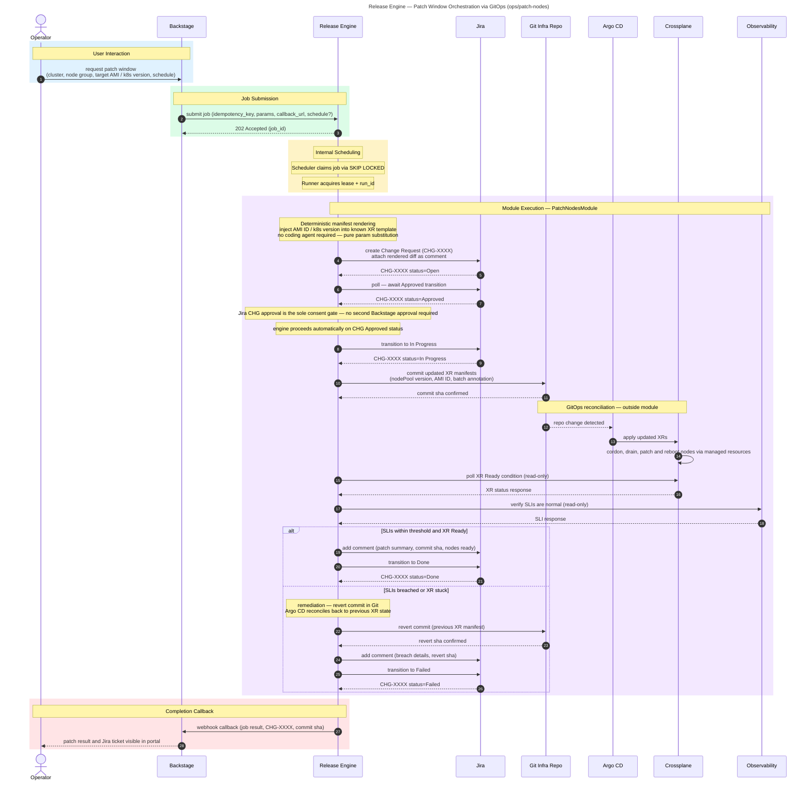

# Patch Window Orchestration

**Audience:** Ops

## Overview

Automated node patching workflow with full change-management integration. Renders updated XR manifests for AMI/k8s version upgrades, gates on a Jira CHG approval, commits via GitOps, monitors SLIs during rollout, and auto-reverts on breach.

## Purpose

What this workflow accomplishes: Automated node patching that orchestrates the full patch lifecycle from approval through execution to verification, with automatic rollback on SLI breach.

## Rationale

Why this workflow exists: To transform high-risk, frequent node patching from a manual, error-prone task into a deterministic, auditable, self-healing process.

## Benefit

What value it delivers:
- Node patching becomes deterministic automation instead of manual, high-risk intervention
- Jira CHG approval gates ensure compliance with change management policy
- Automatic rollback preserves service stability if SLIs degrade during patching
- Full audit trail with Jira ticket, commit SHA, and SLI snapshots
- Zero manual intervention after approval — the workflow runs to completion autonomously

## Release Engine Capability Mapping

- **Approval model:** this workflow uses an **external** approval source (Jira CHG) rather than engine-native `waiting_approval`.
- **Recurrent jobs (optional):** patch windows can be submitted with `schedule` for pre-approved recurring maintenance windows.

## Value — TechOps as a Product

| Value Dimension | T-Shirt Size  | Notes |
|---|:-------------:|---|
| Speed at Scale |       L       | Parallel node patching across clusters; scales with cluster count, not manual effort. |
| Consistency & Reduced Risk |       L       | Same patch process every time; auto-rollback reduces blast radius. |
| Governance Through Code |      XL       | Jira integration + GitOps + SLI monitoring ensures change governance without manual oversight. |
| Developer Experience (DX) |       M       | Limited direct DX impact; primarily an ops workflow, but operators benefit from automation. |
| Clear Ownership / Fewer Hand-offs |       L       | Platform owns the automation; operators approve via Jira, not execute patches manually. |

**Combined Value Score (Velocity 1):** 26/40 (L + L + XL + M + L = 5 + 5 + 8 + 3 + 5)

---

