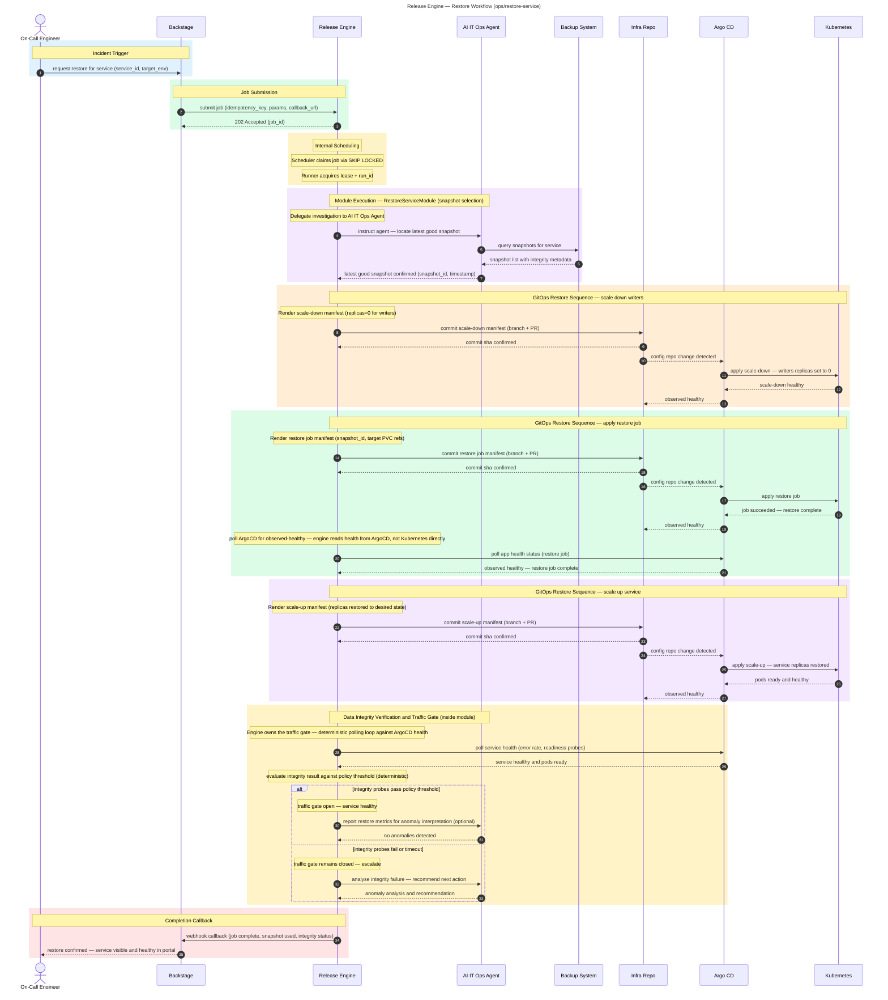

# Restore Workflow

**Audience:** Ops

## Overview

Incident-driven service restore workflow. An AI agent locates the latest valid snapshot; the engine orchestrates a GitOps sequence to scale down writers, apply the restore job, scale services back up, and verify data integrity before reopening traffic.

## Purpose

What this workflow accomplishes: Automated service restore that locates the latest valid snapshot, orchestrates the full restore sequence, and verifies data integrity before reopening traffic.

## Rationale

Why this workflow exists: To reduce Recovery Time Objective (RTO) by eliminating manual restore steps during incident response and ensuring data integrity before traffic is reopened.

## Benefit

What value it delivers:
- Automated orchestration eliminates manual steps during high-pressure incidents
- AI-powered snapshot selection guarantees the best available restore point
- Traffic gate prevents reopening until data integrity is confirmed
- GitOps-driven sequence provides complete audit trail and easy rollback
- Deterministic process removes the chance of human error during incident response

## Value — TechOps as a Product

| Value Dimension | T-Shirt Size  | Notes |
|---|:-------------:|---|
| Speed at Scale |       M       | Restore is inherently sequential; scaling comes from automated orchestration, not parallelism. |
| Consistency & Reduced Risk |      XL       | Same restore sequence every time; integrity checks prevent partial or corrupted restores. |
| Governance Through Code |       M       | GitOps ensures every restore step is version-controlled and reviewable. |
| Developer Experience (DX) |       M       | Developers can trigger restores via Backstage; less reliance on on-call ops experts. |
| Clear Ownership / Fewer Hand-offs |       M       | Platform owns the restore automation; on-call engineers trigger, not execute manually. |

**Combined Value Score (Velocity 1):** 20/40 (M + XL + M + M + M = 3 + 8 + 3 + 3 + 3)

---

