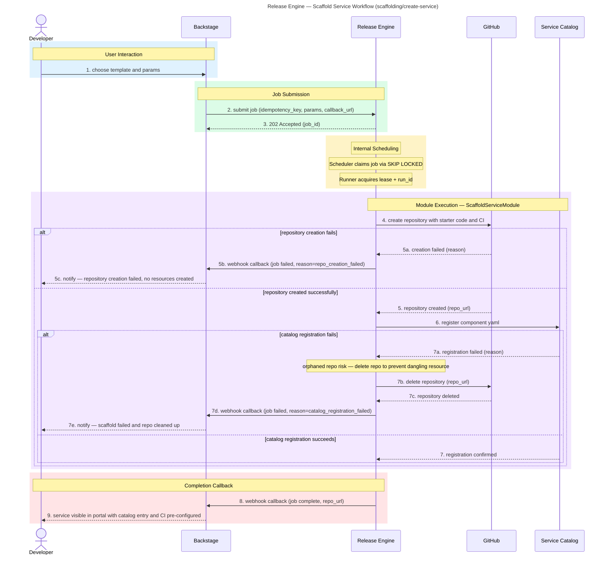

# Scaffold Service

**Audience:** Dev

## Overview

Golden Path workflow for creating new services. A developer selects a template in Backstage; the engine creates a GitHub repository with starter code and CI pre-configured, then registers the component in the Service Catalog — all in a single automated operation.

## Purpose

What this workflow accomplishes: Automated service scaffolding that creates a GitHub repository with starter code, CI pipelines, and Service Catalog registration from a single Backstage request.

## Rationale

Why this workflow exists: To eliminate inconsistency at birth — ensuring every new service starts with vetted defaults, compliant CI, and proper catalog registration rather than a blank slate.

## Benefit

What value it delivers:
- Every new service starts with the right CI, structure, and defaults — no snowflakes
- Developers spin up fully compliant services in minutes, not days
- New services are automatically registered in the Service Catalog for discoverability and observability
- Templates include linting, testing, security scanning, and deployment pipelines by default
- Developers create services without any hand-offs to TechOps or platform teams

## Value — TechOps as a Product

| Value Dimension | T-Shirt Size  | Notes |
|---|:-------------:|---|
| Speed at Scale |      XL       | New services can be created in minutes; scales to any number of teams. |
| Consistency & Reduced Risk |      XL       | Every service starts from a vetted template; no snowflakes or missing defaults. |
| Governance Through Code |       L       | Templates are version-controlled; changes propagate to all new services. |
| Developer Experience (DX) |      XL       | Developers create services from Backstage with one click; immediate productivity. |
| Clear Ownership / Fewer Hand-offs |       L       | Platform owns templates; developers consume self-service; no ticket required. |

**Combined Value Score (Velocity 1):** 34/40 (XL + XL + L + XL + L = 8 + 8 + 5 + 8 + 5)

---

