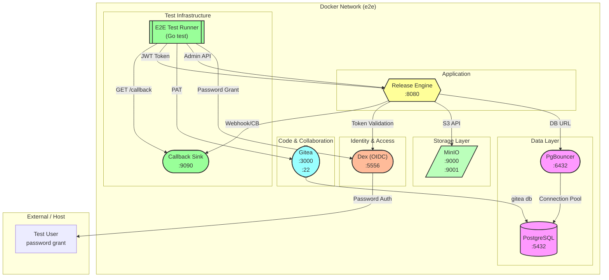
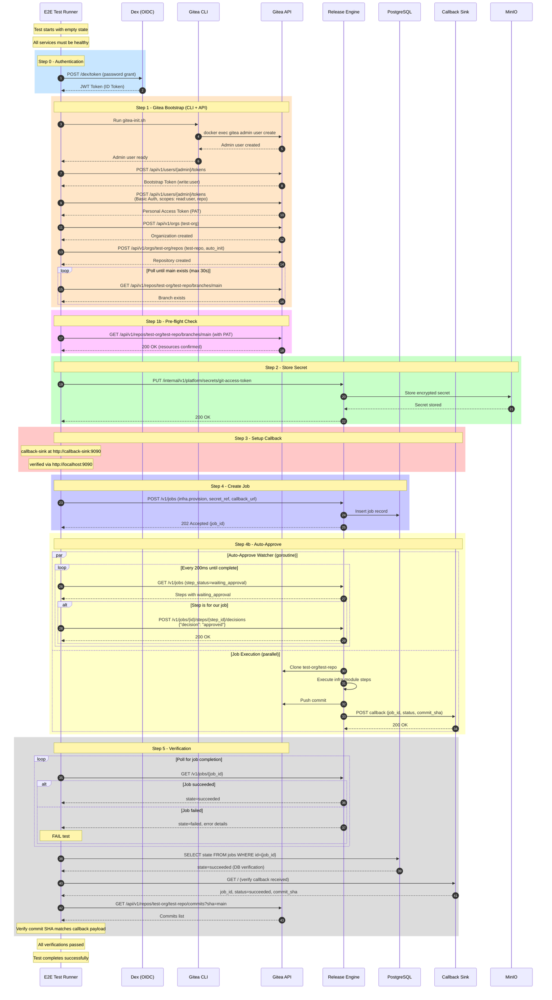
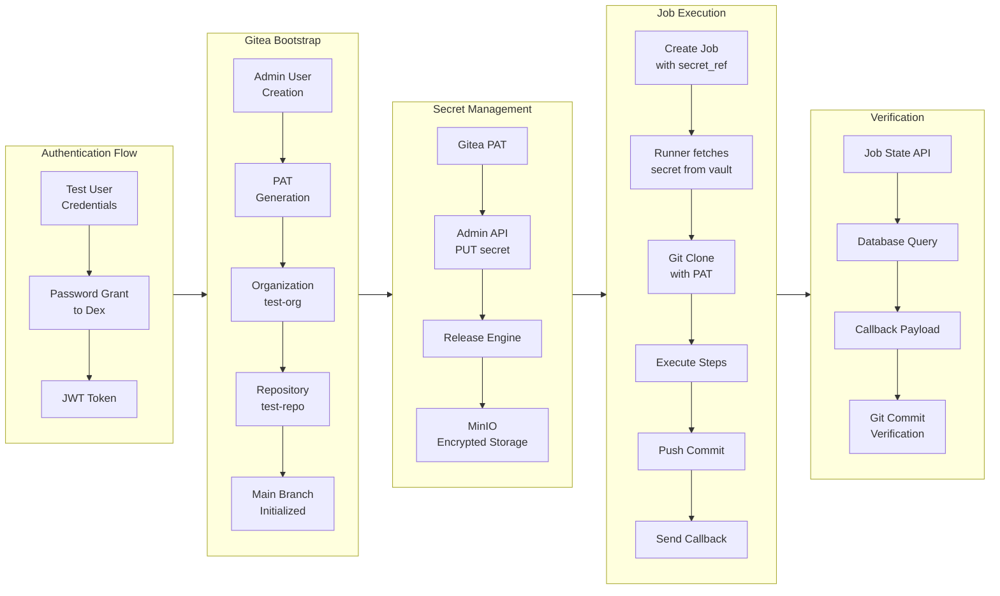

# End-to-End (E2E) Testing Infrastructure

This directory contains the infrastructure and test code for running end-to-end integration tests against the Release Engine.

## Overview

The E2E test validates the complete flow from authentication through job execution, verifying:
- OIDC authentication via Dex
- Gitea integration (PAT, org, repo creation)
- Platform secret storage
- Job creation and execution
- Approval step automation
- Callback handling
- Git commit verification

## Architecture



## Services

| Service | Image | Ports | Purpose                                           |
|---------|-------|-------|---------------------------------------------------|
| **postgres** | postgres:15-alpine | 5432 | Primary database for Release Engine               |
| **pgbouncer** | edoburu/pgbouncer:latest | 6432 | Connection pooler for database                    |
| **minio** | minio/minio:latest | 9000, 9001 | S3-compatible object storage for secrets vault    |
| **gitea** | gitea/gitea:1.21 | 3000, 2222 | Git server (Code repositories for infrastructure) |
| **dex** | ghcr.io/dexidp/dex:v2.38.0 | 5556 | OIDC provider for authentication                  |
| **release-engine** | (builds from Dockerfile) | 8080 | The application being tested                      |
| **callback-sink** | python:3.12-alpine | 9090 | HTTP server to capture webhook callbacks          |

## Bootstrap Sequence Diagram

The following diagram shows the step-by-step flow of the E2E bootstrap process:

### Step-by-Step Explanation

| Step | Name | Participants | Description |
|------|------|--------------|-------------|
| **0** | Authentication | E2E Test Runner → Dex | The E2E test runner authenticates with Dex (OIDC provider) using password grant flow to obtain a JWT ID token. This token is used for subsequent Release Engine API calls. |
| **1** | Gitea Bootstrap | E2E → CLI → Gitea | Creates the initial Gitea infrastructure: (1) Runs `gitea-init.sh` to create an admin user, (2) Creates a bootstrap token with `write:user` scope, (3) Creates a Personal Access Token (PAT) with `read:user` and `repo` scopes, (4) Creates the `test-org` organization, (5) Creates the `test-repo` repository with `auto_init=true`, (6) Polls until the main branch exists (max 30s). |
| **1b** | Pre-flight Check | E2E → Gitea | Verifies the repository is accessible by fetching the main branch using the PAT. Confirms all Gitea resources are properly initialized before proceeding. |
| **2** | Store Secret | E2E → Release Engine → MinIO | The E2E test stores the Gitea PAT securely in the Release Engine's secrets vault. The API call `PUT /internal/v1/platform/secrets/git-access-token` triggers encryption and storage in MinIO. |
| **3** | Setup Callback | E2E → Callback Sink | Verifies the callback-sink service is running and accessible at port 9090. This service will capture webhook callbacks from the Release Engine when jobs complete. |
| **4** | Create Job | E2E → Release Engine → DB | Creates a new job using the `infra.provision` module, referencing the stored secret (`secret_ref`) and providing the callback URL (`http://callback-sink:9090`). Returns 202 Accepted with a job ID. |
| **4b** | Auto-Approve | E2E ↔ Release Engine | Runs in parallel with job execution: (1) An auto-approve watcher polls every 200ms for steps in `waiting_approval` state and approves them, (2) The job runner clones the repo, executes module steps, pushes commits, and sends callbacks. |
| **5** | Verification | E2E → RE → DB → CB → Gitea | Final validation: (1) Polls job status until completion, (2) Queries PostgreSQL directly to verify job state, (3) Fetches callback payload from sink, (4) Verifies the commit SHA in Gitea matches the callback payload. |




## Data Flow Diagram



## Environment Variables

The E2E tests are configured via environment variables with sensible defaults:

| Variable | Default | Description |
|----------|---------|-------------|
| `RELEASE_ENGINE_URL` | http://localhost:8080 | Release Engine API URL |
| `GITEA_URL` | http://localhost:3000 | Gitea API URL |
| `DEX_URL` | http://localhost:5556 | Dex OIDC URL |
| `TENANT_ID` | test-tenant | Tenant identifier |
| `OIDC_CLIENT_ID` | release-engine | OIDC client ID |
| `OIDC_CLIENT_SECRET` | example-secret | OIDC client secret |
| `TEST_USERNAME` | test-user@example.com | Test user for authentication |
| `TEST_PASSWORD` | password | Test user password |
| `GITEA_ADMIN_USER` | gitadmin | Gitea admin username |
| `GITEA_ADMIN_PASSWORD` | admin-password | Gitea admin password |
| `TEST_TIMEOUT` | 5m | Overall test timeout |
| `JOB_EXECUTION_TIMEOUT` | 45s | Maximum time for job execution |
| `API_CLIENT_TIMEOUT` | 30s | HTTP client timeout for API calls |

## Running the Tests

### Prerequisites

1. **Docker and Docker Compose** must be installed and running
2. **Go 1.21+** must be installed for running the tests
3. **Make** must be available

### Run the E2E Tests

Use the `test-e2e` Makefile target from the project root. This target handles:
- Tearing down any previous Docker Compose services
- Building the Release Engine Linux binary
- Building and starting all Docker Compose services
- Running the E2E tests
- Cleaning up Docker Compose services

```bash
# Run E2E tests
make test-e2e

# Run with coverage (generates coverage report in coverage/e2e.cover.out)
make test-e2e COVER=1

# Run configuration tests (no services required)
go test -tags=e2e ./e2e/bootstrap -run TestE2EConfigDefaults -v
go test -tags=e2e ./e2e/bootstrap -run TestE2EConfigOverrides -v
```

## Test Structure

```
e2e/
├── README.md                    # This file
├── docker-compose.yml           # Service definitions
├── .env                         # Environment defaults
├── .gitignore                   # Ignore test artifacts
├── bootstrap/                   # Go test code
│   ├── e2e.go                   # Main bootstrap orchestration
│   ├── e2e_test.go             # Test definitions
│   ├── gitea.go                # Gitea client and bootstrap
│   ├── gitea_cli.go            # Gitea CLI wrapper
│   ├── gitea_test.go           # Gitea client tests
│   └── oidc.go                 # OIDC client (Dex)
├── configs/                     # Service configurations
│   ├── dex/config.yaml         # Dex OIDC configuration
│   ├── gitea/app.ini           # Gitea configuration
│   ├── minio/                   # MinIO configuration
│   ├── pgbouncer/              # PgBouncer configuration
│   └── postgres/               # PostgreSQL init scripts
└── scripts/                     # Utility scripts
    └── gitea-init.sh           # Gitea admin user creation
```

## Key Test Assertions

The E2E test verifies:

1. **Authentication**: JWT token obtained successfully from Dex
2. **Gitea Bootstrap**: Admin user, PAT, org, and repo created
3. **Secret Storage**: PAT stored securely via Admin API
4. **Job Creation**: Job created with secret reference
5. **Auto-Approval**: Approval steps automatically approved
6. **Job Execution**: Job reaches "succeeded" state
7. **Database State**: Job state persisted correctly
8. **Callback Received**: Webhook callback captured by sink
9. **Git Verification**: Commit made to repository with correct SHA

## Troubleshooting

### Services not healthy

```bash
# Check service logs
docker compose logs postgres
docker compose logs gitea
docker compose logs dex

# Restart specific service
docker compose restart release-engine
```

### Test times out

```bash
# Increase timeouts
export TEST_TIMEOUT=15m
export JOB_EXECUTION_TIMEOUT=3m

# Or check if services are under heavy load
docker stats
```

### Gitea admin user creation fails

```bash
# Check if Gitea is fully initialized
docker compose exec gitea bash -c "gitea admin user list --config /data/gitea/conf/app.ini"

# Manually create admin via API
curl -X POST http://localhost:3000/api/v1/admin/users \
  -H "Content-Type: application/json" \
  -d '{"username":"gitadmin","email":"gitadmin@local.dev","password":"admin-password"}'
```

### Callback not received

```bash
# Check callback-sink is running
docker compose logs callback-sink

# Manually test callback sink
curl -X POST http://localhost:9090 -d '{"test":"data"}'
curl http://localhost:9090