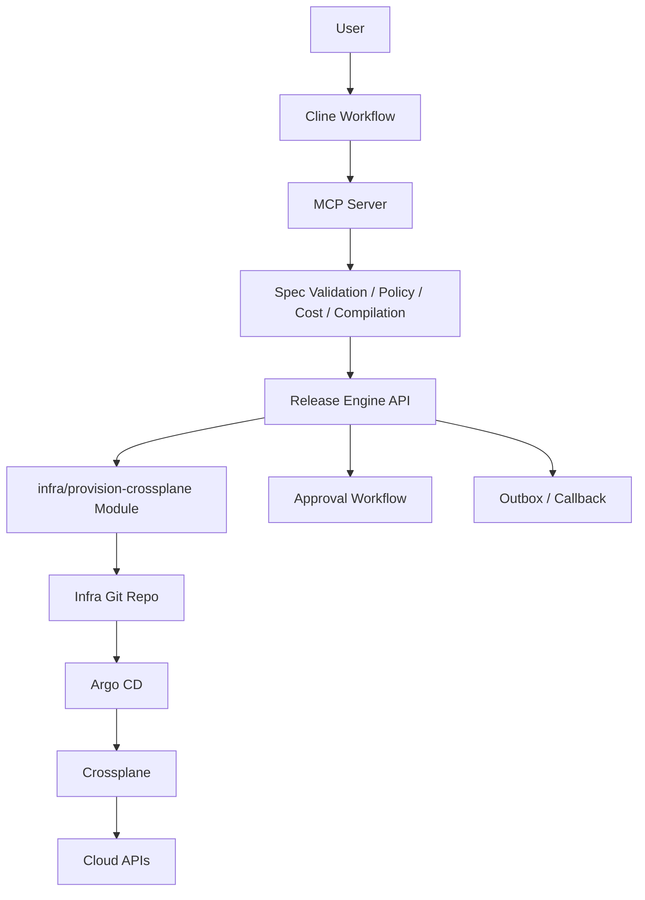

# RFC: Agent-Assisted Intent-Based Infrastructure Provisioning for Release Engine

---

## 1. Executive Summary

This RFC proposes an **agent-assisted infrastructure request flow** in which a user works through an **agentic client** such as Cline, the client talks to an **MCP server**, and the MCP server validates and compiles a **structured infrastructure intent spec** into a standard Release Engine job targeting `modules/infra`. The Release Engine remains the durable execution and approval backend; it does **not** become a general-purpose infrastructure modeling engine. That boundary is important because Release Engine modules are intentionally orchestration-only, compiled into the monolith, and all side effects must flow through the engine `StepAPI` and connectors. ([raw.githubusercontent.com](https://raw.githubusercontent.com/gatblau/release-engine/main/docs/design/d02.md))

The key idea is:

- **Users express intent**
- **The MCP layer validates and compiles intent**
- **Release Engine executes the approved golden path**
- **Crossplane/GitOps still does the actual provisioning**

This approach improves flexibility for complex requests without breaking the current architectural constraints of Release Engine. ([github.com](https://github.com/gatblau/release-engine))

---

## 2. Problem Statement

The current `modules/infra` design is strong for a **golden-path, template-driven** provisioning model: a caller submits a template name (catalogue item) plus parameters, Release Engine renders an XR manifest, optionally pauses for approval, commits to Git, waits for Crossplane readiness, optionally verifies cloud state, and emits completion status. That aligns well with the existing Release Engine model of deterministic job submission, durable execution, approval handling, and connector-mediated side effects. ([raw.githubusercontent.com](https://raw.githubusercontent.com/gatblau/release-engine/main/docs/design/d04.md))

However, for broader adoption, especially where teams need infrastructure beyond a small number of pre-baked cases, the current interface is too narrow:

- it assumes the user already knows which vetted template to choose,
- it puts burden on the user to understand parameter shape,
- it does not naturally support iterative requirement discovery,
- and it does not provide a structured abstraction for “I need a secure production analytics platform” style requests.

The risk is that teams needing anything outside simple cases fall back to tickets, custom pipelines, or direct infra tooling, reducing platform adoption.

---

## 3. Goals

### Primary Goals

1. **Increase provisioning flexibility** without turning Release Engine into Terraform/Pulumi/Crossplane itself.
2. Allow users to request infrastructure using a **structured, intent-based YAML specification**.
3. Enable **agent-assisted request authoring** using Cline workflows.
4. Preserve Release Engine’s existing strengths:
    - durable job intake,
    - approval workflows,
    - connector-based side effects,
    - idempotent execution,
    - auditability,
    - GitOps integration. ([github.com](https://github.com/gatblau/release-engine))

### Secondary Goals

- improve developer experience,
- centralize policy validation,
- keep the platform extensible across multiple clients,
- support future portal, CLI, or pipeline-based consumers.

---

## 4. Non-Goals

This proposal does **not** aim to:

1. make Release Engine a general IaC interpreter,
2. allow arbitrary raw cloud resource graphs from end users,
3. bypass existing approval and policy controls,
4. replace Crossplane, Argo CD, Terraform, or GitOps,
5. require changes to Release Engine core scheduling or job semantics.

These non-goals are deliberate because Release Engine is designed as a modular orchestration service with modules compiled into the binary and connector-controlled I/O, not as an open-ended runtime for arbitrary infrastructure programs. ([raw.githubusercontent.com](https://raw.githubusercontent.com/gatblau/release-engine/main/docs/design/d02.md))

---

## 5. Architectural Fit with Release Engine

This proposal is compatible with Release Engine because:

- jobs are already submitted through `POST /v1/jobs` with flexible `params`,
- the API is explicitly idempotent and asynchronous,
- approval decisions are already first-class,
- modules are the unit of golden-path orchestration,
- connectors provide the boundary to GitHub, cloud APIs, approvals, and notifications. ([raw.githubusercontent.com](https://raw.githubusercontent.com/gatblau/release-engine/main/docs/design/d04.md))

Important architectural constraints from the existing design:

1. **Modules are orchestration-only** and must not perform side effects outside `StepAPI`. ([raw.githubusercontent.com](https://raw.githubusercontent.com/gatblau/release-engine/main/docs/design/d02.md))
2. **All external interactions** should go through connectors and tracked external effects. ([raw.githubusercontent.com](https://raw.githubusercontent.com/gatblau/release-engine/main/docs/design/d02.md))
3. **Release Engine job intake payloads are capped at 256 KB**, so very large specs or generated plans may need indirection or artifact references. ([raw.githubusercontent.com](https://raw.githubusercontent.com/gatblau/release-engine/main/docs/design/d04.md))
4. **Approval is already modeled** in the engine with explicit decision APIs and policy inputs. ([raw.githubusercontent.com](https://raw.githubusercontent.com/gatblau/release-engine/main/docs/design/d04.md))

These constraints strongly suggest that the **intent spec should be validated and compiled outside the engine**, then submitted as a normal job payload.

---

## 6. Decision

### Decision Summary

Adopt a **three-layer model**:

1. **Agentic client**  
   Cline workflow gathers requirements and iteratively refines them.

2. **MCP server**  
   The MCP server exposes infrastructure tools:
    - capability discovery,
    - spec authoring assistance,
    - schema validation,
    - policy pre-checks,
    - cost estimation,
    - compilation into a Release Engine job,
    - submission and status tracking.

3. **Release Engine**  
   Release Engine executes the resulting golden path using the existing `infra/provision-crossplane` module, possibly with enhancements to support compiled plans rather than only hand-chosen template parameters.

### Core Principle

**The MCP server owns “understanding the request.”**  
**Release Engine owns “executing the approved workflow.”**

---

## 7. Proposed Architecture



### Responsibilities by Layer

| Layer | Responsibility |
|---|---|
| Cline | conversational UX, requirement gathering, iterative refinement |
| MCP server | schema, validation, compilation, policy pre-checks, submission |
| Release Engine | job durability, approvals, orchestration, retries, audit |
| `infra/provision-crossplane` | render/commit/wait/verify/notify |
| Crossplane/GitOps | actual infrastructure reconciliation |

This preserves the existing Release Engine contract while adding a richer front door. ([raw.githubusercontent.com](https://raw.githubusercontent.com/gatblau/release-engine/main/docs/design/d02.md))

---

## 8. Why This Approach Is Viable

### 8.1 Strategic Advantages

#### Better developer experience
A conversational client can turn ambiguous requests into valid, reviewable infrastructure requests.

#### Greater flexibility
The user no longer has to begin with a template name; they can begin with desired outcomes.

#### Governance preserved
The final execution still passes through Release Engine approvals and module logic. Approval APIs and approval-policy semantics already exist in the current design. ([raw.githubusercontent.com](https://raw.githubusercontent.com/gatblau/release-engine/main/docs/design/d04.md))

#### Multi-client future
Once an MCP layer exists, the same capability can be used from:
- Cline,
- internal portals,
- CLIs,
- CI/CD systems,
- future AI agents.

#### Better platform abstraction
Consumers ask for **capabilities and constraints**, not low-level infrastructure primitives.

---

## 9. Risks and Design Guardrails

### 9.1 Biggest Risk: Recreating Terraform
If the YAML spec becomes too primitive and unconstrained, the platform will accidentally create another IaC language. That would add complexity, increase support burden, and undermine the golden-path model.

**Guardrail:** the spec must be **intent-based**, not raw provider-resource based.

### 9.2 Agent hallucination
Agents can invent unsupported fields, unsupported topologies, or policy-invalid combinations.

**Guardrail:** all requests must pass strict schema validation and capability resolution in the MCP server before any Release Engine job is submitted.

### 9.3 Responsibility creep into Release Engine
If Release Engine itself starts resolving complex intent, it will violate the architecture’s clean separation.

**Guardrail:** compilation happens before job submission.

### 9.4 Payload size
The Release Engine request body limit is 256 KB. Large specs, derived plans, or embedded generated manifests may exceed this. ([raw.githubusercontent.com](https://raw.githubusercontent.com/gatblau/release-engine/main/docs/design/d04.md))

**Guardrail:** the compiled payload should stay compact; larger artifacts should be stored out-of-band and referenced.

---

## 10. Proposed Request Model

## 10.1 Design Principle

The YAML should capture:

- **business intent**
- **required capabilities**
- **constraints**
- **environment**
- **risk/compliance metadata**
- **sizing guidance**

It should avoid:

- raw cloud API resource definitions,
- provider-specific low-level attributes unless explicitly platform-supported,
- arbitrary logic.

## 10.2 Example Intent Spec

```yaml
apiVersion: platform.gatblau.io/v1alpha1
kind: InfrastructureRequest
metadata:
  name: analytics-prod-eu
  owner: team-data
  tenant: acme

spec:
  environment: production

  workload:
    type: analytics-platform
    criticality: high
    exposure: internal

  capabilities:
    kubernetes:
      enabled: true
      profile: standard
      scale: medium

    database:
      type: postgres
      tier: highly-available
      storage: 500Gi

    objectStorage:
      enabled: true
      class: standard

    networking:
      ingress: private
      egress: controlled

  requirements:
    availability: multi-az
    encryption: required
    backup:
      enabled: true
      retention: 35d
    residency: eu
    compliance:
      - gdpr

  cost:
    maxMonthly: 3000

  delivery:
    approvalClass: high-blast-radius
    targetDate: 2026-03-31
```

### Why this shape
It is expressive enough for meaningful requests, but still platform-oriented.

---

## 11. Compilation Model

This is the most important addition.

## 11.1 Compiler Role

The MCP server must compile an `InfrastructureRequest` into a **Provisioning Plan** suitable for Release Engine submission.

### Compilation responsibilities
- validate schema,
- resolve supported capabilities,
- apply defaults,
- map intent to approved templates/compositions,
- compute risk/approval metadata,
- optionally estimate cost,
- generate a compact execution payload.

## 11.2 Output Model

Example compiled output:

```yaml
kind: CompiledProvisioningPlan
version: v1
summary:
  requestName: analytics-prod-eu
  blastRadius: high
  estimatedMonthlyCost: 2475

execution:
  module: infra/provision-crossplane
  pathKey: golden-path/infra/provision-crossplane

  params:
    template_name: analytics-platform-prod
    composition_ref: xrd.analytics.platform/v1
    namespace: team-data
    git_repo: acme/infra-live
    git_branch: main
    git_strategy: pull-request
    verify_cloud: true
    cloud_resource_type: composite
    approvalContext:
      required: true
      decisionBasis:
        policyOutcome: allow_with_approval
        reasonCodes:
          - high_blast_radius
      riskSummary:
        blastRadius: high
      suggestedApproverRoles:
        - techops-lead
      ttl:
        expiresAt: "2026-04-01T12:00:00Z"

    parameters:
      cluster_profile: standard
      database_tier: ha
      database_storage: 500Gi
      object_storage_enabled: true
      residency: eu
      backup_retention: 35d
      compliance_tags:
        - gdpr
```

Release Engine then receives a standard job with `path_key`, `params`, `idempotency_key`, and optional callback URL via `POST /v1/jobs`. ([raw.githubusercontent.com](https://raw.githubusercontent.com/gatblau/release-engine/main/docs/design/d04.md))

---

## 12. Interaction with `infra/provision-crossplane`

The current module expects a template name, composition reference, parameters, git settings, approval options, polling options, and optional verification. That means the **compiled plan fits naturally** into the current module contract with minimal conceptual change. The module remains responsible for:

1. rendering manifests,
2. waiting for approval if needed,
3. committing to Git,
4. polling Crossplane,
5. optionally verifying cloud state,
6. notifying completion.

That responsibility split is consistent with Release Engine’s “module as orchestrator” design. ([raw.githubusercontent.com](https://raw.githubusercontent.com/gatblau/release-engine/main/docs/design/d02.md))

### Recommended module changes
The module can stay mostly intact, but should be enhanced to support:

- richer metadata from the compiled plan,
- stable request correlation fields,
- output of normalized `resource_refs`,
- optional support for plan provenance metadata in the commit message and job context.

### Not recommended
Do **not** make the module itself parse natural language or interpret arbitrary infra graphs.

---

## 13. MCP Server Design

## 13.1 MCP Tools

Recommended MCP tools:

| Tool | Purpose |
|---|---|
| `list_infra_capabilities` | discover supported platform capabilities |
| `get_infra_policies` | return policy constraints and approval classes |
| `draft_infra_request` | help turn user requirements into structured YAML |
| `validate_infra_request` | schema + policy + capability validation |
| `estimate_infra_cost` | rough monthly cost estimate |
| `compile_infra_request` | compile intent into Release Engine execution payload |
| `submit_infra_request` | submit compiled payload to Release Engine |
| `get_infra_request_status` | query job status from Release Engine |

## 13.2 Why MCP Here
MCP provides a stable capability boundary between AI clients and the platform. That means clients do not need direct knowledge of Release Engine’s API or internal templates.

---

## 14. Cline Workflow Design

A Cline workflow should orchestrate a structured human-in-the-loop flow, not direct provisioning logic.

## 14.1 Recommended Workflow

```yaml
name: infrastructure-request
description: Draft, validate, approve, and submit an infrastructure request

steps:
  - name: gather_requirements
    type: conversation

  - name: discover_capabilities
    type: tool-call
    tool: list_infra_capabilities

  - name: draft_spec
    type: tool-call
    tool: draft_infra_request

  - name: validate_spec
    type: tool-call
    tool: validate_infra_request

  - name: estimate_cost
    type: tool-call
    tool: estimate_infra_cost

  - name: human_review
    type: conversation

  - name: compile_plan
    type: tool-call
    tool: compile_infra_request

  - name: submit
    type: tool-call
    tool: submit_infra_request

  - name: check_status
    type: tool-call
    tool: get_infra_request_status
```

### Workflow Characteristics
- iterative,
- explainable,
- reviewable,
- capable of generating an artifact before submission,
- easy to audit.

---

## 15. Approval Model

Approval should remain anchored in Release Engine, not the agent. Release Engine already supports approval decision submission, approval context retrieval, role-based authorization, self-approval restrictions, and multi-approver progression semantics. ([raw.githubusercontent.com](https://raw.githubusercontent.com/gatblau/release-engine/main/docs/design/d04.md))

### Proposed approach

The MCP layer performs **pre-checks** and can state:
- estimated blast radius,
- expected approver roles,
- likely policy triggers.

But the **authoritative approval gate** remains the Release Engine step.

### Benefits
- audit trail stays in one place,
- consistent policy enforcement,
- clients do not need custom approval state machines,
- fewer governance loopholes.

---

## 16. Data Contracts

## 16.1 Intent Spec Contract
Use YAML as the user-facing authoring format, but define the schema formally using one of:

- JSON Schema,
- CUE,
- OpenAPI schema subset.

### Recommendation
Use **JSON Schema** first because:
- easy for MCP tools to validate,
- straightforward for UI forms and editors,
- easy to version.

## 16.2 Versioning
Every spec should include:

- `apiVersion`
- `kind`
- optional schema version in metadata annotations

This allows non-breaking evolution.

---

## 17. Security and Governance Considerations

### 17.1 Input hardening
The MCP server must reject:
- unsupported capabilities,
- incompatible combinations,
- attempts to bypass platform controls,
- references to unapproved templates.

### 17.2 Tenant isolation
Release Engine is already multi-tenant and uses tenant-scoped auth/RBAC on job operations. The MCP server must preserve tenant identity when submitting jobs. ([github.com](https://github.com/gatblau/release-engine))

### 17.3 Auditability
The end-to-end chain should be traceable:

- user conversation/session reference,
- generated YAML spec,
- compiled plan,
- Release Engine job ID,
- approval records,
- git commit SHA,
- provisioned resource references.

### 17.4 SSRF and callback handling
If the MCP server allows callback URLs, it should follow the same validation expectations as Release Engine, which already validates callback URLs to reduce SSRF risk. ([raw.githubusercontent.com](https://raw.githubusercontent.com/gatblau/release-engine/main/docs/design/d04.md))

---

## 18. Observability

Release Engine already has structured job and step execution semantics and metrics surfaces. The new layers should extend observability, not fragment it. ([raw.githubusercontent.com](https://raw.githubusercontent.com/gatblau/release-engine/main/docs/design/d04.md))

### Recommended telemetry

#### MCP server
- request drafts created,
- validation failures by rule,
- compile failures,
- submissions,
- time to valid spec.

#### Release Engine
- use existing step-level execution tracking,
- add plan metadata into step outputs/context where safe,
- correlate job IDs with request IDs.

#### GitOps layer
- commit SHA,
- PR URL,
- Argo sync outcome,
- Crossplane ready time.

---

## 19. Implementation Options Considered

## Option A: Extend `infra/provision-crossplane` to accept arbitrary complex spec directly
**Rejected.**

Why:
- pushes intent interpretation into Release Engine,
- weakens module simplicity,
- increases coupling,
- risks violating orchestration-only boundaries. ([raw.githubusercontent.com](https://raw.githubusercontent.com/gatblau/release-engine/main/docs/design/d02.md))

## Option B: Build external compiler/MCP layer and keep Release Engine execution-focused
**Chosen.**

Why:
- best fit to current architecture,
- preserves module contract,
- supports multiple clients,
- centralizes validation/policy/cost logic.

## Option C: Skip MCP and call Release Engine API directly from Cline
**Partially viable but not preferred.**

Why not preferred:
- clients would need intimate knowledge of templates and parameters,
- weaker discovery,
- harder to evolve,
- poorer reuse.

---

## 20. Recommended Phased Delivery Plan

## Phase 1 — Schema and Compiler
- define v1 `InfrastructureRequest` schema,
- implement validation,
- build compiler from intent spec to current module params,
- create a small supported capability catalog.

**Outcome:** deterministic intent-to-job compilation.

## Phase 2 — MCP Server
- expose validation, capability listing, compilation, submission, and status tools,
- add tenant-aware auth propagation,
- store request artifacts for traceability.

**Outcome:** stable tool interface for Cline and others.

## Phase 3 — Cline Workflow
- author workflow for requirement gathering,
- create prompts/templates for spec drafting,
- support review and correction loops.

**Outcome:** usable AI-assisted front door.

## Phase 4 — Module Enhancements
- enrich `infra/provision-crossplane` outputs,
- improve provenance metadata,
- support normalized `resource_refs`,
- optionally support plan artifact references.

**Outcome:** smoother integration with compiled requests.

## Phase 5 — Expanded Capability Coverage
- add more templates and capability mappings,
- improve cost estimation,
- add policy packs for different environments.

**Outcome:** broader adoption beyond simple provisioning cases.

---

## 21. Success Criteria

This proposal is successful if, within an initial rollout period:

1. teams can create valid infrastructure requests without knowing internal template names,
2. most requests still resolve onto vetted templates,
3. approval and audit quality is maintained or improved,
4. manual TechOps ticket volume declines,
5. unsupported requests fail early with clear reasons,
6. the platform can add new infra capabilities by updating compiler/catalog logic rather than redesigning the engine.

---

## 22. Open Questions

1. Should the intent schema include **network topology** as a first-class concept, or should that remain template-driven?
2. How detailed should **cost estimation** be in v1?
3. Should the compiler produce:
    - direct module params only, or
    - a durable intermediate “compiled plan” artifact?
4. Which policies should be enforced:
    - only in MCP pre-checks,
    - only in Release Engine approval,
    - or both with different scopes?
5. Should unsupported requests be:
    - denied (hard rejected),
    - or converted into jobs requiring approval (`allow_with_approval`)?

---

## 23. Final Recommendation

Proceed with this approach.

More specifically:

- **Yes** to Cline + MCP + Release Engine.
- **Yes** to a structured YAML infrastructure intent spec.
- **Yes** to approval-integrated submission.
- **No** to making Release Engine the place where arbitrary infrastructure intent is interpreted.
- **No** to exposing raw provider-resource primitives as the primary user contract.

The most important design choice is this:

> **Put intelligence and flexibility in the MCP/compiler layer, while keeping Release Engine as the trusted, durable orchestration and approval backend.**

That fits the current Release Engine architecture, leverages its strengths, and expands the platform’s ability to handle more complex provisioning requests without losing control. ([github.com](https://github.com/gatblau/release-engine))

---

## 24. Suggested Next Artifact

The best follow-on document would be:

### **RFC-INFRA-002: Infrastructure Intent Specification v1**
Containing:
- full YAML schema,
- field semantics,
- validation rules,
- examples,
- compilation rules to `infra/provision-crossplane` params.

If you want, I can produce that next.