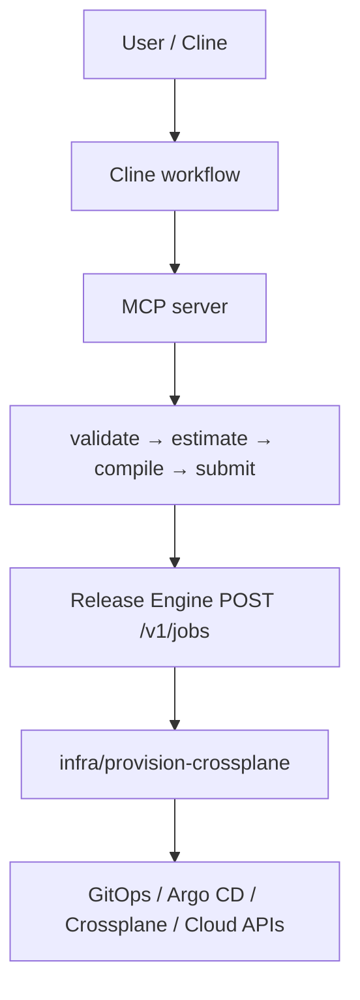
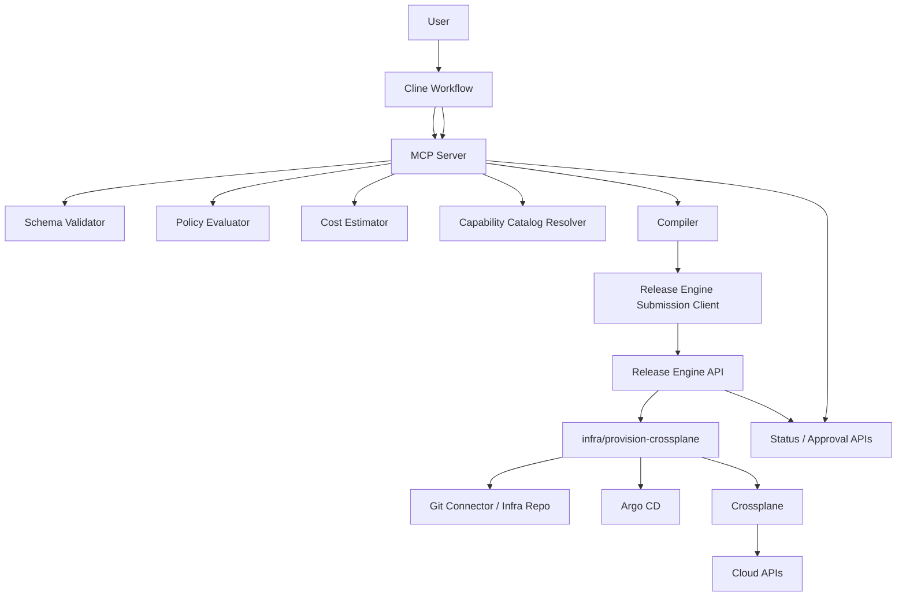

## RFC-INFRA-003: MCP Server and Compiler Design

---

## 1. Executive Summary

This RFC defines the **MCP server, validation pipeline, compiler, and Release Engine submission flow** for agent-assisted infrastructure provisioning. The design keeps Release Engine in its intended role: **durable, idempotent, approval-aware orchestration**, with modules acting as **orchestration-only units** and all external side effects going through connectors. It does **not** turn Release Engine into an arbitrary infrastructure interpreter. ([github.com](https://github.com/gatblau/release-engine))

The proposed flow is:



This is compatible with Cline’s workflow model, which supports Markdown-based workflows and explicit MCP tool calls, and with Release Engine’s HTTP API, which accepts idempotent job submissions with `tenant_id`, `path_key`, `params`, and `idempotency_key`. ([docs.cline.bot](https://docs.cline.bot/customization/workflows))

---

## 2. Problem to Solve

The current `infra/provision-crossplane` model is strong for **vetted-template self-service**, but complex infrastructure requests need a more structured front door than “pick a template and pass parameters.” The missing piece is not a new orchestration engine; it is a **request-shaping layer** that can translate user intent into safe, approved module inputs. Release Engine’s own design explicitly favors adding new golden paths through modules and registry entries rather than changing the engine core. ([github.com](https://github.com/gatblau/release-engine))

Therefore, this RFC introduces an MCP-facing compiler layer that:

- accepts an **Infrastructure Intent Specification**,
- validates structure and policy,
- estimates cost and blast radius,
- resolves the request to an approved capability/template,
- compiles the result into a Release Engine job,
- submits it through the standard API,
- and exposes status back to the agent. ([raw.githubusercontent.com](https://raw.githubusercontent.com/gatblau/release-engine/main/docs/design/d04.md))

---

## 3. Design Goals

### Primary goals

- **Agent-friendly**: easy to call from Cline via workflows and MCP tools. ([docs.cline.bot](https://docs.cline.bot/customization/workflows))
- **Architecturally aligned**: preserve Release Engine as orchestration-only. ([raw.githubusercontent.com](https://raw.githubusercontent.com/gatblau/release-engine/main/docs/design/d04.md))
- **Safe**: enforce schema, policy, and catalog constraints before job submission.
- **Deterministic**: same valid request + same catalog/policy version = same compiled plan.
- **Auditable**: preserve traceability from intent spec to submitted job and approval context.
- **Incremental**: coexist with existing direct template-based usage of `infra/provision-crossplane`.

### Non-goals

- building a general IaC runtime,
- exposing raw provider resources as the primary user contract,
- bypassing Release Engine approvals,
- moving final execution logic into the MCP layer. ([raw.githubusercontent.com](https://raw.githubusercontent.com/gatblau/release-engine/main/docs/design/d04.md))

---

## 4. Architecture Overview

### 4.1 Logical components



Release Engine remains the system of record for job state, approvals, retries, cancellation, and callbacks. Its API surface already includes idempotent job submission, job status retrieval, approval decision recording, and approval-context retrieval. ([raw.githubusercontent.com](https://raw.githubusercontent.com/gatblau/release-engine/main/docs/design/d04.md))

---

## 5. Boundary of Responsibilities

### 5.1 Cline workflow

Cline workflows are responsible for the **user interaction pattern**: gather requirements, call MCP tools, show summaries, and optionally pause for human confirmation before submission. Cline supports Markdown-defined workflows, stepwise execution, and use of MCP tools either explicitly or via natural-language intent. ([docs.cline.bot](https://docs.cline.bot/customization/workflows))

### 5.2 MCP server

The MCP server is responsible for:

- parsing YAML intent specs,
- validating against schema,
- enriching with catalog and policy context,
- estimating cost/blast radius,
- compiling to a Release Engine-compatible plan,
- submitting jobs,
- surfacing status, approval links, and error details.

### 5.3 Release Engine

Release Engine is responsible for:

- authenticated/authorized intake,
- per-tenant rate limiting,
- idempotent writes,
- job scheduling and claiming,
- approval-step handling,
- callback/outbox delivery,
- durable execution semantics. ([raw.githubusercontent.com](https://raw.githubusercontent.com/gatblau/release-engine/main/docs/design/d04.md))

### 5.4 `infra/provision-crossplane`

The module remains responsible for the existing provisioning workflow: render manifests, optionally wait for approval, write to Git, wait for readiness, and complete or fail. This RFC does not require changing its core responsibility; it changes how requests are **prepared** before they reach it.

---

## 6. MCP Server Capabilities

The MCP server should expose a small, explicit tool surface.

### 6.1 Recommended MCP tools

1. `draft_infra_request`
2. `validate_infra_request`
3. `estimate_infra_cost`
4. `compile_infra_request`
5. `submit_infra_request`
6. `get_infra_request_status`
7. `get_infra_request_approval_context`
8. `approve_infra_request` *(optional; often better handled by an approval UI rather than the same workflow)*

This fits Cline’s documented MCP workflow model, where workflows can call external tools through `use_mcp_tool`. ([docs.cline.bot](https://docs.cline.bot/customization/workflows))

---

## 7. MCP Tool Contracts

## 7.1 `draft_infra_request`

**Purpose:** Help the agent create a valid `InfrastructureRequest` document from user intent.

### Input

```json
{
  "tenant": "acme",
  "conversation_summary": "Need a production internal analytics platform in EU with Kubernetes, HA Postgres and object storage",
  "hints": {
    "environment": "production",
    "owner": "team-data"
  }
}
```

### Output

```json
{
  "request": {
    "apiVersion": "platform.gatblau.io/v1alpha1",
    "kind": "InfrastructureRequest",
    "metadata": {
      "name": "analytics-prod-eu",
      "owner": "team-data",
      "tenant": "acme"
    },
    "spec": {}
  },
  "missing_fields": [
    "spec.requirements.residency",
    "spec.constraints.maxMonthlyCost"
  ],
  "warnings": []
}
```

### Notes
This tool is advisory; it does not submit anything.

---

## 7.2 `validate_infra_request`

**Purpose:** Validate schema and semantic rules.

### Input

```json
{
  "requestYaml": "apiVersion: ...",
  "tenantContext": "acme"
}
```

### Output

```json
{
  "status": "valid_with_warnings",
  "normalizedRequest": { "...": "..." },
  "errors": [],
  "warnings": [
    {
      "field": "spec.delivery.approvalClass",
      "code": "APPROVAL_CLASS_HINT_OVERRIDDEN",
      "message": "Final approval class will be derived by policy"
    }
  ],
  "catalogVersion": "2026-03-15",
  "policyVersion": "2026-03-15.1"
}
```

### Status values

- `allow`
- `allow_with_approval`
- `deny`

---

## 7.3 `estimate_infra_cost`

**Purpose:** Produce approximate monthly cost for review and policy checks.

### Input

```json
{
  "requestYaml": "apiVersion: ...",
  "currency": "GBP"
}
```

### Output

```json
{
  "status": "ok",
  "estimate": {
    "monthly": 2475,
    "currency": "GBP",
    "confidence": "low",
    "drivers": [
      "kubernetes/standard/medium",
      "postgres/highly-available/500Gi",
      "objectStorage/standard"
    ]
  },
  "warnings": []
}
```

---

## 7.4 `compile_infra_request`

**Purpose:** Resolve the request into an approved template/capability mapping and generate the Release Engine job payload.

### Input

```json
{
  "requestYaml": "apiVersion: ...",
  "mode": "plan"
}
```

### Output

```json
{
  "status": "ok",
  "compiledPlan": {
    "kind": "CompiledProvisioningPlan",
    "version": "v1",
    "summary": {
      "requestName": "analytics-prod-eu",
      "template": "analytics-platform-prod",
      "blastRadius": "high",
      "estimatedMonthlyCost": 2475
    },
    "job": {
      "tenant_id": "acme",
      "path_key": "golden-path/infra/provision-crossplane",
      "idempotency_key": "infrareq-analytics-prod-eu-v1",
      "params": {}
    }
  }
}
```

---

## 7.5 `submit_infra_request`

**Purpose:** Submit the compiled plan to Release Engine using `POST /v1/jobs`.

### Input

```json
{
  "compiledPlan": { "...": "..." },
  "callbackUrl": "https://example.internal/re/callback"
}
```

### Output

```json
{
  "status": "accepted",
  "job": {
    "job_id": "uuid",
    "tenant_id": "acme",
    "path_key": "golden-path/infra/provision-crossplane",
    "state": "queued"
  }
}
```

Release Engine documents `POST /v1/jobs` as returning `202 Accepted` with a canonical envelope, using idempotency scoped by `(tenant_id, path_key, idempotency_key)`. It also documents body limits, callback validation, and replay semantics. ([raw.githubusercontent.com](https://raw.githubusercontent.com/gatblau/release-engine/main/docs/design/d04.md))

---

## 7.6 `get_infra_request_status`

**Purpose:** Return current status from Release Engine.

### Input

```json
{
  "jobId": "uuid",
  "tenant": "acme"
}
```

### Output

```json
{
  "job_id": "uuid",
  "tenant_id": "acme",
  "state": "running",
  "attempt": 1,
  "started_at": "2026-03-15T10:05:00Z",
  "finished_at": null,
  "last_error_code": null,
  "last_error_message": null
}
```

This maps to `GET /v1/jobs/{job_id}`. ([raw.githubusercontent.com](https://raw.githubusercontent.com/gatblau/release-engine/main/docs/design/d04.md))

---

## 7.7 `get_infra_request_approval_context`

**Purpose:** Fetch pending-approval details.

### Input

```json
{
  "jobId": "uuid",
  "stepId": "uuid"
}
```

### Output

```json
{
  "approval_request": {
    "summary": "Provision analytics-prod-eu",
    "blast_radius": "high",
    "metadata": {
      "estimated_cost": "2475",
      "template": "analytics-platform-prod"
    }
  },
  "policy": {
    "min_approvers": 2,
    "allowed_roles": ["techops-lead", "finance-approver"],
    "self_approval": false
  }
}
```

Release Engine documents a dedicated approval-context endpoint and policy guardrails including role allow-lists, self-approval blocking, tenant scope, and optional budget authority. ([raw.githubusercontent.com](https://raw.githubusercontent.com/gatblau/release-engine/main/docs/design/d04.md))

---

## 8. Validation Pipeline

Validation should be **multi-stage**, with each stage producing explicit artifacts.

### 8.1 Stages

1. **Parse**  
   YAML → canonical in-memory representation.

2. **Schema validate**  
   Validate against `InfrastructureRequest v1alpha1`.

3. **Normalize**  
   Apply defaults, normalize field casing/enums, remove redundant nulls.

4. **Semantic validate**  
   Cross-field checks:
    - production cannot use dev DB tier,
    - backup retention cannot exist if backup is disabled,
    - tenant mismatch is rejected,
    - unsupported capability combinations fail.

5. **Catalog validate**  
   Check requested capabilities against approved platform catalog.

6. **Policy evaluate**  
   Determine allowed / allow_with_approval / deny.

7. **Estimate**  
   Derive approximate cost and blast radius.

8. **Compile**  
   Resolve to module params and Release Engine submission envelope.

### 8.2 Validation result model

```yaml
result:
  status: valid_with_warnings
  normalizedRequest: ...
  errors: []
  warnings: []
  derived:
    blastRadius: high
    estimatedMonthlyCost: 2475
    approvalRequired: true
```

---

## 9. Compiler Design

## 9.1 Compiler inputs

The compiler takes:

- normalized `InfrastructureRequest`,
- capability catalog version,
- policy bundle version,
- environment/tenant context,
- optional pricing dataset.

## 9.2 Compiler outputs

The compiler produces two outputs:

1. **Compiled plan artifact**
2. **Release Engine job request**

### 9.2.1 Compiled plan artifact

This is a durable audit object that explains what was derived.

```yaml
kind: CompiledProvisioningPlan
version: v1
source:
  requestVersion: platform.gatblau.io/v1alpha1
  catalogVersion: 2026-03-15
  policyVersion: 2026-03-15.1
summary:
  requestName: analytics-prod-eu
  template: analytics-platform-prod
  blastRadius: high
  estimatedMonthlyCost: 2475
resolution:
  namespace: team-data
  compositionRef: xrd.analytics.platform/v1
  parameterMapping: ...
job:
  tenant_id: acme
  path_key: golden-path/infra/provision-crossplane
  idempotency_key: infrareq-analytics-prod-eu-v1
  params: ...
```

### 9.2.2 Why keep a compiled plan

Benefits:

- auditability,
- easier debugging,
- approval clarity,
- support for dry-run / plan mode,
- deterministic replay.

---

## 10. Capability Catalog Model

The compiler depends on a **capability catalog**, not on free-form inference.

### 10.1 Catalog responsibilities

The catalog defines:

- supported workload types,
- supported capabilities and allowed settings,
- mappings from intent patterns to approved templates/compositions,
- environment constraints,
- policy tags,
- cost heuristics.

### 10.2 Suggested storage model

For v1, store the catalog in **Git-managed YAML** alongside platform code.

Benefits:

- versioned,
- reviewable,
- auditable,
- easy to promote through environments.

### 10.3 Example catalog entry

```yaml
id: analytics-platform-prod
match:
  workloadType: analytics-platform
  environment: production
requires:
  capabilities:
    kubernetes: true
    database: true
allows:
  databaseEngines: [postgres]
  regions: [eu-west-1, eu-central-1]
resolvesTo:
  templateName: analytics-platform-prod
  compositionRef: xrd.analytics.platform/v1
  namespaceStrategy: owner
defaults:
  gitStrategy: pull-request
  verifyCloud: true
policyTags:
  - regulated
  - high-blast-radius
costModel:
  kubernetesBase: 900
  postgresHA: 1200
  objectStorageStandard: 75
```

---

## 11. Policy Engine Design

Policy should be evaluated in the MCP/compiler layer **before submission**, while Release Engine continues to enforce approval decision guardrails **during approval execution**. That split keeps early feedback fast without weakening engine-side enforcement. Release Engine already specifies approval guardrails and progression semantics for waiting-approval steps. ([raw.githubusercontent.com](https://raw.githubusercontent.com/gatblau/release-engine/main/docs/design/d04.md))

### 11.1 Policy categories

- **Schema policy**: shape and required fields
- **Platform policy**: approved capabilities/templates only
- **Security policy**: ingress/egress/compliance restrictions
- **Environment policy**: production rules
- **Budget policy**: max monthly cost, approver limit
- **Approval policy**: derive class, approver roles, min approvers

### 11.2 Policy outcomes

- `allow`
- `allow_with_approval`
- `deny`

---

## 12. Cost Estimator Design

### 12.1 Principles

- approximate, not billing-grade,
- transparent drivers,
- no silent zeroes,
- must disclose confidence level.

### 12.2 Data sources

For v1:
- static cost heuristics from the capability catalog.

For later:
- cloud pricing feeds or internal cost service.

### 12.3 Estimator output

```yaml
estimate:
  monthly: 2475
  currency: GBP
  confidence: low
  drivers:
    - kubernetes/standard/medium
    - postgres/highly-available/500Gi
    - objectStorage/standard
```

---

## 13. Release Engine Submission Adapter

The submission adapter translates a compiled plan into a standard Release Engine request body.

### 13.1 Request shape

Release Engine documents:

```json
{
  "tenant_id": "acme",
  "path_key": "golden-path/infra/provision-crossplane",
  "params": {},
  "idempotency_key": "infrareq-analytics-prod-eu-v1",
  "callback_url": "https://example.internal/callback"
}
```

with a maximum request body size of **256 KB**, stable `202 Accepted` semantics, and deterministic replay behavior. ([raw.githubusercontent.com](https://raw.githubusercontent.com/gatblau/release-engine/main/docs/design/d04.md))

### 13.2 Adapter responsibilities

- ensure payload is under size limit,
- generate compliant idempotency keys,
- add callback URL only if allowed,
- preserve exact request body for deterministic replay,
- surface `409 ERR_IDEM_CONFLICT` meaningfully if the same key is reused with different payload. ([raw.githubusercontent.com](https://raw.githubusercontent.com/gatblau/release-engine/main/docs/design/d04.md))

### 13.3 Idempotency strategy

Recommended idempotency key pattern:

```text
infrareq-{metadata.name}-{specVersion}-{contentHashShort}
```

Example:

```text
infrareq-analytics-prod-eu-v1-a13f29c2
```

This reduces accidental collisions while keeping keys under the documented 128-character limit and allowed character set. ([raw.githubusercontent.com](https://raw.githubusercontent.com/gatblau/release-engine/main/docs/design/d04.md))

---

## 14. Mapping to `infra/provision-crossplane`

The compiler should emit parameters already expected by the module design, such as:

- `template_name`
- `composition_ref`
- `namespace`
- `git_strategy`
- `verify_cloud`
- `approvalContext`
- `parameters`

### Example compiled `params`

```yaml
params:
  template_name: analytics-platform-prod
  composition_ref: xrd.analytics.platform/v1
  namespace: team-data

  git_repo: acme/infra-live
  git_branch: main
  git_strategy: pull-request

  verify_cloud: true
  cloud_resource_type: composite

  approvalContext:
    required: true
    decisionBasis:
      policyOutcome: allow_with_approval
      reasonCodes:
        - high_blast_radius
    riskSummary:
      blastRadius: high
    suggestedApproverRoles:
      - techops-lead
    ttl:
      expiresAt: "2026-04-01T12:00:00Z"

  parameters:
    environment: production
    cluster_profile: standard
    cluster_scale: medium
    database_engine: postgres
    database_tier: highly-available
    database_storage: 500Gi
    object_storage_class: standard
    ingress_mode: private
    egress_mode: controlled
    residency: eu
    owner: team-data
    request_name: analytics-prod-eu
```

This preserves the module’s role as a bounded orchestrator rather than a planner.

---

## 15. Approval Flow Design

### 15.1 Derivation in MCP/compiler layer

The compiler derives:

- `blastRadius`
- `estimatedMonthlyCost`
- `approvalRequired`
- suggested approver roles
- `ttl`
- summary metadata (review context)

### 15.2 Enforcement in Release Engine

Release Engine remains the source of truth for:

- waiting-approval steps,
- approval decisions,
- self-approval restrictions,
- approver role checks,
- tenant scoping,
- multi-approver progression,
- approval expiry and escalation events. ([raw.githubusercontent.com](https://raw.githubusercontent.com/gatblau/release-engine/main/docs/design/d04.md))

### 15.3 Suggested metadata passed into approval context

```yaml
approvalContext:
  required: true
  decisionBasis:
    policyOutcome: allow_with_approval
    reasonCodes:
      - high_blast_radius
  riskSummary:
    blastRadius: high
    estimatedCostBand: medium
  reviewContext:
    request_name: analytics-prod-eu
    owner: team-data
    template: analytics-platform-prod
    compiler_version: "v1.0.0"
    request_version: "platform.gatblau.io/v1alpha1"
```

---

## 16. Status and Event Model

### 16.1 Polling model

The MCP server should primarily use:

- `GET /v1/jobs/{job_id}`
- `GET /v1/jobs/{job_id}/steps/{step_id}/approval-context`
- optionally `GET /v1/jobs` for pending approvals

because these are documented and stable. ([raw.githubusercontent.com](https://raw.githubusercontent.com/gatblau/release-engine/main/docs/design/d04.md))

### 16.2 Optional callback integration

If the MCP server or an internal gateway owns a callback URL, it can receive Release Engine’s outbound callback/outbox events. Release Engine documents at-least-once delivery, HMAC signing, replay protection via `delivery_id`, and DLQ/backoff behavior. ([raw.githubusercontent.com](https://raw.githubusercontent.com/gatblau/release-engine/main/docs/design/d04.md))

### 16.3 Recommendation

Use:
- **polling** for Cline interactive UX,
- **callbacks** for platform-side automation and notifications.

---

## 17. Security Design

### 17.1 Authentication

- Cline authenticates to the MCP server.
- MCP server authenticates to Release Engine using the organization’s service identity model.
- Release Engine requires JWT bearer auth on its endpoints. ([raw.githubusercontent.com](https://raw.githubusercontent.com/gatblau/release-engine/main/docs/design/d04.md))

### 17.2 Authorization

The MCP server should enforce:
- tenant scoping,
- allowed actions per user or team,
- spec ownership constraints.

Release Engine separately enforces RBAC at job submission and approval time. ([raw.githubusercontent.com](https://raw.githubusercontent.com/gatblau/release-engine/main/docs/design/d04.md))

### 17.3 SSRF and callback safety

If the MCP layer accepts `callbackUrl`, it must apply its own allow-listing and validation before forwarding, even though Release Engine also validates callback URLs for SSRF protection. Defense in depth is appropriate here. ([raw.githubusercontent.com](https://raw.githubusercontent.com/gatblau/release-engine/main/docs/design/d04.md))

### 17.4 Secrets

The MCP server should not embed cloud credentials into the spec or plan. Any sensitive runtime data should remain inside approved connectors and tenant-scoped secret systems in the Release Engine architecture. The repository describes multi-tenant operation and secret-management design as a core concern. ([github.com](https://github.com/gatblau/release-engine))

---

## 18. Auditability and Provenance

Every request should preserve these identities:

- user/requestor,
- tenant,
- owning team,
- spec version,
- catalog version,
- policy version,
- compiler version,
- Release Engine job ID.

### 18.1 Recommended provenance chain

```text
InfrastructureRequest
   → validation result
   → cost estimate
   → compiled plan
   → POST /v1/jobs request
   → Release Engine job_id
   → approval events / execution status
```

### 18.2 Recommended persistence

Persist:
- original spec,
- normalized spec,
- compiled plan,
- submission envelope,
- job ID,
- approval summary.

This enables high-quality incident review and change traceability.

---

## 19. Error Model

### 19.1 MCP-visible error categories

| Category | Example |
|---|---|
| Parse error | invalid YAML |
| Schema error | missing required field |
| Semantic error | production with dev DB tier |
| Catalog resolution error | no approved template match |
| Policy denial | public ingress forbidden |
| Approval review required | over budget |
| Submission conflict | idempotency mismatch |
| Engine execution error | Crossplane readiness timeout |

### 19.2 Error response shape

```json
{
  "status": "invalid",
  "errors": [
    {
      "field": "spec.capabilities.database.tier",
      "code": "UNSUPPORTED_VALUE",
      "message": "tier 'dev' is not permitted for environment 'production'"
    }
  ],
  "warnings": []
}
```

### 19.3 Submission conflict example

If Release Engine returns a conflict because the same idempotency key was reused with a different payload, the MCP server should surface that explicitly and include the canonical envelope returned by the engine. Release Engine documents this behavior for `ERR_IDEM_CONFLICT`. ([raw.githubusercontent.com](https://raw.githubusercontent.com/gatblau/release-engine/main/docs/design/d04.md))

---

## 20. Observability

### 20.1 MCP metrics

Recommended metrics:

- `mcp_infra_validate_total`
- `mcp_infra_compile_total`
- `mcp_infra_submit_total`
- `mcp_infra_submit_failures_total`
- `mcp_infra_approval_required_total`
- `mcp_infra_compile_duration_ms`
- `mcp_infra_submission_duration_ms`

### 20.2 Correlation IDs

Use:
- `request_id`
- `job_id`
- `idempotency_key`
- `compiler_version`

### 20.3 Alignment with Release Engine observability

Release Engine already defines SQL and Prometheus metrics around jobs and steps, with bounded labels and engine-level observability flow. The MCP layer should complement this rather than duplicate it. ([raw.githubusercontent.com](https://raw.githubusercontent.com/gatblau/release-engine/main/docs/design/d04.md))

---

## 21. Example Cline Workflow

Because Cline workflows are Markdown files that can invoke MCP tools, a workflow like this is viable: gather intent, validate, estimate, compile, show review summary, then submit. ([docs.cline.bot](https://docs.cline.bot/customization/workflows))

```md
# Infrastructure Request

## Step 1: Gather request details
Ask the user for:
- tenant
- owner team
- environment
- workload type
- required capabilities
- residency/compliance
- budget limit

## Step 2: Draft request
Use the MCP server to draft an InfrastructureRequest.

<use_mcp_tool>
<server_name>release-engine-infra</server_name>
<tool_name>draft_infra_request</tool_name>
<arguments>{"tenant":"acme","conversation_summary":"Need a production internal analytics platform in EU with Kubernetes, HA Postgres and object storage","hints":{"owner":"team-data","environment":"production"}}</arguments>
</use_mcp_tool>

## Step 3: Validate request
Use the MCP server to validate the generated request.
If invalid, show errors and stop.

## Step 4: Estimate cost
Use the MCP server to estimate cost.
Show the estimate and confidence.

## Step 5: Compile request
Use the MCP server to compile the request to a provisioning plan.

## Step 6: Review
Present:
- template
- estimated cost
- blast radius
- approval expectation

Ask whether to submit.

## Step 7: Submit
Use the MCP server to submit the request.

## Step 8: Monitor
Poll status until:
- completed
- failed
- waiting for approval
```

---

## 22. Implementation Plan

### Phase 1 — Validator and Schema
- finalize JSON Schema,
- implement parser + normalization,
- implement semantic validation,
- return structured diagnostics.

### Phase 2 — Catalog and Policy
- define Git-backed capability catalog,
- implement template resolution,
- implement policy bundle,
- add blast-radius derivation.

### Phase 3 — Compiler
- generate compiled plan artifact,
- map to `infra/provision-crossplane` params,
- enforce payload-size and idempotency-key constraints.

### Phase 4 — Release Engine Adapter
- implement `POST /v1/jobs` client,
- implement status polling,
- implement approval-context retrieval,
- add conflict/error translation.

### Phase 5 — Cline Workflow
- build reusable workflow in `.clinerules/workflows/`,
- add review and submit checkpoints,
- refine prompts and summaries.

### Phase 6 — Hardening
- authn/authz,
- audit persistence,
- observability,
- callback handling,
- integration tests.

---

## 23. Testing Strategy

### Unit tests
- YAML parse/normalize,
- schema validation,
- semantic rules,
- catalog resolution,
- cost estimation,
- parameter mapping,
- idempotency key generation.

### Integration tests
- compile + submit happy path,
- invalid spec rejection,
- allow_with_approval path,
- idempotency replay,
- idempotency conflict,
- approval-required path,
- engine timeout/failure propagation.

### End-to-end tests
- Cline workflow → MCP → Release Engine → module execution,
- approval cycle,
- callback and status polling behavior.

---

## 24. Final Recommendation

Proceed with this design.

It is a good fit because it preserves the strongest parts of the current system:

- Cline handles the conversational workflow,
- the MCP server handles intelligence and translation,
- Release Engine handles durable orchestration and approvals,
- `infra/provision-crossplane` continues to execute the provisioning golden path. ([docs.cline.bot](https://docs.cline.bot/customization/workflows))

The most important implementation rule is:

> **Put intent interpretation and compilation in the MCP/compiler layer, not inside Release Engine itself.**

That gives you flexibility for more complex infrastructure requests without violating the Release Engine design contracts. ([raw.githubusercontent.com](https://raw.githubusercontent.com/gatblau/release-engine/main/docs/design/d04.md))

---

