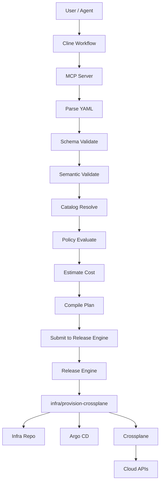

## RFC-INFRA-004: Implementation Backlog and API Definitions

---

## 1. Executive Summary

This RFC turns the previous design documents into an **implementable package**.

It defines:

- the **MCP tool contracts** in concrete form,
- the **`InfrastructureRequest` JSON Schema** shape,
- the **capability catalog schema**,
- the **compiled plan schema**,
- the **Go package layout**,
- the **Release Engine adapter interfaces**,
- the **validation / compilation pipeline contracts**,
- and a **delivery backlog** with milestones.

The goal is to make implementation straightforward and low-ambiguity.

This document assumes the core architecture already agreed in earlier RFCs:

- **intent authored outside Release Engine**
- **MCP server validates and compiles**
- **Release Engine executes durable workflow**
- **`infra/provision-crossplane` remains orchestration-only**

---

# 2. Scope

## In scope

- MCP server API/tool definitions
- JSON schema structure for `InfrastructureRequest`
- Capability catalog schema
- Compiled plan schema
- Validation result schema
- Release Engine submission model
- Go package boundaries
- Implementation milestones
- Testing backlog

## Out of scope

- Full Crossplane XRD/Composition design
- Full Backstage scaffolder implementation
- Cloud-provider-specific resource modeling
- Cost API integration beyond placeholder design
- Approval UI implementation

---

# 3. Design Principles

1. **Deterministic compilation**  
   Same request + same catalog + same policy => same compiled result.

2. **Strict contracts**  
   YAML is user-friendly, but runtime processing should use strongly typed structures.

3. **Separation of concerns**
    - MCP layer: parse, validate, estimate, compile, submit
    - Release Engine: durable orchestration and approval
    - Module: provisioning workflow execution

4. **Audit-first**  
   Every transformation should preserve provenance.

5. **Golden path only**  
   Unsupported requests are denied or marked for approval (`allow_with_approval`); they are not interpreted ad hoc.

---

# 4. End-to-End Flow



---

# 5. MCP Tool API Definitions

## 5.1 Tool naming

Recommended MCP server name:

```text
release-engine-infra
```

Recommended tool names:

- `draft_infra_request`
- `validate_infra_request`
- `estimate_infra_cost`
- `compile_infra_request`
- `submit_infra_request`
- `get_infra_request_status`
- `get_infra_request_approval_context`

---

## 5.2 Shared response envelope

All MCP tools should return a consistent envelope.

```json
{
  "status": "ok",
  "data": {},
  "errors": [],
  "warnings": [],
  "meta": {
    "requestId": "req-123",
    "timestamp": "2026-03-15T12:00:00Z",
    "version": "v1"
  }
}
```

### `status` values

- `ok`
- `invalid`
- `allow_with_approval`
- `deny`
- `error`

### Error object

```json
{
  "code": "SCHEMA_REQUIRED_FIELD",
  "message": "spec.owner is required",
  "field": "spec.owner",
  "retryable": false
}
```

### Warning object

```json
{
  "code": "ESTIMATE_LOW_CONFIDENCE",
  "message": "Cost estimate is based on heuristic catalog data",
  "field": "spec.cost.maxMonthly"
}
```

---

## 5.3 `draft_infra_request`

### Purpose

Generate an initial `InfrastructureRequest` skeleton from conversational input.

### Input schema

```json
{
  "tenant": "acme",
  "conversationSummary": "Need a production internal analytics platform in EU with HA postgres and object storage",
  "hints": {
    "owner": "team-data",
    "environment": "production",
    "workloadType": "analytics-platform"
  }
}
```

### Output schema

```json
{
  "status": "ok",
  "data": {
    "request": {
      "apiVersion": "platform.gatblau.io/v1alpha1",
      "kind": "InfrastructureRequest",
      "metadata": {
        "name": "analytics-prod-eu",
        "tenant": "acme"
      },
      "spec": {
        "owner": "team-data",
        "environment": "production",
        "workload": {
          "type": "analytics-platform"
        }
      }
    },
    "missingFields": [
      "spec.location.primaryRegion",
      "spec.cost.maxMonthly",
      "spec.capabilities.database"
    ]
  },
  "errors": [],
  "warnings": []
}
```

---

## 5.4 `validate_infra_request`

### Purpose

Validate structure, defaults, semantics, catalog compatibility, and policy posture.

### Input schema

```json
{
  "requestYaml": "apiVersion: platform.gatblau.io/v1alpha1\nkind: InfrastructureRequest\n...",
  "tenant": "acme",
  "mode": "full"
}
```

### `mode` values

- `schema`
- `semantic`
- `full`

### Output schema

```json
{
  "status": "ok",
  "data": {
    "result": {
      "valid": true,
      "normalizedRequest": {},
      "derived": {
        "blastRadius": "high",
        "approvalRequired": true
      },
      "catalogVersion": "2026-03-15",
      "policyVersion": "2026-03-15.1"
    }
  },
  "errors": [],
  "warnings": []
}
```

---

## 5.5 `estimate_infra_cost`

### Purpose

Return estimated monthly cost and confidence.

### Input schema

```json
{
  "requestYaml": "apiVersion: ...",
  "currency": "GBP",
  "tenant": "acme"
}
```

### Output schema

```json
{
  "status": "ok",
  "data": {
    "estimate": {
      "monthly": 2475,
      "currency": "GBP",
      "confidence": "low",
      "drivers": [
        {
          "key": "kubernetes.standard.medium",
          "amount": 900
        },
        {
          "key": "postgres.ha.500Gi",
          "amount": 1200
        },
        {
          "key": "object-storage.standard",
          "amount": 75
        }
      ]
    }
  },
  "errors": [],
  "warnings": []
}
```

---

## 5.6 `compile_infra_request`

### Purpose

Compile a validated request into a durable plan and Release Engine job payload.

### Input schema

```json
{
  "requestYaml": "apiVersion: ...",
  "tenant": "acme",
  "planOnly": true
}
```

### Output schema

```json
{
  "status": "ok",
  "data": {
    "compiledPlan": {
      "apiVersion": "platform.gatblau.io/v1",
      "kind": "CompiledProvisioningPlan",
      "metadata": {
        "name": "analytics-prod-eu",
        "tenant": "acme"
      },
      "summary": {
        "template": "analytics-platform-prod",
        "blastRadius": "high",
        "estimatedMonthlyCost": 2475
      },
      "job": {
        "tenant_id": "acme",
        "path_key": "golden-path/infra/provision-crossplane",
        "idempotency_key": "infrareq-analytics-prod-eu-v1-a13f29c2",
        "params": {}
      }
    }
  },
  "errors": [],
  "warnings": []
}
```

---

## 5.7 `submit_infra_request`

### Purpose

Submit compiled plan to Release Engine.

### Input schema

```json
{
  "compiledPlan": {},
  "callbackUrl": "https://internal.example/callback"
}
```

### Output schema

```json
{
  "status": "ok",
  "data": {
    "job": {
      "jobId": "0c4deff0-2f68-4ab1-8b86-49758e9d3b09",
      "tenantId": "acme",
      "pathKey": "golden-path/infra/provision-crossplane",
      "state": "queued"
    }
  },
  "errors": [],
  "warnings": []
}
```

---

## 5.8 `get_infra_request_status`

### Input schema

```json
{
  "jobId": "0c4deff0-2f68-4ab1-8b86-49758e9d3b09",
  "tenant": "acme"
}
```

### Output schema

```json
{
  "status": "ok",
  "data": {
    "job": {
      "jobId": "0c4deff0-2f68-4ab1-8b86-49758e9d3b09",
      "state": "running",
      "attempt": 1,
      "createdAt": "2026-03-15T12:10:00Z",
      "startedAt": "2026-03-15T12:10:05Z",
      "finishedAt": null,
      "lastErrorCode": null,
      "lastErrorMessage": null
    }
  },
  "errors": [],
  "warnings": []
}
```

---

## 5.9 `get_infra_request_approval_context`

### Input schema

```json
{
  "jobId": "0c4deff0-2f68-4ab1-8b86-49758e9d3b09",
  "stepId": "b7288afd-71b9-4f0f-b2aa-9c564b7033be",
  "tenant": "acme"
}
```

### Output schema

```json
{
  "status": "ok",
  "data": {
    "approval": {
      "summary": "Provision analytics-prod-eu",
      "blastRadius": "high",
      "estimatedCost": 2475,
      "currency": "GBP",
      "approverRoles": [
        "techops-lead",
        "finance-approver"
      ],
      "minApprovers": 2,
      "selfApprovalAllowed": false
    }
  },
  "errors": [],
  "warnings": []
}
```

---

# 6. `InfrastructureRequest` Schema Definition

## 6.1 Top-level shape

```yaml
apiVersion: platform.gatblau.io/v1alpha1
kind: InfrastructureRequest
metadata:
  name: analytics-prod-eu
  tenant: acme
  labels: {}
spec:
  owner: team-data
  environment: production
  workload: {}
  capabilities: {}
  location: {}
  security: {}
  operations: {}
  cost: {}
  delivery: {}
```

---

## 6.2 JSON Schema outline

Below is the recommended practical schema structure.

```json
{
  "$id": "https://platform.gatblau.io/schemas/infrastructure-request-v1alpha1.json",
  "type": "object",
  "required": ["apiVersion", "kind", "metadata", "spec"],
  "properties": {
    "apiVersion": {
      "type": "string",
      "const": "platform.gatblau.io/v1alpha1"
    },
    "kind": {
      "type": "string",
      "const": "InfrastructureRequest"
    },
    "metadata": {
      "type": "object",
      "required": ["name", "tenant"],
      "properties": {
        "name": {
          "type": "string",
          "pattern": "^[a-z0-9]([-a-z0-9]*[a-z0-9])?$",
          "minLength": 3,
          "maxLength": 63
        },
        "tenant": {
          "type": "string",
          "minLength": 1,
          "maxLength": 64
        },
        "labels": {
          "type": "object",
          "additionalProperties": {
            "type": "string"
          }
        }
      },
      "additionalProperties": false
    },
    "spec": {
      "type": "object",
      "required": ["owner", "environment", "workload"],
      "properties": {
        "owner": { "type": "string", "minLength": 1, "maxLength": 128 },
        "environment": {
          "type": "string",
          "enum": ["development", "test", "staging", "production"]
        },
        "workload": { "$ref": "#/$defs/workload" },
        "capabilities": { "$ref": "#/$defs/capabilities" },
        "location": { "$ref": "#/$defs/location" },
        "security": { "$ref": "#/$defs/security" },
        "operations": { "$ref": "#/$defs/operations" },
        "cost": { "$ref": "#/$defs/cost" },
        "delivery": { "$ref": "#/$defs/delivery" }
      },
      "additionalProperties": false
    }
  },
  "$defs": {}
}
```

---

## 6.3 `workload`

```json
{
  "workload": {
    "type": "object",
    "required": ["type"],
    "properties": {
      "type": {
        "type": "string",
        "enum": [
          "web-service",
          "api-service",
          "worker-service",
          "data-platform",
          "analytics-platform",
          "database-service",
          "object-storage-service"
        ]
      },
      "profile": {
        "type": "string",
        "enum": ["small", "medium", "large"]
      },
      "exposure": {
        "type": "string",
        "enum": ["private", "internal", "public"]
      }
    },
    "additionalProperties": false
  }
}
```

---

## 6.4 `capabilities`

```json
{
  "capabilities": {
    "type": "object",
    "properties": {
      "kubernetes": { "$ref": "#/$defs/kubernetesCapability" },
      "database": { "$ref": "#/$defs/databaseCapability" },
      "objectStorage": { "$ref": "#/$defs/objectStorageCapability" },
      "messaging": { "$ref": "#/$defs/messagingCapability" }
    },
    "additionalProperties": false
  }
}
```

### `kubernetesCapability`

```json
{
  "kubernetesCapability": {
    "type": "object",
    "properties": {
      "enabled": { "type": "boolean" },
      "tier": {
        "type": "string",
        "enum": ["standard", "hardened"]
      },
      "size": {
        "type": "string",
        "enum": ["small", "medium", "large"]
      },
      "multiAz": { "type": "boolean" }
    },
    "additionalProperties": false
  }
}
```

### `databaseCapability`

```json
{
  "databaseCapability": {
    "type": "object",
    "properties": {
      "enabled": { "type": "boolean" },
      "engine": {
        "type": "string",
        "enum": ["postgres", "mysql"]
      },
      "tier": {
        "type": "string",
        "enum": ["dev", "standard", "highly-available"]
      },
      "storageGiB": {
        "type": "integer",
        "minimum": 10,
        "maximum": 65536
      },
      "backup": {
        "type": "object",
        "properties": {
          "enabled": { "type": "boolean" },
          "retentionDays": {
            "type": "integer",
            "minimum": 1,
            "maximum": 365
          }
        },
        "additionalProperties": false
      }
    },
    "additionalProperties": false
  }
}
```

### `objectStorageCapability`

```json
{
  "objectStorageCapability": {
    "type": "object",
    "properties": {
      "enabled": { "type": "boolean" },
      "class": {
        "type": "string",
        "enum": ["standard", "infrequent-access"]
      },
      "versioning": { "type": "boolean" }
    },
    "additionalProperties": false
  }
}
```

---

## 6.5 `location`

```json
{
  "location": {
    "type": "object",
    "properties": {
      "residency": {
        "type": "string",
        "enum": ["eu", "uk", "us", "global"]
      },
      "primaryRegion": {
        "type": "string",
        "minLength": 1,
        "maxLength": 64
      },
      "secondaryRegion": {
        "type": "string",
        "minLength": 1,
        "maxLength": 64
      }
    },
    "additionalProperties": false
  }
}
```

---

## 6.6 `security`

```json
{
  "security": {
    "type": "object",
    "properties": {
      "compliance": {
        "type": "array",
        "items": {
          "type": "string",
          "enum": ["none", "gdpr", "pci", "sox", "hipaa"]
        },
        "uniqueItems": true
      },
      "ingress": {
        "type": "string",
        "enum": ["private", "internal", "public"]
      },
      "egress": {
        "type": "string",
        "enum": ["open", "controlled", "restricted"]
      },
      "dataClassification": {
        "type": "string",
        "enum": ["public", "internal", "confidential", "restricted"]
      }
    },
    "additionalProperties": false
  }
}
```

---

## 6.7 `operations`

```json
{
  "operations": {
    "type": "object",
    "properties": {
      "availability": {
        "type": "string",
        "enum": ["best-effort", "standard", "high"]
      },
      "backupRequired": { "type": "boolean" },
      "drRequired": { "type": "boolean" },
      "monitoring": {
        "type": "string",
        "enum": ["basic", "standard", "enhanced"]
      }
    },
    "additionalProperties": false
  }
}
```

---

## 6.8 `cost`

```json
{
  "cost": {
    "type": "object",
    "properties": {
      "maxMonthly": {
        "type": "number",
        "minimum": 0
      },
      "currency": {
        "type": "string",
        "enum": ["GBP", "USD", "EUR"]
      },
      "approvalRequiredAbove": {
        "type": "number",
        "minimum": 0
      }
    },
    "additionalProperties": false
  }
}
```

---

## 6.9 `delivery`

```json
{
  "delivery": {
    "type": "object",
    "properties": {
      "strategy": {
        "type": "string",
        "enum": ["direct-commit", "pull-request"]
      },
      "verifyCloud": { "type": "boolean" },
      "callbackUrl": {
        "type": "string",
        "format": "uri"
      }
    },
    "additionalProperties": false
  }
}
```

---

# 7. Semantic Validation Rules

Schema validation is not enough. The validator must enforce semantic rules.

## 7.1 Required semantic rules

### Environment rules

- `production` must not use database tier `dev`
- `production` must not use ingress `public` unless catalog/policy explicitly allows it
- `production` with `drRequired = true` should require a supported secondary region or equivalent template

### Backup rules

- if `operations.backupRequired = true`, database backup must be enabled
- if `database.backup.enabled = false`, `retentionDays` must not be set

### Security rules

- `dataClassification = restricted` cannot use `egress = open`
- `compliance` requirements must be supported by resolved capability

### Cost rules

- if estimate exceeds `cost.maxMonthly`, result should be `allow_with_approval` or `deny`, depending on policy

### Ownership rules

- `metadata.tenant` must match authenticated tenant context
- `spec.owner` must be an allowed team within tenant context

---

# 8. Capability Catalog Schema

The catalog is the approved platform capability registry.

## 8.1 Top-level structure

```yaml
apiVersion: platform.gatblau.io/v1
kind: CapabilityCatalog
metadata:
  name: default
  version: 2026-03-15
spec:
  templates: []
  policies: []
```

---

## 8.2 Template entry schema

```yaml
id: analytics-platform-prod
displayName: Analytics Platform - Production
match:
  workloadType: analytics-platform
  environment: production
  exposure: internal
requires:
  capabilities:
    kubernetes: true
    database: true
allows:
  regions:
    - eu-west-1
    - eu-central-1
  databaseEngines:
    - postgres
  compliance:
    - gdpr
resolvesTo:
  templateName: analytics-platform-prod
  compositionRef: xrd.analytics.platform/v1
  namespaceStrategy: owner
defaults:
  gitStrategy: pull-request
  verifyCloud: true
  approvalClass: high-blast-radius
policyTags:
  - regulated
  - high-blast-radius
costModel:
  kubernetesBase: 900
  postgresHA: 1200
  objectStorageStandard: 75
```

---

## 8.3 JSON Schema outline for catalog template

```json
{
  "type": "object",
  "required": ["id", "match", "resolvesTo"],
  "properties": {
    "id": { "type": "string" },
    "displayName": { "type": "string" },
    "match": {
      "type": "object",
      "properties": {
        "workloadType": { "type": "string" },
        "environment": { "type": "string" },
        "exposure": { "type": "string" }
      },
      "additionalProperties": false
    },
    "requires": { "type": "object" },
    "allows": { "type": "object" },
    "resolvesTo": {
      "type": "object",
      "required": ["templateName", "compositionRef"],
      "properties": {
        "templateName": { "type": "string" },
        "compositionRef": { "type": "string" },
        "namespaceStrategy": {
          "type": "string",
          "enum": ["owner", "fixed", "tenant"]
        },
        "fixedNamespace": { "type": "string" }
      },
      "additionalProperties": false
    },
    "defaults": { "type": "object" },
    "policyTags": {
      "type": "array",
      "items": { "type": "string" }
    },
    "costModel": {
      "type": "object",
      "additionalProperties": {
        "type": "number"
      }
    }
  },
  "additionalProperties": false
}
```

---

# 9. Policy Bundle Schema

Policy is separate from catalog resolution.

## 9.1 Example policy bundle

```yaml
apiVersion: platform.gatblau.io/v1
kind: PolicyBundle
metadata:
  name: default
  version: 2026-03-15.1
spec:
  approvalPolicies:
    - name: high-blast-radius
      match:
        blastRadius: high
      decision:
        requireApproval: true
        minApprovers: 2
        allowedRoles:
          - techops-lead
          - finance-approver
        selfApproval: false
  budgetPolicies:
    - name: over-budget-review
      match:
        exceedsBudget: true
      decision:
        mode: allow_with_approval
```

---

# 10. Compiled Plan Schema

## 10.1 Shape

```yaml
apiVersion: platform.gatblau.io/v1
kind: CompiledProvisioningPlan
metadata:
  name: analytics-prod-eu
  tenant: acme
summary:
  template: analytics-platform-prod
  blastRadius: high
  estimatedMonthlyCost: 2475
  currency: GBP
source:
  requestHash: sha256:...
  catalogVersion: 2026-03-15
  policyVersion: 2026-03-15.1
  compilerVersion: 1.0.0
resolution:
  namespace: team-data
  compositionRef: xrd.analytics.platform/v1
  gitStrategy: pull-request
  verifyCloud: true
job:
  tenant_id: acme
  path_key: golden-path/infra/provision-crossplane
  idempotency_key: infrareq-analytics-prod-eu-v1-a13f29c2
  params: {}
```

---

## 10.2 `job.params` canonical layout

```yaml
template_name: analytics-platform-prod
composition_ref: xrd.analytics.platform/v1
namespace: team-data

git_repo: acme/infra-live
git_branch: main
git_strategy: pull-request

verify_cloud: true
cloud_resource_type: composite

    approvalContext:
      required: true
      decisionBasis:
        policyOutcome: allow_with_approval
        reasonCodes:
          - high_blast_radius
      riskSummary:
        blastRadius: high
        estimatedCostBand: medium
      reviewContext:
        request_name: analytics-prod-eu
        owner: team-data
        template: analytics-platform-prod
        compiler_version: "1.0.0"
        policy_version: "2026-03-15.1"
        catalog_version: "2026-03-15"
      suggestedApproverRoles:
        - techops-lead
      ttl:
        expiresAt: "2026-04-01T12:00:00Z"

    parameters:
  environment: production
  cluster_profile: standard
  cluster_scale: medium
  database_engine: postgres
  database_tier: highly-available
  database_storage: 500Gi
  object_storage_class: standard
  ingress_mode: private
  egress_mode: controlled
  residency: eu
  owner: team-data
  request_name: analytics-prod-eu
```

---

# 11. Validation Result Schema

## 11.1 Shape

```yaml
apiVersion: platform.gatblau.io/v1
kind: ValidationResult
result:
  valid: true
  status: valid_with_warnings
  errors: []
  warnings: []
  derived:
    blastRadius: high
    approvalRequired: true
    matchedTemplate: analytics-platform-prod
```

## 11.2 Status values

- `allow`
- `allow_with_approval`
- `deny`

---

# 12. Go Package Layout

Recommended package structure for the MCP/compiler service:

```text
infra-intent/
├── cmd/
│   └── infra-intent-mcp/
│       └── main.go
├── internal/
│   ├── api/
│   │   ├── mcp/
│   │   │   ├── server.go
│   │   │   ├── tools.go
│   │   │   ├── envelope.go
│   │   │   └── errors.go
│   │   └── http/
│   │       └── health.go
│   ├── model/
│   │   ├── request.go
│   │   ├── compiled_plan.go
│   │   ├── validation.go
│   │   ├── catalog.go
│   │   └── policy.go
│   ├── schema/
│   │   ├── request_schema.json
│   │   ├── catalog_schema.json
│   │   └── compiled_plan_schema.json
│   ├── validate/
│   │   ├── parser.go
│   │   ├── schema.go
│   │   ├── semantic.go
│   │   ├── normalize.go
│   │   └── validator.go
│   ├── catalog/
│   │   ├── loader.go
│   │   ├── matcher.go
│   │   └── resolver.go
│   ├── policy/
│   │   ├── evaluator.go
│   │   └── rules.go
│   ├── estimate/
│   │   └── estimator.go
│   ├── compile/
│   │   ├── compiler.go
│   │   ├── idempotency.go
│   │   └── mapper.go
│   ├── releaseengine/
│   │   ├── client.go
│   │   ├── submit.go
│   │   ├── status.go
│   │   └── approval.go
│   ├── auth/
│   │   └── context.go
│   └── observability/
│       ├── metrics.go
│       ├── logging.go
│       └── tracing.go
├── pkg/
│   └── contracts/
│       ├── request.go
│       ├── result.go
│       └── tooltypes.go
└── test/
    ├── fixtures/
    ├── integration/
    └── e2e/
```

---

# 13. Core Go Interfaces

## 13.1 Validator

```go
type Validator interface {
    Validate(ctx context.Context, req *InfrastructureRequest, opts ValidateOptions) (*ValidationResult, error)
}
```

### Supporting types

```go
type ValidateOptions struct {
    Tenant string
    Mode   ValidationMode
}

type ValidationMode string

const (
    ValidationModeSchema   ValidationMode = "schema"
    ValidationModeSemantic ValidationMode = "semantic"
    ValidationModeFull     ValidationMode = "full"
)
```

---

## 13.2 Catalog resolver

```go
type CatalogResolver interface {
    Resolve(ctx context.Context, req *InfrastructureRequest) (*CatalogMatch, error)
}
```

```go
type CatalogMatch struct {
    TemplateID      string
    TemplateName    string
    CompositionRef  string
    Namespace       string
    PolicyTags      []string
    Defaults        map[string]any
    CatalogVersion  string
}
```

---

## 13.3 Policy evaluator

```go
type PolicyEvaluator interface {
    Evaluate(ctx context.Context, req *InfrastructureRequest, match *CatalogMatch, estimate *CostEstimate) (*PolicyDecision, error)
}
```

```go
type PolicyDecision struct {
    Outcome          PolicyOutcome
    ReasonCodes      []string
    ApprovalClass    string
    MinApprovers     int
    AllowedRoles     []string
    SelfApproval     bool
    Warnings         []Diagnostic
}
```

---

## 13.4 Cost estimator

```go
type CostEstimator interface {
    Estimate(ctx context.Context, req *InfrastructureRequest, match *CatalogMatch, currency string) (*CostEstimate, error)
}
```

```go
type CostEstimate struct {
    Monthly    float64
    Currency   string
    Confidence string
    Drivers    []CostDriver
}
```

---

## 13.5 Compiler

```go
type Compiler interface {
    Compile(ctx context.Context, req *InfrastructureRequest, opts CompileOptions) (*CompiledProvisioningPlan, error)
}
```

```go
type CompileOptions struct {
    Tenant   string
    PlanOnly bool
}
```

---

## 13.6 Release Engine client

```go
type ReleaseEngineClient interface {
    SubmitJob(ctx context.Context, req *SubmitJobRequest) (*SubmitJobResponse, error)
    GetJob(ctx context.Context, tenant string, jobID string) (*JobStatus, error)
    GetApprovalContext(ctx context.Context, tenant string, jobID string, stepID string) (*ApprovalContext, error)
}
```

---

# 14. Release Engine Adapter Contracts

## 14.1 Submit request

```go
type SubmitJobRequest struct {
    TenantID       string         `json:"tenant_id"`
    PathKey        string         `json:"path_key"`
    Params         map[string]any `json:"params"`
    IdempotencyKey string         `json:"idempotency_key"`
    CallbackURL    string         `json:"callback_url,omitempty"`
}
```

## 14.2 Submit response

```go
type SubmitJobResponse struct {
    JobID    string `json:"job_id"`
    TenantID string `json:"tenant_id"`
    PathKey  string `json:"path_key"`
    State    string `json:"state"`
}
```

## 14.3 Job status

```go
type JobStatus struct {
    JobID            string     `json:"job_id"`
    TenantID         string     `json:"tenant_id"`
    State            string     `json:"state"`
    Attempt          int        `json:"attempt"`
    CreatedAt        time.Time  `json:"created_at"`
    StartedAt        *time.Time `json:"started_at,omitempty"`
    FinishedAt       *time.Time `json:"finished_at,omitempty"`
    LastErrorCode    *string    `json:"last_error_code,omitempty"`
    LastErrorMessage *string    `json:"last_error_message,omitempty"`
}
```

## 14.4 Approval context

```go
type ApprovalContext struct {
    Summary           string         `json:"summary"`
    BlastRadius       string         `json:"blast_radius"`
    EstimatedCost     float64        `json:"estimated_cost"`
    Currency          string         `json:"currency"`
    MinApprovers      int            `json:"min_approvers"`
    AllowedRoles      []string       `json:"allowed_roles"`
    SelfApproval      bool           `json:"self_approval"`
    Metadata          map[string]any `json:"metadata"`
}
```

---

# 15. Canonical Domain Models

## 15.1 `InfrastructureRequest`

```go
type InfrastructureRequest struct {
    APIVersion string                    `yaml:"apiVersion" json:"apiVersion"`
    Kind       string                    `yaml:"kind" json:"kind"`
    Metadata   InfrastructureMetadata    `yaml:"metadata" json:"metadata"`
    Spec       InfrastructureRequestSpec `yaml:"spec" json:"spec"`
}
```

## 15.2 Metadata

```go
type InfrastructureMetadata struct {
    Name   string            `yaml:"name" json:"name"`
    Tenant string            `yaml:"tenant" json:"tenant"`
    Labels map[string]string `yaml:"labels,omitempty" json:"labels,omitempty"`
}
```

## 15.3 Spec

```go
type InfrastructureRequestSpec struct {
    Owner        string                `yaml:"owner" json:"owner"`
    Environment  string                `yaml:"environment" json:"environment"`
    Workload     WorkloadSpec          `yaml:"workload" json:"workload"`
    Capabilities CapabilitySpec        `yaml:"capabilities,omitempty" json:"capabilities,omitempty"`
    Location     LocationSpec          `yaml:"location,omitempty" json:"location,omitempty"`
    Security     SecuritySpec          `yaml:"security,omitempty" json:"security,omitempty"`
    Operations   OperationsSpec        `yaml:"operations,omitempty" json:"operations,omitempty"`
    Cost         CostSpec              `yaml:"cost,omitempty" json:"cost,omitempty"`
    Delivery     DeliverySpec          `yaml:"delivery,omitempty" json:"delivery,omitempty"`
}
```

---

# 16. Compiler Mapping Rules

## 16.1 Namespace derivation

Rules:

- if catalog says `namespaceStrategy = owner`, namespace = sanitized `spec.owner`
- if `tenant`, namespace = sanitized `metadata.tenant`
- if `fixed`, namespace = `fixedNamespace`

## 16.2 Approval derivation

Rules:

- `approvalContext.required = true` if policy outcome says approval required
- `approvalContext.ttl` should be set from policy defaults
- `approvalContext.reviewContext` should include estimate, blast radius, request identity, versions

## 16.3 Git strategy derivation

Rules:

- request can suggest a delivery strategy
- catalog/platform policy decides final allowed value
- compiler emits effective value only

## 16.4 Parameter mapping

Map normalized request fields into flattened module params expected by `infra/provision-crossplane`.

Example:

| Request Field | Module Param |
|---|---|
| `spec.environment` | `parameters.environment` |
| `spec.owner` | `parameters.owner` |
| `spec.location.residency` | `parameters.residency` |
| `spec.capabilities.database.engine` | `parameters.database_engine` |
| `spec.capabilities.database.tier` | `parameters.database_tier` |
| `spec.capabilities.database.storageGiB` | `parameters.database_storage_gib` |
| `spec.security.ingress` | `parameters.ingress_mode` |
| `spec.security.egress` | `parameters.egress_mode` |

---

# 17. Idempotency Key Algorithm

## 17.1 Requirements

The key must be:

- deterministic for the compiled request payload
- stable across retries
- different if effective payload changes

## 17.2 Recommended algorithm

\[
\text{idempotency\_key} = \text{"infrareq-"} + \text{name} + \text{"-v1-"} + \text{shortHash}
\]

Where:

- `name` = sanitized `metadata.name`
- `shortHash` = first 8 hex chars of SHA-256 over canonicalized submission payload

## 17.3 Pseudocode

```go
func BuildIdempotencyKey(name string, payload []byte) string {
    sum := sha256.Sum256(payload)
    short := hex.EncodeToString(sum[:])[:8]
    return fmt.Sprintf("infrareq-%s-v1-%s", sanitize(name), short)
}
```

---

# 18. MCP Server Implementation Notes

## 18.1 Tool execution pattern

Each tool should follow:

1. authenticate caller
2. authorize tenant access
3. parse input
4. validate required fields
5. run domain service
6. map errors to standard envelope
7. return structured response

## 18.2 Error mapping

Internal errors should be converted consistently:

| Internal Error | MCP Code |
|---|---|
| YAML parse failure | `YAML_PARSE_ERROR` |
| JSON schema violation | `SCHEMA_VALIDATION_FAILED` |
| semantic rule failure | `SEMANTIC_VALIDATION_FAILED` |
| no template match | `CATALOG_NO_MATCH` |
| policy deny | `POLICY_DENIED` |
| budget over limit | `BUDGET_EXCEEDED` |
| idempotency conflict | `IDEMPOTENCY_CONFLICT` |
| release engine unavailable | `RELEASE_ENGINE_UNAVAILABLE` |

---

# 19. Observability Contract

## 19.1 Structured logs

Every operation should log:

- `request_id`
- `tenant`
- `tool`
- `metadata.name`
- `catalog_version`
- `policy_version`
- `job_id` if available
- outcome
- duration_ms

## 19.2 Metrics

Recommended counters:

- `infra_mcp_requests_total{tool,status}`
- `infra_validation_failures_total{code}`
- `infra_compile_total{status}`
- `infra_submit_total{status}`
- `infra_approval_required_total`
- `infra_release_engine_errors_total`

Recommended histograms:

- `infra_validation_duration_seconds`
- `infra_compile_duration_seconds`
- `infra_submit_duration_seconds`

---

# 20. Testing Backlog

## 20.1 Unit tests

### Schema and parsing
- valid request parses successfully
- malformed YAML returns parse error
- unknown top-level field rejected
- invalid enum rejected
- invalid metadata name rejected

### Semantic validation
- production + dev DB tier fails
- backup retention without backup fails
- restricted data + open egress fails
- tenant mismatch fails
- unsupported compliance fails

### Catalog resolution
- exact match returns template
- no match returns `CATALOG_NO_MATCH`
- multiple matches produce deterministic best match
- namespace strategy resolves correctly

### Policy
- high blast radius requires approval
- cost over budget returns review-required
- public ingress in production denied

### Compiler
- compiled plan contains provenance
- params mapping correct
- idempotency key stable
- changed effective payload changes idempotency key

### Release Engine adapter
- submit request marshals correctly
- status response maps correctly
- approval context maps correctly
- conflict response surfaced correctly

---

## 20.2 Integration tests

- validate → estimate → compile happy path
- validate invalid request
- compile request with allow_with_approval outcome
- submit compiled plan and get queued job
- poll running/completed status
- retrieve approval context
- callback URL omitted cleanly
- idempotency replay returns same job
- idempotency mismatch returns conflict

---

## 20.3 End-to-end tests

- Cline workflow produces draft, validates, compiles, submits
- approval-required job pauses and resumes after approval
- rejected approval causes terminal failure
- Crossplane timeout propagates cleanly to user-facing status
- cloud verification skipped when disabled
- pull-request strategy invokes PR path successfully

---

# 21. Delivery Backlog

## Milestone 1 — Contracts and Models

### Deliverables
- Go structs for request, catalog, compiled plan
- JSON schemas
- shared MCP response envelope
- fixture examples

### Acceptance criteria
- schemas validate fixtures
- models serialize/deserialize round-trip
- fixtures checked into repo

---

## Milestone 2 — Validation Engine

### Deliverables
- YAML parser
- schema validator
- semantic validator
- normalization logic

### Acceptance criteria
- all validation unit tests passing
- clear field-level diagnostics
- normalized output stable

---

## Milestone 3 — Catalog and Policy

### Deliverables
- Git-backed catalog loader
- template resolver
- policy evaluator
- policy fixture bundle

### Acceptance criteria
- deterministic template resolution
- policy decisions reproducible
- version reporting included in output

---

## Milestone 4 — Cost Estimation and Compiler

### Deliverables
- heuristic estimator
- compiler
- idempotency key builder
- module param mapper

### Acceptance criteria
- compiled plan stable
- params compatible with `infra/provision-crossplane`
- provenance metadata included

---

## Milestone 5 — Release Engine Adapter

### Deliverables
- submit client
- status client
- approval context client
- error translation layer

### Acceptance criteria
- mock integration tests passing
- 202 accepted path handled correctly
- conflict and failure handling verified

---

## Milestone 6 — MCP Server

### Deliverables
- MCP server bootstrap
- tool registration
- authz integration
- observability hooks

### Acceptance criteria
- all tools callable end-to-end
- consistent envelope returned
- structured logs and metrics emitted

---

## Milestone 7 — Cline Workflow

### Deliverables
- workflow markdown
- prompt patterns
- submit confirmation step
- monitoring/polling step

### Acceptance criteria
- agent can complete happy path without manual prompt engineering
- failures surfaced intelligibly
- approval waiting state explained clearly

---

## Milestone 8 — Hardening

### Deliverables
- payload size guards
- callback URL validation
- audit persistence
- rate limiting / abuse controls
- retry strategy documentation

### Acceptance criteria
- operational readiness review passed
- security review issues resolved
- production deployment checklist complete

---

# 22. Example Repository Layout

If you want this as a practical mono-repo addition, a reasonable target shape is:

```text
.
├── docs/
│   └── rfc/
│       ├── RFC-INFRA-001.md
│       ├── RFC-INFRA-002.md
│       ├── RFC-INFRA-003.md
│       └── RFC-INFRA-004.md
├── infra-intent/
│   ├── cmd/
│   ├── internal/
│   ├── pkg/
│   └── test/
├── catalog/
│   ├── capability-catalog.yaml
│   └── policy-bundle.yaml
└── workflows/
    └── cline/
        └── infrastructure-request.md
```

---

# 23. Example Acceptance Story

## Story

A developer asks for:

- production analytics platform
- EU residency
- internal ingress
- HA Postgres
- object storage
- max monthly budget £3000

## System behavior

1. agent drafts `InfrastructureRequest`
2. validator normalizes and validates
3. catalog resolves `analytics-platform-prod`
4. policy marks request as approval-required
5. estimator returns about £2475
6. compiler emits `CompiledProvisioningPlan`
7. MCP submits to Release Engine
8. Release Engine runs `infra/provision-crossplane`
9. approval pauses if required
10. GitOps/Crossplane provisions
11. status is polled until completion

---

# 24. Recommended Implementation Order

If you want the fastest path to value, implement in this exact order:

1. **Request models + JSON schema**
2. **Parser + schema validation**
3. **Semantic validation**
4. **Catalog loader + resolver**
5. **Compiler to module params**
6. **Release Engine submission adapter**
7. **Status polling**
8. **Cost estimation**
9. **Policy bundle**
10. **MCP tools**
11. **Cline workflow**
12. **Hardening / audit / observability**

That order gives usable progress early and reduces architectural risk.

---

# 25. Final Recommendation

Proceed with implementation using this RFC as the execution contract.

The key practical decisions to lock immediately are:

- exact **request schema**,
- exact **catalog format**,
- exact **compiled plan format**,
- exact **module param mapping**.

Once those are fixed, most of the rest becomes straightforward engineering.

---
